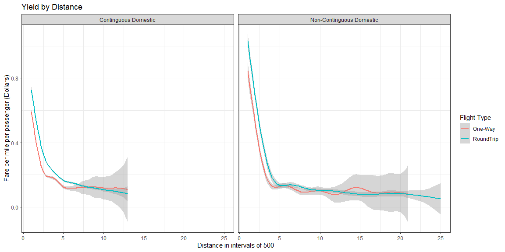

# Introduction 

## Our Question

  As students of economics, we have studied many different industries and market structures in order to understand how people try to maximize their profits. In many of the models that we have studied for our prior classes, pricing of goods and services was straightforward, and we had clear evidence showing why a producer would want to sell their product at certain quantities and prices. But when it comes to airlines selling flights how firms maximize their profit gets a little more ambiguous. We know that airlines compete as an oligopoly market, so they want to collude but can’t, which begs the question what is their next best alternative? What methods can they employ to get an edge over their competitors and maximize their profit when their best option is unavailable? Anyone that has tried to buy a ticket for an airplane has probably realized that not every ticket is priced the same and that some people get better deals than others. We know that one method that airlines use to maximize profit is price discrimination, but that doesn’t tell us anything about their revenue relative to their costs. In other words, knowing that a businessman will typically pay more for a ticket does not tell us all that much about what kind of money the airline is going to make overall. Are airlines getting the most they can out of flights, and what incentives are there to offer deals and discounts? These are important questions when we want to learn more about the industry. 

  We also want to know what kind of deals that airlines make to increase profit, for example we will look at if airlines offer bulk discounts for groups buying tickets in large quantities. Or if the airlines will offer slightly better deals on round-trip flights so they can make money by taking a person to a place and bringing them back. These are some standard practices offered in some other industries and we wanted to see if these are applicable to this industry like others, and if that is the case then it might give us as consumers new ideas on how to exploit those deals offered by the airlines.  

  To state the plan explicitly, we will be taking airline data and will attempt to use flight characteristics to create a regression to determine what kind of revenue airlines will be able to make off a given flight. One of our main variables we will be trying to predict is itinerary yield, which represents the amount of revenue that a flight will bring in. We will look at how the revenue is affected by distance and how much a flight can make per mile. That will give us an idea of whether or not airlines offer discounted rates to those flying long distances. Our hope is that our regression will be able to answer all these questions and more, as well as provide a stable model for future research. Or at the very least, will provide a rough basis to be polished and refined further at a later date. 

## Original Study 

Below is a visual that shows the type of study we originally wanted to conduct. Their data is not open source and because finding data of this type was not possible we changed the data and remainder of the project.

We can see a rough answer to our original question, "When is the cheapest time to buy airline tickets? Does pricing change significantly as demand for flights varies? Do airlines vary price to combat strategic consumers?"... Yes ticket price is extremely elastic.

 


Data Source:
[Source](https://www.transtats.bts.gov/DL_SelectFields.asp?gnoyr_VQ=FKF&QO_fu146_anzr=b4vtv0%20n0q%20Qr56v0n6v10%20f748rB)


---

# Literature Review 


In our search to provide an answer to “what factors affect airline price discrimination? We first need to evaluate a list of variables that have significant effects on the price of airline tickets. To do this, we have reviewed research and analysis from others who have examined individual factors and price determinates, we will be using their findings as a basis for what data should be obtained and applied to our regression study evaluating how airline ticket prices vary based on these pre examined factors (and others we may find?). The primary factors we will be examining are scarcity of seats, the impact of oil prices and consumer strategies on the price of the seat.  

Much of the research is based on the interactions between consumers and airlines pricing. To begin, we felt it was necessary to find evidence that consumers within the airline ticket market are strategic as assumed. I.e., Are the assumed interactions between price and consumers reasonable, or are they a result of other hidden factors? Li and Netessine (2014) provide an analysis of this base question. Their research seeks to answer primarily the idea of whether consumers are strategic within the airline industry to a significant degree, and secondarily what effects this may have on the revenues of airlines. Due to their work, we can say with relative confidence that strategic consumers do exist within this market space, specifically with an estimated share of 5.2% to 19.2% of the consumer market.1 The effects on total revenue due to their presence are more complicated, they found that nondecreasing price commitment strategies can reduce the level of strategic consumers although these same strategies lead to decreased levels of indifferent consumers as well1 (those who buy tickets simply because they are cheap, rather than waiting for prices to drop before buying). These findings show the effects of strategic consumers on revenue may be a relationship worth investigating as if understood it would allow for more exact price strategies that maximize revenues by controlling and shifting markets strategies based on flight patterns, trends, and consumers inputs.  

This leaves the question, what timing is most strategic when selling tickets? To answer this, two things must be identified. The first is, which market (business or tourist) is the airline primarily selling to? The second is, which of three periods are the passengers purchase in? It seems like the ideal model sells a substantial portion of seats in the initial period to businesspersons who are less likely to cancel, then the model opens ticket purchases to the tourist market. Obviously, seating capacity is limited depending on the plane. When capacity is low airlines typically are “better off selling exclusively to business consumers, who have higher valuations and thus will pay more.”4  

The final period of sales regards last minute deals. I.e., the idea that people can fill seats that would otherwise go unoccupied for a less expensive price than normal. This practice, while cutting into the profit that could be realized by the airline, usually cuts the costs that would have been seen by an unoccupied seat. This tool is usually only utilized when capacity is high and only on the day of the flight. 

So in answer to what timing is most strategic when selling tickets? We found that airlines should likely price discriminate in the first period of purchasing, especially to the tourist market. In the second and third purchasing periods they should market moderately priced tickets to the business segment of the market, and finally in the day of, they need to utilize the most profitable preserving models i.e., “last minute deals” for unfilled seats.  

This pricing strategy, however, changes with increases and decreases in flight frequencies. (Cattaneo, Mattia; Malighetti, Paolo; Redondi, Renato; Salanti, Andrea) The authors found that fare variations have a negative correlation with changes in the frequency of a flight. Simply said, frequent flights reduce an airline’s ability to price discriminate.  

This leads to pricing strategies and consumer responses to them. Gregor Bischoff, Sven Maertens, and Wolfgang Grimme found that airlines will often charge more for a one-way ticket than they do for a round trip ticket causing consumers to buy a two-way ticket but skip the return trip to save money. As one could imagine, carriers are not very fond of this practice and do their best to curb it while maintaining the same price discriminatory practices. These authors also note the history of air travel and how demand has settled into a seasonal pattern where most people travel for holidays. Which leads into an analysis of basic elasticities of consumers, where a consumer purchasing a last-minute round-trip flight typically is a very inelastic consumer, whereas a consumer buying tickets months in advance for a vacation flight is more elastic and responsive to price. Then the authors explain some price discrimination methods such as offering discounts to flyers booking flights well in advance as well as offering a discount for last minute customers to book their return flight with the same airline. 

Additionally, airlines also price discriminate via the day of the week a ticket is purchased. Steven Puller and Lisa Taylor found ticket prices to be lower on weekends than weekdays. They concluded this is due to people buying for leisurely purposes on weekends and thus are more price-elastic. i.e., people who are more sensitive to price changes. 

Our goal in this paper is to find other factors that airlines use to price discriminate so one can predict the best possible time to buy any given flight. One thing not found is whether prices rise within the few minutes one begins looking at a flight.  

One of the major variables not accounted for in their estimates is firm-to-firm competition. This is likely to have significant effects on pricing (through price elasticity) due to the oligopolistic nature of the market.  

This article talks extensively about the radical shifts made by certain airlines to make seats more about supply and demand than class and comfort. This shift to a lower cost flight model has impacted the way that other higher cost airlines do business and for them to do some introspection on how they control prices. 


---

# Data Analysis 

All data was obtain via the US Federal Aviation Database systems.
[Source](https://www.faa.gov/data_research/)

*Due to the size of the data this document is created with code that randomly samples 20,000 points from our 11 million, as a result the charts below sometimes vary thus we refrained from interpreting them. Although the full data set is represented by the tabular outputs. Additionally when viewing regression outputs we were able to code in references to outputs as the values change while interpretations are static. The patterns and relationships observed remain constant across samples due to the strength and significance of our variables as well as the large sample size*

## Variable Definition


| Variable Name | Description  | 
|---------------|:-------------:|
| QUARTER       |	Quarter (1-4)	  |
| ROUNDTRIP     |	Round Trip Indicator (1=Yes)  |		 
| ITIN_YIELD    |	Itinerary Fare Per Miles Flown in Dollars (ITIN_FARE/MilesFlown).  |
| PASSENGERS    |	Number of Passengers	|	 
| ITIN_FARE      |	Itinerary Fare Per Person		| 
| DISTANCE_GROUP |	Distance Group, in 500 Mile Intervals		| 
| MILES_FLOWN   |	Itinerary Miles Flown (Track Miles)		 |
| ITIN_GEO_TYPE |	Itinerary Geography Type, 0	= Contiguous Domestic (Lower 48 U.S. States Only) , 1 = Non-contiguous Domestic (Includes Hawaii, Alaska and Territories)   |


```r
tabl3 <-"
| Transformed Variable Name | Original Variable Name | Description  | 
|--------------------|:---------------:|:--------------------------:|
| lPASSENGERS        | PASSENGERS    |	Log(PASSENGERS)	  |
| SQRT_1over_DG_x_MF | DISTANCE_GROUP & MILES_FLOWN |	$\\sqrt{\\frac{1}{\\text{DISTANCE_GROUP} * \\text{MILES_FLOWN}}}$  |		 
"


tabl3 %>% pander()
```


| Transformed Variable Name | Original Variable Name | Description  | 
|--------------------|:---------------:|:--------------------------:|
| lPASSENGERS        | PASSENGERS    |	Log(PASSENGERS)	  |
| SQRT_1over_DG_x_MF | DISTANCE_GROUP & MILES_FLOWN |	$\sqrt{\frac{1}{\text{DISTANCE_GROUP} * \text{MILES_FLOWN}}}$  |		 


## Graphical Summaries #

### Overview 


### Yield by log(Passengers)


```r
ggplot(samp %>% drop_na()) +
  geom_smooth(aes(x= lPASSENGERS, y=ITIN_YIELD, col=ROUNDTRIP)) +
  #geom_jitter(aes(x= lPASSENGERS, y=ITIN_YIELD, col=ROUNDTRIP), alpha= 0.05) +
  facet_grid(rows= ~ITIN_GEO_TYPE)+
  theme_bw()+
  labs(col = "Flight Type", title= "Yield by log(Passengers)")+ 
  xlab("Log(Passengers)") + ylab("Fare per mile per passenger (Dollars)")
```

<!-- -->

### Yield by Distance Groups


```r
ggplot(samp %>% drop_na()) +
  #geom_jitter(aes(x= DISTANCE_GROUP, y=ITIN_YIELD, col=ROUNDTRIP), alpha= 0.0075) +
  geom_smooth(aes(x= DISTANCE_GROUP, y=ITIN_YIELD, col=ROUNDTRIP)) +
  facet_grid(rows= ~ITIN_GEO_TYPE)+
  theme_bw()+
  theme(
      panel.spacing = unit(0.5, "lines")
    )+ 
  labs(col = "Flight Type", title= "Yield by Distance")+ 
  xlab("Distance in intervals of 500") + ylab("Fare per mile per passenger (Dollars)")
```

<!-- -->

### Yield by Binaries


```r
ggplot(data=samp, ) +
    geom_histogram(aes(x=ITIN_YIELD, fill= ROUNDTRIP)) +
    #geom_area(aes(x=HEPerGDP,y=child_mort, fill= continent))+
    theme_bw() +
    gghighlight(use_direct_label = FALSE) +
    facet_wrap(~ITIN_GEO_TYPE) +
    theme(
      panel.spacing = unit(0.5, "lines"),
      axis.ticks.x=element_blank()
    )+ 
  labs(fill = "Flight Type", title= "Distribution of Yields by Flight Types")+ 
  xlab("Fare per mile per passenger (Dollars)") + ylab("Count") 
```

<!-- -->


## Tabular Summaries #

### Overview 

### Yield ~ RoundTrip & Geo


```r
pander(favstats(ITIN_YIELD ~  ROUNDTRIP + ITIN_GEO_TYPE, data=FullDat_Filt)[c("ROUNDTRIP.ITIN_GEO_TYPE", "Q1","median", "mean","Q3", "sd","n")], caption= "Summary table of Yields by Flight Type per Quarter")
```


-----------------------------------------------------------------------------
    ROUNDTRIP.ITIN_GEO_TYPE         Q1     median    mean      Q3       sd   
-------------------------------- -------- -------- -------- -------- --------
  One-Way.Continguous Domestic    0.1047   0.1738   0.2354   0.2908   0.2091 

 RoundTrip.Continguous Domestic   0.1015   0.1599   0.2063   0.2571   0.1657 

    One-Way.Non-Continguous       0.0709   0.1014   0.1423   0.1586   0.148  
            Domestic                                                         

   RoundTrip.Non-Continguous      0.0681   0.0942   0.1246   0.1337   0.1322 
            Domestic                                                         
-----------------------------------------------------------------------------

Table: Summary table of Yields by Flight Type per Quarter (continued below)

 
---------
    n    
---------
 4025439 

 5803943 

 338790  

 438735  
---------

### Yield ~ Distance Group

```r
pander(favstats(ITIN_YIELD ~ DISTANCE_GROUP, data=FullDat_Filt)[c(1:5, 12:16, 23:25),c("DISTANCE_GROUP", "Q1","median", "mean","Q3", "sd","n")], caption= "Summary table of Yields by Flight Type per Quarter")
```


------------------------------------------------------------------------------------
 &nbsp;   DISTANCE_GROUP     Q1     median     mean       Q3        sd         n    
-------- ---------------- -------- --------- --------- --------- --------- ---------
 **1**          1          0.3347   0.5259    0.6113    0.8075    0.3752    420249  

 **2**          2          0.1809   0.2847    0.3348    0.4358    0.2166    1675504 

 **3**          3          0.1301   0.2045    0.2357    0.3043    0.1472    1941759 

 **4**          4          0.1071   0.1659    0.1874    0.2405    0.1128    1759498 

 **5**          5          0.0901    0.136    0.1561    0.1984    0.09458   1631197 

 **12**         12         0.0601   0.0841    0.09356   0.1158     0.048     74074  

 **13**         13         0.0595   0.0819    0.08936   0.1104    0.04411    30455  

 **14**         14         0.0613   0.0829    0.09038   0.1134    0.04188    26418  

 **15**         15         0.0572    0.079    0.08533   0.1071    0.0393     14473  

 **16**         16         0.0611   0.0798    0.08534   0.1036    0.03466    22320  

 **23**         23         0.0552   0.06725   0.07131   0.0857    0.02555     258   

 **24**         24         0.0568   0.0681    0.07164   0.08505   0.02991     131   

 **25**         25         0.0631   0.0869    0.07687   0.1041    0.03513     377   
------------------------------------------------------------------------------------

Table: Summary table of Yields by Flight Type per Quarter


## Data Conculsions

* Increasing variability in Passengers and distance, this will cause issues with our standard errors.
* Increasing Distance, or passengers leads to decreased pricing and thus lower yields.
* There is some variance between distributions of yields when examining flight location and type.

---

# Methodology #

Two regressions were created during our attempts to better understand the data and the relationships between our variables. The first uses at most simple transformations such as logs to help reduce heteroskedasticity. While the second employs more abstract calculus transformations in order to linearize any variable previously used that did not initially hold a simple linear pattern with our endogenous variable.


## Variable Overview #


### Our Variables


### Full Pairs charts

```r
panel.cor <- function(x, y, digits=2, prefix="", cex.cor)
{
usr <- par("usr"); on.exit(par(usr))
par(usr = c(0, 1, 0, 1))
r <- abs(cor(x, y))
txt <- format(c(r, 0.123456789), digits=digits)[1]
txt <- paste(prefix, txt, sep="")
if(missing(cex.cor)) cex <- 0.8/strwidth(txt)
test <- cor.test(x,y)
# borrowed from printCoefmat
Signif <- symnum(test$p.value, corr = FALSE, na = FALSE,
cutpoints = c(0, 0.001, 0.01, 0.05, 0.1, 1),
symbols = c("***", "**", "*", ".", " "))
text(0.5, 0.5, txt, cex = 1.5 )
text(.7, .8, Signif, cex=cex, col=2)
}

pairs(samp, lower.panel=panel.smooth, upper.panel=panel.cor)
```

<!-- -->

## Standard Regression #


### Initial Regression Model

$$
\underbrace{Y_i}_\text{Itinerary Yield} \underbrace{=}_{\sim} \overbrace{\beta_0}^{\stackrel{\text{y-int}}{\text{Base Yield}}} + \overbrace{\beta_1}^{\stackrel{\text{slope along}}{\text{lPassenger}}} \underbrace{X_{1i}}_\text{lPassenger} + \overbrace{\beta_2}^{\stackrel{\text{change in}}{\text{y-int}}}  \underbrace{X_{2i}}_\text{Distance Group} + \overbrace{\beta_3}^{\stackrel{\text{change in}}{\text{y-int}}}  \underbrace{X_{3i}}_\text{Roundtrip} + \overbrace{\beta_4}^{\stackrel{\text{change in}}{\text{y-int}}}  \underbrace{X_{4i}}_\text{Non-Continguous} +\overbrace{\beta_5}^{\stackrel{\text{change in}}{\text{slope}}} \underbrace{X_{1i}X_{2i}}_\text{lPassenger:Distance Group} + \epsilon_i
$$

## Results


```r
lm1 <- lm(ITIN_YIELD ~ lPASSENGERS + DISTANCE_GROUP + ROUNDTRIP + ITIN_GEO_TYPE + lPASSENGERS:DISTANCE_GROUP , data= samp)

summary(lm1) %>% pander
```


-------------------------------------------------------------------------------
             &nbsp;               Estimate    Std. Error   t value   Pr(>|t|)  
-------------------------------- ----------- ------------ --------- -----------
        **(Intercept)**            0.3562      0.002581      138         0     

        **lPASSENGERS**           -0.03408     0.003598    -9.474    2.993e-21 

       **DISTANCE_GROUP**         -0.03444    0.0005024    -68.57        0     

     **ROUNDTRIPRoundTrip**        0.04921     0.002572     19.13    7.417e-81 

 **ITIN_GEO_TYPENon-Continguous    0.08026     0.004928     16.29    3.021e-59 
           Domestic**                                                          

 **lPASSENGERS:DISTANCE_GROUP**   -0.002455    0.000801    -3.065    0.002179  
-------------------------------------------------------------------------------


--------------------------------------------------------------
 Observations   Residual Std. Error   $R^2$    Adjusted $R^2$ 
-------------- --------------------- -------- ----------------
    20000             0.1604          0.2287       0.2285     
--------------------------------------------------------------

Table: Fitting linear model: ITIN_YIELD ~ lPASSENGERS + DISTANCE_GROUP + ROUNDTRIP + ITIN_GEO_TYPE + lPASSENGERS:DISTANCE_GROUP

```r
lm1_r2 <- round(summary(lm1)$adj.r.squared, 2)
lm1_RSE <- round(sigma(lm1)*100, 1)
matrix_coef <- summary(lm1)$coefficients
my_estimates <- matrix_coef[ , 1] 
b0 <- round(my_estimates[1]*100, 2)
b1 <- round(my_estimates[2]*100, 2)
b2 <- round(my_estimates[3]*100, 2)
b3 <- round(my_estimates[4]*100, 2)
b4 <- round(my_estimates[5]*100, 2)
b5 <- round(my_estimates[6], 2)
```

  Our initial regression model using ordinary least squares results in an $R^2$ of 0.23, which in the scope of our data is fairly substantial, airline pricing is incredibly varies and involved hundreds of possible factors, we have access to a very limited number of factors and thus are only able to account for total variation to a very limited extent. Though, our residual Standard error is less than ideal when taken in context, an error of 16 cents in yields is a large percentage of our total yield range (\$0.05-\$2), 0.08\% of our total range to be specific.
  
  Skipping the y-intercept as its interpretation would make little realistic sense in this case, specific coefficient interpretations are as follows;
  
  * For every 1\% increase in itinerary passengers we see a decline in yield of -3.41 cents
  
  * For every 500 additional miles on an Itinerary we see a -3.44 cent decline in yield.
  
  * Roundtrip flights on average provide an additional 4.92 cent yield.
  
  * Domestic (Non-Continguous) flights on average yield 8.03 cents more per mile.
  
  * For each 1\% increase in passenger count we see a 0 decline in the distance of a flight.


### Assumptions 

As the data is not a time series we limited our testing to only Heteroskedasticity and multi-collinearity.


Below are the results from a Breush-Pagan Test:

```r
bptest(lm1)
```

```
## 
## 	studentized Breusch-Pagan test
## 
## data:  lm1
## BP = 670.81, df = 5, p-value < 2.2e-16
```
Despite the transformations made on passengers, significant error variance is still present. This is likely due to the increasing variability over increasing X as well as miss-specification errors due to omitting significant variables.


Due to concerns about high correlation between our variables we tested for Multi-collinearity as well:

```r
vif(lm1)
```

```
##                lPASSENGERS             DISTANCE_GROUP 
##                   4.006313                   1.664075 
##                  ROUNDTRIP              ITIN_GEO_TYPE 
##                   1.244330                   1.291236 
## lPASSENGERS:DISTANCE_GROUP 
##                   3.926802
```
As none of our values are greater than 10 we should not be worried about multi-collinearity.


### Robust Least Squares Model 

In order to allow for a true BLUE regression we calculated the coefficients using robust least squares. As shown below the skeleton of the model remains the same though the methods used to calculate coefficients now apply a weighting system assigning less weight to outlying points than standard OLS.

$$
\underbrace{Y_i}_\text{Itinerary Yield} \underbrace{=}_{\sim} \overbrace{\beta_0}^{\stackrel{\text{y-int}}{\text{Base Yield}}} + \overbrace{\beta_1}^{\stackrel{\text{slope along}}{\text{lPassenger}}} \underbrace{X_{1i}}_\text{lPassenger} + \overbrace{\beta_2}^{\stackrel{\text{change in}}{\text{y-int}}}  \underbrace{X_{2i}}_\text{Distance Group} + \overbrace{\beta_3}^{\stackrel{\text{change in}}{\text{y-int}}}  \underbrace{X_{3i}}_\text{Roundtrip} + \overbrace{\beta_4}^{\stackrel{\text{change in}}{\text{y-int}}}  \underbrace{X_{4i}}_\text{Non-Continguous} +\overbrace{\beta_5}^{\stackrel{\text{change in}}{\text{slope}}} \underbrace{X_{1i}X_{2i}}_\text{lPassenger:Distance Group} + \epsilon_i
$$

## Results

As shown in the output below the relationships of our exogenous variables to our endogenous variable yield remain the same although the degree to which each of these variables affects the yield has somewhat shifted.

## Robust Standard errors:

```r
coeftest(lm1, vcov = vcovHC(lm1, type= 'HC1'))
```

```
## 
## t test of coefficients:
## 
##                                          Estimate  Std. Error  t value
## (Intercept)                            0.35617275  0.00369938  96.2791
## lPASSENGERS                           -0.03408281  0.00462170  -7.3745
## DISTANCE_GROUP                        -0.03444474  0.00065497 -52.5900
## ROUNDTRIPRoundTrip                     0.04920797  0.00275301  17.8743
## ITIN_GEO_TYPENon-Continguous Domestic  0.08025764  0.00509773  15.7438
## lPASSENGERS:DISTANCE_GROUP            -0.00245513  0.00098655  -2.4886
##                                        Pr(>|t|)    
## (Intercept)                           < 2.2e-16 ***
## lPASSENGERS                           1.714e-13 ***
## DISTANCE_GROUP                        < 2.2e-16 ***
## ROUNDTRIPRoundTrip                    < 2.2e-16 ***
## ITIN_GEO_TYPENon-Continguous Domestic < 2.2e-16 ***
## lPASSENGERS:DISTANCE_GROUP              0.01283 *  
## ---
## Signif. codes:  0 '***' 0.001 '**' 0.01 '*' 0.05 '.' 0.1 ' ' 1
```

In addition the the simple robust estimates, due to the extremity of our Breush-Pagan results we felt it would also be useful to calculate 95\% confidence intervals for our estimators and be doubly sure that they remained interpretable and useful. As shown all estimates retain the same signs and are thus safe to include and utilize in a model.

## Robust Coefficients at 95% confidence:

```r
coefci(lm1, vcov = vcovHC(lm1, type= 'HC1'))
```

```
##                                              2.5 %        97.5 %
## (Intercept)                            0.348921659  0.3634238348
## lPASSENGERS                           -0.043141731 -0.0250238851
## DISTANCE_GROUP                        -0.035728532 -0.0331609488
## ROUNDTRIPRoundTrip                     0.043811842  0.0546040891
## ITIN_GEO_TYPENon-Continguous Domestic  0.070265660  0.0902496208
## lPASSENGERS:DISTANCE_GROUP            -0.004388852 -0.0005214142
```


## Transformed Regression #

In this transformed model the non-simple linear relationship between distance group, miles flown and yields was transformed into a simple linear relationship, refer to variable overview. The implications of this are further expanded upon below.

### Initial Regression Model

$$
\underbrace{Y_i}_\text{Itinerary Yield} \underbrace{=}_{\sim} \overbrace{\beta_0}^{\stackrel{\text{y-int}}{\text{Base Yield}}} + \overbrace{\beta_1}^{\stackrel{\text{slope along}}{\text{lPassenger}}} \underbrace{X_{1i}}_\text{lPassenger} + \overbrace{\beta_2}^{\stackrel{\text{change in}}{\text{y-int}}}  \underbrace{X_{2i}}_\text{SQRT_1over_DG_x_MF} + \overbrace{\beta_3}^{\stackrel{\text{change in}}{\text{y-int}}}  \underbrace{X_{3i}}_\text{Roundtrip} + \overbrace{\beta_4}^{\stackrel{\text{change in}}{\text{y-int}}}  \underbrace{X_{4i}}_\text{Non-Continguous} +\overbrace{\beta_5}^{\stackrel{\text{change in}}{\text{slope}}} \underbrace{X_{1i}X_{2i}}_\text{lPassenger:SQRT_1over_DG_x_MF} + \epsilon_i
$$

So as to best maintain the ability to compare the two regression all variables where kept the same except for the replacement of Distance_Group with the new transformed variable.

### Results

```r
lm2 <- lm(ITIN_YIELD ~ lPASSENGERS + SQRT_1over_DG_x_MF + ROUNDTRIP + ITIN_GEO_TYPE + lPASSENGERS:SQRT_1over_DG_x_MF, data= samp)
summary(lm2) %>% pander
```


-----------------------------------------------------------------------------------
               &nbsp;                 Estimate   Std. Error   t value    Pr(>|t|)  
------------------------------------ ---------- ------------ --------- ------------
          **(Intercept)**             0.001708    0.002621    0.6515      0.5148   

          **lPASSENGERS**             -0.01332    0.002713    -4.911    9.125e-07  

       **SQRT_1over_DG_x_MF**          12.81       0.1118      114.5        0      

       **ROUNDTRIPRoundTrip**         0.06455     0.002124     30.39    2.742e-198 

   **ITIN_GEO_TYPENon-Continguous     0.006699    0.003779     1.773     0.07631   
             Domestic**                                                            

 **lPASSENGERS:SQRT_1over_DG_x_MF**    -2.016      0.1278     -15.77    1.149e-55  
-----------------------------------------------------------------------------------


--------------------------------------------------------------
 Observations   Residual Std. Error   $R^2$    Adjusted $R^2$ 
-------------- --------------------- -------- ----------------
    20000             0.1366          0.4401        0.44      
--------------------------------------------------------------

Table: Fitting linear model: ITIN_YIELD ~ lPASSENGERS + SQRT_1over_DG_x_MF + ROUNDTRIP + ITIN_GEO_TYPE + lPASSENGERS:SQRT_1over_DG_x_MF

```r
lm2_r2 <- round(summary(lm2)$adj.r.squared, 2)
lm2_RSE <- round(sigma(lm1)*100, 1)
matrix_coef <- summary(lm2)$coefficients
my_estimates <- matrix_coef[ , 1] 
b0 <- round(my_estimates[1]*100, 2)
b1 <- round(my_estimates[2]*100, 2)
b2 <- round(my_estimates[3], 2)
b3 <- round(my_estimates[4]*100, 2)
b4 <- round(my_estimates[5]*100, 2)
b5 <- round(my_estimates[6], 2)
```

  Our transformed regression model using ordinary least squares results in an $R^2$ of 0.44, which in the scope of our data is fairly substantial, airline pricing is incredibly varies and involved hundreds of possible factors, we have access to a very limited number of factors and thus are only able to account for total variation to a very limited extent. Though, our residual Standard error is less than ideal when taken in context, an error of 16 cents in yields is a large percentage of our total yield range (\$0.05-\$2),  0.08\% of our total range to be specific. 
The Primary issue with this is that we lose the ability to effectively interpret a change in distance due to the complexity of the transformation.
  
Skipping the y-intercept as its interpretation would make little realistic sense in this case, specific coefficient interpretations are as follows;

  * For every 1\% increase in itinerary passengers we see a decline in yield of -1.33 cents
  
  * For every 1 unit increase in $\text{(Miles Flown * Distance group)}^{-\frac{1}{2}}$ on an Itinerary we see a 12.81 dollar increase in yield.
  
  * Roundtrip flights on average provide an additional 6.46 cent yield.
  
  * Domestic (Non-Continguous) flights on average yield 0.67 cents more per mile, but are no longer significant.
  
  * For each 1\% increase in passenger count we see a -2.02 unit decline in $\text{(Miles Flown * Distance group)}^{-\frac{1}{2}}$ of a flight.

### Assumptions 
As the data is not a time series we limited our testing to only Heteroskedasticity and multi-collinearity.

```r
bptest(lm2)
```

```
## 
## 	studentized Breusch-Pagan test
## 
## data:  lm2
## BP = 2594.9, df = 5, p-value < 2.2e-16
```
Despite the transformations made on passengers and the attempt to linearize Distance, significant error variance is still present, in this case even more so than before. This is likely due to the increasing variability over increasing X as well as miss-specification errors due to omitting significant variables.


Due to concerns about high correlation between our variables we tested for Multi-collinearity as well:

```r
vif(lm2)
```

```
##                    lPASSENGERS             SQRT_1over_DG_x_MF 
##                       3.138761                       1.529212 
##                      ROUNDTRIP                  ITIN_GEO_TYPE 
##                       1.169253                       1.046113 
## lPASSENGERS:SQRT_1over_DG_x_MF 
##                       3.614497
```
As none of our values are greater than 10 we should not be worried about multi-collinearity.


### Robust Least Squares Model

## Results

Again due to the issues found in our assumptions we calculated Robust standard errors to use rather than traditional OLS.

## Robust Standard errors:

As shown in the output below the relationships of our exogenous variables to our endogenous variable yield remain the same although the degree to which each of these variables affects the yield has somewhat shifted.

```r
coeftest(lm2, vcov = vcovHC(lm2, type= 'HC1'))
```

```
## 
## t test of coefficients:
## 
##                                         Estimate Std. Error t value  Pr(>|t|)
## (Intercept)                            0.0017075  0.0039266  0.4349 0.6636747
## lPASSENGERS                           -0.0133249  0.0037126 -3.5891 0.0003326
## SQRT_1over_DG_x_MF                    12.8061241  0.2403688 53.2770 < 2.2e-16
## ROUNDTRIPRoundTrip                     0.0645521  0.0023613 27.3371 < 2.2e-16
## ITIN_GEO_TYPENon-Continguous Domestic  0.0066994  0.0030091  2.2264 0.0260013
## lPASSENGERS:SQRT_1over_DG_x_MF        -2.0156493  0.2506270 -8.0424 9.294e-16
##                                          
## (Intercept)                              
## lPASSENGERS                           ***
## SQRT_1over_DG_x_MF                    ***
## ROUNDTRIPRoundTrip                    ***
## ITIN_GEO_TYPENon-Continguous Domestic *  
## lPASSENGERS:SQRT_1over_DG_x_MF        ***
## ---
## Signif. codes:  0 '***' 0.001 '**' 0.01 '*' 0.05 '.' 0.1 ' ' 1
```

## Robust Coefficients at 95% confidence:

Again, in addition the the simple robust estimates, due to the extremity of our Breush-Pagan results we felt it would also be useful to calculate 95\% confidence intervals for our estimators and be doubly sure that they remained interpretable and useful. As shown all estimates retain the same signs and are thus safe to include and utilize in a model with the exception of our intercept and geography types.

```r
coefci(lm2, vcov = vcovHC(lm2, type= 'HC1'))
```

```
##                                              2.5 %       97.5 %
## (Intercept)                           -0.005989046  0.009404067
## lPASSENGERS                           -0.020601965 -0.006047849
## SQRT_1over_DG_x_MF                    12.334981337 13.277266854
## ROUNDTRIPRoundTrip                     0.059923640  0.069180473
## ITIN_GEO_TYPENon-Continguous Domestic  0.000801263  0.012597614
## lPASSENGERS:SQRT_1over_DG_x_MF        -2.506898922 -1.524399746
```

---

# Regression plot


```r
#Graph Resolution (more important for more complex shapes)
graph_reso <- 0.025

#Setup Axis
axis_x <- seq(min(samp$DISTANCE_GROUP), max(samp$DISTANCE_GROUP), by = graph_reso)
axis_y <- seq(min(samp$lPASSENGERS), max(samp$lPASSENGERS), by = graph_reso)
axis_col <- as.factor(c("One-Way", "RoundTrip"))
axis_f <- as.factor(c("Continguous Domestic", "Non-Continguous Domestic"))

#Sample points
lmnew <- expand.grid(DISTANCE_GROUP = axis_x, lPASSENGERS = axis_y, ROUNDTRIP = axis_col, ITIN_GEO_TYPE = axis_f ,  KEEP.OUT.ATTRS=F)
lmnew$Z <- predict.lm(lm1, newdata = lmnew)
lmnew <- acast(lmnew, lPASSENGERS ~ DISTANCE_GROUP , value.var = "Z") #y ~ x
samp %>% 
  filter(ITIN_GEO_TYPE == "Continguous Domestic") %>%
  plot_ly(., 
               x = ~DISTANCE_GROUP, 
               y = ~lPASSENGERS, 
               z = ~ITIN_YIELD, 
               #text = rownames(samp %>% drop_na()),
               type = "scatter3d",
               mode ="markers",
               color = ~as.factor(ROUNDTRIP),
               alpha= 0.7) %>%
              layout(title= list(text = "Continguous Domestic Flights (Lower 48)"))
```

```{=html}
<div id="htmlwidget-ed74d433fd6af0e96dd2" style="width:1152px;height:576px;" class="plotly html-widget"></div>
<script type="application/json" data-for="htmlwidget-ed74d433fd6af0e96dd2">{"x":{"visdat":{"427870a166f":["function () ","plotlyVisDat"]},"cur_data":"427870a166f","attrs":{"427870a166f":{"x":{},"y":{},"z":{},"mode":"markers","color":{},"alpha":0.7,"alpha_stroke":1,"sizes":[10,100],"spans":[1,20],"type":"scatter3d"}},"layout":{"margin":{"b":40,"l":60,"t":25,"r":10},"title":{"text":"Continguous Domestic Flights (Lower 48)"},"scene":{"xaxis":{"title":"DISTANCE_GROUP"},"yaxis":{"title":"lPASSENGERS"},"zaxis":{"title":"ITIN_YIELD"}},"hovermode":"closest","showlegend":true},"source":"A","config":{"modeBarButtonsToAdd":["hoverclosest","hovercompare"],"showSendToCloud":false},"data":[{"x":[2,5,2,4,4,2,3,6,4,4,3,4,3,5,2,3,4,2,2,3,2,4,2,4,1,5,5,2,2,3,3,3,2,5,2,2,2,2,2,5,2,1,4,1,4,5,4,4,2,1,2,3,6,1,5,4,4,4,3,2,4,2,2,3,3,3,5,6,4,2,2,3,4,3,5,2,1,3,2,3,2,2,3,3,1,4,3,3,5,2,5,5,2,4,1,2,2,2,1,3,5,2,2,3,3,2,5,4,4,2,3,4,5,2,1,5,3,3,4,4,2,5,3,4,9,3,4,5,3,1,4,3,3,2,3,6,5,2,2,3,4,3,4,5,3,6,3,1,2,6,3,3,5,3,2,3,4,4,3,3,3,1,4,1,5,1,5,4,3,6,3,4,3,3,4,5,3,4,5,5,5,5,3,3,5,5,5,3,2,2,3,5,3,2,3,2,2,3,3,3,3,7,3,5,4,3,2,2,6,3,2,2,8,5,4,2,3,2,4,5,3,4,3,2,5,2,5,5,6,2,5,2,5,2,4,2,6,7,2,2,3,2,3,6,3,3,8,2,2,2,2,2,3,2,1,3,4,6,4,5,7,4,2,3,2,4,3,2,2,2,4,3,3,5,4,2,3,9,2,1,3,1,3,2,6,3,3,3,3,2,3,3,3,4,2,5,2,2,6,2,10,3,1,2,2,4,2,6,2,4,5,2,2,3,4,3,2,2,2,3,2,2,2,3,2,4,3,2,2,3,2,2,2,2,1,3,5,3,6,2,5,5,2,3,6,3,6,3,3,2,4,2,2,4,3,4,5,1,1,5,2,4,3,5,3,4,2,9,4,1,2,2,3,4,3,3,3,5,5,2,2,2,2,2,4,2,4,3,2,4,3,3,3,4,3,4,3,4,4,2,4,2,3,1,6,4,3,5,4,5,3,3,4,2,5,3,6,4,5,4,2,5,2,4,2,3,5,4,2,3,6,2,1,4,5,2,2,2,7,3,2,4,4,4,3,2,2,2,4,2,2,2,3,5,2,3,2,5,3,2,5,4,4,4,3,5,5,3,3,3,4,4,4,2,2,3,3,2,1,3,3,3,3,3,2,4,2,3,2,1,2,4,6,2,4,6,2,2,5,2,2,3,4,2,2,5,4,2,3,2,4,2,4,3,4,2,2,5,1,1,4,2,2,2,2,5,2,3,3,3,2,2,3,3,2,2,3,5,2,2,5,5,3,5,1,2,3,5,2,1,2,4,2,2,2,3,4,1,1,6,3,6,2,2,5,5,2,3,1,3,5,6,3,3,4,2,2,1,6,5,1,2,3,2,1,2,3,3,1,4,4,3,2,6,3,2,3,2,5,5,4,4,3,9,3,2,2,5,6,2,3,6,3,2,2,4,6,3,1,4,2,3,5,3,4,1,1,4,3,3,3,6,5,1,5,2,3,3,2,4,2,3,4,2,3,5,5,1,2,4,2,3,4,2,4,3,7,12,4,3,3,1,3,1,1,3,3,5,5,2,3,3,3,3,3,5,3,2,2,5,3,3,2,3,3,6,2,2,4,3,2,2,2,1,2,3,3,3,3,3,6,3,5,3,5,3,4,4,5,4,5,2,1,3,3,7,2,3,6,3,2,6,2,2,4,1,2,2,3,5,3,2,4,7,3,4,3,4,2,3,2,1,1,5,6,2,2,4,2,2,2,3,3,3,1,3,3,3,5,5,6,4,5,5,4,4,3,2,2,6,4,2,3,2,2,2,2,1,5,5,6,4,2,2,5,4,5,6,2,2,6,3,4,4,2,5,2,2,7,2,2,6,4,5,2,3,4,4,2,5,4,1,1,3,5,1,3,2,2,3,3,3,5,3,5,3,3,2,3,3,4,3,6,2,3,6,6,6,2,2,3,3,3,3,2,3,5,4,5,2,2,3,4,9,1,2,6,2,2,4,1,2,2,2,4,3,2,5,2,2,3,4,4,6,3,2,3,3,4,3,3,4,1,2,2,3,1,4,1,3,4,4,4,5,3,5,6,2,2,4,1,3,3,2,5,4,3,2,1,5,2,3,6,5,1,3,2,1,3,5,5,2,3,4,6,2,2,6,2,3,2,3,2,3,2,1,3,3,3,3,7,4,3,5,2,2,5,5,2,2,2,2,4,1,5,4,2,2,1,3,3,2,3,3,2,3,3,4,3,3,2,2,3,2,1,3,2,1,5,3,3,2,2,2,4,3,2,3,1,3,4,5,4,5,3,4,1,4,3,3,3,3,2,4,2,5,1,6,5,3,2,2,4,6,7,2,6,3,4,2,2,2,4,6,6,2,3,6,5,3,2,3,4,3,4,7,1,4,3,1,4,2,2,1,2,2,2,3,3,2,5,4,6,1,5,3,2,2,6,2,6,3,3,2,3,2,2,1,2,2,2,4,3,2,2,5,3,5,2,4,4,4,3,3,5,2,5,2,2,5,9,2,3,2,5,4,3,5,3,3,5,2,2,6,2,1,3,5,3,3,2,4,2,2,2,1,3,3,5,3,3,2,3,2,3,6,5,2,1,3,6,3,3,3,5,4,5,2,4,3,6,2,1,2,2,2,3,6,7,3,5,10,2,3,3,5,2,4,6,2,3,2,3,2,4,2,3,5,5,5,4,1,2,4,4,3,4,2,5,2,4,2,9,2,3,2,2,3,3,4,1,3,3,3,3,5,3,2,1,5,2,4,2,5,3,4,3,3,2,6,4,2,5,2,2,5,3,6,2,2,4,3,10,2,1,1,3,4,3,5,4,4,2,5,2,4,3,5,2,6,2,4,5,3,4,2,5,4,5,4,4,4,2,2,3,3,4,4,3,6,6,5,3,2,2,2,4,4,3,2,4,3,3,2,1,4,5,3,2,6,4,4,3,1,2,3,2,3,2,5,2,2,3,3,5,3,4,2,2,1,3,5,2,2,5,2,5,4,1,4,4,2,3,5,3,5,2,1,3,1,3,3,2,3,2,2,4,2,5,2,2,4,5,6,6,2,5,3,5,1,6,3,2,5,2,3,3,1,2,2,3,2,6,2,3,3,2,2,5,6,5,5,1,2,4,3,6,3,4,2,4,2,3,3,2,4,1,4,2,2,2,4,3,2,3,2,3,3,4,2,6,4,1,3,5,4,2,5,5,4,4,5,3,6,3,4,2,2,2,5,5,4,3,2,2,3,5,2,2,4,2,2,10,4,1,3,5,3,2,2,4,2,3,4,2,6,1,3,3,1,2,3,1,3,2,5,2,5,4,2,3,3,4,1,3,4,6,5,2,3,3,2,5,5,6,4,2,2,3,3,3,5,2,4,5,2,2,2,1,3,3,3,2,3,3,1,2,5,2,3,4,4,3,2,4,6,1,5,2,1,4,3,3,1,3,6,4,5,2,3,7,3,3,4,4,2,6,3,5,3,3,2,3,6,2,5,4,1,7,4,1,5,4,3,1,2,2,2,4,7,1,5,2,3,8,3,2,2,1,4,2,4,3,2,3,2,2,1,2,2,5,2,3,5,3,5,3,2,3,2,1,4,3,2,3,6,5,6,2,3,2,3,4,2,4,3,2,4,2,2,3,2,6,3,5,3,4,5,5,4,3,3,3,4,3,2,4,4,2,1,5,3,5,3,3,5,4,1,4,4,4,3,4,1,3,1,3,2,2,2,5,2,4,4,3,1,2,5,3,2,6,6,3,4,3,2,5,5,4,2,2,3,2,2,5,5,4,2,4,2,2,3,2,1,4,4,2,3,2,3,1,2,3,2,4,3,3,4,2,3,5,10,2,2,4,2,2,5,3,4,4,2,6,2,3,2,4,3,4,2,2,3,4,2,2,3,5,2,5,4,2,1,2,5,5,1,2,2,2,4,3,1,3,2,2,2,2,3,3,3,5,5,2,4,7,3,4,3,3,3,5,5,2,1,4,3,2,5,2,5,3,6,3,2,4,1,1,5,3,2,2,3,6,7,3,4,5,2,2,3,2,3,2,5,3,5,3,2,3,2,6,5,2,5,3,4,5,6,3,2,5,2,3,2,4,2,2,1,3,2,6,2,2,3,5,2,5,3,4,4,6,3,3,2,2,6,2,8,2,3,2,5,4,5,4,1,4,4,3,4,3,3,2,2,3,5,3,4,3,2,2,5,2,4,3,2,2,2,4,3,4,4,4,11,3,4,2,2,3,1,3,4,6,5,3,3,2,2,5,4,3,2,3,4,4,5,5,4,4,5,4,3,5,4,3,5,5,3,5,2,3,4,5,1,5,4,3,3,2,4,3,2,3,5,3,1,2,3,5,2,3,5,4,3,3,6,3,4,4,4,2,2,4,6,3,2,3,2,3,10,5,4,5,2,3,2,5,3,2,2,4,6,2,2,3,3,3,5,4,2,4,2,2,4,3,1,4,4,1,3,2,3,3,3,2,3,3,2,2,4,4,5,2,3,6,3,11,2,1,2,3,1,5,4,5,5,4,3,1,5,2,4,4,5,2,3,2,6,5,2,4,3,4,2,1,3,4,3,5,5,5,3,2,4,4,2,3,2,4,4,2,3,3,3,5,5,4,3,2,3,4,2,2,2,5,2,3,2,9,3,3,2,5,3,2,2,2,2,3,4,2,4,4,3,5,3,5,3,3,7,4,2,3,6,3,6,3,3,1,5,2,7,1,5,5,1,4,3,2,2,6,2,3,5,3,4,6,6,3,3,1,2,4,3,1,2,2,5,1,3,3,2,4,2,2,4,2,3,5,2,3,9,3,2,2,2,2,5,2,4,3,1,2,4,2,6,1,1,3,2,2,4,3,2,2,5,1,3,4,2,2,2,2,6,3,3,2,3,3,7,3,2,3,2,2,5,3,3,4,3,4,3,2,3,2,1,3,3,3,3,3,3,3,2,5,2,3,2,2,2,2,3,1,2,4,2,3,2,5,2,4,3,6,5,6,3,1,2,5,3,4,2,1,2,2,1,3,3,7,4,1,2,4,4,5,4,3,6,3,5,4,2,2,2,4,2,6,2,5,5,3,2,4,3,4,2,5,2,1,5,2,4,2,6,3,2,3,1,5,6,2,1,6,4,4,3,3,1,2,4,3,1,3,4,10,4,4,3,5,4,6,5,2,2,2,5,2,1,4,3,2,2,2,5,1,2,6,2,5,3,3,4,4,2,4,5,2,2,2,1,5,3,5,4,4,3,5,2,1,2,5,5,3,4,1,3,4,3,2,6,1,2,3,11,2,2,3,1,3,6,4,3,3,3,2,1,4,3,2,1,5,4,1,4,4,2,4,6,5,5,3,2,1,6,6,4,4,4,4,3,6,1,2,3,5,1,5,3,2,3,2,3,5,2,4,4,3,2,5,2,5,5,4,2,6,3,3,3,2,4,3,5,3,2,2,2,4,1,3,2,2,4,4,3,2,2,3,3,3,3,7,3,5,3,3,2,2,5,5,4,2,3,5,6,3,6,1,4,3,2,2,2,1,3,2,3,2,2,6,2,5,2,1,5,2,1,3,4,2,5,5,10,2,2,2,2,4,1,3,2,3,3,3,5,6,3,4,5,3,1,6,2,3,5,3,5,2,1,3,3,2,2,2,2,7,3,4,1,1,3,3,2,2,5,1,2,1,7,4,2,5,4,2,3,3,2,4,2,3,4,2,5,3,1,3,3,3,2,4,3,4,4,3,2,5,1,4,4,1,2,2,4,2,2,2,2,3,4,2,6,4,5,2,2,2,2,2,3,2,2,4,3,5,4,2,4,5,2,6,3,4,5,3,6,5,2,3,3,3,4,2,3,6,3,2,4,3,2,4,1,5,5,4,4,3,4,5,2,3,2,6,2,2,2,2,1,5,5,2,2,2,6,3,4,4,2,4,2,2,4,1,4,4,3,1,1,5,1,2,2,4,3,2,3,1,3,2,6,3,4,4,3,1,3,4,2,3,5,5,2,2,2,2,2,5,3,2,3,3,2,2,2,3,6,4,2,2,4,1,5,3,2,1,1,3,3,5,5,5,2,2,4,2,3,3,2,3,2,4,3,2,3,4,1,3,3,2,6,5,2,4,5,3,3,4,4,5,3,2,4,3,2,3,5,4,2,2,3,2,2,4,2,4,4,1,4,6,3,4,1,2,3,4,3,3,2,2,4,2,3,3,5,2,4,3,2,2,3,11,2,5,5,6,2,3,3,3,4,4,5,3,4,4,2,2,4,6,4,5,4,3,5,4,3,3,5,3,4,2,2,4,6,3,6,3,3,3,3,2,3,3,2,1,2,4,5,3,3,2,5,3,4,5,6,1,6,2,3,3,3,4,2,5,2,3,3,3,6,2,6,1,2,4,4,3,3,4,4,6,4,4,2,6,5,4,4,2,3,4,8,1,3,1,2,5,4,2,3,2,4,3,2,7,5,2,5,2,5,2,3,4,3,5,3,3,3,1,4,2,2,5,3,5,3,2,3,2,1,4,7,1,1,2,2,5,2,2,2,4,6,3,5,2,4,3,8,1,1,4,4,2,2,3,2,5,2,2,2,2,2,3,6,5,3,6,4,3,3,1,2,3,1,2,4,5,5,2,3,5,2,5,3,2,4,5,2,3,4,3,2,6,4,2,3,4,3,2,3,3,3,3,5,2,5,2,5,6,2,2,3,6,2,2,2,2,3,6,3,5,2,3,5,5,4,1,4,6,3,4,5,2,2,2,4,2,5,4,5,3,4,5,2,2,5,5,2,6,5,3,3,2,1,3,3,2,2,6,2,4,3,5,9,3,3,5,4,2,5,3,4,3,2,4,3,5,5,2,2,3,3,2,4,2,2,3,4,2,4,4,5,3,3,4,2,3,3,2,11,2,5,4,2,3,2,1,2,2,2,3,3,2,5,3,2,2,3,2,2,2,4,3,1,2,5,5,1,4,5,2,3,5,7,2,2,2,1,2,5,2,2,5,5,2,2,2,1,5,4,2,3,2,5,3,5,2,3,5,5,3,6,6,3,4,2,3,4,2,1,5,5,1,2,2,3,2,3,3,3,2,3,6,3,3,2,2,4,3,3,2,3,4,4,3,4,3,3,2,2,3,3,4,2,3,1,5,3,2,2,5,3,2,4,2,5,5,2,2,3,5,5,3,4,6,7,4,2,1,3,3,2,2,5,2,3,3,3,4,3,2,5,1,5,5,5,3,5,2,3,6,3,2,1,4,4,3,2,3,2,2,4,2,5,4,4,5,2,4,2,2,5,1,2,5,5,1,2,4,2,6,4,2,2,1,2,5,4,3,1,4,5,3,4,4,2,5,1,5,3,5,7,6,3,1,3,1,1,2,4,2,2,2,3,3,4,2,2,3,3,1,3,5,2,2,2,1,1,2,4,6,2,2,3,3,2,3,3,5,5,2,3,4,3,3,3,2,4,3,5,6,2,4,3,9,2,6,4,3,3,3,5,1,6,2,4,5,4,2,5,4,3,5,2,4,4,3,6,5,4,5,2,1,2,3,3,7,3,3,4,2,3,2,7,3,2,10,3,3,3,3,3,2,4,2,3,6,2,2,2,2,2,2,2,1,3,4,4,5,2,5,5,4,1,5,4,3,5,3,2,2,4,3,2,2,3,3,3,3,7,3,3,5,4,3,3,2,3,2,5,6,4,4,3,2,4,1,3,10,3,4,3,2,1,4,3,3,3,3,1,2,4,2,5,4,2,2,5,2,4,1,2,2,2,5,2,2,3,3,1,4,5,4,2,4,2,4,2,1,3,2,4,1,1,3,3,2,3,3,3,1,2,2,4,1,2,1,2,5,5,5,4,2,5,5,3,4,3,4,5,7,9,5,3,2,3,5,2,3,5,1,6,2,2,2,2,5,2,2,5,2,2,2,2,3,2,4,3,4,2,3,4,2,3,6,2,6,1,4,3,4,5,4,2,3,6,5,3,2,2,3,3,3,3,2,3,1,1,3,4,4,3,4,4,4,6,6,3,2,4,2,2,4,4,4,5,2,1,2,3,1,3,2,3,1,1,4,3,2,2,5,2,3,5,3,6,2,2,4,2,5,2,3,3,1,2,2,3,5,2,6,3,5,3,4,2,4,2,3,3,1,7,2,3,5,2,3,3,2,6,3,4,3,1,4,3,5,2,2,9,2,5,3,3,6,6,3,3,4,3,6,5,1,5,4,1,3,4,1,4,2,5,4,1,2,6,6,2,3,3,2,3,2,3,6,4,5,2,3,2,3,2,3,1,2,2,3,3,3,5,3,3,3,1,1,1,6,4,3,5,4,2,3,5,2,5,3,1,3,2,3,3,5,4,2,3,3,2,3,1,7,3,4,2,1,3,3,6,6,2,3,2,3,2,2,5,9,5,3,2,1,3,1,4,5,3,6,2,3,4,1,4,5,6,5,3,3,3,1,1,4,5,2,5,6,2,2,2,3,3,5,2,3,3,5,6,10,4,1,5,3,2,3,9,4,5,7,3,2,6,3,3,4,2,1,5,6,1,4,2,1,2,3,5,5,2,2,3,4,4,5,5,2,1,3,6,4,4,4,3,1,3,4,6,7,3,3,1,1,3,4,4,3,1,5,3,6,2,2,3,2,5,2,2,1,3,2,6,3,2,4,3,2,4,8,5,4,5,2,3,3,1,4,5,2,4,2,5,5,3,2,1,3,2,2,1,2,3,4,3,2,2,2,2,3,2,3,3,5,3,3,2,5,5,5,5,5,4,3,11,5,2,2,2,4,1,2,3,1,5,2,3,4,2,2,4,6,4,3,3,1,3,3,2,6,2,2,3,5,5,5,3,6,2,4,5,3,5,4,2,2,3,2,2,2,3,2,2,6,2,3,1,3,3,2,3,3,2,3,5,3,4,5,5,2,2,2,6,1,4,2,3,5,3,6,2,1,4,1,7,6,1,4,4,2,6,2,4,3,4,3,1,5,7,2,2,3,4,5,3,3,2,3,3,5,6,4,2,4,1,2,5,3,5,6,5,4,2,3,3,6,2,3,2,2,4,1,3,3,3,5,2,4,1,5,4,3,5,3,3,1,3,5,2,2,5,5,4,5,5,3,2,2,1,3,3,4,2,4,4,5,3,3,3,3,6,2,2,2,3,6,6,3,6,4,2,4,5,1,2,6,3,3,2,2,3,3,6,3,3,6,6,2,2,3,4,5,1,2,2,4,3,3,3,6,2,2,4,4,2,3,9,6,2,5,3,4,3,5,3,5,3,4,4,2,3,5,4,2,3,2,5,3,1,2,5,2,5,3,2,3,2,5,3,5,6,2,1,3,4,2,2,3,6,3,2,2,2,6,4,1,2,4,3,3,4,3,4,2,5,3,5,2,4,9,2,4,2,1,3,2,5,2,2,1,3,6,5,2,3,4,2,6,4,1,2,3,5,2,2,5,2,3,3,5,3,3,4,2,5,5,6,6,2,2,2,3,1,5,3,4,5,4,4,1,5,4,1,5,5,3,5,2,4,3,4,4,5,2,4,1,3,3,8,7,3,1,3,3,4,5,5,5,5,3,2,5,2,3,5,5,3,4,2,4,2,3,4,8,2,4,3,5,1,3,3,3,5,10,3,4,2,2,6,3,2,3,2,4,4,1,2,3,5,4,4,3,4,1,2,2,3,5,2,2,4,3,5,5,4,4,3,6,3,3,4,2,5,6,3,6,6,5,3,5,2,3,3,3,3,4,4,3,4,4,6,9,2,3,2,3,2,1,2,6,3,5,5,5,4,4,3,2,2,2,3,4,3,3,2,6,1,3,1,2,2,5,3,5,1,8,4,6,2,5,2,4,4,4,3,3,3,5,4,4,5,2,5,3,4,4,3,2,4,2,2,2,2,4,2,5,3,3,5,6,4,4,3,4,3,4,4,1,3,3,2,2,3,4,1,3,2,4,6,6,1,6,5,3,3,3,3,2,3,6,1,2,4,5,3,2,2,5,6,2,1,2,4,5,2,4,2,4,5,4,5,2,4,5,2,6,2,5,2,2,2,5,5,2,2,1,2,4,2,2,5,2,6,5,4,5,2,6,3,4,4,2,3,2,4,5,2,2,2,5,4,4,2,3,4,3,5,1,3,2,4,2,3,3,3,4,3,3,5,6,2,5,3,6,3,6,4,6,5,5,4,2,4,1,5,2,3,5,4,5,3,2,3,5,7,3,2,2,2,2,3,6,2,3,3,4,1,6,4,2,3,4,6,3,1,3,5,5,2,5,4,5,2,2,3,5,3,2,1,6,3,3,4,4,4,4,4,4,2,2,2,2,2,2,4,2,2,5,2,2,5,5,6,1,5,5,2,2,3,2,2,3,4,3,2,3,3,5,6,3,3,4,4,2,3,2,2,3,2,5,5,2,1,4,1,3,1,1,4,2,2,4,1,2,6,2,3,2,2,3,3,2,2,6,3,4,3,3,3,4,5,2,4,2,2,2,2,6,4,2,5,3,3,4,1,4,2,3,2,4,3,2,2,7,1,3,2,3,6,2,5,5,4,2,1,2,2,2,6,4,2,4,1,6,4,1,2,6,6,3,4,3,1,2,2,2,1,5,2,4,2,6,4,3,4,3,5,3,3,2,4,5,4,2,5,3,3,5,2,2,2,2,1,3,5,5,2,4,5,3,2,2,2,2,6,1,2,3,3,2,4,2,3,3,3,4,5,6,2,4,4,3,4,5,3,3,3,2,2,2,10,3,2,3,3,3,2,2,7,2,2,6,4,4,3,1,1,3,6,2,3,5,3,5,1,6,1,3,5,2,5,2,1,4,3,2,2,2,6,4,1,5,5,3,3,4,4,5,6,11,2,4,2,2,2,4,5,2,3,4,2,4,2,4,5,7,3,3,2,2,5,2,1,1,3,4,4,2,3,6,2,2,7,3,1,3,5,2,1,1,2,3,4,1,9,4,1,3,3,5,4,2,1,2,5,3,2,3,3,2,3,1,4,3,2,5,1,4,3,3,3,4,3,2,3,2,2,5,2,3,3,2,2,2,7,4,3,5,5,1,3,5,2,5,4,2,1,2,2,3,3,1,4,3,4,3,4,3,5,1,2,5,2,2,2,4,6,4,3,3,6,6,2,1,4,5,5,2,1,3,2,7,3,3,5,6,3,4,2,2,2,2,2,3,2,5,4,2,3,2,2,1,4,4,1,1,3,5,3,1,3,3,1,3,3,4,5,1,2,1,3,5,1,3,2,5,2,3,2,3,1,2,2,1,5,3,2,3,6,3,6,4,6,2,2,1,2,4,5,3,3,3,5,2,3,3,5,3,2,6,1,3,3,6,2,7,4,1,1,4,6,5,2,2,1,5,3,2,5,6,2,2,5,2,1,3,6,1,2,3,2,6,2,9,3,4,4,3,5,3,6,5,7,5,2,5,4,2,2,3,4,2,3,2,2,4,3,4,4,2,3,3,2,2,5,5,3,4,5,4,8,3,4,2,3,5,4,2,5,3,4,2,2,3,2,2,2,4,3,6,2,4,3,1,2,4,6,4,3,2,5,3,2,3,2,2,3,8,4,5,4,2,3,2,2,2,5,2,2,3,2,5,2,5,3,2,2,1,5,4,2,2,3,2,2,4,2,6,1,3,2,3,2,5,5,4,2,3,3,2,3,4,4,7,3,2,2,2,3,2,1,5,5,3,3,3,2,1,3,3,4,3,5,3,2,3,2,5,5,3,4,2,2,2,4,5,2,4,2,2,5,2,1,3,5,2,5,1,2,5,1,4,1,2,3,2,2,3,5,2,5,3,4,5,2,5,3,1,3,3,2,2,4,2,5,2,6,2,3,5,2,2,3,3,3,3,5,2,3,5,2,2,3,2,2,3,5,3,3,4,4,2,3,3,2,2,6,2,5,4,6,5,2,3,2,3,3,6,2,4,3,1,1,3,2,5,3,4,3,7,2,5,3,3,3,2,4,2,4,1,4,2,2,4,5,4,2,5,2,2,2,4,5,2,2,2,3,2,2,3,9,5,6,4,4,1,3,3,3,2,1,3,1,3,2,3,3,6,6,6,2,4,2,5,6,3,4,6,5,3,3,3,2,1,3,2,6,2,4,2,5,3,7,2,3,3,2,4,6,4,2,1,5,2,1,2,4,4,3,3,6,3,2,4,2,6,2,2,3,3,3,1,3,1,3,3,5,4,1,2,5,3,1,3,2,2,2,2,3,2,2,2,1,2,4,5,3,2,4,5,6,5,3,3,5,2,3,3,2,3,6,2,2,2,3,2,5,5,2,3,3,2,3,4,4,3,2,5,3,3,2,6,2,2,3,5,2,5,1,3,2,1,2,3,4,2,2,3,6,2,3,4,2,1,2,3,2,3,2,3,6,2,4,5,2,4,1,6,4,3,5,1,7,6,2,6,2,1,4,5,4,1,4,3,4,3,1,3,5,2,3,6,3,5,4,2,2,4,4,2,3,5,2,2,4,4,4,2,2,2,1,2,4,4,2,2,2,3,1,8,2,3,3,4,3,3,4,2,2,2,3,3,4,2,2,3,2,3,2,4,5,3,6,3,8,1,3,4,4,3,2,3,2,2,2,3,5,3,3,2,2,2,3,5,5,2,2,2,2,5,6,6,2,2,3,3,3,1,2,2,5,4,2,2,1,2,5,3,3,4,3,2,3,6,5,2,3,5,5,4,2,1,2,5,2,1,5,4,3,3,2,3,2,5,3,5,2,2,3,4,6,4,6,2,2,3,6,1,1,2,5,3,3,2,2,6,2,3,1,2,2,5,3,2,3,3,1,5,5,3,3,3,1,4,6,3,4,2,3,3,2,3,4,3,2,3,6,2,6,2,4,2,2,6,7,5,3,1,4,2,4,2,5,3,1,5,4,4,4,3,2,2,5,2,6,2,4,2,3,5,1,4,3,3,6,6,4,1,7,2,1,3,4,2,3,1,1,3,1,2,4,3,2,3,5,2,5,5,6,4,1,6,4,3,4,2,1,1,2,2,6,1,2,2,2,2,3,2,2,1,2,5,2,2,1,6,7,2,5,2,2,3,2,3,4,2,2,6,2,6,6,4,3,3,4,2,3,4,1,1,3,2,2,6,2,5,3,1,3,4,2,3,1,3,2,2,3,3,1,5,2,1,4,5,6,3,3,2,6,5,5,2,5,3,2,2,3,6,2,1,2,3,2,1,3,3,2,3,3,3,2,2,7,5,2,3,5,2,3,1,6,3,2,5,6,3,3,5,4,5,3,3,4,2,4,2,2,3,2,1,2,5,5,3,2,2,2,4,1,4,2,1,3,4,5,5,2,7,4,2,3,4,2,2,1,2,2,2,3,4,5,6,4,4,4,4,5,3,6,6,5,2,4,2,2,4,11,4,2,5,3,1,3,3,2,3,2,2,3,2,3,3,3,2,1,3,2,2,3,6,5,2,5,2,2,4,1,4,3,3,4,2,3,1,3,3,6,4,4,4,2,2,3,8,3,3,2,2,5,2,3,2,2,2,2,3,2,6,4,3,1,3,1,4,2,4,4,2,6,5,2,3,6,5,4,5,4,4,3,3,3,4,3,2,4,3,3,4,3,2,3,3,1,2,5,1,3,2,5,3,3,4,5,2,5,3,1,3,3,2,3,4,3,2,5,4,3,5,5,7,4,2,2,4,6,5,5,1,4,1,2,5,5,2,3,2,9,3,2,2,2,1,3,3,4,6,5,7,2,3,3,3,2,3,2,2,2,6,4,1,5,3,2,4,4,4,2,3,3,1,5,6,2,2,7,5,3,1,3,6,4,2,2,3,4,6,6,3,2,4,5,6,6,3,6,2,3,4,5,4,2,2,5,5,5,5,2,4,4,3,3,5,5,4,8,2,2,3,5,1,2,2,3,5,4,4,4,4,4,2,5,1,2,4,5,5,1,2,2,5,2,2,4,3,4,1,2,3,3,2,2,4,4,2,2,3,4,3,3,2,5,2,1,1,6,3,2,5,5,1,5,2,3,5,3,1,2,1,2,4,3,3,3,2,3,5,4,5,5,4,2,3,2,2,4,1,2,3,2,5,1,2,4,3,6,3,2,2,5,2,3,2,3,5,4,5,5,2,4,5,4,3,2,2,5,3,2,5,2,5,2,5,3,3,5,1,3,3,3,6,3,4,4,5,3,2,2,5,3,4,3,6,3,5,4,3,4,4,2,3,3,4,2,4,2,5,3,4,5,3,4,2,2,1,2,4,2,6,3,1,3,3,3,2,2,3,4,3,3,4,4,1,4,5,5,3,5,2,6,2,4,2,5,3,2,2,1,4,3,3,2,2,5,2,10,5,1,2,4,4,3,4,2,3,2,2,5,6,4,2,4,3,4,1,2,4,3,3,2,3,1,5,2,4,3,3,4,1,4,6,3,1,5,6,4,3,1,6,3,2,2,4,2,1,5,3,1,2,2,4,3,1,2,3,4,5,1,4,3,3,4,4,4,6,2,3,6,1,3,1,4,4,2,5,2,3,6,3,2,2,5,6,4,1,4,3,2,2,6,2,5,4,1,5,5,5,3,2,2,3,1,2,5,3,3,4,4,3,3,4,4,3,2,4,3,1,5,3,3,4,3,3,5,1,6,6,3,5,3,2,1,4,2,11,1,4,2,5,2,3,3,2,1,1,4,2,2,6,2,3,2,4,3,4,4,2,1,2,4,3,3,4,3,2,2,5,4,2,6,5,4,3,5,2,3,2,3,3,4,2,6,6,2,5,3,6,2,5,3,3,3,2,2,2,4,5,2,3,3,6,3,3,4,5,2,1,2,3,3,5,4,2,4,5,3,5,3,2,2,3,2,2,2,2,3,4,4,1,4,2,3,3,1,8,3,4,2,1,1,3,5,4,4,4,3,3,3,1,2,6,5,3,1,3,2,3,5,5,2,3,3,2,4,5,3,4,2,2,2,2,1,3,4,3,2,3,3,1,5,4,1,4,4,4,1,4,6,4,3,2,3,5,3,3,2,6,4,4,1,3,6,1,2,4,4,1,2,1,3,7,5,4,4,2,4,5,4,2,3,2,2,2,2,6,2,2,6,4,5,2,4,1,2,2,3,3,4,2,3,2,6,2,2,3,3,2,5,3,3,2,2,2,5,2,2,5,3,2,4,2,5,5,2,2,5,2,2,4,5,2,2,5,2,5,2,3,4,4,5,4,4,4,4,2,3,3,5,1,2,2,2,5,4,2,2,3,1,3,4,3,2,4,2,5,2,4,6,5,2,4,5,5,4,2,2,1,6,5,4,2,1,3,3,2,3,4,1,1,3,5,6,4,3,5,2,4,4,3,2,1,5,5,7,2,3,7,2,5,2,5,6,2,4,3,5,5,3,3,5,2,2,4,1,3,2,2,1,1,1,1,3,1,3,3,2,5,3,3,2,3,3,2,3,2,3,2,8,2,4,2,2,5,2,3,3,2,5,4,1,2,1,3,3,7,2,4,3,5,2,4,4,3,2,2,1,3,1,4,5,2,5,3,3,2,3,5,2,8,3,3,10,3,3,6,2,4,2,3,1,1,2,4,3,3,4,3,2,4,2,3,2,4,1,4,2,2,3,5,3,4,4,2,3,5,3,1,2,2,4,2,6,1,1,4,2,5,5,6,2,5,5,2,2,4,3,5,5,1,5,6,2,1,3,6,3,4,1,4,1,1,7,2,5,4,2,4,3,4,2,2,3,3,5,1,3,5,6,2,4,4,3,1,3,5,10,1,3,1,5,2,2,5,4,5,4,7,5,4,4,3,2,2,6,3,2,3,4,3,2,2,2,2,2,6,5,3,5,2,3,2,3,4,1,5,2,3,6,2,3,5,5,3,3,6,2,1,2,1,2,2,3,2,1,4,2,1,2,2,3,1,2,6,3,2,2,4,2,2,4,3,2,8,5,2,3,2,4,2,5,2,5,2,2,4,2,5,5,1,2,2,6,2,1,4,2,1,5,2,6,4,5,5,4,2,4,3,2,3,2,2,3,3,3,5,7,4,2,2,1,2,3,3,2,3,3,2,5,3,2,5,1,5,4,5,6,2,3,1,2,2,1,5,1,5,4,2,2,5,2,1,4,7,5,3,2,2,3,3,4,5,1,4,2,1,1,2,3,3,1,2,6,3,5,6,2,4,2,4,2,6,2,1,6,4,4,3,2,3,2,3,6,1,3,7,2,1,3,2,1,6,5,3,6,1,3,3,1,2,4,3,3,5,2,3,4,4,3,2,1,5,2,3,2,6,4,1,3,5,4,6,5,3,2,2,2,3,5,3,6,6,3,2,2,4,2,1,4,8,5,4,5,4,3,6,2,2,3,2,2,2,3,4,4,3,4,3,2,2,2,2,5,4,4,4,4,4,3,5,5,4,3,6,4,2,6,4,4,2,4,6,5,1,4,4,2,2,1,5,1,5,3,5,3,1,1,1,5,2,2,2,4,4,1,5,4,4,3,5,2,4,2,2,2,4,3,1,3,4,3,2,1,3,2,5,2,2,3,2,2,6,2,6,2,4,4,4,2,2,3,2,10,4,4,1,3,3,1,2,9,2,1,5,4,6,1,3,2,6,2,2,2,3,2,3,5,3,5,3,4,1,4,3,3,2,4,4,1,3,3,2,2,5,2,2,3,4,2,2,3,2,5,3,2,5,6,5,2,1,3,4,1,2,3,2,5,1,5,4,2,6,2,1,4,5,4,3,5,3,2,3,4,2,2,2,2,3,2,6,3,4,4,2,1,3,2,2,3,4,2,2,3,3,6,5,4,3,3,3,3,6,3,3,4,4,4,4,3,3,4,2,3,1,6,3,3,6,2,3,1,5,4,5,1,2,3,2,2,2,5,6,2,5,2,2,2,2,2,5,2,2,3,6,2,3,3,6,5,3,3,5,4,5,4,2,3,4,2,3,2,1,3,4,2,1,1,2,2,4,3,3,5,3,2,3,4,6,2,2,2,3,4,1,2,1,2,2,2,6,5,5,2,5,4,3,5,3,3,4,2,2,2,3,3,3,2,4,4,4,4,2,5,2,3,2,1,4,2,2,2,4],"y":[0,0,0,0,0,0,0,1.09861228866811,0,0.693147180559945,0,0,0,0,0,0,0.693147180559945,0,0,0,0,0,0,0,0,2.89037175789616,0,0,0,0,0.693147180559945,0,0,1.38629436111989,0,0.693147180559945,0,0,0,0,0.693147180559945,0,1.38629436111989,0,0,0,0,0.693147180559945,0,1.38629436111989,0.693147180559945,1.09861228866811,0,0,0.693147180559945,0,0,0,0,0,1.09861228866811,2.484906649788,0,0,1.09861228866811,0,0,0,1.09861228866811,0.693147180559945,0,0,0,0,0,0,0,0,0,0,0.693147180559945,0,1.09861228866811,0,1.94591014905531,0,0,0,0,0,0,0,1.38629436111989,0,0,1.38629436111989,0,0,0,0,0,0.693147180559945,1.09861228866811,1.09861228866811,0.693147180559945,0,0,0,0.693147180559945,1.09861228866811,0.693147180559945,0,0.693147180559945,0,0,0,0,0,0,1.94591014905531,2.77258872223978,0,2.30258509299405,0,0,0,2.30258509299405,0,0,1.38629436111989,0,0,0,0,0,0,0,0.693147180559945,0,0.693147180559945,0,0,0,0,2.484906649788,0,4.61512051684126,1.79175946922805,1.6094379124341,0,0,0,0,0,0,0.693147180559945,0,0,0.693147180559945,0,0,1.09861228866811,0,1.79175946922805,0.693147180559945,0,1.6094379124341,0.693147180559945,0.693147180559945,0,0,0,0,1.6094379124341,1.38629436111989,0,0,0.693147180559945,0,0,1.09861228866811,0,3.49650756146648,0,0,0,0.693147180559945,0,0,1.38629436111989,0,1.6094379124341,0,1.6094379124341,0,0,1.94591014905531,0,0,0,0,0,0,0,0,0,0,0,0,0,1.09861228866811,0,0,0.693147180559945,0,1.6094379124341,0,0,0,0,0,1.09861228866811,0,1.38629436111989,0,0.693147180559945,0,0,0.693147180559945,0,0,1.09861228866811,0,0.693147180559945,0,0,0,0,0,0.693147180559945,0.693147180559945,0,0,0,0,0,0,0,0,1.6094379124341,0.693147180559945,1.38629436111989,2.484906649788,0,1.38629436111989,1.38629436111989,0,0,1.09861228866811,1.38629436111989,0,0,0,0,1.09861228866811,0.693147180559945,0,0,0,2.07944154167984,0,0,0.693147180559945,0,1.09861228866811,0,1.79175946922805,0,0,0.693147180559945,0,0,1.38629436111989,0,0,0,0,0,0,1.38629436111989,2.19722457733622,1.09861228866811,0,0.693147180559945,0.693147180559945,0,0,0,0,0,0,0.693147180559945,0.693147180559945,0,1.09861228866811,0.693147180559945,0,0.693147180559945,0,1.09861228866811,0,0,2.19722457733622,0.693147180559945,0,0.693147180559945,0,0.693147180559945,1.09861228866811,1.38629436111989,0.693147180559945,0,0,0,0,0,0,2.56494935746154,0.693147180559945,0,0,2.77258872223978,0,2.07944154167984,0,0,1.79175946922805,0,1.09861228866811,0,2.30258509299405,0,0,0.693147180559945,0,0,0.693147180559945,2.30258509299405,0,0,0,0,0.693147180559945,0,0,0,0,0.693147180559945,1.79175946922805,0,0,0,0,0,0,0,0,0,0,0,0.693147180559945,0,0,0,0,0,0,0,0,0,0,1.09861228866811,0,0,2.56494935746154,0,0,0,0,0,0,1.09861228866811,0,0,0,0,1.09861228866811,0.693147180559945,0,0,0,0,4.33073334028633,0,0,0,0,1.38629436111989,0,0,0,1.09861228866811,0,3.66356164612965,0,0,0,3.13549421592915,0,0,0,0.693147180559945,0,1.09861228866811,0,0.693147180559945,1.09861228866811,0,0,0,0.693147180559945,0,0.693147180559945,0,1.94591014905531,0,0,0,0,0.693147180559945,0,2.30258509299405,0,0,0,1.6094379124341,0,1.94591014905531,0,0,1.38629436111989,0,0,0.693147180559945,0,0,0,0,3.3322045101752,0,0,0,0,0,3.3322045101752,0,0,0,3.04452243772342,2.19722457733622,0.693147180559945,0,0.693147180559945,0,0,0,0.693147180559945,0,0,0,0.693147180559945,0,0,0,0,0,0,0,0,0,0,1.94591014905531,0,1.38629436111989,0,0,0,0,0,0,0,0,0,0.693147180559945,0,0,0,0,0,0.693147180559945,0,0,0,0,0,0.693147180559945,0,0,0,0,1.79175946922805,1.09861228866811,4.59511985013459,0,0.693147180559945,0,0,0,2.70805020110221,0,0,0,0.693147180559945,0,0,1.09861228866811,0,0,0,1.09861228866811,0,0,0.693147180559945,0,1.38629436111989,0,0,0,0,0,1.09861228866811,0,0,0,0,0,0,1.79175946922805,0.693147180559945,0,0,0.693147180559945,0,0,0,0,0,0,0,0.693147180559945,0,0,0,0,0,0,0.693147180559945,0,0,0,0,0,1.09861228866811,0,0,2.30258509299405,0,0,0,0,0,0,0,0,0.693147180559945,1.09861228866811,0,0.693147180559945,0,0,0,0,0,0,0,0.693147180559945,1.79175946922805,0.693147180559945,0,0,0,0.693147180559945,0.693147180559945,0,0.693147180559945,0.693147180559945,0,0,0.693147180559945,0,0,1.09861228866811,0,0,0,0.693147180559945,0,0,1.09861228866811,0,0,0,0.693147180559945,0,1.09861228866811,0,0.693147180559945,0,0,0,0.693147180559945,0,0,0,0,0.693147180559945,0,0,1.09861228866811,0,4.11087386417331,0,0,1.09861228866811,0,0,0,0,0,0,0,2.07944154167984,0,0.693147180559945,0,1.09861228866811,0,1.09861228866811,0,0,0,2.19722457733622,0,0,0,0,0,0.693147180559945,0,0,0,0,0,0,0,0,0,0.693147180559945,0,0.693147180559945,0,0.693147180559945,0,0,0,0.693147180559945,0,0,0,0,0,0,0,0,0,0,0,1.79175946922805,2.19722457733622,0,0,0,0.693147180559945,0.693147180559945,0,0,0.693147180559945,0,0,0,0,0,0.693147180559945,0.693147180559945,1.6094379124341,0,0.693147180559945,0,0,0,0,0,0.693147180559945,0,0,0,1.09861228866811,0,0,1.38629436111989,0,0,1.79175946922805,0,0,0,0,0,0.693147180559945,1.09861228866811,0,0,0.693147180559945,0,0,1.09861228866811,0,0,0,0,0,1.6094379124341,0,0,0,0,0.693147180559945,0,2.56494935746154,0,0,0,0,0.693147180559945,0,0,1.09861228866811,0,0,0,0,0.693147180559945,0,0,0,0,0,0,0,0,0,0,0,0,0,0,0,0,0,0,0,0,0,0,0,0,0,0,0.693147180559945,0,0,0,0,0,0,0,0,0,0,0,0,0,0,0.693147180559945,0,0,0,1.38629436111989,0,0,0,0,0,0,0,0,0,0,0,0,1.09861228866811,0.693147180559945,0,0,0,0.693147180559945,0,0,0,0,0,1.38629436111989,0,0,0,1.38629436111989,0.693147180559945,0,0,0,1.79175946922805,1.09861228866811,2.07944154167984,1.09861228866811,4.24849524204936,0,0,0,0,1.09861228866811,0,1.38629436111989,0,0,0.693147180559945,1.6094379124341,0,0,0,0,0.693147180559945,0,3.3322045101752,0,0,0,0,0,0,0,0,0,0,0,0,0,0,0,0,0,0,0.693147180559945,1.38629436111989,0.693147180559945,0,0,0.693147180559945,0,0.693147180559945,0,0,0,0,0,1.94591014905531,0,0.693147180559945,0,0,1.09861228866811,0,0,1.38629436111989,0,0,0,0,0,0.693147180559945,0,2.30258509299405,0.693147180559945,0,0,0,0.693147180559945,0,0,0,0,0,0,0,0,0,1.6094379124341,0,0.693147180559945,0,0,0,1.09861228866811,0,0,0,0,0,0,1.79175946922805,0,0,0,0,0,0,0,0.693147180559945,0,0,0,0.693147180559945,2.56494935746154,0,0,0,1.09861228866811,0.693147180559945,0,1.09861228866811,0,0,2.07944154167984,0,1.09861228866811,0,1.09861228866811,0.693147180559945,0,1.38629436111989,2.30258509299405,0,0,0,0,0,0,0.693147180559945,0,0,0,0,0,0,0,0,0,2.39789527279837,0,0,0,0,0,0,0,0,1.09861228866811,0,0,0,1.38629436111989,1.38629436111989,0,0,0,0,0.693147180559945,0,0.693147180559945,0,0,0,2.30258509299405,0,0,0,0,0.693147180559945,0,0,0,2.99573227355399,0,0,0,0,0,0,0,0,0,0,0,3.43398720448515,2.07944154167984,0.693147180559945,0,0,1.38629436111989,0,0.693147180559945,0,0.693147180559945,0,0.693147180559945,0,0,1.09861228866811,0,0,1.79175946922805,0,0,0,0,1.09861228866811,0,0.693147180559945,0,0,0.693147180559945,0,0.693147180559945,0,0,0,0,0,0,0,0,0,0,0,0,0.693147180559945,0,0,0.693147180559945,0,0,0,0,0,0,0,0.693147180559945,0,0,0,0,0,0,0.693147180559945,0.693147180559945,0,1.09861228866811,0,0,0,0,1.38629436111989,0,1.79175946922805,3.29583686600433,1.38629436111989,0,1.09861228866811,0,0,0,0,0,0,2.484906649788,0,3.49650756146648,0.693147180559945,0,0,0,0,2.30258509299405,0,0,0,1.09861228866811,0,0,0,0,0,0,0.693147180559945,0,0,0,0,0,0.693147180559945,0,0,0,0,0,0,0,0,0,0,0,0,0,0,0,0,0.693147180559945,0.693147180559945,0,0,0,0,0,0,0,0.693147180559945,0,0,0,0,0,1.09861228866811,0,3.43398720448515,1.6094379124341,0,0.693147180559945,0,0,0,0,0,0.693147180559945,0,0.693147180559945,0,0,0,0,0,0,0,0,0,0,1.94591014905531,0,0,0,0,0,0,0,0,3.89182029811063,0,0,0,0,0,0,0,2.77258872223978,1.6094379124341,0,1.94591014905531,0,0,0.693147180559945,0,0,0,0,0,0,0,0,0,0.693147180559945,0,0,0,0,0,2.70805020110221,0,0,0,0,1.79175946922805,0,0,0,0,0,0,0,0,1.09861228866811,0,0,0,0,0,0,0,0,0,0,0.693147180559945,0,0,0,0,0,0.693147180559945,0,1.09861228866811,2.30258509299405,0,0,2.484906649788,1.09861228866811,0.693147180559945,0,0.693147180559945,0,0.693147180559945,0.693147180559945,0,0,0,0.693147180559945,0,0,0,2.484906649788,0,0,0,0,0,0.693147180559945,1.38629436111989,0,0,0.693147180559945,0.693147180559945,0.693147180559945,0,2.99573227355399,0,0,1.6094379124341,0,0,0,0,0.693147180559945,0,0,1.09861228866811,1.79175946922805,0,0,0,0,0,0,0,1.38629436111989,0,0,0,0,0,1.38629436111989,0,0.693147180559945,0,0,0,2.484906649788,0,1.09861228866811,0,1.09861228866811,0,0,0,0,0,0,0,0,0.693147180559945,0,0,0,0,2.56494935746154,0.693147180559945,0,0,0,0,0.693147180559945,0,0,0,1.6094379124341,0,0,0,0,0.693147180559945,0,0,0,0,1.09861228866811,0,0.693147180559945,2.07944154167984,0,0.693147180559945,0,0,0,1.94591014905531,0,0,0.693147180559945,0,0,0,0,0.693147180559945,0,0,0,0,0,0,0,0,0,0,0,0,0.693147180559945,0,0,0,0,0,2.99573227355399,0,0,0.693147180559945,0,0,0,0,0.693147180559945,0,0,0,0,0,1.79175946922805,0,0,0,0,0,0,0,0,0.693147180559945,0.693147180559945,0,0.693147180559945,1.09861228866811,0,0,0,0,0,0,0.693147180559945,0.693147180559945,1.38629436111989,0,0,0,0,0,0,0,0,0,0,1.6094379124341,0,0,0,0,0,3.04452243772342,0,0,0,0,0,0.693147180559945,0,0,0,0,1.09861228866811,0,0,0,0,0,0,0,0,1.38629436111989,0,0,0,0,0,2.07944154167984,0,0,0,0,2.94443897916644,0,0,0,0,1.09861228866811,0,0,1.09861228866811,0,0,0,0,0,0.693147180559945,0,0,0,0,0,0,0,0,0.693147180559945,0,0,0,0.693147180559945,0,0,0,0.693147180559945,0,0,2.484906649788,0,3.55534806148941,0,1.09861228866811,2.07944154167984,0,0,0,0.693147180559945,0,0,0,0,0.693147180559945,0,1.94591014905531,0,1.38629436111989,0,0.693147180559945,0,0,1.09861228866811,0,0,0,0.693147180559945,0,0,0,1.09861228866811,0,1.09861228866811,0.693147180559945,0,0,0,0,0,0,0,0,0,0,1.09861228866811,0,0,0,0,0,0,0,1.09861228866811,0.693147180559945,1.6094379124341,0,0,0,0,0.693147180559945,1.38629436111989,1.6094379124341,0,0,0,0,0.693147180559945,0,0,0,4.00733318523247,0,0.693147180559945,0,1.94591014905531,0,1.09861228866811,0,0,0,0,0,0,2.19722457733622,0,0.693147180559945,0,0,0,0.693147180559945,0,0,0,0,2.39789527279837,0,0,0.693147180559945,0,2.83321334405622,0,0,0,0,0.693147180559945,0,0,0,0,1.38629436111989,0,0.693147180559945,0.693147180559945,0.693147180559945,0,1.94591014905531,0,0,0,0,0,0.693147180559945,2.39789527279837,0,0,0,1.38629436111989,1.38629436111989,1.09861228866811,0,0,0,0,0,1.09861228866811,0,0,0,0,0,0,0,0,0,0,0,0,0.693147180559945,0,0,0,0.693147180559945,0,0,0,0,0,1.09861228866811,0,0,0.693147180559945,0,0,0,0,2.56494935746154,0,0,0,0,0,0,0,1.09861228866811,0,0,0,1.6094379124341,0,0,0.693147180559945,0,0,0,0,0,0,0,1.6094379124341,0.693147180559945,0,3.43398720448515,0,0,0,0,0,0,0,1.38629436111989,0,0,0,0,0,0,2.89037175789616,0.693147180559945,0,0.693147180559945,0,0,1.79175946922805,0,0,0,0,0,0,0,0,0,0,0,0,0,0,0,0.693147180559945,0,0,0,0,0,0.693147180559945,0,0,0,2.484906649788,0,0.693147180559945,0.693147180559945,0,0.693147180559945,0,0,0,2.83321334405622,0,0.693147180559945,0.693147180559945,1.6094379124341,0,0,0,1.09861228866811,0,2.07944154167984,0,1.09861228866811,0,0.693147180559945,0,0,0,0,0,0.693147180559945,2.63905732961526,0,1.09861228866811,0,0,0,0,0,0,0,0,0,0,0,0,0,1.79175946922805,0,0.693147180559945,0,0,2.19722457733622,0,0,0.693147180559945,0,0,0,0.693147180559945,0,0,0,0,0.693147180559945,3.2188758248682,0,1.09861228866811,0,0,0,0.693147180559945,0,3.49650756146648,0,0,1.6094379124341,0,0,0,0,0,2.07944154167984,1.09861228866811,0,0,0,0,0,0,0,0,0,1.94591014905531,1.38629436111989,0,0,1.09861228866811,0,0,0,0,1.09861228866811,0,0,0,2.07944154167984,0,0,0.693147180559945,0,0,0,0,1.94591014905531,0,0,0,0,0,0,1.09861228866811,1.09861228866811,0,0,0,0,1.09861228866811,1.09861228866811,0,0,0,0,0,0,1.09861228866811,0,1.38629436111989,0,1.09861228866811,0,0,0.693147180559945,0,0,0,0,1.79175946922805,0,0,0.693147180559945,0,0,0,0,0,0,1.38629436111989,0,0,0,0,0,0,0.693147180559945,1.09861228866811,3.3322045101752,0.693147180559945,3.09104245335832,0,0,0.693147180559945,1.38629436111989,0,0,0,0,0,0,0,0,1.79175946922805,0,0,0,0,0,0,0,1.09861228866811,0,0,1.94591014905531,0,0,0,2.19722457733622,0,0,0,0.693147180559945,0,0.693147180559945,0,0,0,0,0,0,0,0,0,0,0,0,0,0.693147180559945,0,0,1.38629436111989,0.693147180559945,0,0,0,0,0,0,0,0,0,0,1.09861228866811,0,0,0.693147180559945,0,0,0,0,0,3.40119738166216,0,0.693147180559945,0,0,0,0,0,0,0,0,0,0,0,0,0,0.693147180559945,0,0,0,0.693147180559945,0,0,1.38629436111989,0,0,0.693147180559945,0,0,0,0,0,0,0,1.09861228866811,0,0,0,0,0,0,0,0,0,1.79175946922805,0,1.38629436111989,0,0,0,0,1.09861228866811,0,0,0.693147180559945,0,4.62497281328427,0,0,0,1.09861228866811,0,0,0,0,0,0,1.09861228866811,0,1.09861228866811,0,0,0,0,0,0,0,0.693147180559945,0,0,0,0.693147180559945,0,0,0,0,0,0,0,0,0,0.693147180559945,0,3.93182563272433,0,0,0,1.09861228866811,0,0,1.09861228866811,0,1.38629436111989,0,0,2.83321334405622,0,0,0,0.693147180559945,0.693147180559945,0,1.09861228866811,0,0,0,0,0,0,0,0,0,0,0.693147180559945,0,0,0,0,0,0,0,1.38629436111989,1.6094379124341,0,0,0,0,0.693147180559945,0,0,0,2.83321334405622,0,0,0,1.09861228866811,0.693147180559945,0,0,0,0.693147180559945,0,0,1.09861228866811,0,0,2.70805020110221,0,0,0.693147180559945,1.94591014905531,0,0,1.09861228866811,2.56494935746154,0,1.79175946922805,0,0,0,0,0,0,0,0,1.6094379124341,0,0,0,0,0.693147180559945,0,0,0,0.693147180559945,0.693147180559945,0,0,0,0,0,0,0,2.30258509299405,0.693147180559945,1.09861228866811,0,0,0,0,0,0,0,0,2.39789527279837,0.693147180559945,0,0,0,0,0,1.38629436111989,0,0,3.36729582998647,1.38629436111989,0.693147180559945,0.693147180559945,0,0,0,0.693147180559945,0,0,0,0,1.6094379124341,0,0,0,0,0,0,0.693147180559945,0,0,0,0,0,0,0,0,0,0,0,0,0,0,0,0,0.693147180559945,0,0,0.693147180559945,0,1.09861228866811,0.693147180559945,0,0,0,0,0,0,0,1.38629436111989,0,0,1.09861228866811,0,0,0,0,0,0,0,0,0,0,0,0,0,0,0,0,0.693147180559945,0,0,0,2.07944154167984,0,0,1.38629436111989,0,2.39789527279837,0,0,0.693147180559945,0,0.693147180559945,0,0,0,0,0,1.09861228866811,0,0,1.79175946922805,0,1.09861228866811,0,2.30258509299405,0,0,0,0,1.38629436111989,0,1.6094379124341,0,0,0,0,0,0,0,0,2.30258509299405,0.693147180559945,0,0,0,0,0,1.09861228866811,0,0,0,0,0.693147180559945,0,0,0,1.38629436111989,0,0,0.693147180559945,3.13549421592915,0,0,0,0.693147180559945,0,0,0.693147180559945,1.09861228866811,0,0,0,0,0,0,0,0,0.693147180559945,0,1.09861228866811,1.09861228866811,0.693147180559945,0,0,1.38629436111989,0,0,0,0.693147180559945,0,0,0,0,0,0,0,0,3.29583686600433,0,0,0,0,0,0,0,0,0,0.693147180559945,0,0,0,0,2.19722457733622,1.94591014905531,0,0,0,0,0,0,0,0,0,1.38629436111989,0,0,0,1.38629436111989,1.09861228866811,1.6094379124341,0,0,0,0,0,0,0,0,1.09861228866811,2.89037175789616,0,0,0,0,0,0,1.79175946922805,0,0,3.04452243772342,0,0,0.693147180559945,0,0,0,0,0,0,0,0,0,0,0,0,0,0,1.38629436111989,0,0.693147180559945,0,0,0,0,0,0,0.693147180559945,0.693147180559945,0,0,0,0,0,0,0,0,0,0,0,0,0,0,0,1.38629436111989,0,0,0,0,0,0,0,1.09861228866811,1.09861228866811,0,0,0,0,0,0,0,0,0,0,0.693147180559945,0,0,0,0.693147180559945,0,0,1.38629436111989,2.07944154167984,0,0,0,0,0,1.09861228866811,0,0,0,0,0,0,0,1.38629436111989,0,0.693147180559945,0,0,0.693147180559945,0,0,0,1.09861228866811,0,0,0,1.6094379124341,0,0,0,0.693147180559945,0,0,0,0,0,0,0.693147180559945,0,0,0,0,0,0,0,0,0,2.484906649788,0,0,0,0,0,0,0,0,0,1.38629436111989,1.09861228866811,0,0,1.09861228866811,0,0,0.693147180559945,0,2.19722457733622,0,0,0,0,0,0,0,0,1.09861228866811,0,0.693147180559945,0,0,0,0,0.693147180559945,0,1.6094379124341,1.6094379124341,0,2.89037175789616,0,0,2.07944154167984,0,0,0,0,0,0,0,0,0,0,1.09861228866811,0,0,0.693147180559945,0,0,0,0,0,0.693147180559945,1.6094379124341,0.693147180559945,0,2.30258509299405,0,0,0,0,0,1.38629436111989,0,0,0,1.09861228866811,0,0,0,0,1.6094379124341,1.94591014905531,0,0,0,0,0,0.693147180559945,1.38629436111989,0,0,0,1.38629436111989,0.693147180559945,0,1.38629436111989,0,0,0.693147180559945,0,1.09861228866811,0,0,0,0,0,2.70805020110221,0,0,0,0,0,0,1.6094379124341,0,0.693147180559945,0,0,0,0.693147180559945,0,0,0,0,0.693147180559945,0,0,1.09861228866811,0,0,0,0,0,1.38629436111989,1.09861228866811,0,0.693147180559945,0,0,0,0.693147180559945,0,0,0,0,0,0,0,1.09861228866811,0,0,0,0,0,1.38629436111989,0,0,0,0,0,0,2.07944154167984,0,0,1.09861228866811,0.693147180559945,0,0,0,0,0.693147180559945,0,0.693147180559945,0,0,0,0,0.693147180559945,0,1.09861228866811,1.09861228866811,0,0,0.693147180559945,0,0,0,1.38629436111989,0.693147180559945,0,0,0,0,0.693147180559945,0,0.693147180559945,0,1.6094379124341,0,0,0,0,0,0,0,0.693147180559945,1.6094379124341,1.09861228866811,1.09861228866811,1.38629436111989,0,0,0,0,0.693147180559945,0,0.693147180559945,0,0,0,0,0,0.693147180559945,0,0,0,0,0,0,0,0,0,0,0,0,0.693147180559945,1.09861228866811,0,0.693147180559945,0.693147180559945,0,0.693147180559945,0,0,0,0.693147180559945,0,0,0,0,0,0.693147180559945,1.94591014905531,1.6094379124341,0,0,0,0,0,0,0,0,0,0,0,0.693147180559945,0,0,0,0,0,0,2.07944154167984,0,0,0,1.6094379124341,0,0,0,0,0,1.09861228866811,0.693147180559945,0,0,0,0,0,1.6094379124341,0,0.693147180559945,0,0.693147180559945,0,0,0,1.09861228866811,1.94591014905531,0,0,0,0,2.56494935746154,0,0,0,2.89037175789616,0,1.6094379124341,1.09861228866811,0,0.693147180559945,0.693147180559945,1.09861228866811,0.693147180559945,0,0,0,1.38629436111989,0,0,0,0,1.09861228866811,0,0.693147180559945,0.693147180559945,0.693147180559945,0,0.693147180559945,0,0,0,0,0,0,0,0,0,0,0,0,0,0.693147180559945,0.693147180559945,0,3.09104245335832,0,0,0,0,0,0,0.693147180559945,0,0,0,0.693147180559945,0,0,0,0,0,0,0,0,0,0.693147180559945,1.38629436111989,1.09861228866811,0,1.38629436111989,0,0,0.693147180559945,0,0,0,0,2.63905732961526,0,0,0,0,0,0,0.693147180559945,0,0,0,0.693147180559945,0.693147180559945,0,0,0,0,0,0.693147180559945,0,1.6094379124341,0,0,0,0,0,0.693147180559945,0,0,0,0,0,0,0,0,0,1.6094379124341,0,0,0.693147180559945,0,0.693147180559945,0,0,0.693147180559945,0,0,1.94591014905531,0,2.484906649788,0.693147180559945,2.30258509299405,0.693147180559945,0.693147180559945,0,0,0,0,4.23410650459726,0,0,0,0,0,2.19722457733622,0,1.38629436111989,2.19722457733622,0,0,0,0.693147180559945,0,0,1.09861228866811,0,0.693147180559945,0.693147180559945,0,0,0,0,0.693147180559945,0,0.693147180559945,0,0,0,1.38629436111989,1.09861228866811,0,0,0,0.693147180559945,1.09861228866811,2.89037175789616,0,0,0,0,0.693147180559945,0,1.09861228866811,0.693147180559945,2.39789527279837,0,0,1.6094379124341,0.693147180559945,0,0,0,0,0,0,0,1.09861228866811,0,0.693147180559945,0.693147180559945,1.09861228866811,2.56494935746154,0,0,0,0,0.693147180559945,0.693147180559945,0,0,0,2.07944154167984,0,0,0,0,0,0,0.693147180559945,0,0,0,0,0,0.693147180559945,0,0,0,0,0.693147180559945,0,0,1.6094379124341,0,0,0,1.09861228866811,0,0,0,0,0,0.693147180559945,0,0,0,0,0,3.09104245335832,0,0.693147180559945,0,0,2.07944154167984,0,0,0,0,0.693147180559945,0,0,0,0,0,0,0,0,0,2.83321334405622,0,0,0.693147180559945,0,0.693147180559945,2.19722457733622,0,0.693147180559945,0,0,0,2.56494935746154,0,0,0,0,1.09861228866811,0.693147180559945,0.693147180559945,1.09861228866811,0,0,0,0.693147180559945,0.693147180559945,0,0,0,0,0,0,0,0,0,0,0.693147180559945,0,0,0,0,0,0,0,0.693147180559945,0,0,0.693147180559945,0,0,0,2.30258509299405,0,0,0,0,0,0,0.693147180559945,0,1.38629436111989,0,0,0,0.693147180559945,1.09861228866811,0,0,0,0,0.693147180559945,0,0,0,1.94591014905531,2.94443897916644,0,0,0,0,0,0,0,0.693147180559945,0,0,0,0.693147180559945,0,0,1.79175946922805,0,0,0,0,1.6094379124341,1.38629436111989,0.693147180559945,0,0,0,0,2.19722457733622,1.09861228866811,1.38629436111989,0.693147180559945,3.89182029811063,1.79175946922805,0,0.693147180559945,0,0,2.99573227355399,0,0,1.38629436111989,2.56494935746154,0,0.693147180559945,1.6094379124341,0,0,1.79175946922805,0,0,0,1.38629436111989,0,0,0,0,0,0,0,0,0,0,0,0,0.693147180559945,0,1.94591014905531,0,0,0,0,0,0,0,1.6094379124341,1.38629436111989,0,0,0,0,1.79175946922805,0,0,0,0.693147180559945,1.09861228866811,0.693147180559945,1.09861228866811,0,0,0,0.693147180559945,0,0.693147180559945,0,0,0,0,0,0.693147180559945,0,0,0.693147180559945,0,0,0,2.07944154167984,0,0,0,0,0,0,0,0,0,0,0,1.94591014905531,0,0.693147180559945,0,0,1.09861228866811,0,0,0,0,0,0,0,0,3.49650756146648,0,0,0,0,0,0,0.693147180559945,0,0,0,0,1.38629436111989,0,0,0,0,0.693147180559945,0,0,0,0,1.09861228866811,0,0,2.94443897916644,0,0,0,0,0,0.693147180559945,1.79175946922805,0,0,0,0,0,0,0,0,1.09861228866811,0,1.38629436111989,1.09861228866811,0,0,0,0.693147180559945,2.89037175789616,1.09861228866811,0,1.09861228866811,0,0,0,0.693147180559945,0,0.693147180559945,0,0,0,0,0,1.09861228866811,0,0,1.09861228866811,0,0,0.693147180559945,0,0,2.19722457733622,0,0,1.09861228866811,0,0,0,0,0,0.693147180559945,0.693147180559945,0,0,0,0,1.6094379124341,0,0.693147180559945,0,0,0,0,0,0.693147180559945,0,0,0,0,1.38629436111989,0,0,0,0,1.09861228866811,0,0,0,2.07944154167984,1.09861228866811,0.693147180559945,0,0,0,0.693147180559945,0,0,0.693147180559945,0,0,0,0,0,0,0.693147180559945,0,0,0,0,0,0,0,0,0,0,0,0,0,0.693147180559945,0,0,1.6094379124341,0,1.38629436111989,0,0,0,1.38629436111989,0,0,0,1.79175946922805,0.693147180559945,0,0,0,0,0,0.693147180559945,0,2.56494935746154,0,0,2.56494935746154,0,0,0,2.19722457733622,0.693147180559945,3.52636052461616,0,0,0,0,0,0,0,0,0,0.693147180559945,2.19722457733622,0,0,0,0,0,0,0,0,0,1.6094379124341,0,0.693147180559945,0,0,0,0.693147180559945,0,0.693147180559945,0,0,0.693147180559945,0.693147180559945,1.09861228866811,0,0,0,0.693147180559945,0.693147180559945,0,0.693147180559945,0,2.99573227355399,0,1.38629436111989,0,1.38629436111989,0,0,0,0,0,0,0,0,0,2.56494935746154,0,0,3.71357206670431,0,1.79175946922805,0,0,0,0,0,0,0,3.17805383034795,0,0,0,0,0,0,0,2.07944154167984,0,0,2.30258509299405,0,3.43398720448515,0,0,0,0,0,0,0,0,0.693147180559945,0,0,1.38629436111989,0,0.693147180559945,0.693147180559945,1.09861228866811,0,0,0,0,0,0,0,0,0.693147180559945,0,1.38629436111989,0,1.09861228866811,0,0,0,0.693147180559945,0.693147180559945,0,0,0,0,1.09861228866811,0,0,0,0,2.63905732961526,1.38629436111989,0,1.09861228866811,0,0,0,1.09861228866811,0.693147180559945,0,0,0,0,0,0,0.693147180559945,0,2.77258872223978,1.09861228866811,0,0,0,0,0,0.693147180559945,0.693147180559945,0,0,0,2.63905732961526,0,0,0,0,0,0,0,0,1.09861228866811,1.79175946922805,0,0,0,0,0,1.09861228866811,0,0,0,0,0,0,0,0,0,1.38629436111989,0,0,1.38629436111989,1.09861228866811,0,0,0,0,0,0,0.693147180559945,0,0,0,0,0,0,2.39789527279837,0,0,0,0,0,0,0,0,0,0,0,0,0,0.693147180559945,0,0,0,0,0.693147180559945,0,0,0,0,0,0,0,0,0,0,0,0,0,0.693147180559945,0,1.79175946922805,0,2.70805020110221,0,0,0.693147180559945,0,0,0,0,1.38629436111989,0,0,1.94591014905531,0,0,0,0,0,0,1.94591014905531,0,0,1.79175946922805,0,0,0,0,0,0,0,0,0,0,3.36729582998647,0,0,0,0,0,0,3.36729582998647,0,0,0,0.693147180559945,0,0,0,0,1.94591014905531,0,0,2.484906649788,2.63905732961526,1.94591014905531,0,0,0.693147180559945,0.693147180559945,0,0,0,0.693147180559945,0,0,0,0,0,2.07944154167984,0,0,0,0,0,4.27666611901606,0.693147180559945,1.09861228866811,1.6094379124341,0,1.38629436111989,0,1.38629436111989,0,0.693147180559945,0,0,0,0,0,0,1.38629436111989,0,0,1.38629436111989,0,1.6094379124341,0,0,0,0,0,0,0,0,1.09861228866811,0,0,0,0,1.09861228866811,0,0,1.09861228866811,0,0.693147180559945,0,2.484906649788,0,0.693147180559945,1.6094379124341,0,0,0,0,0,0,0,0,0,0,0.693147180559945,0,0,0,0,0,0,0.693147180559945,0.693147180559945,0,0,0,0.693147180559945,0,0,1.79175946922805,1.38629436111989,2.99573227355399,3.89182029811063,0,1.6094379124341,0,0,0.693147180559945,0,0.693147180559945,0,0.693147180559945,1.38629436111989,0,0,1.09861228866811,0,0,0,0,0,0,0,0,0,0,0,0,1.09861228866811,3.49650756146648,1.09861228866811,1.79175946922805,0,0,0.693147180559945,0,0.693147180559945,0.693147180559945,0,0.693147180559945,0,2.07944154167984,0.693147180559945,0,2.56494935746154,0,0,0.693147180559945,0,0,2.07944154167984,0,0,1.09861228866811,0,0,0,0,0.693147180559945,0,1.09861228866811,0,1.79175946922805,0,0,0,0,1.38629436111989,2.07944154167984,0,0,0,1.38629436111989,2.07944154167984,0,0,2.30258509299405,2.30258509299405,0,0,0.693147180559945,0,0.693147180559945,1.38629436111989,0,0,0,0,0,0,0,0,0,0,0,0,0,0,1.09861228866811,0.693147180559945,1.09861228866811,1.6094379124341,0,0,0,0,0,1.38629436111989,0,0,0,0,0.693147180559945,1.09861228866811,0,0,0,0,3.2188758248682,0,0,0,0,0,1.09861228866811,0,0,0,0,0,0,0,0,0,0,0,0,0,1.09861228866811,0,0,1.09861228866811,0,2.19722457733622,0,0,0,0,0,0,0,0,0,2.07944154167984,0,1.09861228866811,0,0.693147180559945,0.693147180559945,0,0,0,0.693147180559945,0,0,0,0,0.693147180559945,0,0,0.693147180559945,0,0,0,1.94591014905531,0,0,1.09861228866811,0,0,0,0,0.693147180559945,0,0.693147180559945,0,0,0.693147180559945,0.693147180559945,0,1.38629436111989,0,0,0,0,0,0,0.693147180559945,0,0,1.38629436111989,0,0,0,2.39789527279837,0,0.693147180559945,1.38629436111989,2.99573227355399,0,1.09861228866811,0,0,0,0,0,0,0,1.38629436111989,0.693147180559945,0,0,0,0,0,2.63905732961526,0,1.09861228866811,0,0,0,0,0,1.6094379124341,0,0,0.693147180559945,0.693147180559945,1.09861228866811,0,0,0,0,0,0,0.693147180559945,0,0,0,1.38629436111989,1.6094379124341,0,0,0,0,0.693147180559945,1.38629436111989,2.63905732961526,0,0,0,0,1.6094379124341,0,0,0,1.79175946922805,0,0,0,0,0,0,0,0,1.09861228866811,1.6094379124341,0.693147180559945,0,0,0.693147180559945,1.6094379124341,0,0,1.09861228866811,1.94591014905531,0.693147180559945,0,0,0,0,0,0,0,0,0,0.693147180559945,1.09861228866811,0,0,0,0,0,2.30258509299405,0,0.693147180559945,0,0,0,0,0.693147180559945,0.693147180559945,0,0,1.38629436111989,0,0,0,0,0,1.09861228866811,0,3.09104245335832,0,0,0,0,0,1.6094379124341,0,0,0.693147180559945,0,0.693147180559945,0,0,0,1.09861228866811,0,0,0,0,0,0,0,0,3.3322045101752,0,0,0,0,0.693147180559945,0,0,0,0,0,0.693147180559945,0,0.693147180559945,1.09861228866811,0.693147180559945,0.693147180559945,0.693147180559945,1.6094379124341,0,0,0,0,0,0,0,0,0,0,0,0,1.38629436111989,0,0,1.09861228866811,0,1.09861228866811,0,0,0,0,0,0,0,2.70805020110221,0,0,0.693147180559945,1.09861228866811,1.09861228866811,0,0,0,1.94591014905531,0.693147180559945,0,0,4.40671924726425,1.6094379124341,0,1.09861228866811,0,0,0,0,0,0,0,0,1.38629436111989,0,0,2.19722457733622,0.693147180559945,0,0,0.693147180559945,0,0,0.693147180559945,0,0,0,1.09861228866811,1.38629436111989,0,0,0,0,0,0,0,0.693147180559945,0,0,0,0,0,0,0,0,0,0,1.09861228866811,0,2.484906649788,0.693147180559945,0.693147180559945,0,0,0,0,0,0.693147180559945,0,0.693147180559945,0,0,0,0,0,1.09861228866811,0,0,0,0.693147180559945,0,0.693147180559945,0,0,2.63905732961526,0.693147180559945,0.693147180559945,0,1.09861228866811,0,0,0,0,0,0,0,0,0,0,0,1.09861228866811,1.09861228866811,0,0,0.693147180559945,2.39789527279837,0,0,0.693147180559945,0,0.693147180559945,0,0,0,0,0,0,0,0,0,1.6094379124341,0,0,0,0,0,0.693147180559945,0,0,2.07944154167984,0,0,0,0,1.38629436111989,0,0,0,0,0,0,1.09861228866811,0,0.693147180559945,0.693147180559945,0,0,0,0,0,0,0,0,0,0.693147180559945,2.07944154167984,0,0,0,0,0,0,0.693147180559945,0,0,0,0.693147180559945,1.38629436111989,0,0,0,0,0,0,0,0.693147180559945,2.94443897916644,0,0,0,0.693147180559945,0,1.6094379124341,0,0,0,0,0,0.693147180559945,0.693147180559945,0,0,0.693147180559945,3.66356164612965,0,0,0.693147180559945,0,0,0,0,0,0,0,0,0,0,0.693147180559945,0.693147180559945,0,0,1.38629436111989,0,0,0,0,0,0,0,0,0,0,0,0.693147180559945,0.693147180559945,0,0,1.38629436111989,0,0,0,0,0,0,0,0,1.94591014905531,0.693147180559945,0,0,0,2.07944154167984,0.693147180559945,0,0,0,0,0,0,0,0,2.56494935746154,1.6094379124341,0,0,1.38629436111989,0,0,0,0,0,0,0,0,1.94591014905531,0,0,0,0,0,0,0,1.38629436111989,0,0.693147180559945,0,1.09861228866811,0,0,0,0,0,0,0,0,0,0,1.09861228866811,0,0,0,1.38629436111989,0,0,0,0,0,0,0,1.09861228866811,0,1.6094379124341,0.693147180559945,0,0.693147180559945,0.693147180559945,0,0,0,0,0,0,0,0,0,0,0.693147180559945,0,0,0,0,0,0,0,0,0,0,0.693147180559945,0,0.693147180559945,0.693147180559945,0,0,0,3.2188758248682,0,0,1.09861228866811,0,0,0,0,0,0,0,0,0,0,0,0,1.6094379124341,1.09861228866811,0,0,0,1.09861228866811,1.09861228866811,0,0.693147180559945,0,0,0,0,0,0.693147180559945,0.693147180559945,0,0,0,0,0,0.693147180559945,0,0.693147180559945,0,0,0.693147180559945,1.09861228866811,0,2.56494935746154,0,0,0,0,0,1.38629436111989,0,0,0,0,0,0,0,0,0,0.693147180559945,0.693147180559945,1.38629436111989,0,0,0,2.30258509299405,0,0,0.693147180559945,1.09861228866811,0.693147180559945,0,0,0.693147180559945,0,0,0,0,0,0,1.09861228866811,0,0,0,0,0,0,0,0,0,4.72738781871234,0,0,0,0,0,0,0,0.693147180559945,1.09861228866811,0,0,0,0,0,0,0,0,0,0,0,0,2.77258872223978,0,0,0.693147180559945,0,0,0,0,0,0,0,0,1.38629436111989,0,0.693147180559945,0,2.30258509299405,0,0,0,2.77258872223978,0,0,3.40119738166216,0,0,0,0,0,0,0,0,0,0,0,0,2.30258509299405,0,0,0,0,0,0,0,0.693147180559945,0,1.09861228866811,0,0,1.09861228866811,0,0,0.693147180559945,0,0,0,0,0,1.09861228866811,0.693147180559945,0,0,1.79175946922805,0,0,0,0,0,0,3.55534806148941,1.38629436111989,0,0,1.38629436111989,0,0.693147180559945,1.6094379124341,0,0.693147180559945,0,0,1.09861228866811,0,0,0,0,0.693147180559945,0,0,0,0,0,0,0,0,3.43398720448515,0,0,0,0,0,0,0,0,0,0,1.94591014905531,0,0,0,0,0.693147180559945,0.693147180559945,0,1.38629436111989,0,0,0,0,0,0,0.693147180559945,0.693147180559945,0,0,0,0,0,0,0,0,1.09861228866811,0.693147180559945,0,2.07944154167984,0,0,0,0,0,0,0,0,2.56494935746154,0,2.56494935746154,0,2.30258509299405,0,0,0,1.6094379124341,0,0,0,0,0,0,0,2.70805020110221,0,1.94591014905531,0,0,0,0,0,0,1.6094379124341,0,0,0,0,0,0,0,0,0,0,0,0,0,1.09861228866811,0,0,0,0,0,0,0,0,0,1.6094379124341,0.693147180559945,0.693147180559945,0,0,0,0,0.693147180559945,0,1.94591014905531,0,0,0,0,0,1.6094379124341,1.79175946922805,0,0,0,0,1.09861228866811,0,0,0,0,1.09861228866811,0,0,0.693147180559945,0,0,2.30258509299405,0,0,1.79175946922805,0,0,0,1.38629436111989,0,0.693147180559945,0,0.693147180559945,0,0,0,0,0,0,1.79175946922805,0,0.693147180559945,0,1.09861228866811,0,0,2.63905732961526,0,0,0,0,0,1.94591014905531,0,0,0,0.693147180559945,1.38629436111989,0,0,0,0,0,0,0,2.484906649788,0,0,0,0,0,0,0,0,0,0,0,0,0,0.693147180559945,0.693147180559945,0,0,0,0,0,0,0,0,0,0,0,0,0,0,0,3.04452243772342,0,0,0,0,0,0,0,0,0,0,1.09861228866811,0,0,0.693147180559945,0,0,0,1.38629436111989,0,0,0,0,0,2.77258872223978,0.693147180559945,0,0,0,0,0,2.19722457733622,0,0,0.693147180559945,0,0,1.6094379124341,0,0.693147180559945,1.79175946922805,0,0,1.38629436111989,0,1.09861228866811,0.693147180559945,0,0,1.09861228866811,0,0,1.09861228866811,0,0,0.693147180559945,0,0,0,0,0,0,0,0,0.693147180559945,0,0,0,0,0,0,0,0,0,1.38629436111989,0,0,0,0,0,0.693147180559945,1.38629436111989,0,0,0,0,0,1.09861228866811,0,0,0,0,0,1.09861228866811,0.693147180559945,0,0,0.693147180559945,0,0,0,0,0.693147180559945,0.693147180559945,0,0,0,0,0.693147180559945,0,0,0,0,1.09861228866811,0,0,0,0,0,1.09861228866811,0,0,0.693147180559945,0,0,0,0.693147180559945,0,0,0,0,1.09861228866811,1.6094379124341,0,0,0,0,0,0,0,0,0,0,0,0,0,0,0,0,0,1.09861228866811,0,0,0,0,0,1.94591014905531,0.693147180559945,0,0,3.85014760171006,0,0,0.693147180559945,2.07944154167984,2.77258872223978,1.09861228866811,0,0,0,1.09861228866811,3.04452243772342,0,1.94591014905531,0,3.17805383034795,0.693147180559945,0,0,0,0,0,0,0,0.693147180559945,0,2.19722457733622,1.09861228866811,0,0,2.07944154167984,0,0,0,0,0,0,0,0,0,0,0,1.38629436111989,0,0,0,0,0,1.79175946922805,0,0,0,1.09861228866811,0,0,0.693147180559945,0,0,0,0,0,0,0,0,0,2.94443897916644,0.693147180559945,0,0.693147180559945,0,0,0,0,0,0,0,0,0,0,0.693147180559945,2.07944154167984,0,0,0,0,0,1.79175946922805,0,2.484906649788,0.693147180559945,0.693147180559945,0,0,0,0,0.693147180559945,0,0,0,0,0,1.6094379124341,0,0,0,0,0,0,0,0,0,0,0,0,0,0,0,1.94591014905531,3.71357206670431,0,0.693147180559945,0,0,0.693147180559945,0,0,0,1.38629436111989,0,0,0,1.09861228866811,0,0,0,0.693147180559945,0,0,0,0,0,0,0.693147180559945,0,0,0,0,0,0,0,1.79175946922805,1.94591014905531,0,1.09861228866811,0,0,0,1.09861228866811,0,0,0,0,0,1.09861228866811,0,0,0,0,0,0,0,0.693147180559945,0,1.6094379124341,1.09861228866811,0,0,1.38629436111989,1.94591014905531,0.693147180559945,0,1.38629436111989,0,0,0,0,3.36729582998647,0,0,0,2.07944154167984,0.693147180559945,0,0,0,0,0,0.693147180559945,0,0,2.56494935746154,1.09861228866811,0,0,0,0,0,0,0,0.693147180559945,1.38629436111989,0,0,0,0,0.693147180559945,0,0,0,0,0,0,1.79175946922805,1.09861228866811,0,0,0,0,0,0,0,0,0.693147180559945,0,0,0.693147180559945,0.693147180559945,0,0,0,0,0,0,0.693147180559945,0,0,0,0.693147180559945,1.79175946922805,0.693147180559945,0,0,0,0,0,0,0,0,0,0,0,2.484906649788,5.07517381523383,0,0.693147180559945,0,1.6094379124341,0,0,0,0,0,0,0,0.693147180559945,0,0,1.38629436111989,0,0,0,0.693147180559945,0,1.09861228866811,1.09861228866811,0,1.09861228866811,0,0.693147180559945,0,0,1.79175946922805,0,0,0,0,2.83321334405622,0,1.09861228866811,0,0.693147180559945,0,2.94443897916644,0,0,0,0,0,0,0,2.484906649788,0,0,0,0.693147180559945,0,0,0,0.693147180559945,0,0,0,0,0,0,0,0,0,0,0,0,1.6094379124341,0,0,0,0,0,0,0,0,1.38629436111989,1.6094379124341,0,0,1.79175946922805,0,0,0,3.04452243772342,0,3.09104245335832,0,0,0.693147180559945,0.693147180559945,0,0,0,0,0,0,0,0,0,0,0,0.693147180559945,0,1.38629436111989,0,0,0,1.38629436111989,0,0,0,0,0,0.693147180559945,0,0.693147180559945,0,2.30258509299405,0,0,0,0,0,0,0,0,0,0,0,0,0.693147180559945,0.693147180559945,0.693147180559945,1.09861228866811,0,2.484906649788,0,2.89037175789616,0,0,0,0,0,1.79175946922805,0,0,0.693147180559945,0,0,0.693147180559945,0,0.693147180559945,2.39789527279837,0,1.09861228866811,0,0,0,3.80666248977032,0,3.76120011569356,0,0,0,0,0.693147180559945,0,0,0,0,0,0,0,0,0,0,0,0,0,0,1.09861228866811,0,0,0,0,0,0,1.09861228866811,1.09861228866811,0,0,0,0,0,0,0,1.6094379124341,0,0,0,0,0,0,0,0,1.09861228866811,1.94591014905531,0,0,0,0,1.38629436111989,0,0.693147180559945,0,4.46590811865458,0,0,0,1.38629436111989,0,0,0,0,0,0,0.693147180559945,0,0,0,0,0,0,0,0,0,0,0,0,0,0,0,1.6094379124341,0,0,0,0,0.693147180559945,0,0,0,0,0.693147180559945,0,0,0,0.693147180559945,1.09861228866811,0,0,1.09861228866811,0,0,0,0,0,0,0,0,0,0.693147180559945,1.6094379124341,1.6094379124341,0,0,0,0.693147180559945,1.38629436111989,0,0,0,1.09861228866811,0,1.09861228866811,0,0.693147180559945,0,0,0,0.693147180559945,0,0,0,0,1.09861228866811,1.09861228866811,0,0,1.09861228866811,1.09861228866811,1.09861228866811,1.38629436111989,0.693147180559945,0,2.07944154167984,0,0,0,0,0,0,0,0,0,0,0,0,0,0,0,0,1.79175946922805,0,1.94591014905531,0,1.09861228866811,0.693147180559945,0,0,0,0,0,0.693147180559945,0,0,0,0,0,0,0,0,0.693147180559945,2.07944154167984,0,0,0.693147180559945,0,0,0,0,0,0.693147180559945,0,0,0,0,0,0,1.09861228866811,0,0,0,0,0,0,1.09861228866811,0,0,1.09861228866811,0,1.09861228866811,0,0.693147180559945,0,0,0,0.693147180559945,0,0,0.693147180559945,0,1.09861228866811,1.38629436111989,0,0,0,0,0,0,0,0,0,0,3.63758615972639,0,0,0.693147180559945,4.07753744390572,0,0,1.09861228866811,0,0,0,0,0,1.38629436111989,0,0,0,0,0,1.38629436111989,0.693147180559945,0,0,0,0,0,0.693147180559945,2.07944154167984,0,0,0,1.09861228866811,0,0,0.693147180559945,0,0,0,0,0,0,1.09861228866811,0.693147180559945,0,0,0.693147180559945,0,1.09861228866811,4.91265488573605,0,0.693147180559945,0,3.63758615972639,0,0,0,0,0.693147180559945,0,0,0,0,0,1.38629436111989,2.56494935746154,0,3.09104245335832,0,0,0,0,0,0,0,1.79175946922805,0,0.693147180559945,0.693147180559945,0.693147180559945,0.693147180559945,0,0,0.693147180559945,0.693147180559945,0,0,0,0,2.56494935746154,0,1.38629436111989,0,3.63758615972639,0,0,0,0,0,0.693147180559945,0,0,0,0,0,0,0,0,0,0,0,0,0,0.693147180559945,0,0,0,0,0,0,1.09861228866811,1.79175946922805,0,0,0,0,0,0.693147180559945,0,0,0,1.09861228866811,0.693147180559945,1.6094379124341,0,0,0,2.19722457733622,0,1.94591014905531,0,0,0,0,1.79175946922805,0,0,0,0,0,0,0,0.693147180559945,0.693147180559945,0,1.09861228866811,0,0,0,0,0,0,0,0.693147180559945,0,0,0,0,0,0,0,0,1.09861228866811,0,0,0,0,0,0,0,0,0.693147180559945,1.09861228866811,0,0,0,0,0,0.693147180559945,2.07944154167984,3.76120011569356,0,0,0,0,0,0,2.94443897916644,0,0,0,0,0,0,3.66356164612965,0,1.38629436111989,0,0,0,0,0,0.693147180559945,0,0,0,0,0,1.09861228866811,0.693147180559945,0,0,0,0,0,0,0,0,1.38629436111989,1.09861228866811,0,0,0,0.693147180559945,0,0,0,0,0,0,0,0,1.09861228866811,0,0,0,1.94591014905531,0,0,0.693147180559945,0,0.693147180559945,0,1.6094379124341,0,0.693147180559945,0,0,0,0.693147180559945,0,0,0.693147180559945,0,2.56494935746154,0,2.56494935746154,1.09861228866811,0,0,0,0,0,0,0,0,0,1.38629436111989,2.56494935746154,0,0,0,0.693147180559945,0,0,0,0,0,0,0,0,0.693147180559945,0,0,0,0,0.693147180559945,0,0,0,0,1.09861228866811,0,0,0,0,0,0,0.693147180559945,1.38629436111989,0,1.38629436111989,0,0,0,3.17805383034795,0,0,0,0.693147180559945,0.693147180559945,0,0,0,0,0,0,0,0,0,0.693147180559945,0,0,0,0,0,0,0,0.693147180559945,0,0,0,0,0.693147180559945,0,0.693147180559945,0,0,0,0.693147180559945,0,0,0,0,0,3.25809653802148,1.6094379124341,0,2.19722457733622,0,1.09861228866811,0,0.693147180559945,0.693147180559945,0,0,0.693147180559945,0.693147180559945,0,0.693147180559945,0,0,0,0,1.09861228866811,0,0.693147180559945,0.693147180559945,0,1.38629436111989,1.09861228866811,0,0,0.693147180559945,0,0,2.99573227355399,0,0,0.693147180559945,1.6094379124341,0.693147180559945,0,0,0.693147180559945,0,0,0,0,0,0,0,0,0,0.693147180559945,0,2.39789527279837,0,0.693147180559945,0,0,0,0,0,1.6094379124341,0,0.693147180559945,0,1.6094379124341,0,0,0,0,0,1.38629436111989,0,0,0,0,0,0,0.693147180559945,0,0,0,0,1.6094379124341,0,0,0,0,0,0.693147180559945,0,0,0,0,0.693147180559945,0,0,0,0.693147180559945,0,0,0,0,0.693147180559945,0,0,0,0.693147180559945,0.693147180559945,0,1.38629436111989,0.693147180559945,0,0.693147180559945,0,0,0,0,0,0,1.94591014905531,0,0,1.6094379124341,0,0,0,1.09861228866811,0.693147180559945,0.693147180559945,2.77258872223978,0,0,0,1.38629436111989,0,0,0.693147180559945,1.6094379124341,0,0,0,0,1.09861228866811,0,0,0,0,0,1.09861228866811,0,0,0,0,2.30258509299405,0,0,1.09861228866811,0,0.693147180559945,0,0,0,0,0,1.09861228866811,0,1.09861228866811,0,0,1.6094379124341,0,0,1.6094379124341,0,0,0,0,0.693147180559945,0.693147180559945,0,0,0,2.99573227355399,0,0,0,0.693147180559945,0,0,0,0,0,0,0.693147180559945,0.693147180559945,0,0,0,0,0,0,0,0,0,0,0.693147180559945,1.38629436111989,0,0,1.6094379124341,0,1.09861228866811,0,0,0,0,0,0,0.693147180559945,0.693147180559945,0,0,0,0,0,0,0.693147180559945,1.09861228866811,0,0,0,0,0,0,0,0,0,0,0,0,0,0,0,2.30258509299405,0,0,0,0,0,1.09861228866811,0,2.484906649788,0,0,0,1.38629436111989,0,0,0,0,1.38629436111989,0.693147180559945,1.09861228866811,0.693147180559945,1.09861228866811,2.94443897916644,0,0,0,0,0,0,0,0,0,0,2.63905732961526,0,0,1.09861228866811,0,0,1.38629436111989,2.56494935746154,0,1.79175946922805,0,0,0,4.00733318523247,0,0,0,0,0,0,0.693147180559945,0,0,0,0.693147180559945,0,0.693147180559945,0.693147180559945,0,0,0.693147180559945,0,0,0,0.693147180559945,0,2.484906649788,0,0,2.63905732961526,0,0,0,1.09861228866811,0,0,0,0,0,0,0,0.693147180559945,1.79175946922805,0,0,1.09861228866811,0,2.89037175789616,0,0,0,0,0,0,0,0,0.693147180559945,0,0,0,1.6094379124341,2.484906649788,0,0,0,0,0,0,0,0,0,0,0,0,2.484906649788,0,2.77258872223978,0,0,0,0,0,0,0,1.38629436111989,0,0,0,0,0,0,1.38629436111989,0,0,1.09861228866811,0.693147180559945,0,1.38629436111989,0,0,0,0,0.693147180559945,0,0,0,0,0,0.693147180559945,0,1.09861228866811,0,0,1.38629436111989,0,0,3.17805383034795,0,1.09861228866811,0,0,0,0,0,0,0,2.07944154167984,0,0,1.09861228866811,0,0,0,0.693147180559945,0.693147180559945,0,1.94591014905531,0,0,0,2.484906649788,0.693147180559945,0.693147180559945,0,0,0,0,0,0,0,0.693147180559945,3.36729582998647,0,0,0,0,0,0,0,0,1.6094379124341,0,2.77258872223978,0,0,0,0,0.693147180559945,0,0,1.38629436111989,0,0,1.38629436111989,0.693147180559945,2.77258872223978,0,0,0,0,0,0,0,0,0.693147180559945,0,0,0,0,0,2.56494935746154,0.693147180559945,0,0,0,0,0,0,0.693147180559945,0,0,1.09861228866811,0,0.693147180559945,1.6094379124341,0,0,0.693147180559945,1.09861228866811,0,0,0,1.6094379124341,0,0,0,0,0,0.693147180559945,0.693147180559945,0,0,0,0,1.79175946922805,0,0,0,0,2.83321334405622,0,0,0,2.07944154167984,0,0,0,0,0,0,0,0,0,0,0,0,0,1.38629436111989,0,0.693147180559945,0,0,0.693147180559945,0,0,0,0,0.693147180559945,0,1.38629436111989,0,0,0.693147180559945,0,0,2.39789527279837,0,0,1.94591014905531,0,0,0,2.77258872223978,0,0,0,0,0,0,0,1.09861228866811,0.693147180559945,0,0,0,0,0.693147180559945,0,0,0,0,2.56494935746154,0,0,0,1.6094379124341,0,0,2.19722457733622,0,0,0,1.38629436111989,0,0,1.09861228866811,0.693147180559945,0,2.56494935746154,0,0,1.09861228866811,0.693147180559945,0,0,0,0,0,0,0,0,0,0,1.38629436111989,0,0.693147180559945,0,1.09861228866811,0,0,0,0,0,0,0,0,0,0,0,0,0,0,0,0,0,2.19722457733622,0,1.38629436111989,1.94591014905531,0,0,0,1.09861228866811,0,0,0.693147180559945,0.693147180559945,1.09861228866811,0,1.09861228866811,1.79175946922805,0,0,1.09861228866811,0,0,0,0,0.693147180559945,0,0.693147180559945,0,0,0,0,1.6094379124341,0,2.484906649788,0.693147180559945,0.693147180559945,0.693147180559945,0,0,0,0,0,0,0,1.6094379124341,0,0,0.693147180559945,1.79175946922805,0,0,0,0,0,0.693147180559945,0,0,0,0.693147180559945,0,0.693147180559945,0,0.693147180559945,0,0,0,0,4.20469261939097,1.09861228866811,0.693147180559945,0,0,1.38629436111989,0,0,0,0,0,0,1.6094379124341,0.693147180559945,0,0,1.09861228866811,0,0,0,0.693147180559945,0,0,0,0,0.693147180559945,0,0.693147180559945,0,1.38629436111989,0,0.693147180559945,0,0,0,0.693147180559945,0,0,0,0,0,0,0,0.693147180559945,0,0,1.09861228866811,0,0,0,1.79175946922805,0,1.6094379124341,0,0,0,0.693147180559945,0.693147180559945,0,0,0,0,0,0,0,0,0,0,0,0,0,0.693147180559945,0,2.30258509299405,0.693147180559945,1.38629436111989,0,0,0,0.693147180559945,0,0,0,0,0,0,1.6094379124341,0,0.693147180559945,0.693147180559945,0,0,0,0,0,0,0,0,0,0,0,0,0,0,2.07944154167984,0,0,0,0.693147180559945,0,0,2.484906649788,0,0,0,2.30258509299405,0,0,3.61091791264422,0,0,0,0,0.693147180559945,0,0.693147180559945,2.07944154167984,2.30258509299405,0,0,0,1.09861228866811,0,0,0.693147180559945,0,1.38629436111989,0,2.39789527279837,1.09861228866811,0,1.09861228866811,0,0,0,0,1.09861228866811,1.38629436111989,0,0,0,3.25809653802148,1.38629436111989,0.693147180559945,0.693147180559945,0,0,0,0,0.693147180559945,0,0.693147180559945,0.693147180559945,0,0,0,0,0,0,0,0,1.6094379124341,0,0,0,0,1.6094379124341,0,0.693147180559945,1.79175946922805,0,0,0,0,0,0,0,0,0,0,1.38629436111989,0,0,0,0,0,0,0.693147180559945,0,0,0,0,0,0,0,1.09861228866811,0,0,0,0,0,1.38629436111989,0,0,0.693147180559945,0,0,0.693147180559945,0,0,1.38629436111989,0,1.6094379124341,2.99573227355399,0,0.693147180559945,3.17805383034795,0,0,0,0.693147180559945,0,0,0,0,0,0,0,0,0,1.38629436111989,0,0,0,0,0,0,0,1.79175946922805,0.693147180559945,1.79175946922805,0,0,1.09861228866811,0,0,0,1.94591014905531,2.39789527279837,1.94591014905531,0,0,0,0,1.09861228866811,1.79175946922805,0,0.693147180559945,1.38629436111989,0,0,0,1.38629436111989,0.693147180559945,0,1.09861228866811,2.70805020110221,0,0,0,0,0,0,1.38629436111989,0,0,0,0,0.693147180559945,0,0,0,0,1.09861228866811,0,0,0,0,1.38629436111989,0,0,0,0.693147180559945,0,0.693147180559945,0,0,0.693147180559945,0,0,0,0,0,0,0,0,0,3.3322045101752,0,0,0,0,0.693147180559945,0,0,0,0.693147180559945,0,1.94591014905531,0,0,0,0,0,0,0,0,0,0,1.09861228866811,0,1.09861228866811,0,0.693147180559945,0.693147180559945,0,2.19722457733622,0.693147180559945,0,0,0,0.693147180559945,0,0,0,0.693147180559945,0,0,0,0,0,0,0,0,0,0,3.58351893845611,0.693147180559945,1.38629436111989,0,0,0,0,0,0,0,0.693147180559945,0,0.693147180559945,1.09861228866811,0,0,0,0,0,0,0,0,0,0,0,0,0,0,0,1.09861228866811,0.693147180559945,1.09861228866811,0,0,0,0,0,0,0,0,0,0,1.6094379124341,0,0,0,0.693147180559945,0,0,0,0,0,0,0,0,0,0.693147180559945,1.79175946922805,0,0,0,1.09861228866811,0,0,1.94591014905531,0,1.38629436111989,0.693147180559945,0,0,0,0,0,0.693147180559945,0,0,0,0,0,0.693147180559945,1.09861228866811,0,0,0.693147180559945,0.693147180559945,0,0.693147180559945,0,0,0,0.693147180559945,0,0,0.693147180559945,0,1.09861228866811,0,0,0,0.693147180559945,0.693147180559945,0,0,2.19722457733622,0,1.09861228866811,0.693147180559945,0,0.693147180559945,0,0,0,0,0,0,0,0,0,0,1.38629436111989,0,1.38629436111989,0,0,0,0,0,0,0,0,0,1.94591014905531,0,1.09861228866811,0,0,1.38629436111989,0,4.26267987704132,0,0,0,0,0.693147180559945,3.43398720448515,0,0,0,0,1.38629436111989,0,0,0,0.693147180559945,0,0,0,0,0,0,0,0,0,0,0.693147180559945,0,1.09861228866811,0,0,0,0.693147180559945,1.09861228866811,0,0,0,0,0,0,0,0,0.693147180559945,0,0,0,0.693147180559945,2.30258509299405,0,0,0,1.38629436111989,0,0,0,0,0,1.09861228866811,0,0,0,0,0,1.94591014905531,0,0,0,0,1.6094379124341,1.09861228866811,0,0,0,0,0,0,1.09861228866811,0,0.693147180559945,0,0,0.693147180559945,0,0,1.79175946922805,2.07944154167984,0,0,0,0,0,0,0,0,0,0,0,0,0,0,0,0.693147180559945,0,0,0,0,0,0,0,0.693147180559945,0,1.38629436111989,0,0,1.6094379124341,0,0,0,0,0,0,0,0.693147180559945,0,0,0,1.38629436111989,0,2.07944154167984,0,0,1.6094379124341,0,0,0],"z":[0.1044,0.0307,0.5934,0.0555,0.0568,0.0947,0.2445,0.127,0.2018,0.1239,0.1411,0.4572,0.1844,0.0852,0.5435,0.3397,0.0898,0.0605,0.1965,0.3845,0.2827,0.173,0.1505,0.1718,0.4397,0.0603,0.0958,0.2128,0.3879,0.1603,0.1696,0.2014,0.143,0.017,0.2929,0.464,0.0985,0.2435,0.4471,0.0692,0.2049,0.2318,0.1147,0.799,0.2095,0.073,0.1803,0.1006,0.0509,0.3021,0.3365,0.0891,0.1096,1,0.0898,0.0848,0.1481,0.2207,0.1426,0.0608,0.1528,0.0686,0.0935,0.1236,0.0804,0.1336,0.0749,0.0657,0.0831,0.4356,0.0718,0.4016,0.1543,0.2158,0.1125,0.0296,0.6934,0.0856,0.1016,0.1559,0.3902,0.4938,0.3069,0.1199,0.4277,0.7025,0.1498,0.0913,0.06,0.2923,0.2384,0.1394,0.4319,0.2797,0.609,0.1943,0.3622,0.2365,1.2872,0.1105,0.089,0.1287,0.1577,0.0397,0.2369,0.2127,0.1409,0.1268,0.1428,0.253,0.071,0.1468,0.1231,0.5445,0.2842,0.0422,0.17,0.1725,0.1277,0.0652,0.0309,0.1184,0.0591,0.14,0.1585,0.1481,0.0544,0.2187,0.1838,0.2143,0.1797,0.3664,0.0835,0.0603,0.1864,0.0431,0.3713,0.4412,0.0765,0.1564,0.0856,0.092,0.1166,0.1094,0.0231,0.0987,0.0635,0.2897,0.236,0.0587,0.2136,1.2441,0.359,0.1284,0.5812,0.1082,0.2116,0.1351,0.0536,0.202,0.3406,0.2188,0.12,0.8097,0.0739,1.3625,0.0734,0.0899,0.2358,0.2401,0.1062,0.067,0.0941,0.26,0.1402,0.038,0.4756,0.0879,0.1275,0.0675,0.0658,0.0616,0.1108,0.4045,0.0443,0.0578,0.0368,0.1409,0.2423,0.2112,0.1549,0.0348,0.0792,0.2071,0.3339,0.4682,0.2609,0.2205,0.0927,0.0404,0.1226,0.0349,0.3953,0.0453,0.2273,0.1989,0.2596,0.2459,0.0266,0.1344,0.3022,0.5855,0.0838,0.0867,0.1056,0.1359,0.2154,0.1271,0.1628,0.0613,0.2403,0.0614,0.2333,0.1205,0.143,0.1036,0.2228,0.2371,0.1405,0.3995,0.1525,0.7595,0.0907,0.4763,0.1573,0.8835,0.3652,0.1471,0.2749,0.3596,0.1784,0.6393,0.2516,0.0734,0.0941,0.1789,0.3457,0.1297,0.139,0.1069,0.174,0.561,0.1065,0.5751,0.3496,0.181,0.1907,0.1241,0.1544,0.0153,0.2781,0.0937,0.3076,0.0642,0.5444,0.216,0.2041,0.3658,0.088,0.0947,0.144,0.0635,0.1041,0.0898,0.203,1.3444,0.2118,0.0192,0.0792,0.1662,0.0854,0.9726,0.0783,0.3591,0.0391,0.2669,0.0839,0.1776,0.4101,0.3803,0.1503,0.0656,0.0377,0.0873,0.2982,0.2438,0.4307,0.1066,0.1568,0.3129,0.1051,0.3193,1.0933,0.1247,0.1652,0.1904,0.2875,0.0566,0.1932,0.029,0.0638,0.2894,0.0602,0.1483,0.2019,0.0212,0.2373,0.1886,0.1619,0.1334,0.1086,0.2983,0.264,0.1967,0.048,0.3137,0.1777,0.2538,0.4644,0.0785,0.2977,0.113,0.4462,0.2387,0.825,0.0717,0.0649,0.3613,0.0517,0.0996,0.0687,0.096,0.2915,0.3875,0.2178,0.1037,0.0594,0.1316,0.1192,0.0655,0.1784,0.4236,0.215,0.3506,0.1291,0.2228,0.318,0.5166,0.2458,0.4047,0.4591,0.089,0.2805,0.0407,0.0766,0.0517,0.4525,0.0866,0.175,0.8372,0.5413,0.1699,0.2249,0.05,0.6219,0.4174,0.4359,0.0976,0.1578,0.2465,0.2751,0.0871,0.4206,0.2661,0.0853,1.1871,0.1692,0.1285,0.1922,0.1366,0.0743,0.0422,0.2224,0.2704,0.1491,0.2879,0.1245,0.141,0.0992,0.0896,0.0978,0.1733,0.0412,0.3208,0.0173,0.0896,0.3829,0.0903,0.2889,0.3537,0.2188,0.1983,0.1303,0.2206,0.1485,0.0791,0.2019,0.0719,0.095,0.063,0.21,0.1641,0.2349,0.1005,0.8452,0.154,0.1858,0.2785,0.3921,0.1238,0.061,0.2007,0.1042,0.1383,0.419,0.5281,0.6243,0.752,0.1631,0.0883,0.4155,0.1435,0.3435,0.0741,0.0897,0.2609,0.0646,0.0933,0.0637,1.4369,0.2907,0.214,0.2418,0.0548,0.1199,0.1202,0.036,0.0474,0.1565,0.7645,0.0851,0.1167,0.1503,0.0885,0.0541,0.1373,0.073,0.177,0.0434,0.2008,0.1904,0.0947,0.0832,0.2397,0.1626,0.2909,0.0876,0.0551,1.1473,0.1627,0.1201,0.1635,0.2495,0.1552,0.3406,0.1146,0.1762,0.3588,0.2222,0.7773,0.3395,0.1026,0.1273,0.1936,0.3119,0.0524,0.2038,0.2023,0.0699,0.5621,0.2268,0.2214,0.1114,0.5404,0.2756,0.1489,0.0715,0.1468,0.0797,0.2805,0.1266,0.1952,0.0792,0.2193,0.0366,0.2419,0.7894,0.0151,0.4718,0.5082,0.1189,0.0932,0.0711,0.2256,0.4291,0.0604,0.3986,0.2582,0.0545,0.1755,0.0877,0.2235,0.0517,0.1448,0.1589,0.1391,0.1726,0.0727,0.89,0.1564,0.0933,0.1605,0.1302,0.1253,0.5104,0.2396,0.155,0.1876,0.7126,0.3743,0.0692,0.1703,0.2003,0.2354,0.4856,0.1455,0.1639,0.1457,0.5181,0.2611,0.3608,0.0558,0.0729,0.5968,0.0708,0.2482,0.3912,0.1077,1.5148,0.1643,0.145,0.0525,0.1037,0.2138,0.1316,0.0715,0.2846,0.2661,0.0858,0.1392,1.2824,0.1538,0.2323,0.3605,0.8609,0.1811,0.1709,0.5649,0.4049,0.1694,0.0266,0.2642,0.2555,0.0445,0.1992,0.1135,0.4765,0.4202,0.0729,0.1266,0.1324,0.0747,0.1341,0.3123,0.0783,0.1279,0.4093,0.2512,0.1432,0.302,0.5341,0.1762,0.205,0.2638,0.1514,0.1676,0.1504,0.0939,0.1631,0.144,0.3136,0.1707,0.1201,0.183,0.0792,0.3638,0.7479,0.1551,0.2282,0.1522,0.2076,0.0679,0.0657,1.0629,0.0622,0.3528,0.0343,0.1615,0.5195,0.1799,0.4189,0.1973,0.1366,0.4286,0.1139,0.1498,0.1551,0.4882,0.273,0.1578,0.1522,0.2749,0.1414,0.3135,0.217,0.3899,0.2434,0.1878,0.1684,0.1614,0.1442,0.4973,0.1856,0.1739,1.0607,0.0441,0.1188,0.1345,0.0872,0.2237,0.0608,0.0636,0.3082,0.1576,0.1726,0.1632,0.1195,0.1586,0.4624,0.147,0.148,0.269,0.233,0.1192,0.1787,0.1145,0.4038,0.2084,0.1034,0.1933,0.4345,0.1694,0.3237,1.1981,0.374,0.1134,0.0754,0.0757,0.0727,0.1616,0.0861,0.2696,0.3629,0.2472,0.0826,0.1296,0.7308,0.1821,0.0987,0.2914,0.0641,0.3784,0.665,0.5032,0.0649,0.1531,0.2144,0.1901,0.0827,0.3035,0.0554,0.0918,0.1122,0.6066,0.258,0.6134,0.7403,0.0997,0.5092,0.0958,0.1381,0.3226,0.0829,0.0873,0.267,0.2649,0.0221,0.1377,0.2874,0.5909,0.25,0.5225,0.374,0.3134,0.0608,0.2956,0.45,0.3427,0.1452,0.1586,0.4278,0.0848,0.1143,0.1423,0.3117,0.1746,0.3129,0.2366,0.1321,0.0938,0.1287,0.0621,0.1391,0.0524,0.1295,0.0818,1.0576,0.2596,0.0565,0.3415,0.0663,0.3427,0.4825,0.2445,0.6599,0.199,0.1029,0.2025,0.1073,0.1739,0.2574,0.1412,0.2937,0.1883,0.1087,0.2693,0.1564,0.0529,0.1894,0.325,0.0661,0.0951,0.3962,0.0521,0.2378,0.0774,0.4327,0.3443,0.1613,0.4832,0.5102,0.0575,0.224,0.137,0.1623,0.2262,0.2755,0.1794,0.178,0.2035,0.1349,0.755,1.217,0.0854,0.142,0.2452,0.1606,0.4514,0.709,0.0346,0.1135,0.3519,0.0592,0.2909,0.0626,0.1823,0.3451,0.0753,0.0913,0.1001,0.1446,0.1117,0.0526,0.1815,0.0984,0.1247,0.2137,0.0692,0.3908,0.1071,0.1548,0.1464,0.4115,0.125,0.2039,0.2123,0.2848,0.2442,0.1521,0.4946,0.1733,0.1214,0.205,0.0749,0.4236,0.1464,0.1049,0.2403,0.4898,0.0841,0.7152,0.1398,0.1009,0.1947,0.078,0.2221,0.2601,0.1141,0.0761,0.4382,0.0421,0.1279,0.2163,0.0488,0.2881,0.1546,0.0741,0.27,0.0785,0.1256,0.187,0.2169,0.3018,0.202,0.1126,0.1141,0.6224,0.175,0.5846,0.0294,0.2924,0.13,0.0794,0.1157,0.5414,0.0687,0.1987,0.383,0.7614,0.1193,1.4257,0.13,0.1218,0.2218,0.1165,0.2324,0.129,0.2106,0.2878,0.1332,0.4457,0.1995,0.1278,0.1405,0.2543,0.1756,0.0473,0.2159,0.2035,0.0678,0.0697,0.2112,0.1231,0.2141,0.1615,0.8147,0.4236,0.1969,0.12,0.164,0.1144,0.1563,0.4195,0.2082,0.3904,0.6593,0.3045,0.1358,0.3624,0.2377,0.0859,0.1497,0.1219,0.0805,0.2779,0.2554,0.0596,0.0874,0.3856,0.4657,0.3567,0.1081,0.1028,1.2829,0.1135,0.172,0.1556,0.4419,0.6422,0.2271,0.131,0.5475,0.1099,0.1722,0.0441,0.0646,0.0929,0.0688,0.2086,0.2621,0.1287,0.2879,0.256,0.4636,1.092,0.1138,0.5701,1.6571,0.0679,0.1213,0.1425,0.2905,0.3458,0.1888,0.1962,0.1736,0.2625,0.0659,0.1069,0.1192,0.0237,0.0522,0.1186,0.2261,0.3359,0.066,0.4063,0.1201,0.0926,0.2614,0.1667,0.0855,0.1174,0.0744,0.1162,0.0695,0.4867,0.2245,0.0835,0.0923,0.1678,0.2472,0.1372,0.0697,0.07,0.1306,0.1442,0.47,0.2973,0.2146,0.319,0.9525,0.0742,0.531,0.1345,0.3411,0.0852,0.0353,0.2004,0.137,0.3574,0.1174,0.0911,0.1032,0.1866,0.0546,0.141,0.1313,0.2602,0.2149,0.0996,0.0858,0.132,0.2995,0.2706,0.3666,0.6191,0.1349,0.1119,0.9104,0.1082,0.0923,0.0414,0.2786,0.2021,0.2756,0.1846,0.1645,0.0808,0.5448,0.1711,0.24,0.199,0.3014,0.0692,0.1703,0.2813,0.4866,0.1689,0.0321,0.1717,0.0702,0.2438,0.2169,0.4409,0.1001,0.0964,0.0987,0.388,0.1967,0.1545,0.1934,0.1207,0.1005,0.0196,0.9293,0.0922,0.1414,0.2589,0.1012,0.1697,0.3462,0.342,0.4152,0.1614,0.1154,0.2762,0.1286,0.0518,0.4211,0.1989,0.1391,0.2631,0.106,0.2265,1.3817,0.2105,0.1249,0.1393,0.3062,0.1738,0.2172,0.1003,0.2156,0.1552,0.2955,0.1612,0.2125,0.5542,0.0536,0.1493,0.2702,0.0936,0.367,0.2397,0.1262,0.0299,0.4061,0.2634,0.4078,0.1072,0.1134,0.2976,0.0621,0.1673,0.1497,0.1446,0.2059,0.1212,0.1788,0.0923,0.0987,0.476,0.2452,0.3068,0.0549,0.4622,0.269,0.0337,0.0756,0.4314,0.1089,0.0592,0.2019,0.1347,0.1023,0.0585,0.1563,0.0468,0.2094,0.2015,0.3932,0.1275,0.937,0.2166,0.5559,0.0914,0.1076,0.1743,0.0828,0.0979,0.4888,0.1775,0.1415,0.2891,0.1007,0.1974,0.1495,0.114,0.4475,0.0827,1.3746,0.0626,0.441,0.1249,0.6268,0.2745,0.3569,0.1794,0.3382,0.6159,0.1843,0.0683,0.0914,0.3889,0.1093,0.1018,0.1356,0.7621,0.0578,0.17,0.1673,0.1581,0.0811,0.2944,0.1061,0.2752,0.1659,0.2436,0.1047,0.1952,1.2288,0.0577,0.391,0.0842,0.1846,0.0616,0.1288,0.187,0.6072,0.0865,0.121,0.092,0.0428,0.2012,0.3243,0.2204,0.113,0.4121,0.0719,0.1577,0.0964,0.053,0.0382,0.2553,0.3961,0.1685,0.181,0.4206,0.1351,0.6494,0.0611,0.3797,0.0666,0.1706,0.1146,0.1003,0.0645,0.0874,0.121,0.1062,0.4563,0.2266,0.2035,0.2091,0.3844,0.1731,0.1565,0.0271,0.0644,0.0795,0.0897,0.2596,0.0964,0.42,0.2495,0.1057,0.2047,0.3457,0.3073,0.1215,0.1472,0.1725,0.0978,1.8647,0.182,0.0561,0.2833,0.2082,0.1322,0.0917,0.1871,0.0651,0.7051,0.3059,0.4105,0.0671,0.0422,0.3163,0.0931,0.1609,0.1525,0.2269,0.1926,0.0428,0.1285,0.1348,0.5644,0.3047,0.6932,0.1083,0.1687,0.15,0.6525,0.2349,0.063,0.1038,0.1353,0.7193,0.2984,0.1746,0.2171,0.129,0.2508,0.1132,0.0577,0.3611,0.2302,0.1063,1.6739,0.2061,0.1735,0.1386,0.1194,0.2681,0.1564,0.2295,0.1878,0.09,0.105,0.1188,0.1424,0.0842,0.0615,0.0313,0.3839,0.1555,0.1931,0.3073,0.3195,0.118,0.224,0.3562,0.0777,0.3217,0.2502,0.1327,0.1943,0.3168,0.0944,0.3084,0.1614,0.0765,0.2927,0.0736,0.1192,0.1966,0.366,0.1653,0.1542,0.1134,0.2353,0.6553,0.4624,0.1841,0.1266,0.1224,0.1339,0.0924,0.4427,0.1694,0.1969,0.2257,0.416,0.1875,0.0347,0.3731,0.0719,0.1291,0.2459,0.3728,0.1903,0.2172,0.2533,0.0846,0.4009,0.2788,0.0751,0.1102,0.3808,0.088,0.1014,0.5196,0.1862,0.0835,0.0195,0.322,0.0533,0.0468,0.1277,0.1001,0.4331,0.1761,0.1919,0.1214,0.1895,0.1965,0.3375,0.331,0.1012,0.0857,0.2205,0.1944,0.2032,0.2042,0.2077,0.0984,0.188,0.2701,0.2237,0.251,0.3976,0.167,0.2677,0.3899,0.0636,0.0788,0.1526,0.2128,0.0548,0.1092,0.2493,0.1829,0.1531,0.2751,0.0257,1.0051,0.0835,0.1782,0.3642,0.1525,0.1517,0.8039,0.0984,0.5366,0.2616,0.5146,0.0303,0.1768,0.4809,0.1925,0.1625,0.1023,0.1863,0.2895,0.2456,0.0619,0.0988,0.3714,0.4483,0.1269,0.1916,0.1095,0.4727,0.2233,0.0954,0.3696,0.6366,0.2598,0.1614,0.2011,0.0268,0.2437,0.1619,0.067,0.2753,0.4659,0.3989,0.3482,0.2497,0.2585,0.118,0.7847,0.0911,0.2411,0.6691,0.4858,0.2785,0.1763,0.2806,0.0545,0.0781,0.0883,0.3562,0.0778,0.0695,0.5042,0.0932,0.1174,0.5746,0.2479,0.2051,0.1574,0.4975,0.1891,0.0465,0.1849,0.2161,0.1363,0.1852,0.0325,0.1679,0.1922,0.1459,0.0445,0.1558,0.1108,0.045,0.0658,0.3094,0.1899,0.0361,0.0508,0.1106,0.5966,0.138,0.0448,0.7905,0.1022,0.1374,0.5737,0.124,0.0605,0.0934,0.8148,0.5799,0.2778,0.2776,0.0495,0.1017,0.5629,0.0986,0.6647,0.0816,0.0989,0.1236,0.2633,0.2751,0.8828,0.2104,0.3343,0.5443,0.3244,0.1583,0.1932,0.2829,0.1731,0.2205,0.1492,0.041,0.1028,0.1916,0.0278,0.0552,0.0939,0.0753,0.2201,0.2309,0.1523,0.3707,0.7869,0.1064,0.103,0.4941,0.0908,0.1346,0.1292,0.0642,0.1162,0.2077,0.2774,0.153,0.1687,0.2022,0.1722,0.3833,0.3017,0.2228,0.195,0.3542,0.2857,0.2374,0.06,0.1417,0.1755,0.5613,0.0312,0.1935,0.0415,0.2757,0.1926,0.0964,0.1957,0.2147,0.2655,0.0522,0.108,0.182,0.2084,0.3022,0.1597,0.5242,0.1328,0.3161,0.067,0.0738,0.0965,0.4844,0.0412,0.4415,0.1601,0.1887,0.1587,0.2255,0.2057,0.51,0.0922,0.0673,0.284,0.2685,0.1219,0.1146,0.0501,0.0931,0.1191,0.2436,0.3482,0.0377,0.1043,0.2706,0.2769,0.0558,0.1948,0.0476,0.5071,0.0997,0.134,0.0561,0.0833,0.0368,0.1672,0.0399,0.2776,0.0734,0.1342,0.1273,0.2077,0.3852,0.1867,0.0981,0.1077,0.0814,0.3994,0.1228,0.1117,0.1075,0.1204,0.0706,0.1516,0.1584,0.8223,0.1471,0.4123,0.1335,0.0751,0.2363,0.1888,0.0958,0.2728,0.3041,0.1513,0.1334,0.3441,0.3428,0.1925,0.2692,0.1639,0.3628,0.9436,0.1883,0.1017,0.6356,0.0652,0.2438,0.4483,0.5229,0.1454,0.0917,0.1173,0.1528,0.249,0.352,0.1192,0.2298,0.0723,0.2856,0.1365,0.4758,0.2927,0.143,0.1696,0.7808,0.0649,0.1263,0.3015,1.2691,0.3632,0.2798,0.1966,0.1178,0.1849,0.5064,0.1326,0.3358,0.2285,0.1257,0.4064,0.0525,0.2981,0.3501,0.2328,0.1034,0.1831,0.0814,0.03,0.108,0.2198,0.2512,0.1626,0.0452,0.1129,0.0179,0.4121,0.4652,0.0862,0.1588,1.2017,0.2084,0.0423,0.0785,0.1142,0.0373,0.5753,0.4422,0.2789,0.5269,1.4348,0.2268,0.0848,0.3483,0.1994,0.3879,0.1325,0.035,0.099,0.0785,0.1117,0.2166,0.1515,0.4191,0.3212,0.1906,0.3159,0.0492,0.049,0.1387,0.2931,0.6234,0.3197,0.2441,0.0424,0.0872,0.2963,0.3048,0.1719,0.1974,0.0716,0.0617,0.1097,0.1629,0.4014,0.0805,0.1602,0.1141,0.1408,0.2003,0.3421,0.2545,0.1657,0.1284,0.0369,0.2304,0.2224,0.2486,0.1017,0.4355,0.1715,0.3046,0.2053,0.1214,0.154,0.1259,0.1478,0.409,0.21,0.0527,0.1774,0.1375,0.1007,0.1068,0.1427,0.0681,0.2662,0.1884,0.0908,0.5799,0.0297,0.1496,0.2343,0.0701,0.2838,0.2747,0.6137,0.5486,0.1209,0.4708,0.2562,0.2083,0.1161,1,0.0497,0.125,0.0917,0.0995,0.3608,0.3071,0.1914,0.1643,0.0877,0.0549,0.1348,0.7308,0.1192,0.1625,0.2233,0.2184,0.1379,0.2047,0.5874,0.5508,0.116,0.0874,0.0387,0.1076,0.1273,0.5564,0.1904,0.2118,0.1666,0.0691,0.183,0.222,0.1314,0.0474,0.0637,0.1463,0.2157,0.1545,0.0751,0.0811,0.1522,0.3132,0.0979,0.1046,0.271,0.0498,0.1326,0.0794,0.2806,0.3116,0.2385,0.1932,0.1033,0.4256,0.1261,0.0651,0.2274,0.074,0.177,0.2181,0.358,0.2873,0.4137,0.1351,0.0267,0.3882,0.0916,0.1617,0.1431,0.2586,0.3328,0.1207,0.1152,0.1988,0.4632,0.0829,0.1478,0.0745,0.0541,0.2687,0.2008,0.359,0.3072,0.1693,0.1399,0.1779,0.146,0.2387,0.0597,0.1193,0.394,0.2544,0.1454,0.3188,0.9228,0.2024,0.0599,0.2251,0.2647,0.4345,0.1794,0.0888,0.4747,0.1103,0.1299,0.2182,0.0938,0.0459,0.2788,0.0708,0.1241,0.6824,0.2957,0.1553,0.3056,0.2865,0.0276,0.1041,0.7398,0.1982,0.5444,0.2437,0.1188,0.1274,0.1906,0.0964,0.1831,0.2475,0.4082,0.0896,0.2036,0.1396,0.1378,0.1172,0.0612,0.1301,0.0942,0.0515,1.1408,0.1649,0.0845,1.8428,0.1276,0.1276,0.0674,0.1748,0.0425,0.1265,0.3299,0.2545,0.2918,0.1183,0.0716,0.0867,0.1619,0.2953,0.3998,0.0405,0.1364,0.2961,0.1496,0.1763,0.1319,1.7715,0.1685,0.102,0.0874,0.2875,0.1678,0.1783,0.0679,0.2413,0.2326,0.0577,0.0968,0.3461,0.2522,0.4196,0.0547,0.1087,0.3452,0.0406,0.4554,0.0494,0.1356,0.1103,0.3693,0.0656,0.1032,0.4913,0.1967,0.2826,0.4188,0.3222,0.115,0.2051,0.1461,0.1254,0.0942,0.0913,0.126,0.2429,0.0932,0.2377,0.3209,0.2854,0.7865,0.1451,0.1589,0.2798,0.2761,0.2375,0.2127,0.2777,0.4087,0.0932,0.1503,0.2183,0.06,0.0447,0.0398,0.5994,0.5552,0.1124,0.1226,0.0335,0.1087,0.0402,0.4532,0.1125,0.2814,0.0135,0.5667,0.153,0.1128,0.2784,0.1283,0.0636,0.0392,0.6316,0.1926,0.0835,0.1909,0.1284,0.3762,0.1334,0.0645,0.0536,0.1257,0.061,0.5256,0.6088,0.0686,0.1144,0.8371,0.4676,0.5719,0.1403,0.3386,0.0272,0.1775,0.5414,0.0998,0.0954,0.6794,0.1363,0.3315,0.3086,0.0812,0.2545,0.0478,0.1699,0.179,0.1974,0.1137,0.4216,0.2319,0.333,0.3275,0.1848,0.1361,0.444,0.2157,0.0227,0.3676,0.0327,0.2426,0.6235,0.2059,0.3497,0.4656,0.0585,0.1631,0.3927,0.4373,0.0689,0.1413,0.4413,0.1348,0.2133,0.2907,0.3466,0.3133,0.2543,0.0436,0.1537,0.2139,0.1826,0.2401,0.0145,0.1777,0.2339,0.2599,0.4724,0.0952,0.1645,0.2522,0.2459,0.2246,0.1955,0.0601,0.1153,0.2446,0.4526,0.9134,0.3086,0.0761,0.1057,0.5654,0.0958,0.097,0.0582,0.0225,1.0265,0.0234,0.5439,0.1152,0.2755,0.4753,0.3816,0.0454,0.1485,0.8224,0.217,0.0488,0.3309,0.3273,0.2896,0.0614,0.4438,0.2567,0.7043,0.0268,0.1861,0.0557,0.1065,0.4664,0.2008,0.3778,0.1596,0.1198,0.0724,0.9776,0.125,0.1298,0.8553,0.2081,0.1031,0.0549,0.1755,0.8097,0.5368,0.1835,0.0291,0.1539,0.0528,0.1614,0.3021,0.0715,0.0868,0.2626,0.7663,0.8169,0.6439,0.2397,0.2351,0.0573,0.1948,0.1102,0.1177,0.1417,1.0186,0.3022,0.1881,0.8444,0.2446,0.0845,0.1321,1.1339,0.2511,0.1824,0.0875,0.1261,0.1013,0.1617,0.8382,0.0407,0.5322,0.0792,0.1094,0.0607,0.75,0.0824,0.5061,0.0981,0.2241,0.4531,0.4757,0.4617,0.0807,0.0989,1.0559,0.0364,0.2252,0.2653,0.1843,0.0935,0.2194,0.0593,0.381,0.1921,0.0772,0.3522,0.1836,0.2222,0.082,0.1398,0.1328,0.7004,0.2586,0.3081,0.5789,0.2129,0.0894,1.5041,0.114,0.1863,0.0366,0.0784,0.8386,0.1351,0.2388,0.1207,0.3464,0.1932,0.3338,0.3384,0.6727,0.2634,0.1795,0.1731,0.5463,0.0698,0.1618,0.3204,0.16,0.1903,0.3934,0.2988,0.0676,0.0497,0.1523,0.134,0.1571,0.4558,0.4436,0.7528,0.162,0.4668,0.0572,0.3967,0.1696,0.247,0.0276,0.1343,0.1185,0.1168,0.6043,0.0817,0.0552,0.2416,0.1874,0.1671,0.1852,0.1147,0.9497,0.0388,0.1364,0.4991,0.6909,0.0645,0.1665,0.8289,0.0573,0.0766,0.3161,0.1357,0.1521,0.1366,0.0157,0.2257,0.1293,0.104,0.0958,0.0446,0.0741,0.0512,0.2297,0.2391,0.0859,0.0723,0.7519,0.1555,0.1484,0.0556,0.2094,0.0516,0.0597,0.0583,0.1274,0.3706,0.173,0.0684,0.2084,0.0818,0.1884,0.1954,0.2584,0.0628,0.3563,0.2187,0.0776,0.2478,0.3604,0.0708,0.1722,0.1051,0.1633,0.1364,0.1319,0.3669,0.0903,0.0313,0.1686,0.3343,0.1427,0.1136,0.2878,0.214,0.0949,0.9263,0.0747,0.1947,0.3473,0.1689,0.1602,0.1356,0.4244,0.1366,0.1355,0.2471,0.3963,0.2741,0.1826,0.07,0.1415,0.1451,0.1204,0.112,0.0553,0.1646,0.1678,0.2236,0.0708,0.0887,0.1463,0.5,0.2531,0.0687,0.3741,0.2172,0.045,0.8812,0.3059,1.0192,0.134,0.2263,0.0859,0.0723,0.1707,0.1797,0.1931,0.6301,0.0474,0.3162,0.7929,0.4139,0.0948,0.222,0.5524,0.1225,0.0278,0.102,0.2346,0.1557,0.142,0.1732,0.2123,0.3017,0.2821,0.2015,0.0993,0.3215,0.3678,0.2083,0.1624,0.0928,0.0496,0.1551,0.3864,0.0734,0.5095,0.1348,0.1282,0.1841,0.1216,0.2459,0.3487,0.3451,0.0885,0.176,0.3564,0.485,0.3973,0.01,0.1114,0.0696,0.6408,0.2219,0.2999,0.2309,0.2822,0.2503,0.2454,0.9619,0.2387,0.6726,0.0495,0.1256,0.1239,0.086,0.1271,0.2152,0.429,0.0807,1.2611,0.1,0.1281,0.1373,0.1865,0.5741,0.101,0.1857,0.3169,0.498,0.0712,0.1604,0.1577,0.1442,0.2379,0.2053,0.2614,0.2878,0.2488,0.1246,0.2719,0.0725,0.101,0.3374,0.1685,0.2382,0.0946,0.2365,0.2281,0.1346,0.3732,0.1355,0.0905,0.1433,0.122,0.1852,0.0818,0.4088,0.084,0.192,0.4533,0.477,0.1328,0.1741,0.2558,0.1068,0.359,0.0627,0.1807,0.4677,0.0758,0.0179,0.6078,0.1332,0.1753,0.1556,0.1269,0.1667,0.055,0.1903,0.3009,0.1445,0.1278,0.3751,0.1954,0.5699,0.1785,0.158,0.5288,0.181,0.074,0.2434,0.1471,0.0767,0.2764,0.2541,0.0724,0.1606,0.1854,0.2239,0.1538,0.1273,0.1909,0.0639,0.514,0.1032,0.325,1.0162,0.8936,0.3823,0.3188,0.0436,0.0815,0.2184,0.5032,0.2736,0.3014,0.1067,0.032,0.2239,0.1966,0.1359,0.1473,0.1649,0.1812,0.2541,0.1368,0.1201,0.1667,0.236,0.6718,0.1367,0.4209,0.3086,0.7367,0.0258,0.1232,0.1457,0.2488,0.9018,0.1224,0.6226,0.1617,0.1804,0.0758,0.1278,0.1662,0.4068,0.1132,0.1053,0.3118,0.2577,0.085,0.2874,0.158,0.1022,0.2478,0.2691,0.5298,0.0899,0.1394,0.3795,0.4964,0.4274,0.7044,0.1491,0.2373,0.2007,0.0515,0.1064,0.4988,0.1745,0.1868,0.4216,0.0542,0.3041,0.1013,0.4736,0.3761,0.1076,0.1625,0.1011,0.0393,0.2366,0.6835,0.1005,0.0829,0.1627,0.0657,0.1012,0.0708,0.2794,0.1208,0.1035,0.107,0.3193,0.1866,0.1473,0.8112,0.1521,0.1126,0.4919,0.1083,0.0969,0.1789,0.1228,0.1275,0.1664,0.1549,0.0733,0.1742,0.0834,0.334,0.1276,0.128,0.0617,0.2798,0.118,0.0525,0.0544,0.072,0.1022,0.1218,0.1795,0.4176,0.2745,0.1705,0.1427,0.1697,1.2366,0.0173,0.2435,0.4415,0.4083,0.5525,0.3897,0.2952,0.1147,0.2917,0.2413,0.1314,0.3837,0.1614,0.4635,0.2869,0.1653,0.042,0.1675,0.4032,0.1488,0.4011,0.1292,0.3499,0.0731,0.2745,0.0651,0.2482,0.0657,0.2609,0.2805,0.1694,0.3654,0.2577,0.1239,0.1274,0.4335,0.062,0.0852,0.1798,0.2088,0.1087,0.0325,0.1141,0.0808,0.1536,0.268,0.3189,0.2202,0.1369,0.0809,0.068,0.2421,0.1747,0.1198,0.3173,0.0524,0.112,0.1515,0.2251,0.2819,0.4078,0.2722,0.24,0.4154,0.0984,0.4155,0.4953,1.1825,0.7828,0.0691,0.0698,0.3164,0.028,0.065,0.0932,0.2856,0.0356,0.2183,0.0685,1.1122,0.0958,0.5942,0.2275,0.6727,0.1324,0.2415,0.2759,0.083,0.3569,0.0831,0.1437,0.0221,0.1272,0.239,0.0571,0.5012,0.213,0.1535,0.1012,0.0723,0.0849,0.0749,0.0811,0.0421,0.0682,0.2,0.2676,0.0961,0.3189,0.2064,0.1825,0.2626,0.1264,0.1928,0.0927,0.3966,0.232,0.5022,0.3078,0.1853,0.2013,0.7123,0.3517,0.5631,0.1562,0.2507,0.1822,0.1198,0.1564,0.2532,0.5322,0.0844,0.3243,0.4684,0.2387,0.1129,0.1598,0.0924,0.0667,0.1217,0.0831,0.9304,0.1358,0.7881,0.2053,0.2712,0.1017,0.0644,0.0772,0.6869,0.1141,0.2011,0.2038,0.0183,0.097,0.4651,0.1726,0.1667,0.2518,0.1066,0.4267,0.2819,0.1161,0.0789,0.1228,0.3456,0.1711,0.249,0.1075,0.3556,0.0358,0.2634,0.4955,0.085,0.1954,0.1813,0.1379,0.5369,0.3102,0.148,0.46,0.5323,0.171,0.1654,0.5125,0.1074,0.2276,0.0579,0.0904,0.0545,0.0777,0.4614,0.2168,0.2126,0.5301,0.1436,0.3716,0.1276,0.1072,0.2635,0.178,0.2618,0.1008,0.123,0.4112,0.0773,0.3531,0.5115,0.0784,0.1106,0.4284,0.0597,0.251,0.0773,0.2647,0.1187,0.1036,0.0314,0.1158,0.1177,0.1965,0.3782,0.1207,0.1894,0.1617,0.2623,0.0557,0.1313,0.0991,0.3147,0.0478,0.0868,0.4537,0.1948,0.1981,0.111,0.1898,0.1069,0.3433,0.1133,0.14,0.2079,0.2405,0.0869,0.2945,0.0957,0.0707,0.0728,0.117,0.621,0.3143,0.0729,0.3327,0.0893,0.1138,0.0792,0.2154,0.1865,0.1182,0.2379,0.2233,0.1372,0.129,0.2414,0.0487,0.0416,0.2267,0.2208,0.4002,0.1386,0.5461,0.3165,0.1623,0.2192,0.1648,0.1438,1.4159,0.1005,0.269,0.1794,0.1345,0.0435,0.2724,0.0789,0.1547,0.3189,0.0069,0.5015,0.1895,0.2854,0.2528,0.2028,0.0392,0.1438,0.109,0.0763,0.0898,0.2171,0.1075,0.0668,0.0589,0.0414,0.1885,0.2565,0.2254,0.2604,0.1566,0.2538,0.1841,0.243,0.3572,0.0639,0.3111,0.122,0.1439,0.0895,0.1848,0.0841,0.1019,0.1134,0.207,0.1837,0.085,0.2466,0.1305,0.0672,0.2201,0.122,0.3074,0.2926,0.349,0.2824,0.145,0.1175,0.2063,0.2597,0.1354,0.1487,0.6955,0.2288,0.3207,0.1027,0.3176,0.197,0.086,0.1643,1.4746,0.2265,0.0506,0.1549,0.3756,0.0282,0.5766,0.9671,0.3766,0.059,0.0303,0.2483,0.6292,0.5803,0.8176,0.418,0.0814,0.0491,0.0747,0.0999,0.2141,0.3164,0.6757,0.2582,0.6368,0.0703,0.0844,0.2245,0.2157,0.2222,0.0883,0.0725,0.0788,0.1983,0.1622,0.302,0.0609,0.113,0.3257,0.1345,0.2097,0.3018,0.7874,0.1177,0.0961,0.3673,0.4805,0.0899,0.114,0.5482,0.305,0.4569,0.1469,0.1675,0.0554,0.0947,0.1422,0.238,0.1305,0.0741,0.2971,0.1801,0.1959,0.2088,0.2544,0.1761,0.1213,0.4561,0.18,0.0957,0.0919,0.1068,0.1057,0.0696,0.1713,0.5662,0.5129,0.0877,0.2535,0.0819,0.1711,0.2555,0.6303,0.1491,0.3539,0.2249,0.2235,0.0989,0.1041,0.2613,0.2056,0.1371,0.1028,0.0522,0.5268,0.101,0.1398,0.1032,0.1679,0.3371,0.3717,0.2176,0.142,0.1976,0.158,0.7167,0.0223,0.1199,0.4284,0.3396,0.299,0.3416,0.1513,0.1953,0.0968,0.2283,0.2024,0.241,0.0954,0.2764,0.0701,0.0816,0.083,0.2936,0.0715,0.1382,0.1314,0.0711,0.4798,0.3055,0.3926,0.1525,0.0949,0.2555,0.3258,0.2096,0.2291,0.0836,0.2258,0.1035,0.1544,0.0815,0.0624,0.0992,0.25,0.274,0.0823,0.2541,0.2178,0.368,0.2622,0.1035,0.1333,0.5598,0.4635,0.3952,0.1022,0.1041,0.0755,0.0891,0.0996,0.4586,0.3528,0.1095,0.1925,0.2617,0.582,0.3365,0.1319,0.5032,0.2103,0.0632,0.1829,0.1622,0.2556,0.1985,0.0388,0.192,0.0295,0.1428,0.2679,0.5726,0.0659,0.3333,0.3356,0.3842,0.1354,0.2622,0.199,0.2567,0.0237,0.1225,0.0269,0.3818,0.4899,0.1473,0.1045,1.2308,0.1174,0.0679,0.2237,0.2772,0.3605,0.4091,0.2789,0.1651,0.2785,0.1669,0.0908,0.185,0.511,0.5,0.1333,0.1719,0.2874,0.1611,0.1223,0.378,0.1019,0.1248,0.0572,0.1195,0.4087,0.1807,0.1252,0.3018,0.1805,0.0747,0.3635,0.4911,0.1861,0.0962,0.2284,0.1003,0.1077,0.0385,0.1787,0.1741,0.1441,0.6717,0.2826,0.0816,0.1491,0.0661,0.1639,0.1208,0.0817,0.0939,0.2908,0.1135,0.2602,0.2196,0.1027,0.0814,0.2055,0.0258,0.143,0.132,0.4833,0.6096,0.1837,0.1272,0.1426,0.0179,0.1928,0.1042,0.5348,0.1747,0.1011,0.0571,0.1166,0.1458,0.5172,0.1048,0.0405,0.4109,0.0947,0.4447,0.1091,0.1654,0.074,0.3658,0.1148,0.1141,0.0712,0.8401,0.3584,0.3179,0.2042,0.2401,0.3293,0.4904,0.0417,0.0737,0.1728,0.0669,0.1167,0.1019,0.1235,0.1783,0.6243,0.1825,0.1771,0.2679,0.0524,0.036,0.2026,0.5833,0.2072,0.3111,0.3413,0.2706,0.2014,0.0935,0.1272,0.2682,0.0403,0.1717,0.0898,0.0605,0.0616,0.0762,0.295,0.088,0.5228,0.0469,0.0525,0.045,0.3906,0.1355,0.0788,0.5213,0.0678,0.5521,0.1681,0.1409,0.2415,0.0355,0.4594,0.2694,0.3502,0.1932,0.0493,0.3715,0.1866,0.2133,0.5869,0.1716,0.1528,0.2987,0.0903,0.1296,0.6966,0.232,0.0976,0.1553,0.1637,0.4564,0.3594,0.1521,0.2779,0.1088,0.1344,0.6043,0.3318,0.1434,0.3631,0.0887,0.0472,0.079,0.3366,0.123,0.1775,0.094,0.1333,1.2679,0.1409,0.2184,0.0766,0.4612,0.8333,0.1065,0.2442,0.1661,0.4616,0.2409,0.2463,0.1107,0.1383,0.2017,0.0375,0.602,0.1523,0.9809,0.2286,0.1621,0.2975,0.1444,0.153,1.0643,0.0801,0.0626,0.1088,0.0983,0.0572,0.1335,0.1529,0.2443,0.0675,0.0585,1.0343,1.1338,0.171,0.1751,0.3235,0.0359,0.0658,0.7816,0.1189,0.1726,0.1081,0.2713,0.508,0.05,0.2299,0.3033,0.1828,0.2108,0.1041,0.2638,0.0968,0.1962,0.8327,0.1761,0.0369,0.3851,0.3675,0.1808,0.2595,0.2302,0.2007,0.0581,0.3124,0.0929,0.6172,0.1755,0.125,0.064,0.1896,0.169,0.1135,0.1115,0.0593,0.0988,0.5938,0.2222,0.4934,0.2175,0.1475,0.1545,0.349,0.2156,0.0364,0.3047,0.177,0.1389,0.0553,0.0859,0.251,0.1149,0.0897,0.3508,0.0606,0.0479,0.4899,0.1969,0.209,0.1693,0.3539,0.2236,0.097,0.0882,0.1311,0.1081,0.6029,0.1069,0.1508,0.3347,0.3995,0.2054,0.0843,0.4252,0.4171,0.0592,0.195,0.2984,0.0504,0.0278,0.1883,0.0514,0.3051,0.4446,0.0291,0.2753,0.4357,0.0578,0.6209,0.0294,1.0934,0.1966,0.181,0.2894,0.2571,0.2142,0.6017,0.0511,0.1653,0.0244,0.3483,0.1454,0.3223,0.0681,0.1264,0.3051,0.1768,0.3032,0.1964,0.7,0.1258,0.5138,0.1141,0.0736,0.3856,0.2305,0.0808,0.3574,0.0634,0.1955,0.089,0.1523,1.4244,0.1153,0.0475,0.2293,0.338,0.1734,0.0564,0.1794,0.1565,0.1685,0.1139,0.1629,0.0963,0.6465,0.0853,0.1883,0.4523,0.0785,0.1372,0.1615,0.0784,0.2639,0.0756,0.0329,0.076,0.982,0.166,0.1655,0.1532,0.1126,0.8136,0.3517,0.1367,0.1854,0.124,0.1479,0.0628,0.1429,0.2051,0.2008,0.2512,0.1407,0.1703,0.0411,0.6381,0.188,0.2649,0.3673,0.0502,0.2863,1.0144,0.4207,0.3043,0.2403,0.0707,0.2277,0.2469,0.1925,0.0456,0.0824,0.3381,0.3021,0.4979,0.1341,0.1307,0.1149,0.0425,0.1055,0.0621,0.0443,0.0314,0.191,0.23,0.1957,0.9712,0.0759,0.2119,0.6207,0.1933,0.1555,0.0759,0.4614,0.2214,0.3535,0.28,0.2318,1.1517,0.2728,0.4338,0.0892,0.2536,0.4923,0.2268,0.1067,0.1079,0.1691,0.0929,0.3077,1.4103,0.0637,0.3293,0.2072,0.1166,0.1399,0.0891,0.1124,0.0303,0.7815,0.1476,0.0588,0.3503,0.1205,0.0593,0.1186,0.2534,0.3396,0.1662,0.3551,0.3029,0.0663,0.0716,0.0533,0.2653,0.1056,0.0691,0.411,0.2358,0.1054,0.1081,0.0693,0.0759,0.0531,0.5761,0.2025,0.1378,0.133,0.0804,0.2691,0.6391,0.2089,0.0484,0.319,0.0788,0.0768,0.3081,0.3348,0.1802,0.7132,0.3233,0.0989,0.3003,0.0581,0.0646,0.2094,0.1287,0.2255,0.066,0.1447,0.1592,0.0556,0.3237,0.3208,0.1997,0.1295,0.161,0.317,0.487,0.3879,0.1941,0.0633,0.0954,0.2707,0.1567,0.7768,0.1343,0.154,0.1935,0.1075,0.3138,0.1026,0.4224,0.1962,0.0616,0.1677,0.1536,0.1172,0.1363,0.3013,0.1618,0.2103,0.1022,0.0343,0.1141,0.0525,0.5749,0.5122,0.3072,0.5472,0.4661,0.1239,0.1483,0.0606,0.204,0.1024,0.1534,0.4264,0.1923,0.3901,0.0425,0.3241,0.4452,1.0042,0.215,0.1023,0.0526,0.3768,0.3973,0.1458,0.1259,0.6862,0.0272,0.124,0.1307,0.1443,0.1655,0.7895,0.1098,0.2157,0.1823,0.2026,0.0826,0.2892,0.1047,0.194,0.0676,0.0369,0.2474,0.1063,0.5898,0.0825,0.0598,0.0517,0.2287,0.0904,0.1286,0.1634,0.2284,0.2611,0.6667,0.2509,0.2879,0.0884,0.2028,0.05,0.1021,0.0507,0.2021,0.1047,0.3546,0.212,0.1397,0.2365,0.0281,0.0969,0.1252,0.2769,0.0279,0.3029,0.2308,0.2489,0.1159,0.2006,0.7474,0.1346,0.0612,0.351,0.1443,0.2759,0.0507,0.0677,0.4019,0.3417,0.0824,0.1539,0.096,0.304,0.1102,0.7237,0.1478,0.025,0.3606,0.0851,0.4044,0.4954,0.2431,0.1,0.0694,0.1392,0.6993,0.1126,0.28,0.0944,0.183,0.4435,0.0842,0.0814,0.1164,0.0483,0.1228,0.1187,0.2385,0.3071,0.2307,0.2765,0.3329,0.1394,0.3369,0.1536,0.6651,0.2878,0.197,0.0482,0.0881,0.1909,0.4639,0.2653,0.0393,0.1237,0.1517,0.0802,0.0789,0.1137,0.3504,0.1748,0.0533,0.3368,0.0995,0.1557,0.1794,0.1715,0.1288,0.1657,0.0605,0.3412,0.091,0.305,0.065,0.0548,0.134,0.0677,0.0712,0.1928,0.119,0.4373,0.2197,0.2365,0.0776,0.1399,0.7684,0.0248,0.0283,0.3878,0.4475,0.1096,0.1913,0.0688,0.3647,0.0847,0.0871,0.3845,0.096,0.1725,0.105,0.0624,0.1891,0.0934,0.9909,0.384,0.0693,0.056,0.1058,0.063,0.0269,0.0794,0.8939,0.1793,0.2483,0.2954,0.1194,0.2206,0.168,0.4861,0.109,0.9353,0.2521,0.2385,0.2542,0.1264,0.3385,0.1726,0.6384,0.2057,0.2234,0.0708,0.0883,0.1455,0.1369,0.2554,0.1735,0.133,0.1394,0.147,0.0722,0.059,0.1104,0.1361,0.13,0.2657,0.3001,0.2302,1.75,0.1002,0.4371,0.1318,0.1106,0.3682,0.2341,0.1728,0.2037,0.1502,0.1134,0.2358,0.0797,0.1303,0.1216,0.1891,0.2717,0.0556,0.0845,0.2683,0.1112,0.1011,0.2808,0.096,0.1674,0.8456,0.7553,0.0765,0.4939,0.1151,0.4397,0.3449,0.1357,0.0411,0.1283,0.1929,0.2604,0.2344,0.0484,0.1694,0.6225,0.0826,0.1377,0.0545,0.1783,0.1456,0.3148,0.1912,0.1391,0.2173,0.5317,0.0631,0.2801,0.1649,0.0645,0.2327,0.0466,0.2277,0.1312,0.1371,0.0368,0.0973,0.1526,0.0604,0.204,0.0606,0.2638,0.0577,0.4772,0.1242,0.1545,0.1529,0.1684,0.0142,0.0929,0.1038,0.0852,0.3333,0.1965,0.3058,0.7673,0.2039,0.2134,0.2371,0.0783,0.0711,0.1034,0.8107,0.7147,0.1511,0.1757,0.144,0.0547,0.0662,0.3234,0.1026,0.4177,0.1844,0.1463,0.1132,0.3511,0.1663,0.2243,0.3442,0.1034,0.078,0.1963,0.8506,0.1941,0.3574,0.0811,0.0552,0.0646,0.0958,0.0456,0.6288,0.2282,0.4438,0.3592,0.1299,0.3325,0.326,0.2614,0.071,0.481,0.3639,0.2893,0.1389,0.065,0.8579,0.2579,0.4725,0.2746,0.1609,0.0658,0.1597,0.085,0.0893,0.294,0.0464,0.1379,0.4125,0.1712,0.1134,0.1849,0.1807,0.4085,0.0507,0.2602,0.288,0.2397,0.0744,0.2741,0.0977,0.0303,0.1984,0.0765,0.0543,0.1571,0.0153,0.3167,0.5882,0.0756,0.2198,1.0659,0.1437,0.2086,0.1507,0.2016,0.1205,0.1114,0.2444,0.0784,0.0885,0.7426,0.1234,0.0615,0.2384,0.0856,0.1981,0.0567,0.1026,0.0136,0.2471,0.3261,0.5062,0.2704,0.4099,0.1056,0.1055,0.2574,0.0447,0.1682,0.3891,0.0849,0.0841,0.0968,0.145,0.1071,0.16,0.1543,0.2436,0.2995,0.1413,0.1624,0.1922,0.1025,0.1899,0.1241,0.1695,0.8074,0.1443,0.1582,0.0862,0.0749,0.1637,0.1485,0.1792,0.0411,0.1002,1.0139,0.1178,0.1086,0.1551,0.2115,0.1177,0.3792,0.1478,0.2368,0.0853,0.1629,0.1131,0.255,0.1849,0.4009,0.1022,0.1366,0.3509,0.2919,0.3628,0.082,0.1818,0.0523,0.1257,0.1401,0.4802,0.1025,0.1648,0.1929,0.0884,0.1554,0.2642,0.4944,0.3852,0.223,0.0596,0.3173,0.4141,0.0984,0.173,0.1587,0.3634,0.0994,0.2316,0.2827,0.0789,0.3811,0.1019,0.096,0.2374,0.3139,0.1338,0.6347,0.2117,0.1106,0.3528,0.0442,0.0588,0.0713,0.1376,0.1954,0.2252,0.0655,0.2412,0.2769,0.253,0.327,0.1856,0.3509,0.5728,0.1332,0.0287,0.0397,0.1485,0.1992,0.0942,0.2456,0.1655,0.168,0.3901,0.3896,0.0438,0.1388,0.1951,0.2083,0.3034,0.2828,0.074,0.56,0.2311,1.1667,0.393,0.3535,0.3199,0.1336,0.115,0.2946,0.0541,0.1729,0.0755,0.2176,0.0864,0.7224,0.1822,0.0177,0.244,0.1439,0.1713,0.1117,0.1197,0.1383,0.0666,0.3983,0.2204,0.0925,0.168,0.1069,0.1229,0.205,0.0432,0.1072,0.1876,0.1008,0.4528,0.2938,0.0334,0.4965,0.1169,0.0998,0.2541,0.3453,0.0784,0.2233,0.1652,0.1053,0.1585,0.2394,0.0637,0.3271,0.7887,0.1086,0.2709,0.0883,0.2778,0.1646,0.4158,0.1221,0.1182,0.1462,0.1746,0.1535,0.0798,0.3161,0.3026,0.0724,0.424,0.2401,0.2217,0.0662,0.2282,0.1023,0.072,1.0391,0.1283,0.168,0.1303,0.3198,0.115,0.1344,0.0796,0.2023,0.2873,1.0254,0.3762,0.1528,0.0764,0.9042,0.1418,0.2101,0.0815,0.0893,0.138,0.028,0.1609,0.0539,0.1001,0.9633,0.0521,0.3384,0.1556,0.4078,0.2256,0.2505,0.3029,0.1804,0.1981,0.1398,0.2597,0.0447,0.0858,0.3735,0.1389,0.0681,0.2925,0.1137,0.1092,0.0832,0.0739,0.2096,0.1551,0.144,0.3024,0.0776,0.2631,0.085,0.261,0.1536,0.1168,0.2776,0.493,0.1501,0.0895,0.1877,0.3873,0.2452,0.1702,0.0565,0.1442,0.0439,0.4407,0.1477,0.2292,0.1232,0.3338,0.0826,0.177,0.2386,0.1717,0.2854,0.1809,0.0408,0.1592,0.287,0.2026,0.415,0.0731,0.1254,0.1115,0.1201,0.088,0.1353,0.0516,0.322,0.3255,0.0214,0.7917,0.1066,0.25,0.1915,0.0709,0.1606,0.214,0.4158,0.2623,0.2679,0.1448,0.1066,0.0568,0.3069,0.1857,0.2768,0.4901,0.1218,0.1282,0.3278,0.1871,0.0405,0.0693,0.348,0.5162,0.1227,0.5606,0.1163,0.076,0.1028,0.1332,0.507,0.1983,0.2741,0.0953,0.1835,0.1673,0.1195,0.115,0.3007,0.2897,0.1628,0.1263,0.1409,0.1471,0.5056,0.0393,0.1561,0.2269,0.1375,0.188,0.1717,0.0778,0.0858,0.0291,0.2859,0.1678,0.6072,0.1894,0.1503,0.2412,0.3399,0.2814,0.3183,0.1208,0.2191,0.2714,0.022,0.1214,0.0532,0.2394,0.2836,0.0508,0.7625,0.1634,0.282,0.1741,0.257,0.3169,0.1877,0.2374,0.3177,0.2569,0.0761,0.1507,0.1418,0.22,0.1337,0.1436,0.0164,0.0919,0.0946,0.8044,0.46,0.1616,0.1128,0.1321,0.2668,0.5293,0.9731,0.0839,0.3881,0.331,0.682,0.8911,0.1649,0.2644,0.5197,0.3005,0.7753,0.4611,0.1304,0.2251,0.2745,0.3612,0.2352,0.5137,0.3555,0.452,0.2338,0.0706,0.1068,0.3877,0.1658,0.4731,0.3203,0.1588,0.1076,0.3075,0.1932,0.2099,0.8249,0.3511,0.4585,0.1859,0.0797,0.1092,0.0728,0.1802,0.0854,0.1549,0.6348,0.0366,0.2599,0.0906,0.14,0.3479,0.3223,0.1507,0.1147,0.0906,0.6824,0.1165,0.1773,0.1109,0.1424,0.2142,0.0964,0.0815,0.0633,0.2071,0.2222,0.0844,0.9681,0.4488,0.1026,0.2521,0.1852,0.1372,0.7325,0.1152,0.2697,0.4631,0.2572,0.0534,0.0756,0.3051,0.0981,0.1892,0.2995,0.151,0.0352,0.0303,0.2879,0.2455,0.3142,0.1614,0.3492,0.0184,0.1318,0.1694,0.2246,0.3393,0.1808,0.3397,0.0666,0.1631,0.2101,0.0317,0.0669,0.2421,0.115,0.1037,0.1948,0.0705,0.1581,0.1702,0.5796,0.13,0.6827,0.3263,0.2835,0.0587,0.737,0.0787,0.1223,0.1987,0.1224,0.5884,0.2287,0.5477,0.1438,0.2051,0.3696,0.2811,0.1318,0.225,0.2946,0.0588,0.0322,0.1471,0.3355,0.306,0.2292,0.1864,0.4087,0.2609,0.039,0.1943,0.2413,0.0728,0.0964,0.1526,0.1677,0.2234,0.2521,0.3486,0.1743,0.1177,0.4672,0.4946,0.2586,0.5889,1.1123,0.1298,0.0158,0.4583,0.4072,0.0533,0.074,0.1863,0.2052,0.6515,0.745,0.1842,0.1057,0.3218,0.1395,0.1248,0.1509,0.0979,0.1704,0.0792,0.4629,0.104,0.2872,0.0805,0.2806,0.3661,0.4299,0.0621,0.0256,0.4788,0.3318,0.2434,0.0559,0.0316,0.4206,0.1093,0.209,0.1507,0.2402,0.0697,0.1573,0.0608,0.0515,0.1079,0.0693,0.2138,0.2135,0.2389,0.1254,0.0476,0.1698,0.141,0.1721,0.4409,0.125,0.2217,0.4594,0.1269,0.1587,0.0598,0.0867,0.3931,0.2416,0.3139,0.1281,1.2689,0.2043,0.4,0.1133,0.3631,0.1979,0.0644,0.1426,0.0666,0.0794,0.3818,0.0125,0.0857,0.6479,0.2421,0.4557,0.0726,1.1963,0.3949,0.2939,0.0981,0.1237,0.6271,0.0993,0.3311,0.5061,0.2321,0.1453,0.0999,0.4764,0.2186,0.409,0.3247,0.1975,0.284,0.2344,0.1725,0.2135,0.2437,0.0788,0.502,0.2306,0.2789,0.1582,0.2414,0.4634,0.2832,0.2335,0.126,0.1179,0.0991,0.1381,0.2939,0.1067,0.2,0.2302,0.0763,0.059,0.2541,0.3188,0.9971,0.1746,0.162,0.1906,0.1111,0.1476,0.2856,0.0862,1.2065,0.1846,0.1314,0.2,0.1108,0.1686,0.1414,0.7671,0.1575,0.7349,0.1679,0.2007,0.3645,0.157,0.1817,0.184,0.042,0.1883,0.0586,0.0529,0.9533,0.1435,0.1244,0.3289,0.2438,0.2512,0.1013,0.0405,0.0546,0.399,0.0818,0.1192,0.1331,0.066,0.1579,0.1668,0.0712,0.0602,0.0423,0.7781,0.0468,0.4101,0.0712,0.5652,0.2698,0.1743,0.2613,0.1795,0.3457,0.2728,0.3727,0.1124,0.4929,0.2319,0.0803,0.2389,0.0346,0.0893,0.1276,0.1485,0.1606,0.3272,0.4917,0.1501,0.1895,0.2208,0.2771,0.172,0.0712,0.2535,1.4826,0.1835,0.1139,0.5175,0.0421,0.1447,0.0609,0.0575,0.3717,0.5026,0.3224,0.1451,0.1148,0.8986,0.1583,0.4048,0.139,0.3003,0.1429,0.2825,0.1866,0.7745,0.2874,1.3333,1.1907,0.0504,0.1912,0.5006,0.0946,0.0601,0.0829,0.0862,0.2272,0.1513,0.2614,0.1389,0.5891,0.0429,0.0961,0.0512,0.2653,0.102,0.1413,0.4533,0.3529,0.3028,0.1595,0.1424,0.2427,0.09,0.1064,1.0402,0.2254,0.1142,0.0798,0.0351,0.0783,0.1551,0.4422,0.2923,0.1469,0.0557,0.0774,0.1277,0.3581,0.9051,0.1014,0.1719,0.4263,0.1138,0.068,0.7442,0.5224,0.2422,0.2744,0.5311,0.2444,0.1031,0.4447,0.3913,0.0445,0.5244,0.0942,0.2201,0.1089,0.1935,0.1197,0.0753,0.7993,0.0578,0.1872,0.0819,0.1507,0.0858,0.0723,0.3642,0.0731,0.1557,0.2352,0.5043,0.4159,0.0897,0.05,0.1863,0.2458,0.2428,0.2879,0.5922,0.1549,0.1352,0.1297,0.1925,0.1108,0.2658,0.2345,0.1298,0.0949,0.2256,0.1871,0.1087,0.206,0.0777,0.1596,0.1851,0.2088,0.025,0.0424,0.2915,0.3873,0.1222,0.111,0.1179,0.1862,0.1572,0.2629,0.3688,0.1837,0.286,0.2933,0.1232,0.0538,0.3128,0.4818,0.286,1.1255,0.1693,0.0875,0.2725,0.1903,0.0688,0.5729,0.0724,0.1787,0.1674,0.1474,0.7266,0.3919,0.0848,0.2575,0.1707,0.1251,0.1654,0.2786,0.1393,0.2492,0.2187,0.4367,0.0681,0.7092,0.5511,0.2865,0.175,0.1269,0.0973,0.0616,0.0954,1.181,0.1814,0.1118,0.0891,0.2245,0.2157,0.0455,0.1909,0.4337,0.5712,0.1754,0.1961,0.128,0.9811,0.2301,0.0544,0.1291,0.5562,0.0786,0.1672,0.0623,0.2977,0.2036,0.114,0.0923,0.3488,0.0572,0.1307,0.1021,0.0812,0.4064,0.1022,0.1463,0.1431,0.3007,0.3928,0.0602,0.0726,0.2002,0.0478,0.1994,0.303,0.4646,0.1578,0.1941,0.17,0.1739,0.2842,0.2139,0.0761,0.086,0.5604,0.0706,0.1999,0.1027,0.2308,0.2024,0.3924,0.3846,0.2437,0.1803,0.1455,0.1325,0.2558,0.0543,0.1535,0.4715,0.4749,0.0865,0.1227,0.3888,0.1112,0.7572,0.2662,0.1308,0.6477,0.1378,0.4785,0.0862,0.6051,0.2071,0.2607,0.1054,0.1483,0.2612,0.1182,0.0291,0.2609,0.1141,0.0378,0.0866,0.1035,0.3372,0.0527,0.2448,0.3103,0.3263,0.1778,0.4586,0.1353,0.5196,0.1915,0.0683,0.0947,0.1574,0.389,0.339,0.285,0.1712,0.2986,0.2415,0.2527,0.505,0.2204,0.0875,0.2521,0.3677,0.0656,0.5553,0.6117,0.0753,0.1104,0.1343,0.2071,0.1257,0.077,0.0648,0.1081,0.0461,0.0621,0.0932,0.1013,0.1955,0.0768,0.5694,0.1245,0.0825,0.6667,0.1394,0.2291,0.4703,0.2224,0.0954,0.1582,0.201,0.3669,0.7642,0.5,0.1211,0.2087,0.0686,0.1494,0.3708,0.2598,0.1164,0.4015,0.06,0.3539,0.0972,0.2447,0.1931,0.0713,0.4134,0.2104,0.5653,0.1228,0.1519,0.3121,0.0883,0.2739,0.2058,0.2989,0.0558,0.4832,0.2559,0.4604,0.2401,0.1395,0.1969,0.1914,0.28,0.156,0.188,0.7235,1.0076,0.1271,0.3253,0.1621,0.1576,0.3955,0.5225,0.3141,0.2815,0.1041,0.264,0.1467,0.107,1.1848,0.1188,0.2884,0.2798,0.19,0.1142,0.1738,0.0711,0.2014,0.0977,0.2869,0.0838,0.0538,0.1242,0.2448,0.0288,0.0922,0.1712,0.3418,0.233,0.1369,0.1649,0.2604,0.1925,0.1106,0.3214,0.4566,0.6731,0.035,0.1534,0.0633,0.1227,0.1822,0.2783,0.0887,0.069,0.0694,0.3267,0.1101,0.4924,0.1861,0.3001,0.1779,0.2992,0.0311,0.0906,0.1496,0.2404,0.0785,0.1267,0.2815,0.3082,0.2973,0.0684,0.0288,0.1583,0.0309,0.1623,0.0307,0.245,0.281,0.7129,0.2331,0.1737,0.0906,0.1108,1.5025,0.1317,0.3622,0.238,1.46,0.102,0.3256,0.5616,0.097,0.1522,0.1437,0.8817,0.736,0.0652,0.3978,0.1938,0.0662,0.1124,0.2076,0.0475,0.2397,0.0714,0.0946,0.296,0.1964,0.0437,0.121,0.2176,0.2393,0.1531,0.0883,0.1646,0.1323,0.523,0.1476,0.4699,0.112,0.1606,0.0535,0.5867,0.1908,0.104,1.0503,0.2202,0.1182,0.2258,0.1475,0.3483,0.2549,0.0787,0.0451,0.2253,0.0874,0.1106,0.1016,0.2465,0.1292,0.2172,0.0539,0.5948,0.2685,0.1642,0.4436,0.4231,0.2956,0.1057,0.182,0.201,0.5255,0.2963,0.181,0.1931,0.3072,0.1291,0.4991,0.845,0.0947,0.1624,0.6621,0.2304,0.2667,0.0323,0.1321,0.35,0.1447,0.1228,0.4795,0.1402,0.197,0.0954,0.0871,0.2902,0.0203,0.5949,0.1139,0.0939,0.2606,0.0334,0.1975,1.0191,0.2061,0.306,0.3181,0.3602,0.085,0.1311,0.093,0.0641,1.5171,0.203,0.2253,0.1013,0.18,0.0415,0.0722,0.1319,0.1306,0.0426,0.145,0.0936,0.2266,0.5535,0.188,0.0551,0.3953,0.0962,0.2904,0.404,0.0585,0.2673,0.2859,0.1895,0.9508,0.5022,0.0896,0.1761,0.2476,0.1924,0.4144,0.2618,0.3276,0.0933,0.1785,0.1967,0.1117,0.0345,0.1084,0.0769,0.2335,0.5568,0.3883,0.5029,0.1752,0.1788,0.1117,0.0407,0.3114,0.1701,0.2874,0.0777,0.5918,0.0909,0.1135,0.1203,0.0818,0.0386,0.2072,0.8904,0.1973,0.0909,0.1607,0.2186,0.2208,0.1879,0.1694,0.1935,0.2518,0.1815,0.1123,0.3994,0.0495,0.6752,0.1438,0.1477,0.0758,0.2742,0.0999,0.0378,0.8095,0.7478,0.5971,0.0646,0.0734,0.2523,0.316,0.4196,0.0724,0.0913,0.6661,0.7016,0.1517,0.4495,0.0854,0.2198,0.1751,0.7863,0.4844,0.3136,0.0799,0.0757,0.1463,0.1174,0.3545,0.0577,0.4632,0.047,0.1251,0.1197,0.1639,0.1446,0.1051,0.072,0.4281,0.8039,0.5068,0.133,0.2015,0.1734,0.2657,0.2506,0.159,0.1898,0.2347,0.2829,0.1109,0.3739,0.1555,0.1175,0.1303,0.2155,0.1951,0.0843,0.0892,0.1695,0.2693,0.2646,0.0534,0.72,0.0971,0.3086,0.6555,0.2534,0.0792,0.3376,0.2631,0.2963,0.2939,0.1169,0.1243,0.1432,0.1902,0.4299,0.1532,0.1029,0.252,0.5091,0.1055,0.0435,0.3631,0.1395,0.2035,0.1449,0.4396,0.107,0.2989,0.2769,0.0619,0.1935,0.0741,0.1909,0.1605,0.1071,0.4053,0.2134,0.0641,0.4313,0.2744,0.3627,0.1975,0.3227,0.0815,0.184,0.1752,0.3448,0.4774,0.064,0.1876,0.0904,0.17,0.335,0.0826,0.1319,0.0718,0.2256,0.0629,0.4072,0.2246,0.1353,0.0227,0.1594,0.0516,0.1829,0.2019,0.4309,0.1857,0.3043,0.1003,0.2236,0.3683,0.1095,0.1225,0.104,0.7762,0.0962,0.1219,0.1236,0.1784,0.2132,0.1501,1.5354,0.0791,0.2459,0.1662,0.1246,0.0539,0.3199,0.1382,0.1951,0.4194,0.1493,0.4481,0.3559,0.1613,0.3258,0.082,0.0956,0.1453,0.2629,0.0695,0.2922,0.0181,0.0684,0.4224,0.2018,0.2701,0.2228,0.1255,0.0505,0.5051,0.2488,0.4706,0.2475,0.085,0.1048,0.2506,0.2041,0.2557,0.267,0.1094,0.3402,0.4151,0.1229,0.063,0.1538,0.1675,0.4632,1.4914,0.0958,0.0204,0.7216,0.1322,0.142,0.1475,0.146,0.1289,0.5786,0.1236,0.4084,0.2274,0.1358,0.3236,0.0613,0.529,0.2219,0.0742,0.2672,0.0686,0.3211,0.1338,0.2077,0.5968,0.3462,0.1554,0.2555,0.7539,0.0904,1.2802,0.0943,0.2979,0.2449,0.7745,0.0809,0.0486,0.1283,0.3894,0.1252,0.4133,0.4014,0.1628,0.2483,0.1604,0.0896,0.2058,0.2393,0.0992,0.119,0.2285,0.1423,0.1834,0.5246,0.0623,0.1123,0.079,0.1518,0.0573,0.2063,0.1295,0.2107,0.2705,0.05,0.1643,0.3353,0.2888,0.2282,0.1066,0.8717,0.1206,0.1891,0.2881,0.3333,0.3764,0.18,0.1111,0.2356,0.1711,0.1597,0.0409,0.2916,0.0782,0.1677,0.1355,0.3482,0.1217,0.4513,0.4337,0.3145,0.1084,0.2078,0.6292,0.0827,0.0975,0.1331,0.1027,0.1174,0.098,0.2535,0.0765,0.0451,0.26,0.668,0.1102,0.5892,0.4954,0.3869,0.1142,0.1943,0.198,0.2338,0.1964,0.16,0.7389,0.0897,0.7723,0.3865,0.2746,0.5303,0.1217,0.1619,0.2395,0.0383,0.0241,0.2141,0.1093,0.1432,0.4261,0.1511,1.8504,0.2431,0.1573,0.3754,0.1685,0.0573,0.0624,0.0482,0.0572,0.0943,0.0877,0.1675,0.1992,0.0709,0.0582,0.0421,0.3176,0.3536,0.4352,0.2492,0.3653,0.4221,0.1286,0.1228,0.1296,0.2068,0.0444,0.6286,0.1391,0.0904,0.0461,0.073,0.0805,0.2046,0.1837,0.1091,0.8151,0.4793,0.34,0.6202,0.9126,0.2991,0.1935,0.2671,0.0831,0.1903,0.0978,0.2221,0.137,0.5109,0.2483,0.3856,0.9582,0.103,0.0952,0.0369,0.0239,0.2216,0.0544,0.1792,0.1609,0.1431,0.044,0.1949,0.0739,0.1823,1.203,0.0823,0.1118,0.1445,0.1434,0.2191,0.2551,0.2809,0.4177,0.1471,0.5231,0.6382,0.2314,0.2831,0.0946,0.1625,0.1821,0.059,0.0786,0.1718,0.1518,0.1282,0.3491,0.3181,0.3528,0.1472,0.2851,0.2738,0.0688,0.0666,0.432,0.4249,0.0297,0.1135,0.2075,0.1155,0.1527,0.0511,0.1466,0.1524,0.1108,0.1034,0.1005,0.3302,0.0485,0.0778,0.1763,0.0248,0.3081,0.3103,0.142,0.1365,0.3501,0.0743,0.0598,0.2249,0.4115,0.2619,0.1075,0.238,0.164,0.0948,0.0666,0.301,0.0848,0.18,0.3662,0.3062,0.2419,0.2885,0.1193,0.2567,0.295,0.5602,0.1598,0.1394,0.1713,0.1322,0.2449,0.1357,0.2042,0.1867,0.4638,0.2299,0.0899,0.1537,0.0724,0.4855,0.194,0.1388,0.1286,0.2991,0.1067,0.4913,0.1471,0.1954,0.0894,0.0461,0.672,0.2765,0.1674,1.5661,0.2015,0.1837,0.0292,0.2574,0.0855,0.1715,0.2627,0.1574,0.2304,0.2215,0.1914,0.064,0.0907,0.2851,0.2539,0.1981,0.1882,0.5693,0.1081,0.0343,0.2399,0.1359,0.3678,0.4068,0.166,0.1099,0.133,0.6809,0.164,0.0688,0.1689,0.3776,0.0966,0.109,0.2839,1.1344,0.2733,0.0709,0.2325,0.1232,0.3585,0.124,0.1801,0.0372,0.0464,0.174,0.237,0.026,0.0608,0.0747,0.1867,0.0752,0.155,0.1356,0.409,0.1382,0.1196,0.4109,0.337,0.3127,0.2607,0.0115,0.118,0.0926,0.1885,0.1391,0.1304,0.1121,0.2043,0.0484,0.1277,0.0487,0.0562,0.8131,0.3739,0.2569,0.0703,0.3729,0.3919,0.1084,0.0984,0.1062,0.0254,0.1372,0.2646,0.2423,0.2382,0.2628,0.1675,0.4144,0.3476,0.1433,0.0737,0.2228,0.3266,1.1208,0.2209,0.1128,0.524,0.3902,0.2528,0.1811,0.1107,0.4286,0.3399,0.1615,0.1343,0.0307,0.2,0.0607,0.0896,0.3641,0.264,0.0596,0.1181,0.1492,0.2626,0.2823,0.0783,0.4268,0.7345,0.3781,0.0552,0.092,0.2915,0.089,0.2758,0.643,0.0897,0.2011,0.1206,0.1151,0.2348,0.5615,0.1431,0.4043,0.193,0.1482,0.2012,0.123,0.1616,0.2464,0.3411,0.1865,0.178,0.1853,0.5203,0.0615,0.3114,0.2396,0.1026,0.1003,0.1985,0.318,0.1014,0.1347,0.175,0.461,0.8469,0.1623,0.1023,0.0993,0.0772,0.5403,0.438,0.1303,0.1324,0.1589,0.1939,0.2598,0.0765,0.1829,0.2267,0.1493,0.0905,0.1195,0.0607,0.0224,0.0459,0.2317,0.1994,0.27,0.0713,0.274,0.2185,0.0983,0.5417,0.0975,0.7092,0.0672,0.2059,0.0602,0.0438,0.6105,0.2439,0.0734,0.4575,0.2826,0.2384,0.1288,0.1054,0.1979,0.4538,0.5915,0.237,0.042,0.2824,0.0968,0.0816,0.0996,0.3964,0.0912,0.0665,0.1119,0.158,0.1678,0.0962,0.1474,0.2376,0.0994,0.6389,0.0839,0.0956,0.1688,0.2119,0.1825,0.0653,0.1569,0.0192,0.2928,0.4751,0.3602,0.216,0.0686,0.1315,0.0733,0.0872,0.8466,0.168,0.2951,0.1642,0.1055,0.1655,0.3464,0.0687,0.2154,0.1716,0.1028,0.2091,0.6074,0.0922,0.1405,0.124,0.1492,0.0549,0.1848,0.1582,0.5635,0.2511,0.0901,0.1247,0.121,0.2211,0.1521,0.7368,0.202,0.309,0.1042,0.1045,0.601,0.1219,0.184,0.1021,0.1491,0.2162,1.0101,0.089,0.2108,0.1549,0.1018,0.3172,0.1228,0.232,0.3314,0.103,0.186,0.1907,0.2946,0.1125,0.0393,0.2272,1.7083,0.4018,0.0696,0.1301,0.0381,0.0884,0.0506,0.576,0.1037,0.1848,0.1133,0.1094,0.1706,0.1622,0.1511,0.1143,0.0874,0.2334,0.5537,0.1687,0.1409,0.0186,0.2441,0.4952,0.3209,0.1375,0.2063,0.3093,0.1538,0.3523,0.2368,0.0841,0.1834,0.5044,0.0724,0.093,0.0542,0.291,0.1976,0.3002,0.1322,0.3433,0.1301,0.2124,0.123,0.0666,0.1283,0.4182,0.551,0.2543,0.0579,0.4167,0.1689,0.2049,0.6152,0.1294,0.6777,0.1471,0.1038,0.4856,0.108,0.1001,0.1488,0.2372,0.0917,0.1794,0.253,0.2855,0.0786,0.2692,0.3419,0.0942,0.1378,0.4481,0.1903,0.1531,1.1282,0.4699,0.1841,0.2494,0.165,0.0814,0.1375,0.1313,0.2007,0.2712,0.2167,0.9953,0.2418,0.1075,0.1643,0.3735,0.0284,0.0284,0.0441,0.2323,0.1543,0.2905,0.1917,0.398,0.4228,0.2938,1.1138,0.2893,0.1082,0.0929,0.3879,0.2324,0.1121,0.1546,0.2831,0.1167,0.0433,0.2708,0.1153,0.0714,0.1549,0.8379,0.2289,0.2944,0.138,0.2401,0.0919,0.1271,0.1389,0.2532,0.2538,0.6566,0.4275,0.3214,0.1892,0.152,0.1768,0.3345,0.251,0.3858,0.2414,0.3805,0.2231,0.0887,0.0179,0.163,0.2255,0.3277,0.1212,0.2815,0.0413,0.1024,0.0826,0.0945,0.0512,0.3607,0.3093,0.1108,0.1912,0.0693,0.133,0.1071,0.4742,0.124,0.4112,0.1664,0.2046,0.1593,0.1863,0.2257,0.2411,0.0532,0.225,0.2516,0.1526,0.3514,0.0912,0.0824,0.0658,0.3438,0.1402,0.2063,0.5746,0.6488,0.1344,0.3243,0.0901,0.3478,0.3708,0.1099,0.1264,0.1448,0.1343,0.0644,0.1974,0.2267,0.1036,0.9361,0.062,0.1131,0.0899,0.1559,0.3719,0.1203,0.1244,0.1124,0.0917,0.0631,0.0858,0.2449,0.1705,0.0735,0.3521,0.1587,0.086,0.0694,0.0909,0.1252,0.0958,0.1274,0.1944,0.1097,0.0942,0.497,0.0762,0.0948,0.2282,0.2209,0.4668,1.4098,0.0861,0.1511,0.4293,0.1371,0.1198,0.1426,0.0928,0.1824,0.2627,0.1228,0.0794,0.1708,0.1201,0.1191,0.0522,0.1542,0.1353,0.1174,0.0707,0.2665,0.2451,0.2538,0.3269,0.0914,0.0888,0.0374,0.1397,0.0693,0.2697,0.1308,0.225,0.2784,0.4494,0.1881,0.1247,0.1365,0.2455,0.1099,0.3973,0.0545,0.1639,0.5688,0.1962,0.1798,0.3412,0.6058,0.0815,0.1279,0.0651,0.1955,0.2239,0.5956,0.1746,0.1154,0.1564,0.1973,0.2378,0.1315,0.138,0.5653,0.6388,0.045,0.7508,0.1942,0.1547,0.0874,0.2763,0.3304,1.3636,0.3771,0.1246,0.137,0.071,0.201,0.4761,0.0598,0.2861,0.0491,0.9496,0.1487,0.1938,0.2592,0.2355,0.0691,0.2302,0.0959,0.621,0.0221,0.2669,0.1315,0.4155,0.0545,0.3954,0.3601,0.3142,0.2393,0.1083,0.1505,0.2962,0.1996,0.5807,0.1419,0.4548,0.257,0.0959,0.2301,0.185,0.1038,0.1997,0.2752,0.4007,0.0835,0.7749,0.1738,0.4172,0.5357,0.0352,0.1148,0.1331,0.1423,0.2569,0.041,0.0297,0.6245,0.1542,0.1469,0.1895,0.8913,0.2551,0.063,0.3389,0.3634,0.0577,0.0759,0.2295,0.7037,0.1426,0.0834,0.2557,0.0495,0.0613,0.078,0.1507,0.0876,0.2618,0.1773,0.1747,0.1157,0.8732,0.2165,0.0683,0.4003,0.0157,0.1251,0.2413,0.4123,0.1931,0.9514,0.171,0.366,0.0915,0.1539,0.1777,0.3501,0.0881,0.6161,0.1192,0.1658,0.1283,0.1408,0.0865,0.0809,0.0853,0.0818,0.1674,0.752,1.215,0.0962,0.0858,0.2009,0.0712,0.5361,0.4535,0.0905,0.2376,0.1927,0.0874,0.398,0.748,0.1228,0.0997,0.0731,0.228,0.2984,0.2413,0.3959,0.3082,0.2288,0.0902,0.2647,1.4626,0.1646,0.0752,0.0594,0.6444,0.1988,0.1447,0.1544,0.1118,0.2611,0.3025,0.0142,0.2189,0.177,0.2734,0.1243,0.1318,0.1754,0.4939,0.0712,0.6693,0.2188,0.2673,0.59,0.3029,0.2931,0.5927,0.3318,0.5377,0.2315,0.7362,0.129,0.3391,0.2765,0.3685,0.1482,0.2269,0.1548,0.1363,0.0868,0.0373,0.042,0.1093,0.2847,0.253,0.1058,0.375,0.0669,0.2611,0.0982,0.0639,0.1204,0.0547,0.2933,0.025,0.8307,0.4233,0.1532,0.3931,0.2807,0.3989,1.1518,0.1529,0.1401,0.193,0.5286,0.1777,0.0995,0.0645,0.0543,0.1163,0.2776,0.1728,0.2365,0.2711,0.2249,0.1135,0.3457,0.1564,0.1867,0.0794,0.0521,0.3946,0.2554,0.3305,0.2209,0.2189,0.3749,0.1131,0.1658,0.1906,0.1117,0.12,0.2067,0.1251,0.1899,0.0724,0.2299,0.2939,1.1372,1.0625,0.5006,0.1643,0.269,0.0529,0.1335,0.1237,0.6429,0.1356,0.2271,0.2108,0.3864,0.2482,0.8073,0.0872,0.5811,0.447,0.0709,0.2857,0.1165,0.1072,0.0616,0.5742,0.1085,0.4578,0.0818,0.4041,0.1837,0.6464,0.0754,0.6721,0.0116,0.4837,0.4017,0.0885,0.271,0.0797,0.0542,0.0937,0.7932,0.0719,0.1552,0.1395,0.1917,0.0849,0.2018,0.091,0.1495,0.8701,0.0716,0.0798,0.2538,0.3828,0.0506,0.1402,0.2972,0.0817,0.2725,0.1522,0.1034,1.1759,0.056,0.3748,0.114,0.1566,0.1867,0.1618,0.1049,0.2329,0.1902,0.185,0.2148,0.1042,0.0734,0.3355,0.1855,0.0786,0.0634,0.0941,0.0546,0.202,0.1979,0.7725,0.5178,0.1237,0.1544,0.7663,0.346,0.5598,0.0989,0.2133,0.354,0.128,0.2149,0.0566,0.0518,0.0376,0.1032,0.2566,0.3198,0.1767,0.1704,0.1944,0.1098,0.4974,0.3438,0.2332,0.1935,0.1555,0.1235,0.1201,0.2377,0.2197,0.1486,0.0635,0.0835,0.4719,0.0684,0.048,0.1645,0.1523,0.0878,0.1354,0.6264,0.2873,0.2691,0.1455,0.2612,0.2002,0.179,0.2466,0.2368,0.117,0.1835,0.0825,0.2704,0.4837,0.3897,0.2454,0.2351,0.3187,0.0537,0.2082,0.5745,0.0991,1.4479,0.7394,0.2832,0.0376,0.097,0.264,0.3755,0.0458,0.2053,0.167,0.093,0.2646,0.1545,0.5017,0.0619,0.0426,0.1106,0.0251,0.1461,0.5125,0.3021,0.036,0.3335,0.3266,0.2427,0.0606,0.0803,0.255,0.0426,0.1202,0.3602,0.2052,0.1168,0.242,0.1992,0.0712,0.1025,0.1667,0.1995,0.0933,0.2167,0.3957,0.1801,0.5737,0.1427,0.0678,0.0777,0.1507,0.0813,0.2667,0.2318,0.1192,0.4372,0.1733,1.3226,0.3419,0.1448,0.1042,0.131,0.0755,0.153,0.1593,0.2785,0.3267,0.2277,0.5722,0.0633,0.159,0.1117,0.1922,0.4551,0.2357,0.0743,0.3965,0.2848,0.1282,0.8616,0.0226,0.1044,0.1108,0.0383,0.1829,0.1308,0.5831,0.5253,0.2332,0.1891,0.1378,0.1315,0.1393,0.3188,0.2853,0.4888,0.0537,0.4404,0.7196,0.356,0.1376,0.0729,0.2025,0.6636,0.1426,0.3738,0.1883,0.111,0.2813,0.4013,0.194,0.2758,0.4531,0.5051,0.2327,0.3076,0.0699,0.4861,0.6154,0.1175,0.1584,0.1481,0.0479,0.1599,0.1129,0.2016,0.7444,0.2566,0.0422,0.2989,0.7494,0.1058,0.0282,0.0865,0.5432,0.2756,0.0563,0.5283,0.2956,0.1278,0.0913,0.1696,0.0727,0.2304,0.9215,0.2604,0.6115,0.1698,0.416,0.1548,0.4358,0.0809,0.5409,0.3849,0.1278,0.1689,0.1123,0.1044,0.0675,0.6229,0.0758,0.1659,0.1176,0.1326,0.1207,0.0304,0.1009,0.7081,0.1804,0.1359,0.2004,0.3233,0.15,0.0233,0.6033,0.1019,0.0602,0.2694,0.0728,0.1589,0.2429,0.1683,0.2521,0.2295,0.2496,0.236,0.4085,0.1477,0.0352,0.0597,0.2058,0.252,0.221,0.2289,0.5899,0.184,0.0472,0.0184,0.4479,0.054,0.1924,0.0866,0.1462,0.2756,0.4561,0.1658,1.096,0.0782,0.3937,0.1522,0.1896,0.1008,0.2169,0.1575,0.2255,0.2615,0.2096,0.795,0.1598,0.1682,0.1239,0.1813,0.1701,0.1248,0.0492,0.2075,0.399,0.0752,0.0961,0.1261,0.0887,0.0817,0.4781,0.1001,0.0852,0.2742,0.2189,0.081,0.1789,0.2039,0.2483,0.1991,0.2777,0.26,0.1719,1.0296,0.0885,0.7588,0.1653,0.206,0.0559,0.2392,0.5135,0.3455,1.3706,0.0557,0.1481,0.215,0.0823,0.0872,0.1878,0.2279,0.0469,0.1638,0.1248,0.175,0.0406,0.3767,0.0572,0.2452,0.5394,0.2075,0.086,0.1614,0.1818,0.2024,0.2497,0.2601,0.2855,0.3662,0.5429,0.2956,0.1858,0.2637,0.3698,0.0872,0.1618,0.4412,0.0659,0.7183,0.0275,0.1851,0.0597,0.0658,0.1597,0.3766,0.4401,0.2451,0.1621,0.1399,0.1172,0.1028,0.2941,0.0519,0.2028,0.3048,0.4453,0.1284,0.2199,1.3664,0.0969,0.1849,0.0851,1.0508,0.3316,0.2609,0.1027,0.1935,0.1055,0.1984,0.1065,0.1227,0.029,0.0959,0.2546,0.1187,0.2279,0.1049,0.5077,0.182,0.0531,0.3914,0.7071,0.1938,0.0898,0.652,0.1373,0.2848,0.2589,0.2382,0.0546,0.2013,0.051,0.214,0.1947,0.2791,0.1613,0.1227,0.3328,0.0147,0.0595,0.1279,0.0834,0.1194,0.0713,0.1095,0.9558,0.0696,0.1124,0.7723,0.3663,0.1195,0.2034,0.1135,0.4098,0.2248,0.1328,0.1141,0.1103,0.2243,0.4115,0.1695,0.0839,0.0176,0.2504,0.0929,0.2812,0.3199,0.0896,0.3401,1.114,0.5091,0.7786,0.1291,0.1105,0.21,0.1633,0.0448,0.063,0.0181,0.1005,0.4217,0.0322,0.2552,0.0914,0.1112,0.2773,0.2024,0.1054,0.2599,0.0732,0.0948,0.101,0.0776,0.1231,0.077,0.1729,0.1609,0.0932,0.2757,0.1779,0.2453,0.3124,0.3815,0.146,0.1401,0.171,0.0747,0.3122,0.2553,0.2868,0.1474,0.103,0.143,0.1901,0.2091,0.3171,0.0881,0.1007,0.0598,0.0376,0.9364,0.1832,0.1181,0.3551,0.4922,0.2055,0.0922,0.0641,0.3303,0.0581,0.0397,0.2051,0.2231,0.2659,0.3517,0.1658,0.0924,0.1906,0.0477,0.0761,0.1842,0.1251,0.1536,0.0915,0.2873,0.2292,0.5204,0.1423,0.3098,0.1594,0.1742,0.1392,0.1077,0.0617,0.3845,0.1911,0.4011,0.2474,0.22,0.0629,0.3644,0.3803,0.7841,0.5876,0.1789,0.1067,0.2724,0.2128,0.0294,0.4835,0.3058,0.4239,0.1253,0.0913,0.2763,0.4661,0.2056,0.1344,0.1589,0.6317,0.5965,0.1392,0.1411,0.346,0.1376,0.2706,0.0739,0.1239,0.0748,0.0367,0.0992,0.584,0.1064,0.261,0.1086,0.0907,0.1703,0.2312,0.3676,0.2,0.2148,0.1104,0.1142,0.1429,0.123,0.179,0.0999,0.0538,0.1001,0.1619,0.0773,0.2441,0.2065,0.2827,0.1253,0.3194,0.1691,0.2068],"mode":"markers","type":"scatter3d","name":"One-Way","marker":{"color":"rgba(102,194,165,0.7)","line":{"color":"rgba(102,194,165,1)"}},"textfont":{"color":"rgba(102,194,165,0.7)"},"error_y":{"color":"rgba(102,194,165,0.7)"},"error_x":{"color":"rgba(102,194,165,0.7)"},"line":{"color":"rgba(102,194,165,0.7)"},"frame":null},{"x":[2,2,5,3,8,5,4,3,5,7,9,2,8,10,5,2,3,10,6,6,7,6,3,6,2,11,4,4,3,6,9,6,5,4,5,4,4,5,8,3,2,1,2,6,3,4,9,6,8,9,3,5,4,6,2,3,5,5,6,6,13,7,2,2,2,3,6,7,5,3,11,6,3,7,3,4,3,9,1,5,7,1,11,3,2,5,6,7,4,5,6,3,2,4,9,2,6,6,9,7,4,5,4,5,4,2,4,4,10,5,7,9,4,3,6,7,3,9,2,7,3,5,10,5,5,2,4,2,3,5,3,6,8,10,3,6,10,4,6,3,10,9,6,4,5,3,9,11,10,4,6,10,7,2,10,6,1,10,2,6,3,5,4,4,3,3,7,4,3,7,10,3,5,5,8,5,5,5,8,8,5,5,5,3,6,6,9,1,5,8,6,3,3,5,10,6,9,6,4,4,2,10,5,8,7,3,8,6,4,6,10,9,2,4,7,4,8,9,5,5,4,12,6,3,10,6,5,3,3,2,7,2,12,4,5,4,7,3,7,4,6,6,7,4,3,4,6,7,2,5,2,7,8,7,4,8,8,7,5,8,4,6,11,4,3,5,4,11,5,5,7,5,10,7,8,4,3,3,6,5,10,2,4,2,2,6,5,6,7,4,5,9,6,4,3,4,6,3,2,10,10,4,6,8,6,5,8,4,6,4,2,6,9,4,6,8,4,4,10,3,2,6,3,7,6,10,8,5,5,2,6,2,4,6,4,11,4,3,7,4,3,4,4,4,11,5,5,5,1,4,3,7,6,5,4,4,4,5,2,6,7,5,4,10,5,6,4,4,3,6,4,5,12,7,11,8,8,5,5,3,11,8,5,11,4,7,2,5,3,9,5,3,5,6,8,6,7,6,5,6,5,8,2,2,8,7,5,4,4,11,6,9,7,4,6,5,10,12,4,7,2,4,3,6,6,8,8,5,5,3,7,6,3,7,3,3,8,10,4,6,7,4,2,5,10,10,3,4,5,3,8,4,6,7,5,8,3,4,6,9,3,11,5,8,2,7,7,5,7,3,6,8,4,4,7,6,8,4,6,4,10,4,3,5,9,6,4,3,5,5,2,10,2,9,4,5,8,4,3,5,3,8,4,3,3,7,6,6,9,8,4,3,5,6,4,7,4,3,10,9,2,10,8,5,2,5,8,5,11,7,4,6,4,2,5,4,3,4,9,7,4,9,9,7,10,5,7,10,9,4,6,4,10,3,10,7,5,11,8,9,9,3,4,7,2,6,3,4,3,3,9,5,4,2,2,4,10,5,6,6,3,2,3,6,9,3,3,8,8,4,9,3,2,3,10,9,4,5,6,6,4,5,8,4,7,4,8,5,3,4,6,2,3,7,2,8,3,4,4,5,4,8,4,3,8,4,4,3,5,3,3,5,6,5,2,4,8,5,4,4,2,6,5,4,5,8,5,7,7,4,8,8,11,3,4,6,6,11,5,6,8,4,9,4,6,5,2,3,3,3,4,5,5,3,2,7,5,10,2,7,4,5,3,9,8,11,10,8,4,10,5,7,5,9,11,4,4,12,3,8,5,5,12,8,3,6,4,7,2,2,5,5,8,6,4,11,5,1,2,8,7,2,4,10,12,4,7,3,5,6,9,4,6,9,4,3,6,3,2,11,2,5,7,5,10,8,4,5,4,5,3,4,9,5,7,4,3,2,3,5,6,4,3,6,2,2,10,6,10,5,11,2,6,3,4,3,8,4,5,3,7,11,6,3,8,2,4,6,4,12,7,7,4,9,2,4,3,3,4,5,4,1,4,5,3,10,7,7,5,5,8,8,9,10,6,8,5,5,4,6,3,5,3,4,4,10,3,5,7,8,3,6,2,5,10,12,7,3,6,7,11,11,5,10,5,5,3,2,7,5,3,5,6,3,4,3,3,9,4,10,4,3,8,3,4,4,4,2,5,8,8,6,3,5,4,5,8,4,4,10,6,5,2,10,5,7,8,6,3,3,4,5,7,5,7,2,2,6,3,2,5,10,6,5,8,8,4,5,6,11,8,6,1,6,4,2,2,4,3,3,11,5,7,2,5,4,3,6,5,4,5,3,7,4,10,3,4,4,10,10,4,2,2,3,12,5,4,5,9,9,5,3,8,2,5,4,10,9,2,12,6,5,9,5,2,8,3,4,2,4,5,3,5,5,3,11,9,11,5,5,5,10,4,5,11,4,7,2,8,6,2,3,7,6,2,8,11,6,4,3,2,4,5,6,5,9,10,9,6,7,7,2,11,4,3,6,4,2,5,5,3,4,6,7,4,7,2,2,4,5,10,10,3,13,10,3,2,3,4,5,9,4,9,3,2,3,4,10,11,10,10,10,3,8,4,1,6,2,3,3,4,7,6,5,3,2,10,6,10,7,6,1,1,10,8,9,5,3,7,4,4,7,4,4,6,4,2,8,5,6,8,3,4,5,10,5,4,7,6,2,5,4,3,3,4,7,5,3,2,12,2,5,9,4,3,5,3,3,7,6,4,10,4,5,3,8,4,6,7,5,7,7,5,2,3,11,3,3,4,4,2,3,4,3,3,8,6,5,5,3,6,3,6,7,4,7,8,6,10,11,2,11,4,2,10,2,5,3,2,10,3,3,4,4,5,5,3,10,7,3,10,4,3,6,4,4,3,2,3,10,6,3,5,4,5,2,4,7,5,7,3,4,7,1,2,7,6,7,5,10,5,4,8,7,5,11,3,2,6,3,4,4,5,8,10,11,2,4,3,4,2,7,8,5,5,11,4,4,5,4,11,6,7,6,10,3,6,6,5,10,5,5,5,11,8,2,4,6,7,4,4,2,6,7,4,3,8,14,3,3,4,4,4,3,9,5,3,4,2,8,3,9,5,3,3,3,2,6,4,11,4,5,4,5,2,8,5,7,3,3,4,8,5,3,9,2,3,4,5,4,5,1,9,9,4,3,5,8,8,9,2,3,2,5,7,4,3,5,6,4,5,2,3,7,4,3,9,9,9,9,5,4,3,5,6,5,5,1,5,3,10,1,10,4,4,4,7,5,3,3,7,3,5,3,5,4,9,10,7,5,8,3,7,9,5,5,3,2,9,5,5,5,11,6,8,3,2,4,1,6,5,7,6,3,5,10,7,5,5,9,10,2,5,8,7,5,6,5,3,6,2,2,4,5,5,2,9,4,2,8,7,5,4,3,6,1,6,6,9,2,11,11,8,5,3,2,2,5,5,6,4,3,4,6,6,10,7,5,3,8,5,10,3,4,1,11,3,5,3,4,9,8,6,5,9,10,9,9,5,2,8,9,8,7,4,6,2,4,4,6,4,4,3,6,4,4,8,4,6,3,6,3,4,2,8,2,4,4,8,4,6,7,4,7,8,7,5,6,7,5,5,7,2,2,4,3,2,4,5,3,7,7,10,4,8,4,8,4,8,4,5,5,4,6,8,5,11,2,10,2,9,5,5,5,1,5,4,4,7,11,5,4,9,5,3,10,3,4,4,10,1,2,2,2,3,5,3,6,3,2,7,5,7,4,6,4,3,5,10,3,6,3,5,3,5,5,6,5,2,8,4,7,4,3,5,4,2,5,4,7,11,3,5,5,10,3,2,4,4,6,4,3,6,4,5,4,4,5,5,4,5,6,10,3,3,6,10,7,3,3,4,6,11,3,2,7,1,2,11,10,5,2,5,4,3,4,6,4,9,2,3,6,6,3,7,5,4,4,7,6,7,6,9,5,3,9,4,9,4,3,5,3,3,3,4,8,3,9,4,3,5,8,4,6,5,3,5,7,2,3,6,10,2,9,7,3,4,5,6,4,4,3,6,3,5,6,6,4,3,7,7,6,4,6,2,4,2,6,7,7,4,10,7,4,6,6,3,4,5,10,12,3,7,8,5,5,3,4,8,5,3,4,3,4,2,7,4,4,3,5,3,9,5,2,4,6,3,6,11,5,5,2,10,7,4,3,7,4,4,5,11,7,4,7,4,4,7,7,2,5,4,9,6,2,5,4,2,2,7,8,7,3,5,4,4,7,3,5,3,7,3,6,10,4,4,5,5,3,6,4,7,2,7,4,3,6,1,5,4,7,10,5,5,6,5,4,3,7,7,3,11,5,7,4,4,8,5,3,5,10,3,6,4,10,7,6,5,2,4,3,3,5,4,6,4,2,5,4,7,5,5,3,3,11,7,4,8,2,4,3,6,6,5,6,4,4,5,2,2,4,5,9,9,4,6,4,5,10,12,10,6,2,5,3,6,4,2,5,3,4,5,4,5,4,8,3,5,8,7,10,5,5,4,3,3,5,3,3,6,4,4,6,7,5,10,9,6,5,10,3,9,4,9,5,2,5,4,7,4,4,5,2,9,5,10,10,9,3,4,9,2,9,8,3,6,3,5,3,10,10,3,10,7,5,6,6,3,3,3,5,3,2,5,4,6,3,6,11,5,3,5,3,4,4,3,4,6,2,4,5,7,2,3,11,6,3,7,4,7,3,4,9,5,3,5,2,8,9,10,5,6,4,4,5,2,3,10,3,5,8,8,3,9,7,6,10,6,4,4,11,10,2,3,5,2,5,10,3,8,5,4,4,4,2,6,4,2,5,6,5,9,5,10,8,7,11,2,1,4,5,3,9,9,12,3,5,5,5,7,5,9,5,4,3,8,8,5,5,4,5,3,3,8,5,4,6,4,5,5,4,1,1,5,5,5,8,6,2,4,5,3,7,2,3,3,8,4,3,3,4,4,4,4,3,10,5,5,10,9,3,2,3,6,8,5,7,9,8,10,4,5,5,3,4,3,3,5,7,5,7,4,2,2,10,9,4,3,2,3,3,4,5,8,8,5,4,10,6,8,7,6,5,2,4,7,4,7,9,4,5,8,9,1,8,3,1,8,3,3,11,9,2,5,5,11,8,7,7,4,3,5,6,2,9,4,8,3,5,9,3,10,6,10,3,9,6,4,11,3,8,3,5,4,3,3,8,7,5,3,5,9,7,6,2,8,2,2,5,8,10,5,5,8,4,6,2,10,4,8,9,6,7,7,12,11,3,4,5,4,4,5,3,7,6,3,5,7,6,2,4,2,10,7,8,4,3,3,7,2,3,7,5,10,3,4,2,6,7,5,8,8,4,3,3,5,5,2,4,8,4,8,7,6,11,9,4,3,2,5,7,4,7,9,8,4,2,4,5,7,2,10,5,9,9,7,3,5,2,4,4,4,5,7,3,5,10,6,2,4,5,5,5,7,4,5,4,9,6,5,5,10,4,3,3,10,4,7,9,4,9,8,4,2,4,4,7,7,3,5,3,6,7,5,4,8,5,9,4,4,1,6,6,4,3,3,8,3,5,7,5,5,7,8,6,3,7,7,6,6,5,7,6,1,10,7,8,6,3,5,4,3,5,4,4,5,4,4,4,2,6,5,4,6,5,6,4,9,3,3,4,4,12,5,6,10,5,8,3,6,2,3,4,4,3,3,2,9,5,5,6,5,3,8,4,10,8,4,5,2,3,2,4,1,2,5,2,3,2,4,3,3,2,5,3,4,5,4,8,8,5,2,3,3,6,6,5,5,2,5,3,5,3,2,3,3,9,5,2,4,5,4,7,3,2,4,5,7,3,4,5,4,4,8,7,4,8,6,5,5,3,5,2,2,7,3,11,8,5,5,3,8,3,5,7,4,8,3,4,5,10,6,5,2,3,4,2,10,8,8,4,4,7,6,5,5,4,9,7,5,11,8,4,3,7,11,1,8,5,4,4,9,3,3,3,3,4,6,3,5,4,10,6,7,10,5,5,3,3,5,7,4,2,10,4,3,4,3,7,5,3,7,4,3,7,3,5,4,5,11,3,5,3,8,9,5,7,1,1,2,9,5,7,11,4,7,6,3,4,6,2,2,5,2,3,7,6,7,5,4,5,1,3,1,4,6,8,1,3,6,7,6,5,3,8,7,2,7,4,4,11,3,4,3,4,5,2,7,4,10,3,10,4,8,6,4,3,5,8,3,2,5,4,5,12,6,3,2,4,2,3,6,3,3,4,3,4,5,2,3,5,7,5,5,6,5,7,4,1,2,9,4,9,8,6,7,4,5,4,5,9,7,10,5,3,3,5,2,5,10,2,4,10,4,6,6,3,9,5,4,3,6,5,3,6,5,2,5,7,4,8,5,5,2,5,4,5,7,10,5,6,7,10,7,7,6,11,6,2,11,3,8,9,2,5,3,4,4,4,3,8,4,4,10,9,7,6,4,2,3,4,4,1,3,4,5,4,7,7,5,2,7,9,5,5,7,6,6,4,10,5,3,3,8,6,8,5,6,5,3,3,3,5,8,2,8,6,11,11,2,6,9,6,4,5,6,7,5,6,7,6,10,3,4,6,5,3,6,5,4,5,10,9,7,4,6,9,4,3,5,2,3,6,2,5,3,2,7,3,2,4,3,7,10,5,10,4,2,7,7,2,9,4,2,5,3,7,4,11,2,7,3,5,4,8,5,10,4,3,3,7,6,8,5,4,3,4,2,3,7,3,3,9,2,3,2,4,5,4,3,7,5,3,7,10,6,9,2,11,4,4,10,3,6,1,8,5,13,9,9,7,3,9,4,7,4,6,7,2,10,3,5,5,4,4,11,6,3,3,5,6,3,9,7,8,9,2,3,9,6,10,7,3,9,4,4,8,10,3,3,8,4,9,10,5,8,10,7,7,6,9,5,4,8,5,5,5,6,4,4,5,3,3,5,6,2,5,6,7,5,6,6,6,10,3,3,3,5,7,7,11,3,4,5,4,11,5,6,3,10,4,3,7,2,8,8,5,5,7,10,4,3,6,7,5,4,3,11,3,6,8,4,2,4,7,9,11,4,5,3,4,10,11,5,5,6,3,4,6,2,5,3,4,5,5,4,5,5,3,5,4,5,7,5,5,8,3,5,8,6,6,7,5,8,9,10,4,5,8,4,4,4,8,10,6,2,8,7,5,3,4,3,7,8,6,3,7,2,3,3,11,3,11,6,4,5,5,4,4,6,9,7,5,2,7,6,6,3,4,7,9,8,4,4,6,6,4,5,8,6,3,3,6,10,5,5,9,2,10,4,3,7,8,5,9,4,4,4,5,6,3,6,3,2,1,4,4,8,2,5,3,5,4,8,2,6,5,5,5,4,3,10,9,4,5,4,4,4,10,5,1,5,3,7,4,4,1,4,7,4,11,6,5,4,8,7,7,6,5,12,7,10,10,8,5,3,4,5,2,4,5,8,9,6,10,11,4,2,11,6,11,5,4,7,6,3,6,5,6,3,7,3,7,9,8,3,3,4,6,7,3,5,8,6,6,7,4,7,5,4,11,8,3,7,5,10,3,9,8,12,7,3,5,3,10,3,4,5,4,6,11,5,6,3,2,6,4,8,2,4,5,10,5,6,2,8,3,2,5,9,2,3,3,3,11,2,9,1,3,5,7,4,5,4,7,3,4,9,5,2,11,7,5,4,8,9,5,3,4,3,7,4,7,9,10,5,5,3,5,5,2,3,11,8,4,2,9,7,5,4,4,7,13,10,6,3,2,11,2,4,6,7,5,5,7,6,4,2,5,5,6,9,4,10,5,11,5,4,2,9,4,5,9,4,5,1,5,8,9,5,8,4,4,4,2,3,11,8,11,2,5,8,7,3,5,11,4,4,3,2,7,5,5,5,5,8,11,6,3,3,8,4,9,7,6,6,8,4,5,3,4,6,4,4,6,4,3,3,4,9,6,7,4,8,7,4,7,4,5,6,4,5,4,4,8,4,2,2,4,4,6,4,4,8,5,7,5,5,5,7,9,4,5,3,7,1,5,6,5,2,8,5,5,5,6,5,9,3,4,5,10,10,4,8,7,5,2,6,4,6,5,3,3,5,6,5,4,2,6,8,5,3,2,3,2,7,7,7,10,9,4,3,1,5,2,8,3,6,6,7,10,8,5,4,4,4,5,3,8,9,4,4,3,4,4,3,5,2,3,9,3,4,3,3,9,2,5,5,6,4,10,8,5,3,2,2,3,4,2,5,8,3,6,5,2,6,6,7,2,7,4,3,4,5,9,8,3,6,6,4,5,10,10,7,6,5,5,4,3,3,4,3,9,9,2,5,5,10,8,2,10,7,4,11,11,10,9,7,4,5,11,5,5,3,10,9,4,2,5,4,5,8,2,5,2,2,3,8,3,3,5,3,9,3,2,8,3,5,7,2,2,14,2,5,3,8,8,3,4,5,3,8,3,6,4,4,11,5,7,2,9,2,7,7,8,8,4,7,6,10,8,4,4,9,3,9,6,5,4,5,2,9,6,3,12,3,4,10,4,4,6,6,4,5,4,9,7,4,6,6,3,4,4,4,2,5,5,4,3,5,3,5,5,5,4,3,10,3,6,3,9,3,4,2,3,5,3,3,9,6,4,6,11,3,5,7,6,2,5,8,7,3,5,5,10,5,9,2,4,2,4,4,9,6,4,2,3,4,5,5,5,6,7,4,5,10,3,4,4,6,5,4,7,6,6,4,3,2,4,4,6,2,8,5,3,10,5,11,5,5,5,2,9,6,3,5,3,3,4,2,3,6,4,5,4,4,4,8,3,3,6,9,2,6,4,6,7,2,6,6,4,4,6,11,3,3,3,9,4,5,5,9,9,10,3,4,4,11,4,4,3,4,3,4,8,5,3,2,3,3,4,10,6,10,7,6,5,3,2,8,5,5,4,2,5,4,11,9,5,4,10,5,1,4,10,10,3,4,5,6,4,8,2,5,6,3,5,9,2,5,5,5,10,8,6,7,4,5,8,4,4,2,5,5,3,3,8,5,3,4,3,9,8,1,4,8,2,4,4,6,5,8,12,5,3,3,4,5,5,2,4,7,4,5,7,2,4,4,4,12,10,6,8,8,5,4,11,3,9,3,7,6,5,4,8,3,7,8,6,7,4,5,7,7,4,5,2,5,2,4,4,4,9,5,5,12,9,4,6,7,2,4,7,3,8,6,5,5,6,7,10,4,6,8,8,6,5,7,10,6,3,9,9,7,5,6,2,3,11,2,6,8,8,5,6,4,7,5,3,5,5,8,7,3,9,8,3,2,6,7,8,4,7,4,4,2,10,11,2,6,3,4,2,7,4,8,9,6,3,3,2,4,10,7,4,4,5,9,3,2,8,9,3,9,5,3,9,2,5,3,7,2,5,4,6,5,3,3,3,10,4,5,4,6,7,3,4,5,11,2,5,5,4,4,5,4,5,10,9,4,3,4,5,6,9,5,5,5,5,7,2,4,8,5,2,2,3,4,4,4,3,5,3,2,2,9,8,9,4,7,4,10,5,3,7,1,4,8,8,6,7,4,5,5,11,5,4,4,4,5,11,5,10,5,3,4,6,5,5,5,4,3,9,6,3,10,4,5,9,2,7,4,5,6,4,7,3,4,4,2,6,6,5,4,8,9,3,9,1,4,6,4,5,3,5,7,4,4,5,4,7,3,9,7,8,4,8,5,7,10,9,4,4,2,7,5,5,6,6,5,9,2,5,4,2,2,5,1,8,2,7,6,6,7,3,2,4,6,5,10,3,5,2,3,3,7,9,5,4,4,2,4,2,3,3,3,6,3,6,5,8,6,4,2,5,4,3,5,9,7,4,3,3,4,8,8,3,5,11,2,3,3,2,3,4,4,4,10,4,5,8,6,5,2,4,2,6,4,3,3,5,4,8,2,5,4,4,3,10,2,7,5,4,4,2,5,5,9,6,6,9,10,7,4,2,7,6,11,10,4,5,4,3,9,2,3,3,3,2,7,8,10,5,3,7,2,2,1,4,10,4,8,4,3,3,3,2,4,10,6,9,4,10,5,6,2,9,3,6,5,2,3,9,5,2,9,6,7,7,4,4,3,2,3,8,9,2,11,12,4,7,4,5,3,7,2,5,4,3,6,7,4,5,5,10,3,4,7,4,5,5,9,5,4,6,8,8,7,4,11,2,5,9,5,5,3,6,6,4,7,7,4,7,2,7,3,8,5,3,6,4,10,4,9,3,10,4,3,5,5,3,7,4,5,6,4,5,4,4,4,8,10,2,5,4,12,2,4,1,5,8,3,3,3,7,6,4,8,6,6,10,3,2,6,6,3,4,3,2,8,10,6,6,5,5,3,4,3,8,7,7,3,5,5,10,5,8,4,10,12,10,3,10,2,5,2,3,6,3,8,3,5,3,9,4,8,3,11,4,4,7,9,2,6,6,5,10,7,4,5,3,4,1,4,8,2,2,8,6,4,4,3,5,2,5,10,7,5,8,8,4,3,6,4,4,2,4,3,11,2,2,10,9,5,1,5,6,9,6,2,5,4,8,5,5,2,6,7,5,7,7,3,4,6,8,6,5,4,4,4,1,2,2,5,2,3,7,9,2,10,2,2,8,5,8,3,5,6,6,5,6,6,4,9,5,5,2,3,11,5,7,7,3,2,7,4,7,5,3,5,4,4,9,8,9,4,5,3,2,2,3,11,7,5,9,1,6,7,6,5,4,2,5,1,4,8,4,3,8,7,8,5,4,6,4,3,6,5,3,8,5,10,11,5,4,6,5,10,5,12,7,3,3,4,8,7,5,11,2,6,5,1,8,3,9,3,6,5,8,4,4,5,7,3,3,4,4,3,4,10,4,8,3,7,6,6,7,2,7,3,5,3,2,6,5,3,5,3,9,8,3,8,4,5,5,3,4,3,6,3,2,3,2,1,8,5,7,3,7,6,10,10,4,6,2,5,5,7,8,1,8,11,2,4,8,7,8,10,6,5,5,3,2,2,8,9,2,5,8,5,4,5,3,3,3,5,2,6,9,6,4,4,2,5,6,6,4,8,4,3,5,7,7,11,7,10,10,6,5,7,5,4,5,4,8,5,5,5,7,5,4,3,2,2,7,7,4,2,3,3,6,4,6,5,7,10,8,6,8,11,7,3,3,5,7,6,4,7,3,10,4,3,11,7,5,4,4,7,3,10,4,4,8,10,5,3,2,2,5,4,6,3,3,3,9,4,7,7,5,11,3,7,3,5,4,6,10,11,8,2,5,5,5,3,6,9,3,5,3,4,7,3,4,4,5,5,6,3,2,7,5,7,9,11,6,10,5,4,3,10,6,2,3,3,5,7,2,5,5,4,5,4,4,10,4,3,8,8,9,4,3,2,3,4,4,4,2,4,8,8,5,4,5,6,7,4,2,7,3,9,10,3,2,9,11,6,12,4,3,12,5,6,7,4,4,5,11,2,4,6,4,9,7,3,4,4,7,8,4,4,3,8,3,3,5,7,4,6,5,5,6,5,3,2,5,5,5,5,6,5,4,4,6,9,2,8,10,3,8,4,4,10,3,7,10,5,11,8,4,5,2,4,4,6,7,2,2,5,4,9,2,7,5,5,4,5,3,5,7,8,1,9,5,5,4,4,3,6,5,4,9,9,8,4,7,11,8,7,4,4,6,11,4,5,7,4,8,4,4,4,5,2,5,2,3,4,13,4,7,5,7,4,3,5,11,5,10,4,5,7,4,10,2,5,10,10,7,3,3,5,4,11,3,4,4,10,4,2,8,4,5,6,5,5,7,4,3,2,5,5,5,5,5,4,3,4,9,4,2,5,6,4,3,5,8,11,2,8,5,5,8,6,10,7,5,10,1,5,7,2,7,3,6,8,6,3,3,11,4,4,11,4,5,4,6,2,6,9,5,1,2,8,8,8,8,4,3,3,5,6,7,6,6,4,5,4,4,9,8,5,6,11,5,7,3,5,11,5,6,6,5,11,6,4,3,4,4,4,6,6,2,8,5,3,7,2,4,5,8,8,8,2,4,4,2,4,6,5,3,6,3,10,5,6,5,10,4,5,5,7,4,5,5,2,5,2,3,3,10,10,3,3,5,2,4,9,5,4,4,4,6,3,7,6,5,10,1,4,5,3,7,10,4,6,2,5,7,3,2,5,7,9,8,6,3,11,3,4,5,5,5,7,2,8,5,5,4,9,10,7,10,4,3,7,6,4,1,3,12,3,11,12,5,5,5,4,10,4,5,7,6,5,9,11,3,7,3,5,9,2,4,4,2,3,6,6,2,4,11,2,10,4,9,3,6,6,7,4,5,11,2,5,5,3,7,6,9,8,12,4,5,7,6,10,9,5,3,4,2,10,9,10,3,11,5,4,7,4,3,8,2,2,5,7,6,5,7,8,9,3,3,4,3,3,6,7,7,8,5,4,5,4,3,11,4,4,5,9,10,4,7,12,10,11,3,4,8,3,3,3,4,4,3,5,8,4,6,3,6,8,9,4,9,8,3,5,5,6,3,10,6,3,8,3,3,4,9,3,9,5,10,7,3,4,3,5,4,9,6,2,4,6,5,7,4,6,9,10,4,5,6,10,5,5,3,10,13,8,8,7,5,6,5,3,10,5,7,3,6,9,3,8,10,5,5,5,4,8,2,5,7,7,8,2,3,6,5,3,4,3,5,7,5,4,2,2,3,3,5,5,7,4,3,4,10,5,6,8,1,4,6,6,7,3,3,8,3,6,9,3,3,5,2,7,7,5,2,11,4,3,4,5,6,1,9,4,7,2,3,4,4,2,6,4,5,5,4,3,10,7,4,3,5,9,4,10,7,6,8,7,4,6,4,5,8,10,5,3,5,10,4,4,5,4,2,8,2,2,3,5,5,3,9,9,3,5,7,7,5,5,5,5,4,8,9,4,2,7,3,5,3,11,3,5,4,7,3,3,4,5,2,3,9,2,4,3,8,3,3,4,3,7,5,10,8,5,8,4,8,6,7,2,3,7,8,8,6,5,4,4,2,2,9,7,7,4,6,4,3,5,8,3,4,4,4,3,5,11,3,3,5,5,5,4,7,11,4,4,4,9,7,8,5,5,3,3,4,10,3,4,4,4,10,7,4,10,3,5,11,3,2,5,3,5,6,4,8,6,4,3,6,4,4,3,8,2,2,4,9,3,7,5,6,5,6,6,5,7,6,6,2,10,6,4,4,7,5,4,2,7,11,4,7,4,3,11,5,3,5,7,7,11,8,6,9,4,5,9,7,4,8,6,4,6,9,5,5,9,2,4,4,12,6,3,4,5,4,4,6,2,6,8,5,5,8,3,6,6,1,8,7,4,8,2,2,6,4,6,7,3,4,9,2,8,5,7,6,7,7,7,5,3,3,4,5,9,9,9,5,2,2,8,4,3,4,3,5,3,4,3,4,6,12,4,8,9,6,2,4,3,8,3,4,3,2,5,4,9,9,9,3,2,5,9,6,6,10,3,5,8,4,5,6,2,6,8,6,7,8,4,4,9,4,8,2,4,3,6,4,2,3,1,5,4,4,2,2,5,10,7,3,5,5,5,8,2,2,4,6,5,4,7,5,8,5,5,4,6,3,5,2,12,4,8,5,11,7,5,11,5,6,5,6,6,3,2,9,5,6,9,6,2,8,1,8,10,10,10,4,3,3,8,3,10,4,7,6,8,5,6,5,8,5,4,4,8,11,7,3,4,3,5,10,3,4,2,9,2,8,5,8,5,4,5,10,3,2,5,7,3,4,5,10,8,4,6,4,2,3,3,4,4,8,4,3,5,4,2,11,9,5,4,7,4,10,3,5,4,5,5,4,2,3,6,3,3,8,3,7,3,11,6,2,5,3,4,11,4,5,10,10,4,3,7,11,9,5,5,2,4,10,1,8,4,8,10,7,7,5,5,2,4,8,3,9,6,7,4,5,6,4,5,4,4,3,3,2,3,4,4,2,4,7,3,8,4,9,3,9,6,2,11,4,5,10,4,7,5,5,2,4,6,5,6,2,6,12,10,5,3,9,10,9,9,5,3,5,3,6,11,7,2,8,5,3,5,6,4,8,11,4,5,5,4,9,10,3,2,3,4,4,5,3,10,6,10,5,6,5,8,3,2,5,7,5,6,5,8,5,4,4,2,11,6,3,7,5,6,4,1,5,9,4,5,5,4,5,5,11,3,3,11,7,10,9,5,3,2,7,7,11,3,5,6,7,4,4,5,11,6,3,5,9,3,2,7,5,5,3,9,2,5,4,2,7,4,2,5,6,3,4,4,5,4,2,2,4,4,8,3,2,10,2,2,10,9,10,5,4,9,2,9,8,9,12,2,3,6,7,5,10,4,2,3,5,5,3,9,3,4,4,1,4,6,8,10,5,2,10,3,4,4,6,5,3,5,3,7,10,3,7,2,5,5,9,2,2,11,4,2,4,4,3,8,9,4,2,3,3,5,3,3,10,10,6,5,7,9,4,2,4,11,5,5,5,5,3,4,5,5,2,5,8,2,9,6,9,3,2,4,4,6,9,2,6,2,7,5,10,6,10,7,2,10,11,5,12,4,11,4,9,5,8,5,4,4,3,2,3,9,7,6,1,3,4,6,4,8,10,6,3,5,3,2,4,3,3,6,10,4,5,9,5,5,5,4,4,9,4,2,3,6,3,4,4,4,3,8,8,4,4,2,2,7,6,5,4,5,5,3,4,3,4,4,1,5,7,3,5,11,8,2,9,5,3,5,8,6,4,2,3,1,5,3,8,9,5,8,6,7,6,10,7,6,6,3,10,5,6,4,11,2,4,7,6,9,8,3,3,7,4,10,2,5,3,4,7,5,5,11,8,9,2,4,10,10,4,11,3,7,3,3,6,3,5,9,9,8,4,5,6,10,3,3,2,3,5,8,2,5,1,11,4,3,5,7,4,7,4,11,5,5,10,3,5,4,3,3,5,10,9,3,2,11,5,2,3,2,4,4,4,4,2,7,3,5,1,4,7,3,5,3,4,2,8,3,4,10,4,7,10,5,4,3,11,4,4,5,2,5,3,6,8,10,5,4,4,7,6,11,5,10,5,2,4,6,5,10,4,10,4,4,4,5,4,4,7,3,5,2,3,7,3,4,4,5,9,3,9,7,5,6,5,4,6,10,2,10,6,7,12,5,7,4,9,5,10,10,5,5,3,5,4,7,2,4,4,2,7,3,3,5,2,6,5,4,8,3,7,2,3,6,2,8,4,2,5,5,5,9,3,6,3,5,4,4,5,2,7,5,4,5,10,5,5,9,4,4,3,5,11,6,6,6,5,3,11,4,3,10,3,2,5,6,5,4,8,3,5,2,5,6,10,3,3,3,11,2,6,3,3,10,3,5,11,5,4,8,4,4,6,4,3,5,4,3,3,4,10,4,8,6,4,4,9,3,7,8,3,5,3,6,11,4,9,3,2,3,1,4,6,8,2,6,3,2,2,6,4,5,4,9,8,3,5,4,2,4,9,2,4,3,5,7,10,7,5,2,4,4,10,6,4,10,5,5,5,6,4,5,6,6,8,6,3,2,3,3,4,9,3,4,7,4,3,4,9,8,7,5,6,5,6,6,7,5,10,6,9,5,5,5,5,7,3,3,4,3,4,2,5,4,2,5,6,7,1,3,5,3,6,3,4,2,2,3,4,6,4,4,4,8,2,5,4,7,10,7,3,3,7,10,2,4,2,2,10,4,9,3,2,6,8,11,4,5,3,7,7,3,4,6,4,3,5,6,2,2,1,4,5,5,3,7,4,11,4,5,10,5,7,5,5,4,5,4,8,3,3,4,8,2,11,2,9,5,6,4,11,12,9,10,5,4,2,4,3,10,4,3,2,4,5,6,8,5,5,3,3,5,10,3,3,3,3,5,9,4,3,4,3,7,1,3,9,2,8,2,4,7,4,5,8,4,5,3,3,10,2,7,5,3,4,3,5,11,6,3,4,4,6,4,4,2,6,7,4,2,5,5,4,7,8,6,10,7,3,11,10,3,2,6,2,10,3,4,9,10,5,4,10,3,10,5,5,11,3,4,4,3,2,2,9,8,9,4,3,2,8,6,5,3,3,5,4,8,5,5,3,6,6,3,2,4,4,10,4,10,9,8,5,2,2,1,3,5,6,4,2,7,3,5,6,4,3,8,4,3,8,7,3,4,8,3,5,9,3,5,9,3,5,2,4,4,3,6,4,5,3,2,10,3,7,4,6,4,6,8,3,6,6,5,7,5,4,7,3,7,7,7,5,6,4,10,3,9,3,5,4,3,4,1,2,6,6,5,10,5,9,5,4,9,4,5,5,4,4,4,6,5,4,5,4,1,4,8,2,4,9,5,3,7,8,7,2,9,7,4,5,4,3,8,4,6,3,7,9,7,6,5,10,3,5,5,5,2,5,7,3,2,2,4,10,6,3,3,6,5,4,3,12,2,5,5,2,5,3,2,6,3,4,2,4,6,7,6,9,2,3,4,4,7,3,8,9,5,11,7,5,5,4,7,2,1,5,6,5,5,5,3,1,12,13,6,3,5,10,10,4,10,4,4,10,4,6,5,4,6,4,7,4,3,5,6,10,5,10,8,11,14,4,7,6,5,5,7,2,4,3,2,3,9,5,4,11,7,5,4,2,2,6,7,6,11,6,2,3,5,10,5,7,5,4,5,7,9,7,6,4,8,6,2,2,6,12,4,3,6,6,5,7,3,3,6,8,5,2,2,6,9,9,1,5,8,9,6,7,5,5,7,8,8,8,10,5,7,10,5,5,8,7,3,5,4,1,10,4,6,1,7,4,2,4,8,7,4,9,5,3,6,3,4,3,8,3,3,4,4,4,1,10,9,3,5,5,5,5,6,6,5,8,11,2,6,5,7,4,7,4,2,8,6,10,3,8,7,9,2,4,5,5,2,5,8,9,3,6,7,5,4,4,5,3,9,4,7,3,4,7,4,3,5,6,8,10,6,2,8,8,11,5,1,4,5,9,4,9,4,4,5,4,5,5,4,9,4,4,4,7,8,7,6,5,2,2,3,5,10,4,2,4,4,11,5,7,5,7,4,5,7,5,8,8,7,8,4,2,3,10,8,3,6,4,8,2,4,2,5,5,4,3,3,8,3,3,7,6,4,7,4,3,7,8,5,4,7,8,2,2,5,5,2,5,9,5,10,6,4,9,4,7,7,5,8,7,4,3,5,7,11,6,5,10,8,8,10,10,2,10,3,4,5,3,10,11,10,6,6,9,3,9,3,9,4,8,8,2,2,3,2,6,9,2,9,4,10,3,7,4,5,4,11,4,4,3,7,3,2,6,4,1,2,4,4,5,10,3,7,4,5,5,3,3,2,6,1,2,5,2,12,7,4,4,10,9,5,8,4,4,3,5,4,10,8,8,6,6,3,7,9,3,3,9,10,5,7,7,5,8,7,7,5,4,4,11,4,2,7,5,4,5,3,5,5,7,5,6,9,5,3,4,6,4,2,2,4,5,5,3,9,9,2,2,9,4,8,4,5,2,7,7,3,4,7,11,4,12,4,5,7,9,12,3,8,10,4,8,3,5,4,5,3,8,11,11,6,5,4,5,2,10,3,4,4,12,6,11,4,9,10,6,6,5,11,8,3,4,3,10,2,2,4,5,6,3,4,9,5,5,6,5,3,5,9,6,2,9,9,5,9,3,8,3,2,3,4,5,4,3,6,5,5,5,4,8,10,12,9,3,6,3,6,6,6,5,5,5,2,8,6,3,7,6,3,10,10,3,5,5,10,5,4,7,4,6,7,7,5,5,5,5,2,8,4,6,4,9,4,8,5,7,7,5,4,6,3,7,8,3,3,8,6,5,5,2,7,3,8,10,6,5,2,6,5,7,2,8,1,8,7,3,5,4,2,3,6,4,9,4,10,3,4,7,6,5,4,7,5,7,8,4,4,6,8,5,9,6,3,10,2,7,3,4,9,4,10,1,10,9,2,8,6,8,4,7,8,5,5,8,4,2,5,11,4,7,2,7,6,4,7,4,8,2,3,8,6,6,5,11,4,4,5,6,4,9,9,5,5,3,9,4,6,4,3,4,3,4,4,4,10,9,5,6,5,4,8,4,10,4,5,3,4,6,5,3,4,4,6,4,7,5,6,4,5,3,4,7,3,6,7,5,4,12,7,9,3,6,8,3,1,10,6,2,9,3,6,4,6,4,4,2,7,2,6,6,1,3,9,10,3,2,9,6,4,2,10,7,10,5,5,3,5,2,7,5,4,2,10,4,4,3,4,7,3,7,4,7,5,5,1,3,6,9,4,9,6,7,5,6,5,5,6,2,5,9,8,9,13,2,3,11,6,3,3,6,4,1,3,4,5,4,8,6,9,9,4,3,5,8,3,6,4,6,11,11,4,4,2,3,7,10,7,4,4,2,9,7,6,4,3,4,8,5,2,3,5,4,4,3,10,4,3,5,8,4,2,6,6,8,4,5,3,2,6,9,7,5,4,8,1,5,6,5,3,6,3,3,5,6,7,10,5,6,10,5,5,3,8,11,5,3,2,7,8,5,7,5,2,4,4,3,7,4,5,8,2,11,4,8,3,10,6,6,3,3,5,6,11,6,7,9,6,3,9,5,4,4,8,5,3,7,4,6,4,3,11,8,8,4,7,5,5,4,6,7,10,6,7,5,6,8,9,6,4,4,7,7,6,9,7,3,6,4,4,5,4,5,11,10,4,4,7,3,4,3,2,9,6,4,4,2,8,3,10,2,3,3,8,5,4,5,5,4,4,7,4,5,4,4,6,3,4,6,5,7,7,5,3,8,2,4,2,4,5,4,3,2,11,5,3,7,8,4,9,5,5,7,9,3,8,8,11,8,3,8,10,6,10,9,10,5,3,7,7,3,6,3,2,9,4,4,5,3,11,2,4,11,6,5,10,5,2,8,5,6,2,5,2,6,7,2,6,5,4,5,5,6,6,5,6,8,9,7,8,4,2,4,5,4,7,7,3,3,4,4,4,5,3,3,9,6,8,8,9,5,2,2,7,4,6,11,5,3,4,7,10,3,7,3,6,6,9,4,5,5,3,4,4,5,4,4,5,4,4,3,4,3,10,3,2,3,11,4,6,3,4,10,6,7,6,5,7,3,5,6,2,4,3,1,7,8,3,7,5,4,11,10,5,6,8,4,3,10,4,10,5,2,6,6,7,8,12,4,4,5,7,4,5,3,2,4,5,6,10,8,3,4,7,2,4,3,7,6,9,3,5,4,8,4,4,9,5,6,7,8,10,10,8,4,5,6,4,4,2,4,3,2,2,7,3,4,4,4,8,8,11,5,4,5,6,1,3,10,2,11,6,10,4,4,7,3,3,7,2,3,7,2,2,3,8,4,5,5,10,7,4,4,3,9,6,3,5,4,4,2,9,9,5,2,4,6,4,5,6,3,3,5,3,9,2,1,12,4,5,5,5,4,2,9,10,3,6,2,6,2,2,5,5,6,2,6,7,9,5,12,5,7,5,7,5,5,10,6,5,3,3,9,4,11,8,3,7,8,5,7,2,7,4,4,8,5,3,4,5,4,4,7,4,12,7,12,10,4,11,11,2,2,6,7,10,4,8,10,7,8,2,10,8,4,7,10,5,5,3,9,4,5,11,9,8,5,5,2,1,6,7,7,5,3,4,4,6,5,4,2,3,4,3,6,4,3,10,5,9,4,9,9,3,9,6,4,6,4,9,10,5,4,7,7,3,5,4,8,10,3,5,4,8,4,8,5,4,4,5,12,7,8,2,10,3,3,4,11,8,3,10,3,7,4,6,9,7,11,2,3,5,7,6,2,4,11,6,11,6,9,3,4,8,4,2,7,8,6,9,6,4,2,8,6,6,4,5,4,6,6,3,1,5,3,3,9,2,4,10,3,9,7,5,2,6,7,7,5,5,3,4,7,5,5,5,4,4,6,3,4,6,8,1,12,4,8,10,10,6,7,3,4,8,12,12,11,5,9,6,4,4,3,3,3,5,7,2,4,6,6,4,8,10,2,10,12,7,4,5,2,5,6,3,9,3,2,7,8,8,8,4,9,4,5,4,7,3,10,6,3,10,3,6,4,2,7,8,3,5,9,3,6,1,4,5,3,4,10,8,8,9,8,5,11,4,5,9,5,3,8,5,5,9,5,7,5,4,2,3,3,2,6,4,4,6,4,2,3,5,5,4,10,6,11,3,5,4,6,4,8,3,4,4,5,7,11,2,5,3,5,10,3,5,5,4,10,10,2,10,11,3,4,4,3,9,6,11,5,5,7,4,10,5,3,2,3,2,4,7,6,7,6,6,5,2,4,9,3,2,11,11,2,3,7,3,5,4,3,8,5,11,5,4,4,5,10,7,9,2,4,6,6,4,4,11,5,3,5,5,9,7,5,4,4,8,3,2,10,7,10,3,5,1,3,3,11,3,5,1,4,2,11,6,4,4,3,11,5,7,12,7,2,2,8,9,5,2,9,7,3,4,7,4,3,4,9,4,11,5,11,4,4,6,8,1,6,5,4,4,5,4,6,7,3,6,1,8,6,3,5,2,4,4,9,9,4,4,3,4,5,10,2,12,5,3,3,2,5,4,4,2,2,3,4,4,10,4,10,3,3,3,5,4,4,3,6,11,4,4,3,6,10,6,2,11,10,10,4,6,6,5,7,4,3,10,5,5,7,5,3,3,5,8,5,3,7,3,4,5,7,5,2,3,6,11,9,5,2,5,10,5,3,11,6,5,4,2,3,10,5,3,6,8,2,6,7,11,3,6,10,4,7,4,3,3,8,4,5,3,2,5,4,5,5,2,4,4,2,2,2,5,12,5,6,7,3,8,9,10,4,6,6,7,5,3,5,2,7,3,9,8,3,4,4,6,5,4,5,6,6,4,10,9,10,3,6,4,4,5,5,4,8,4,6,10,7,2,4,9,4,9,2,5,5,6,1,10,11,8,5,2,3,5,2,6,3,10,6,2,5,3,5,3,6,3,4,2,9,4,3,6,6,7,8,6,8,5,4,3,2,3,3,3,3,3,5,2,11,3,10,2,5,5,6,2,2,8,3,9,5,10,5,5,4,8,9,2,4,3,11,1,7,7,5,3,3,3,5,5,5,9,3,5,3,4,8,4,3,5,8,10,8,4,1,4,6,7,3,7,5,6,7,10,7,4,6,5,8,5,5,3,1,6,4,6,6,5,3,4,5,5,3,11,3,9,8,8,10,2,3,4,5,8,5,6,3,5,10,6,4,9,5,2,3,3,10,4,5,8,3,4,7,3,7,2,9,3,10,11,5,3,5,5,7,7,5,9,11,7,11,4,5,7,10,7,4,2,10,5,3,10,5,11,5,4,4,3,3,5,3,3,4,12,4,9,2,10,3,10,5,4,2,4,3,5,7,2,5,11,5,7,4,5,2,6,5,7,10,3,5,1,7,2,4,5,1,5,3,3,5,4,4,3,3,6,4,4,3,8,5,4,3,5,2,4,4,4,2,3,6,8,2,10,5,9,5,9,4,4,4,7,8,6,2,3,3,12,12,4,6,2,6,8,9,10,8,4,8,3,5,5,4,7,4,5,7,11,12,5,3,6,2,2,5,3,4,1,5,3,1,8,7,5,5,5,5,11,6,5,6,5,5,3,6,6,10,6,3,3,5,3,10,5,4,2,9,9,6,10,4,5,5,5,4,5,4,3,11,2,1,3,10,5,7,4,3,5,5,7,10,8,4,9,4,5,5,8,4,4,7,7,3,2,4,6,7,3,6,3,1,11,3,5,5,3,6,3,4,3,4,3,3,10,4,6,2,4,2,2,7,11,7,5,3,2,5,8,6,5,8,3,6,2,4,6,4,5,9,3,2,4,9,3,3,4,5,2,8,8,2,4,8,5,4,5,9,6,8,11,2,4,1,11,3,5,8,7,11,7,2,7,6,10,3,5,3,4,2,2,2,3,11,3,7,4,6,9,10,9,7,4,4,5,2,5,9,6,4,8,4,3,3,7,5,4,10,4,10,7,3,4,7,5,5,9,3,5,6,9,2,2,8,7,4,8,6,6,8,5,5,6,4,9,5,5,4,4,4,5,4,4,8,3,4,10,10,5,10,3,2,3,2,6,5,8,4,9,3,9,2,5,5,5,2,5,5,4,5,8,5,6,3,3,5,4,4,3,4,6,3,6,3,5,2,3,7,8,5,3,3,7,4,6,2,3,5,3,4,8,4,7,3,2,4,5,2,2,8,7,3,4,5,8,4,5,3,5,3,5,5,3,2,5,5,7,8,3,5,9,4,6,2,5,5,3,3,6,7,9,4,2,3,5,9,8,9,3,3,7,5,5,4,9,6,5,4,3,7,12,6,1,4,3,7,5,12,4,4,2,4,8,4,2,7,4,4,4,10,4,3,10,4,5,3,3,6,6,10,4,9,3,9,7,7,4,5,9,5,7,8,7,5,3,4,5,3,4,4,4,2,11,4,5,6,1,2,3,10,2,4,11,4,5,10,3,10,7,3,6,5,6,5,3,9,3,12,3,6,2,4,4,7,2,10,2,11,7,4,2,4,2,3,4,3,3,6,10,5,5,4,4,4,4,4,11,3,9,2,7,6,7,4,5,7,3,8,13,9,4,10,2,10,2,5,7,5,4,10,10,2,5,8,3,3,1,9,6,6,3,3,6,6,4,10,1,10,6,10,3,5,13,9,5,4,2,4,5,4,6,5,2,2,5,4,7,4,3,9,5,4,12,4,3,7,4,3,5,4,2,5,8,2,8,3,7,6,8,9,11,8,10,5,5,8,4,5,4,11,3,5,6,11,8,10,11,2,6,4,3,7,6,7,6,7,4,9,7,3,7,9,8,5,5,9,4,5,2,6,10,2,4,5,6,3,5,10,5,8,3,7,3,4,6,5,5,8,4,11,7,3,3,5,7,4,5,3,5,5,5,3,4,9,3,7,11,3,4,6,2,5,8,1,10,7,3,7,2,5,4,6,4,8,7,3,5,6,8,1,3,5,7,4,7,4,5,2,5,8,4,4,9,7,7,7,7,2,6,6,9,5,8,5,3,3,8,4,7,8,7,4,7,3,4,4,3,5,4,8,8,3,9,2,5,7,4,8,8,6,7,10,7,4,5,7,5,7,6,6,3,10,2,6,9,4,7,7,5,7,10,3,2,2,8,2,10,3,4,5,5,5,10,5,7,10,4,4,5,4,3,4,5,12,3,2,4,2,3,3,5,5,5,3,3,5,3,5,6,5,4,7,5,2,6,8,3,7,3,2,5,4,8,3,2,9,6,3,4,5,7,2,9,4,2,4,4,7,3,5,3,1,4,7,3,4,6,3,4,10,5,8,4,2,1,6,4,8,10,7,1,3,7,5,7,7,2,3,3,9,7,2,7,11,4,2,8,10,9,4,3,5,2,2,8,5,6,3,3,5,4,11,8,3,10,11,2,7,8,3,2,7,5,8,7,5,4,11,5,4,3,3,10,3,2,2,3,4,5,6,3,7,3,5,3,3,6,7,10,9,6,10,9,7,7,9,4,8,8,6,5,4,6,3,1,11,9,3,5,9,9,6,8,5,9,6,11,3,1,3,7,9,4,2,5,6,5,11,2,5,2,4,5,4,4,2,7,5,5,5,9,3,4,2,8,7,8,6,6,6,3,4,12,6,10,11,7,2,3,5,8,2,4,6,4,5,4,7,3,3,10,7,5,4,5,6,7,4,8,8,8,5,5,10,5,4,6,9,4,3,6,4,3,7,8,3,4,10,4,2,10,5,3,4,12,8,3,6,4,11,4,2,5,3,3,3,7,6,9,5,3,5,7,6,6,4,5,6,3,5,8,6,7,3,7,11,7,10,4,4,5,5,8,4,8,3,6,5,3,3,6,4,4,5,3,11,4,3,7,5,11,5,5,8,4,4,6,3,12,2,6,4,3,6,4,8,10,5,11,4,10,5,6,5,5,6,7,7,5,3,2,5,3,1,6,8,3,6,8,3,3,3,11,9,3,9,5,8,5,3,5,9,4,2,3,7,4,6,2,5,8,9,10,11,5,4,11,5,10,11,5,6,4,4,5,7,7,6,6,2,4,3,9,2,4,2,4,9,13,3,4,5,8,5,5,11,8,8,9,6,2,12,11,9,5,6,2,10,3,10,7,4,7,2,9,4,4,2,3,8,4,3,8,4,2,8,4,12,9,3,2,3,4,9,4,12,2,5,5,6,3,4,7,7,5,4,5,8,4,11,6,4,4,11,3,2,4,6,10,7,2,4,4,4,5,4,3,7,2,2,2,4,12,4,9,4,9,4,6,4,2,4,3,12,5,3,5,7,5,2,6,8,2,5,9,6,4,10,4,5,3,5,7,7,9,8,3,10,12,9,4,12,2,7,12,8,3,9,3,12,4,4,3,3,2,10,3,8,5,7,12,4,4,7,2,5,4,5,5,8,2,9,1,11,10,3,4,2,5,5,8,7,5,6,2,3,7,4,4,5,3,7,7,5,4,6,10,3,7,3,3,5,7,2,11,5,11,5,2,5,2,4,4,11,4,2,3,7,2,3,3,5,4,10,2,6,4,4,4,3,4,5,3,9,4,3,4,8,7,9,3,3,5,3,6,8,5,4,6,8,6,6,4,4,4,8,2,4,9,2,2,5,5,5,2,3,10,6,6,7,6,4,5,5,3,7,11,9,6,6,5,8,4,4,10,9,5,6,8,5,7,6,3,5,6,2,3,3,10,2,5,4,4,7,2,6,4,3,8,4,11,6,5,5,7,4,2,4,1,5,3,7,10,3,6,7,8,4,6,6,5,5,4,10,4,5,7,3,4,4,4,5,2,5,3,7,6,5,3,7,5,5,3,4,7,5,4,4,4,7,3,8,7,4,8,6,3,3,6,5,8,6,5,6,7,10,4,9,6],"y":[0.693147180559945,2.07944154167984,1.94591014905531,1.09861228866811,2.30258509299405,0,0,0,0,0,0,0,0,0,0,0,0,0,0.693147180559945,0,0,0,0.693147180559945,0,1.79175946922805,1.09861228866811,0,0.693147180559945,0,0.693147180559945,0,0,0,0,0,0,0,1.09861228866811,0,0.693147180559945,0.693147180559945,0,0,0,2.19722457733622,0,0,2.30258509299405,1.09861228866811,0,0.693147180559945,0,0,0.693147180559945,0,0,1.94591014905531,0,0.693147180559945,0,0,0,0,0,0,1.09861228866811,1.09861228866811,0,1.6094379124341,2.30258509299405,0,0,1.6094379124341,1.6094379124341,0.693147180559945,0,0,0,0,0,0.693147180559945,0,0,1.6094379124341,0,0.693147180559945,0,0,0.693147180559945,0.693147180559945,0,0,0.693147180559945,0,1.38629436111989,0,0,0,0,0,0,0,0,0,1.38629436111989,0,0,0,0,0,1.79175946922805,0.693147180559945,0,0,0.693147180559945,0,0,0,0,0,0,0,0,0.693147180559945,0,0,0,0,0,0,0,0,0,0,0.693147180559945,0.693147180559945,0,0,0,0,0,0,0,0,0,0,0,0,0,0,0,0,0,0,0,0.693147180559945,1.6094379124341,0,0,0,0.693147180559945,0,3.04452243772342,0,0,0,2.07944154167984,0,0,0,0,0,1.38629436111989,0.693147180559945,0,0,0,0.693147180559945,1.09861228866811,1.6094379124341,0.693147180559945,0,0,0,0,0,0,0,0,0,0,1.09861228866811,0,0,0,0,0,0,0,0,0,0,0,0,0,0,0,0,0.693147180559945,0,1.09861228866811,0,0,0,0,0,0,0,0,0,0,0,0,0,0,0,0,0,0,0,0,0.693147180559945,0,0,0,0,0,0,0,1.38629436111989,0,0,0,0,0.693147180559945,0,0,0,1.38629436111989,0,0,0,0,0,0,0,0,0,0,0,0.693147180559945,0,0,0,0,0,0,0,0,0.693147180559945,0,0,0,0,0,0,0,0,0,0,0,0,0,0,0,1.09861228866811,0,0,0,0,0,0,0,0,0.693147180559945,0,0,0,1.6094379124341,0,0,0,0,0,0,2.83321334405622,0,0,0,0,0,1.38629436111989,0,0,0,0,0,0,0,0,0,0,0,0,2.19722457733622,0,1.09861228866811,0,0,0,0,0,1.6094379124341,0,0,0,0.693147180559945,0,0,0,0,0,0,0,0,0,0,0,0.693147180559945,0,0,0,0.693147180559945,0,1.38629436111989,0,0,0,2.63905732961526,0,0,1.38629436111989,0,0,0,0,0.693147180559945,0,0.693147180559945,0,0,0,0,1.09861228866811,0,0,0,0,2.07944154167984,0,0,0,0,0,0,0,0,0,0.693147180559945,1.6094379124341,0,1.94591014905531,0,0,0,0,0,0,0,0,0,0,0,0,0.693147180559945,0,0,0,0,0,0,0,0.693147180559945,0,0,0,0,0,2.07944154167984,1.09861228866811,0,0,0.693147180559945,0,0,0,0,0,0.693147180559945,0,0,0,0.693147180559945,0,0,0.693147180559945,0.693147180559945,0,1.38629436111989,0,0,0,0,2.63905732961526,0,0,0,0,0,0,0,0,0,2.19722457733622,0,0,0,1.38629436111989,0,0,0,0,0,0,0,0,1.09861228866811,0,0,0,0,0.693147180559945,0,0,0,0,1.6094379124341,0,0,0,0,0,0,1.09861228866811,0,0,0,2.99573227355399,0,0,0,0,0,0,0,0,0,0,1.09861228866811,0,0,0.693147180559945,0,0,0,0,0,0,0,0,0,0,0,0,0.693147180559945,0,0.693147180559945,0,0,0,0,0,0.693147180559945,0.693147180559945,0,0,0,0,0,0,0.693147180559945,0,0,1.09861228866811,0,0.693147180559945,2.07944154167984,1.79175946922805,0,0,2.94443897916644,0,0,0,0,0,0,0,0,2.07944154167984,1.6094379124341,0,0,2.30258509299405,0,0,0,0,0,0,0,0,1.38629436111989,0.693147180559945,0.693147180559945,0,0,0,0,1.38629436111989,0,2.30258509299405,0,0,0,0,0,0,0,0,0,0,0,0,0,0,0,0,0,0,0.693147180559945,0,0,0.693147180559945,0,0,0,0,0,0,0,0,0,0.693147180559945,0.693147180559945,0,0,0,2.19722457733622,0.693147180559945,0,0,0.693147180559945,0,0,0,0,2.19722457733622,1.38629436111989,0,0,0,0,0,0,0,4.40671924726425,0.693147180559945,0,0,0,0,0,0,0.693147180559945,1.09861228866811,0,0,0,0,1.38629436111989,0,0,0,0,0,0,0,0,0,0,0,0,0,0.693147180559945,2.07944154167984,0,0.693147180559945,0.693147180559945,0,0,0,0,0,0,0,2.99573227355399,0,0,0,0,0,0,0,0,0,0,0,0,0,0,0.693147180559945,0,0,0,1.09861228866811,0,0,0,0,0,0,0,0.693147180559945,1.09861228866811,0,0.693147180559945,0,0,0,0,1.38629436111989,0,0,0,0.693147180559945,1.09861228866811,0,0,0.693147180559945,0,0,0,0.693147180559945,1.6094379124341,0,0,0,0,0,0,2.30258509299405,0,0,0,0,0,2.63905732961526,0,0,0,0,0,0,0,0,0,1.09861228866811,1.38629436111989,0.693147180559945,0,0,0,0,0,0,0,0,0,1.09861228866811,0,0,0,0.693147180559945,0,0,0,0,2.56494935746154,0,0,0,0,0,1.09861228866811,0,1.09861228866811,0,0,0.693147180559945,0,0,0,1.09861228866811,1.09861228866811,1.6094379124341,0,1.6094379124341,0,0.693147180559945,0,0,1.79175946922805,0,0,0,0,0,4.30406509320417,0,0,0,0.693147180559945,0,0,0.693147180559945,0,0.693147180559945,0,0,0,0,0,0,0,0,0,0,0,1.94591014905531,0,0,0,0,0,0,0,0,0,0,0,0,0,0,0,0,3.17805383034795,0,0,1.09861228866811,0,0,0,0,0,0,0,1.6094379124341,0,0,0,0,0,1.6094379124341,0,1.6094379124341,0,0,0.693147180559945,0,0,0,0,0,0,2.56494935746154,0.693147180559945,0,0,0,0,0,0,0,0.693147180559945,0,0,2.30258509299405,0,0.693147180559945,0.693147180559945,0,0,0,0,0,0,0,0,0,0,0,0,0,0,0,0,0,0,0,1.6094379124341,1.6094379124341,0,0,0,3.40119738166216,1.94591014905531,0,0,0,0,0,0,0,1.09861228866811,0,0,0,0,0,0,0,0,0,3.46573590279973,0.693147180559945,0,0,0,0,1.09861228866811,1.38629436111989,0,0,0,0,0,0,0.693147180559945,0,0,0,0,0,0,1.38629436111989,0.693147180559945,1.09861228866811,0,0,0,2.30258509299405,0,0,0,0,0,0,0,0,0,0,0,0,0.693147180559945,0,0,0,1.09861228866811,0,0,0,0,1.09861228866811,0,0,0.693147180559945,0.693147180559945,0,0.693147180559945,0,0,0.693147180559945,0,0,0,0,0,5.08140436498446,0,0,0,0,0.693147180559945,0,0,0,0,0,0,0,0,0,0.693147180559945,0,0,0,0.693147180559945,0,0,2.19722457733622,0,0,0,0,0,0,0,0,0,0,0.693147180559945,0,0.693147180559945,0,0,0.693147180559945,1.79175946922805,0,0,0,0,0,0,0.693147180559945,1.79175946922805,0.693147180559945,0,0,0,0,0.693147180559945,0,0,0,0,0,1.6094379124341,0,0,0,0,0,0.693147180559945,0,0,0,0,0,0,0,0,0,0,0,0,0,0,0,0,0,0,0,0,0,1.79175946922805,0,0,0,0,0,0,0,0,0,0,0,0,0,0.693147180559945,0,0,0,0,0.693147180559945,2.484906649788,0.693147180559945,0,0,0,0,0,0,0,0,0,0,0,0,1.09861228866811,0.693147180559945,0,0,0,1.6094379124341,0,0,0,0,0,0,0,0,0,0.693147180559945,0.693147180559945,0,0,0.693147180559945,0,0,0,0,0,0.693147180559945,0,0,0,0,0,0.693147180559945,0,0,0,0,0,0,0,0,0,0.693147180559945,0.693147180559945,0.693147180559945,0.693147180559945,0,0,0,0,0,0,0,0,0,0,0,0,0.693147180559945,0,0,0,3.2188758248682,0,0,0,0,0.693147180559945,0,0,0,0,0,0,0,0,0,0,0,0,0,0,0,1.09861228866811,0.693147180559945,0,0,0,0,0,0,0,0,0,0,0,0,0,0,0,0.693147180559945,0,0,0,0,0,1.38629436111989,0,0,0,0,0,0,0,0,0,0,0,0.693147180559945,0,0,0.693147180559945,0,0,0,0,0,0,0,0,0,0,0,0.693147180559945,0,0,0,0,1.38629436111989,0,0.693147180559945,0,0,0,0,0,0,0,0,0,0,0,1.38629436111989,0,0,0.693147180559945,0,0,1.09861228866811,0,0,0,0,0,0,0,1.09861228866811,1.09861228866811,0,0,0,0,0,0,0,0,0,0,1.09861228866811,0,1.94591014905531,0,0,0,0,1.09861228866811,0,0,1.38629436111989,0,1.09861228866811,0.693147180559945,0,0,0,0,2.63905732961526,0,0.693147180559945,0,0,0,0,0,0.693147180559945,3.3322045101752,0,0,0,0.693147180559945,0,0,0,1.94591014905531,0,0,2.89037175789616,0.693147180559945,0,0,2.39789527279837,0,0,0,0,0,0,0,0,0,0,0,0,1.09861228866811,0,1.09861228866811,0.693147180559945,0,0,0,0,0,0,0,0,0,0,0,0,0,0,0.693147180559945,0,0.693147180559945,0,0,0,0,0,0,0.693147180559945,0,0,0,0,0.693147180559945,0,0,0,1.38629436111989,1.94591014905531,0,0,0,0,0,0,0,0.693147180559945,1.79175946922805,0,0,0,0,0,0,0,0,1.38629436111989,0,1.09861228866811,0,0,1.09861228866811,0,0,0,0,0,0,0.693147180559945,0,0,0,0,0,1.09861228866811,0,0,0,0,0,2.19722457733622,0,0,2.63905732961526,0,0.693147180559945,0.693147180559945,0,0,0,0,0,0.693147180559945,1.94591014905531,0,0,0,0,0,0,0,0,0,0.693147180559945,1.38629436111989,0,0,0,1.09861228866811,0,0,0,0.693147180559945,0,1.79175946922805,0,0,2.07944154167984,0.693147180559945,0,2.63905732961526,0,0,0,0,0,0.693147180559945,0,1.38629436111989,0,0.693147180559945,0,0,0,0,0.693147180559945,0,0,0,0.693147180559945,0,0,0,0,0,0,0.693147180559945,0,0,0,0,0,0,0,0,0,0,0,0,0,2.70805020110221,0.693147180559945,0,0,0,0,0,0,1.09861228866811,0,0,0,1.09861228866811,0,0,0,2.70805020110221,0,0,0,0,0,0,0,0,1.79175946922805,0,0,0,0,0,0,0,0,0,0,0.693147180559945,0,0,0.693147180559945,0,1.09861228866811,0,0,0,0,1.09861228866811,0.693147180559945,0,0,0,0,0,0,0,0,0,0,0,0,0,0,0,0,1.38629436111989,0,0.693147180559945,0,0,0,0.693147180559945,0.693147180559945,0,0,0,0,0,0,0,0,0,0,0,0,0,0,0,0,0,0.693147180559945,0,0,0,0,0,0,0,0,0.693147180559945,0,0,0.693147180559945,0,2.30258509299405,0,0.693147180559945,0,0,0.693147180559945,0,1.09861228866811,0,0,0,0,0,0,0,0,0,0,0,0,0,0,0,0.693147180559945,0,0,0.693147180559945,0,0,0,0,2.83321334405622,0,0,0,0.693147180559945,1.6094379124341,0,0,0,0,0.693147180559945,0.693147180559945,1.09861228866811,0,0,0,0,0,0,0,0,4.18965474202643,1.6094379124341,0,0,0,0,0,0.693147180559945,0,0,0,0,1.09861228866811,0,0,0,0,0,0,1.6094379124341,0,0,0,0.693147180559945,0.693147180559945,1.38629436111989,0,0,0,0,0,0,0,0,0,0,0,0,0,0,0,0,0,0,1.6094379124341,0,0,0.693147180559945,0,0,0,0,0,0,0,0,1.38629436111989,0,1.38629436111989,0,0,0,0.693147180559945,0,0,0,0,0,0,0,0,3.61091791264422,0,0,0,0.693147180559945,0,0,0,0,0,0,0.693147180559945,1.09861228866811,0,1.6094379124341,0.693147180559945,0,0,0,0,0,0.693147180559945,0,0,0.693147180559945,1.09861228866811,0,0,0,0,0,0,0,0,0,0,0,0,0,0,0,0,0,1.38629436111989,1.79175946922805,0,0,1.09861228866811,0,1.09861228866811,0,0,0,0.693147180559945,0,0,2.39789527279837,0,0,1.09861228866811,0,0,1.09861228866811,3.63758615972639,0,0,0,0,0,0,0,0,0,0,0,0,0.693147180559945,0,0,0,1.38629436111989,0,0,0,0,0,0,0,1.6094379124341,1.79175946922805,0,0,0,0,1.09861228866811,0,0,0,0,1.38629436111989,0,0,0.693147180559945,2.07944154167984,0,0,1.38629436111989,0,0,0,0,0,0,0,0,0.693147180559945,0.693147180559945,0,1.38629436111989,0.693147180559945,0,0,1.09861228866811,0,0,1.09861228866811,0,1.38629436111989,0,0,0,1.79175946922805,0,0,2.30258509299405,0,0,0,0,0.693147180559945,0,0,0,0,0,0,0,0,0,0,0,0.693147180559945,0,0,0,0,0,1.09861228866811,0,0,0,0,0.693147180559945,1.09861228866811,0,0,0,0,0,1.09861228866811,0,0,0,0,0,0,0,0,0,0.693147180559945,0,0,1.09861228866811,0,0,0,0,0,0,0,0,0,0,0,0,0,0,0,2.19722457733622,0,0,0,0,0,1.09861228866811,0,0,0,0.693147180559945,0,0,0,0,0,0,0,0,0,0,0,0,0,0,0,0.693147180559945,0,0,0,0,0.693147180559945,0,0,0,0,0,0,0,1.09861228866811,0,0,0.693147180559945,0,0,0,0.693147180559945,0,0,1.6094379124341,0,0,0,2.30258509299405,0.693147180559945,0,0,0.693147180559945,1.38629436111989,1.38629436111989,1.94591014905531,0,0,0,1.38629436111989,0,0,0,0,0,0,0,0.693147180559945,2.19722457733622,0,0,0,0,0,0,0,0.693147180559945,0,0,0,1.38629436111989,0,0,2.484906649788,0,0,0,0,0,0,0.693147180559945,0,0,0,0,0,1.79175946922805,0,0,0,0,0,0,0,1.38629436111989,0,0,0,0.693147180559945,0.693147180559945,0,0,1.09861228866811,0,0,0.693147180559945,0,0,0,0,0.693147180559945,0.693147180559945,0,0,0,1.79175946922805,0,0.693147180559945,0.693147180559945,0,0,0,0,0,0,0,0,0.693147180559945,0,0,0,0,0,0,0,0,2.56494935746154,0.693147180559945,0,0,0,0,0,0,0,0.693147180559945,0,0,0,0,1.94591014905531,1.6094379124341,1.6094379124341,0,0,0,0,0,0,0,0,0,2.484906649788,0,0,0,0,0,1.09861228866811,0,0,0,0,0,0,0,0,0,0.693147180559945,0,0,0,0,0,0,0.693147180559945,0,0,0,0,0,0,0,0,0,0,0,0,0,0,0,0,0.693147180559945,0,2.484906649788,0,0,0,0.693147180559945,0.693147180559945,0,1.94591014905531,0,0,0,0,1.09861228866811,1.09861228866811,0,0,0.693147180559945,0,0,0,0,0,0,0,0,0,0,0,0,1.79175946922805,0,0,0.693147180559945,0,0,0,0,0,0,0,0,0.693147180559945,0,0,0.693147180559945,0,0,0,0,0.693147180559945,1.09861228866811,0,0,0,0,0,0,0.693147180559945,0,0,0,0,0,0.693147180559945,0,0,0,0,0,0,3.43398720448515,0,0.693147180559945,0,0,0,1.38629436111989,0,0,0,1.38629436111989,0,0,1.09861228866811,0,0,0,0.693147180559945,0,3.36729582998647,0,0,0.693147180559945,0,0,0,0,0,0,0,1.09861228866811,0,0,0,1.6094379124341,0,0,0,1.79175946922805,0,0,0,0.693147180559945,0,0,0,0,0,2.63905732961526,0.693147180559945,0,0,0,0,0,0,0,1.94591014905531,0,0,0,0,0,0,0,1.38629436111989,0,1.79175946922805,0.693147180559945,0.693147180559945,0.693147180559945,0,0,0,0,0,0,1.09861228866811,0,0.693147180559945,0,0,0,0,1.38629436111989,0,0,0,0,0,0,0,0,0,1.09861228866811,0,0.693147180559945,0.693147180559945,0,0,0,1.09861228866811,0.693147180559945,0,0,0,0,0.693147180559945,0,0,0,0,0,0,0,0.693147180559945,0,0,0,0,0,0,0,0,0,3.25809653802148,0.693147180559945,0,0,0,0,0,0,0,0,0.693147180559945,2.39789527279837,0,0,0,0,0,0,0.693147180559945,0,0,0,0,0.693147180559945,0,0,0,0.693147180559945,0,0,0,0,0.693147180559945,0,1.09861228866811,0,0,0.693147180559945,0,0,1.38629436111989,0,0,0.693147180559945,1.09861228866811,0,0.693147180559945,0,0,0,0,0,0,0,0,0,0,3.04452243772342,0,0,0,0.693147180559945,0,0,1.09861228866811,0,0.693147180559945,0,0,0,0,0,0,0,0,1.94591014905531,0,0,0,0,1.6094379124341,2.56494935746154,0,0,0,1.09861228866811,0,0.693147180559945,0,1.38629436111989,0,0.693147180559945,1.09861228866811,0,0,0,0,0,0,1.38629436111989,1.09861228866811,0,0,0,0,0,0,0.693147180559945,0,0,0,0.693147180559945,0,0,0,0.693147180559945,1.38629436111989,0,0,0,0,0,0,0,0,0,0,0,0,1.09861228866811,0,0,0,0,0,0,0,1.38629436111989,0,0.693147180559945,0,0,0,0,0,0,0,0,0,0,0,0,0,0,0,2.56494935746154,0,0,0,0,0,0,0.693147180559945,1.94591014905531,1.09861228866811,0,0.693147180559945,0,0,1.09861228866811,0,0.693147180559945,1.38629436111989,0,0,0.693147180559945,0,0,0,0,0,1.6094379124341,0,0,1.09861228866811,0,0,0,0,0.693147180559945,1.38629436111989,0,0,0,0,0,0.693147180559945,0,2.07944154167984,0,0,0,0,0,0.693147180559945,0,0,0,0,1.6094379124341,0,1.09861228866811,0,0,0,0.693147180559945,0,0,0,1.09861228866811,1.09861228866811,0,0,0,0,0,0,0,0.693147180559945,0,0,0,0,0,0.693147180559945,0,0,0,0,0,0,0,0,0,0,0,0,0.693147180559945,0,0,0,0,0,0,0,0,0,2.30258509299405,0,0,0,0,0,0,0,0,0,0,0,0.693147180559945,1.38629436111989,0,0.693147180559945,0,1.09861228866811,0,0.693147180559945,0.693147180559945,0,0,0.693147180559945,0,0.693147180559945,0,0,0,0,0,0.693147180559945,0,0,0,0,0,0.693147180559945,0.693147180559945,0,0.693147180559945,0,0,0,0.693147180559945,0,0,0,0,0,0,0.693147180559945,1.6094379124341,0,0,0,0,0.693147180559945,0,0,0.693147180559945,0,0,0,0,1.94591014905531,0,0,0,0,2.07944154167984,0,1.09861228866811,0,0,0.693147180559945,0,0,0,1.79175946922805,0,1.09861228866811,0,1.38629436111989,0,0,0,0,0,0,0,0,1.09861228866811,0.693147180559945,0,0,0,0,0,0,0,0,0.693147180559945,0,0.693147180559945,0,0,0,0,0,0,0,0,1.38629436111989,0,0,1.09861228866811,0,0.693147180559945,0,1.38629436111989,0,1.38629436111989,0,0,0,0,0,0,0,0,1.09861228866811,0,0,0,0,0,0.693147180559945,0,0,0.693147180559945,0,0,0,0,0,0,0,0,0,0,0,0,0,0,0,0,0,0,0,0,0,0,0,0.693147180559945,2.56494935746154,0,0.693147180559945,0.693147180559945,0,0,0,0,0,1.38629436111989,0,0,0,0,0,0,0,0,0,0,0,0,0,0,0,0,0,0,0,1.09861228866811,0,0,0.693147180559945,0,0,0,0,0.693147180559945,0,0,2.56494935746154,0,1.09861228866811,0,0,0,0,0,0,0,0,0,0,0,0,1.09861228866811,1.09861228866811,0,0,0,2.30258509299405,0,0,0,1.79175946922805,0.693147180559945,2.39789527279837,0,1.6094379124341,0,0,0,0,0,0.693147180559945,0.693147180559945,0.693147180559945,0,0,0,0,0,0,0,0,0,0,0,1.09861228866811,0.693147180559945,0,0,0,0,0,0,0,0,0,0,1.38629436111989,0,0,0,1.6094379124341,0,0,0,0,1.09861228866811,3.17805383034795,0,0,0,0,0,0,0,0,0,0,0,0,1.09861228866811,0,0,0,0,0,0,0,1.09861228866811,0,0,0.693147180559945,0,1.79175946922805,0,0,0,0,0,0,0,0,0,0,0,0.693147180559945,0,2.484906649788,0,0,0,0,0,0,0,0.693147180559945,0,0,1.38629436111989,0,0,0,0,0,0,0.693147180559945,0,0,0,1.09861228866811,0,0,0,0,0,0,0,0,0,0,0,0,0,1.6094379124341,0,0,0.693147180559945,0,1.6094379124341,0,2.30258509299405,0,0,0,0,0,0,0,0,0,0,0,1.94591014905531,0,0,0,0,0,0.693147180559945,0,0,0,0,0,0,0.693147180559945,0,0,0,0,0,0,0,0,0,0.693147180559945,0,0,0,0,0,0,0,0,0,0,0,2.19722457733622,1.09861228866811,0,0,0,0,0,0,0,0,0,0,0.693147180559945,1.6094379124341,0,0,0,0,0,0,1.09861228866811,0,0,1.38629436111989,0.693147180559945,0,0,1.09861228866811,0,0,0.693147180559945,0,0,0.693147180559945,0,0,2.30258509299405,0,0.693147180559945,0,0,0,0,0,1.94591014905531,0,0,0,0,0,1.79175946922805,0,0,0,0,0,0,0,0,0,0.693147180559945,0,0,0,0,0,0,0,2.30258509299405,0,0,0.693147180559945,0,0,0,0,0,2.484906649788,0,0,2.07944154167984,0,0,0,0,2.07944154167984,0,0,0,0,0,1.09861228866811,0,0,0,0,0,0,0,0,0.693147180559945,0,0,0,0,0,1.09861228866811,0,0.693147180559945,0,0,0,0,0.693147180559945,1.94591014905531,0.693147180559945,0,1.94591014905531,0,0,0,0,0.693147180559945,0,1.09861228866811,0,0,0,0,0,0,0,0,0,0,1.09861228866811,0,0,0,0,0,0.693147180559945,0,0,0,0,0,0,0,0,0,0,0,0,0,0,0,0,0,0,0,0,0,0,0,0,0,1.38629436111989,0,0,0,1.6094379124341,1.79175946922805,0.693147180559945,0,1.09861228866811,0,0,0,0,0,0.693147180559945,0,0,0,0,1.38629436111989,0,1.09861228866811,0,0,0,0,0,0,0,0.693147180559945,0,0,0,0,0,0,0,0,0,0,0,1.38629436111989,0,0,0.693147180559945,0.693147180559945,0,0,0,0.693147180559945,0,0,0,0,0,0,0.693147180559945,2.30258509299405,0,1.09861228866811,0,0,0,0,0,0,0,0,0,0.693147180559945,0,0,0,0,0,0,2.56494935746154,1.94591014905531,0,0,0,0,1.09861228866811,0.693147180559945,0,0,0.693147180559945,1.94591014905531,0,0,0,0,0,0,0,0,0,0,0,2.30258509299405,0.693147180559945,0,0,0,0,0,1.6094379124341,0,0,0,0.693147180559945,0,0,0,0,0,0,0,0.693147180559945,0,0,0,0.693147180559945,0,0,0,0,0,0,0,0,0,0,0,0,0,0,0,0,0,0,0,0,0,0,0,0,0,0,0,0,0,0,0,0,0,0,0,0,0,0,1.09861228866811,0,0,0,0,0.693147180559945,0,0,0,0,0,0,0,0,0,0,1.38629436111989,0,0,0.693147180559945,0,0,0,0,0,0,0,0,0,0.693147180559945,0,0,0,0,0,0,0.693147180559945,0,0,1.6094379124341,0,0,0,0,0,0,0,0.693147180559945,0,0,0,0,0,0,0,0,0,0,3.04452243772342,1.38629436111989,0,0,0,0,0.693147180559945,0.693147180559945,0,0,0,0.693147180559945,0,0,0,0,0.693147180559945,1.94591014905531,1.09861228866811,0,0,0,0,0,1.09861228866811,1.38629436111989,0,0,0,0,0,0,0.693147180559945,0,0,1.09861228866811,0,0.693147180559945,0,0,0,0,1.09861228866811,0,0,0,0,0,0,0.693147180559945,4.60517018598809,0,1.6094379124341,0,0,0.693147180559945,0,0,0,0,0,0,0,0.693147180559945,0,0,1.09861228866811,0,0,0,0,0,0.693147180559945,0,0,0,0,0,0,0.693147180559945,0,0,0,0,1.38629436111989,0,0,1.38629436111989,0,2.07944154167984,0,0,0,0,0.693147180559945,0,0,0,1.09861228866811,2.56494935746154,0,1.38629436111989,0.693147180559945,0,0.693147180559945,0,0.693147180559945,0,0,0.693147180559945,0.693147180559945,0,0,0,0,0.693147180559945,0,0,0,1.94591014905531,0,1.09861228866811,0.693147180559945,0,0,1.6094379124341,0,0,0,4.91998092582813,0.693147180559945,0,0,0.693147180559945,0,0,0,0.693147180559945,0,0,1.38629436111989,0,0,0,0,0,0,1.38629436111989,0,0,0,0,0.693147180559945,0,0,0,0,0.693147180559945,0,0,0,0.693147180559945,2.07944154167984,0,0,0,0,0,0,0,0,0,0.693147180559945,1.09861228866811,0.693147180559945,0,0,0,0,0,0,0,0,0,0,0,0,1.09861228866811,0,0,1.6094379124341,0.693147180559945,0,0,0.693147180559945,0,0.693147180559945,0,0,0,0,0,0,0,0,0,0,0,0,0,0,0,0,0,3.04452243772342,0.693147180559945,0,0,0,0,1.94591014905531,0,0,0,0,0,0,0,0,0,0,0,0,0,0.693147180559945,0,0,0,0,0,0,0.693147180559945,0,0.693147180559945,1.38629436111989,0.693147180559945,0,0,0.693147180559945,0,0,0,0,0,0,0,0.693147180559945,0,0,0,0.693147180559945,0.693147180559945,0.693147180559945,0,0,0,0,0.693147180559945,0,0.693147180559945,0.693147180559945,0,0,0.693147180559945,0,0,0,0,0,0.693147180559945,0,1.38629436111989,0,0,0,0,0,0,0,0,0,0.693147180559945,2.07944154167984,0,0,0,0,0,0,0,0,0,0,0,0,0,0.693147180559945,0,0,0,0,0.693147180559945,0,0,1.09861228866811,0.693147180559945,0.693147180559945,0,0,1.09861228866811,0,0,0,0.693147180559945,1.09861228866811,0,0,0.693147180559945,0,1.09861228866811,0.693147180559945,0,0,1.38629436111989,0,1.38629436111989,0,0,0,0,0,0,2.63905732961526,1.38629436111989,0,1.79175946922805,0,0.693147180559945,0,0,0,0,0,0,0,0,0,0,3.17805383034795,1.38629436111989,0,0,0,0,0,0,0,0,0,0,0,0,0,0,1.38629436111989,0,0.693147180559945,0,0,0,1.38629436111989,0,0,0,0,0,0,0.693147180559945,0,1.09861228866811,0,0.693147180559945,1.94591014905531,0,0,0,1.09861228866811,0,0.693147180559945,0,0,0.693147180559945,2.63905732961526,2.19722457733622,0,0,0,0,0.693147180559945,1.09861228866811,0,0,0,0,0,0,0,0,0,0.693147180559945,0,0,0.693147180559945,0,0,0,0,1.38629436111989,0,0,0,0,0,1.94591014905531,0,3.3322045101752,0,0.693147180559945,0,0,0,0,0,0,0,0,0,0,0.693147180559945,0,0,0,0,0,1.38629436111989,0,0,0,0.693147180559945,0,0,0.693147180559945,0,0,0,0,0,0,2.70805020110221,0,0,0,0,0,0,2.56494935746154,1.79175946922805,0,0,0,0,0.693147180559945,0,1.6094379124341,0,1.6094379124341,1.09861228866811,0,0,0,0,0,0,0,2.77258872223978,0.693147180559945,1.09861228866811,0,0,0,0,0,1.09861228866811,0,0,0,0,0,0,0.693147180559945,0.693147180559945,0,0,0,0,0,0,1.38629436111989,0,0,0,0,0,0,0,0,0,0,0,0,0,0,0,0,0.693147180559945,0,0,0.693147180559945,0,0,0,0.693147180559945,1.6094379124341,0,0,0,0,0,0,1.09861228866811,0,0,0,2.07944154167984,0,0,0,0.693147180559945,0,0,0,0.693147180559945,3.17805383034795,1.09861228866811,0,0,0,0,0,0,0,0,0,0,0,0,0,0,0,0,0,0,1.79175946922805,0,0,1.09861228866811,0,0,0,0,0,0,0,0,0,0,0,0,0,0,0.693147180559945,0,1.6094379124341,0,0.693147180559945,0,0,0.693147180559945,0,0,0,0,0,0,1.38629436111989,0,0,2.07944154167984,0,0,0,0,0,0,0,0,0,0,0,0.693147180559945,0,0,0,0,0,0,1.09861228866811,0,0,0,0,0,0,0,0,0,0,2.56494935746154,0,0,0,0,2.19722457733622,0,0,0,0,1.6094379124341,0,0,1.38629436111989,0,0,0,0,0.693147180559945,0.693147180559945,0,0,0,0,0,0,0,0,0,0,0,0,0,0,0,0,1.09861228866811,0,0,1.09861228866811,0.693147180559945,0,0,0,0,0,0,0,0.693147180559945,0,0.693147180559945,0,0,0,0,0,0,0,0,0,0,0,0,0,0,0,0,2.19722457733622,0.693147180559945,0,0,0,0,0.693147180559945,0,0,3.04452243772342,0.693147180559945,0,0,0,0,1.38629436111989,0,0,0,0,1.38629436111989,0,0,0,0,0,0,0,0,0,0.693147180559945,0,0,0,0.693147180559945,0,0,0,0.693147180559945,0,0,2.19722457733622,1.6094379124341,1.6094379124341,0,0,0,1.79175946922805,0.693147180559945,0,0,0,0,0,0.693147180559945,0,0,0,0,0.693147180559945,1.09861228866811,0,0.693147180559945,0,0,0.693147180559945,0,0,0,0,0,0,0,0.693147180559945,0,1.94591014905531,0,0,0,0,0,0,0,0,0,0,0,0,0,0,0,0,0,0,0.693147180559945,0,1.09861228866811,0,0,0,0,0,0.693147180559945,0,0,0,0,0,0.693147180559945,1.38629436111989,0,0,0,0,0.693147180559945,0,0,0,0,0,0,0,0,0,0,0,0,0,0,0,3.43398720448515,0,0.693147180559945,0.693147180559945,0,0.693147180559945,0,0,2.39789527279837,0,0.693147180559945,0,0,0,0,0,0.693147180559945,0,0,0,1.38629436111989,0,0,0,0.693147180559945,0,0,0,2.07944154167984,0,0,1.38629436111989,0,0,0,0,1.09861228866811,0,0,0.693147180559945,1.09861228866811,0,1.79175946922805,0,0,0,1.38629436111989,0,0,0,0,0,0,0,1.09861228866811,0,0,0,0,0,0.693147180559945,0,0,0,0,0,0,0,0,1.09861228866811,0,1.79175946922805,0,0,0,0.693147180559945,0,0,0,0,0,0,1.94591014905531,0,0,0,3.91202300542815,0,0,0.693147180559945,0,0,0,0,0,0,0.693147180559945,0,0,0,1.09861228866811,0.693147180559945,0,0,0,0,0,0,0,0,0,0,0,0,0,0,0,0.693147180559945,0,0,0,0,0,1.09861228866811,0,0,0,0,0,0,0,0,2.56494935746154,2.19722457733622,0,0,0,0,0,1.38629436111989,0,0,0,0,0,0,0,0,0,0,0,0,0.693147180559945,0,0,0,0,0,0,0.693147180559945,0,0,0,0,0,0,0,0,0,0,0,0,0,1.09861228866811,0,1.09861228866811,0,0,0.693147180559945,0,0.693147180559945,0,2.07944154167984,0,0.693147180559945,0.693147180559945,0.693147180559945,0,0,0.693147180559945,1.38629436111989,0.693147180559945,1.6094379124341,0,0.693147180559945,0,0,0,0,2.89037175789616,0,0,0.693147180559945,0,0,0,1.09861228866811,0,0,0,0,0,0,0,0,1.94591014905531,0,0,0,0,0.693147180559945,0,0.693147180559945,0,1.6094379124341,0,2.39789527279837,0.693147180559945,0,0,0.693147180559945,0,0,0,0,0,0,0,0,0,0,0,0.693147180559945,0,0,0,0,0,0,0,0,0,0,0,0,1.09861228866811,0,0.693147180559945,0,0,0,0,0,0,0,0,0,0,0,0,0,0,0,0.693147180559945,0,0,1.38629436111989,0,0,0,0,0,0,3.29583686600433,0,0,0,0,0,0,0,0,0.693147180559945,0,0,0,0,0,0,0,0,0,0,0,0.693147180559945,1.09861228866811,0,0,0,1.79175946922805,1.38629436111989,0,0,0,0,0.693147180559945,0.693147180559945,0,0,0,0,0,0,0,0,0,0,0,0,0,0,0.693147180559945,1.6094379124341,0.693147180559945,0.693147180559945,0,0,0,0.693147180559945,0,0,0,0,0,0,2.19722457733622,0.693147180559945,0,0.693147180559945,0.693147180559945,0,0,1.38629436111989,0,0,0,0,0,0,0,0,0,0,0,0,0,0,2.39789527279837,0.693147180559945,0.693147180559945,0,0,0.693147180559945,0,0,0,0.693147180559945,0,0,0.693147180559945,0,0,0,2.07944154167984,0,0,0,0,3.17805383034795,1.09861228866811,0.693147180559945,0,0,0,0.693147180559945,0,0,0.693147180559945,0,1.38629436111989,0,0,0,0,0,2.07944154167984,0,0,0,0.693147180559945,0,0,0,1.94591014905531,0,0,0,0,0,0,0.693147180559945,0,2.19722457733622,0.693147180559945,0,0,0,0,0,0,0,0,0,0,0.693147180559945,0.693147180559945,0,0,1.79175946922805,1.79175946922805,0,1.6094379124341,0,0,0,0,0,0,0,0,0,0,0.693147180559945,0,0,0,0,0,0,0,0,0,0,0,0,0.693147180559945,1.09861228866811,2.19722457733622,0,0,0,0,0,0,0,0,0,0,0,2.07944154167984,0,0,0,0,0,0,0,0,0,0.693147180559945,0,0,0,0.693147180559945,0.693147180559945,0,0,0,0,2.19722457733622,0,0,0,0,0,0,1.09861228866811,0,1.09861228866811,0,0,0,1.09861228866811,2.19722457733622,0,0,1.79175946922805,0,0,0,0,0,1.79175946922805,0,0,0,0,1.79175946922805,0,0,0,0,1.94591014905531,0,0,0,0,0,0,0,0,0,0.693147180559945,0.693147180559945,0,0,0,2.07944154167984,0,0,1.79175946922805,0.693147180559945,0,1.79175946922805,0,0,0,0,0,0,0,0,0,1.38629436111989,2.30258509299405,0,1.38629436111989,0,0.693147180559945,0,0,1.38629436111989,0,0,0,0,0,0.693147180559945,3.13549421592915,0.693147180559945,0,0,0,0,0,0,1.09861228866811,0,0,1.38629436111989,0,0,0,0,0,1.09861228866811,0,0,0,0,0,0,0,1.6094379124341,0,0,0,0,0.693147180559945,0,0,1.38629436111989,0,0,0,0,0,0,0,0,0,0,0.693147180559945,0,0,0,1.6094379124341,0,0,0,0,1.38629436111989,0,0,0,0,0.693147180559945,0,0,0,0,0.693147180559945,0,0,0,0,0,0,0,0.693147180559945,0,0,0,0,0,0,0,0,0,0.693147180559945,0,0,0,0,2.39789527279837,1.38629436111989,0,0,0,0,0.693147180559945,0,0,0,0,0,0,0,0,0,4.21950770517611,1.09861228866811,0,0,0,0,0.693147180559945,0,0,0,1.94591014905531,0,0,0,0,0,0,0,0,2.30258509299405,0,0,0,0.693147180559945,0,0,0,0,0,0,0,0,0,0,0,0,0,0,0,0,0,0,0,0,0,0,0,1.38629436111989,0,0,0.693147180559945,0,0,0.693147180559945,0.693147180559945,0,0.693147180559945,0,0,0,0.693147180559945,0.693147180559945,0,0,0,0,0.693147180559945,0.693147180559945,1.38629436111989,0,0,0.693147180559945,0,0,0,0,0,0.693147180559945,0,0,0,2.56494935746154,0,0,0,0,1.09861228866811,0,0,0,0,0,0,0.693147180559945,0,0,0,0.693147180559945,0,0,0,0.693147180559945,0,0,0,0,0,0,0,0,0,0.693147180559945,0,0,0,0,0,1.09861228866811,0.693147180559945,0,0,1.09861228866811,0,0,0,0,0,0.693147180559945,0,0,0,0,0,0,0,0,0,2.07944154167984,0,0,0,0.693147180559945,0,0,0,0,0,0,0,0,0.693147180559945,1.09861228866811,0,0,1.09861228866811,0,0,0,0.693147180559945,0,0,0,3.04452243772342,0,0,0,0,0,0,0,0,0,0,0.693147180559945,0,2.56494935746154,0,0,0,0,1.09861228866811,0,0,0,0,0.693147180559945,1.09861228866811,0,0,0,1.09861228866811,1.94591014905531,0,0,0,0,0,0.693147180559945,0,0,0,0,0,0,0,0,1.09861228866811,0,1.38629436111989,2.484906649788,0,0,1.79175946922805,0,0,0,0,0,0,0,0,0,0,0.693147180559945,0,0,1.09861228866811,0,0,1.38629436111989,0,0,0,0,0,0,0.693147180559945,0,0,0,0,0,0,1.6094379124341,1.09861228866811,0.693147180559945,0,0,0,0,0,2.19722457733622,0,0,0,0,2.484906649788,0.693147180559945,0,0,0,0,0,0,1.38629436111989,0,0,0,0,0,0,0,0,0,0,0,0.693147180559945,0,0,0,0,0,0,0,0,0,1.09861228866811,0,0,0,0,0,0,0,0,0,0,0,0,0,0,0,2.77258872223978,0,1.94591014905531,0,0,0,0,0,0,0,0,0,0.693147180559945,0,0,0,0,0,1.6094379124341,0,0,0,0,0,1.09861228866811,0,0,2.484906649788,0,0,0,0,0,0.693147180559945,0,0,0,0,0.693147180559945,0.693147180559945,0.693147180559945,0,0,0.693147180559945,0,0,0,0,2.83321334405622,0,0,0,0,0,0,0,0,0,0,0,0,1.09861228866811,0,0,0,0,0,0.693147180559945,0.693147180559945,0.693147180559945,0,0,0,0,0,0,0,0,0,0,0,0,0,2.99573227355399,0,0.693147180559945,0,0,0,0,0,0,1.38629436111989,0.693147180559945,0,0,0,0,0,0,0,0,0,0,1.38629436111989,0,0,0.693147180559945,0,0,0,1.09861228866811,0,0.693147180559945,0,0,0,0,0,0,0,0,0,0,0,0,0,0,1.6094379124341,1.09861228866811,0,0,0.693147180559945,1.79175946922805,0,0,0,0,0,0,0,0,0.693147180559945,0,0,2.30258509299405,0,0,0,0,0,0,0,0.693147180559945,0,0,2.56494935746154,0.693147180559945,0,1.6094379124341,0,0.693147180559945,0,0.693147180559945,0,0,1.09861228866811,0,0.693147180559945,0,1.09861228866811,0,0,0,0,0,0,0,0,0,2.07944154167984,0,0,0,0.693147180559945,0,0,0,1.38629436111989,0,0,0,1.09861228866811,0.693147180559945,0,0.693147180559945,0,0,0,0,2.07944154167984,0,0,0,0,0,0,0,0,0,0,0.693147180559945,0.693147180559945,1.94591014905531,0,0,0,0,0.693147180559945,1.38629436111989,0,0,0.693147180559945,0,0,0,0.693147180559945,1.6094379124341,1.09861228866811,0,0,0.693147180559945,0,0,0,0,0,0,0,0,0,0,0,2.19722457733622,0,0.693147180559945,1.38629436111989,0,0.693147180559945,0,0,0,0,0,0,0,0,0,0,0,0,0,0,1.09861228866811,0,0,0,0,0,0,0,0,0,0,1.38629436111989,2.63905732961526,0,0,0,0,0.693147180559945,0,0,0.693147180559945,0,1.09861228866811,0.693147180559945,2.484906649788,0,0,0,0,0,0,0,0.693147180559945,0,0,0.693147180559945,0,0,0,0,0,0,0,0,1.38629436111989,0,0,0,0,0.693147180559945,0,0,0,0,0,0,0,0,0,0,0,0,0,0,0,0,0,0,0,0,0,0.693147180559945,0,0,0,2.484906649788,0,0,0.693147180559945,0,0,0.693147180559945,0,0,0,0,0.693147180559945,0,0,0,0,0,0,0,0.693147180559945,0,0.693147180559945,0,0,0,0,0,0,0,0,0,0,0,0,0,0,0,0,0,0,0,0,0,0,1.38629436111989,0,0,0.693147180559945,0,0,0,1.38629436111989,1.6094379124341,0,0,0,0,0,0,0,0,0.693147180559945,0.693147180559945,0,0,0,0,0,0,0,0,0,0,0,0,0,0,0,0.693147180559945,0,0,0,0,0.693147180559945,0,0,0,0,0,3.17805383034795,0,0,0,1.09861228866811,0,0,0,0,0.693147180559945,0,0,0,0,0,0.693147180559945,0.693147180559945,0.693147180559945,0,0,0,0,0,0,0.693147180559945,0,0,1.6094379124341,0,1.38629436111989,0,0,0,0,0,0,0,0,0,0,0.693147180559945,0,0,0,0,0,0.693147180559945,0,0,0,0,0,0,0,0,0,0,0,0,0,1.09861228866811,0.693147180559945,0,0,0,0,0,0,0,0.693147180559945,0,2.30258509299405,0,0.693147180559945,0,0,0,0,0,0,0,0,2.30258509299405,0,0,0,0,0,0,0,0.693147180559945,0.693147180559945,0,0,0,0,0,0,0.693147180559945,0.693147180559945,0,0,0,0,1.6094379124341,0,0,0,0,0,0.693147180559945,0,1.38629436111989,0,0,0,0,0,0,0,0,0,0,0,0,1.6094379124341,0,0,0,0,0,0,0,0,0,0,0,0,0,0,0,1.09861228866811,0,0,0.693147180559945,0,0,0,0,0,0,0,0,0,0,0,0.693147180559945,0,0,0,0,0,0,0,0,0,0,0,0,2.19722457733622,0,0,0,0,0,0,0,0,0,0.693147180559945,0.693147180559945,0,0,0,0,0,0.693147180559945,0,0.693147180559945,0,0,0,0,0,2.39789527279837,0,0,0,0,0,0,0,0,1.09861228866811,0,0.693147180559945,0,0,0,0,0,0,0.693147180559945,0,0,0,0,0,0,0,0,0,0.693147180559945,2.56494935746154,1.09861228866811,0,0,0,0,0,0,0,0,0,0.693147180559945,0,0,3.2188758248682,0,0,0,0,0,0,0,0,0,0,0,0,0,0,2.56494935746154,0,1.09861228866811,0.693147180559945,0,0,0,0,0.693147180559945,1.38629436111989,0,0,0,0,0.693147180559945,0,0,0,0,0,0,1.38629436111989,0,0,0,0,0,0,0,0,0,0,0.693147180559945,2.07944154167984,0,0.693147180559945,0,0,0.693147180559945,1.38629436111989,0,0,0,0,1.94591014905531,0,0,0,0,0,0,0,0,0.693147180559945,0,0.693147180559945,0,0,0.693147180559945,0,0,1.09861228866811,1.79175946922805,1.09861228866811,0.693147180559945,0,0,0.693147180559945,0,0,0,0,0,0,0,0,0,2.89037175789616,0,0,0,0,0,1.09861228866811,0,0,4.11087386417331,0,0,0,0,0,0,0,0,0,0,0,0.693147180559945,0.693147180559945,1.09861228866811,1.6094379124341,0.693147180559945,0,0,0,0,0,0,0,1.79175946922805,0,0,0,0.693147180559945,0,0,0,0,0,0,0,1.09861228866811,0.693147180559945,0,0,0,1.38629436111989,0.693147180559945,0,2.30258509299405,0,0,0,0,0,0,0,0,0,0,0,0,0,0,0,0,0,0,0,0,1.94591014905531,0,1.09861228866811,0,0,0.693147180559945,0,0,1.94591014905531,2.83321334405622,0,0,0,0,0,3.29583686600433,0,0,0,1.6094379124341,0,0,0.693147180559945,0,0,0,2.07944154167984,0,2.19722457733622,0,0,0,0,0.693147180559945,0.693147180559945,0,0,0,0,0,0,0,0,0,0,0,2.30258509299405,1.09861228866811,0,0,0.693147180559945,0,0,0,0,0,0,0,1.6094379124341,0,0,0.693147180559945,0,0,0,0,0,0,0,0,0,0,0,1.38629436111989,0,0,0,0,0,0,0,0,2.30258509299405,0,0,0,0,0,0,0.693147180559945,0,0.693147180559945,0.693147180559945,0,0,0,0,0,0,0,1.09861228866811,0,1.6094379124341,0,0,1.09861228866811,0,0,0.693147180559945,0,0,0,0,0,0,0,1.38629436111989,0,0,0,0,0.693147180559945,0,0,0,0,0,0,0.693147180559945,0,0,0,0,0,0.693147180559945,0,0.693147180559945,2.30258509299405,0,0,0,0,0,0,0,0,0.693147180559945,1.79175946922805,0,0,0,0,0,0,0,0,0,0,1.38629436111989,0,0,1.94591014905531,0,0,1.09861228866811,0,0,0,0,0.693147180559945,0,0,0,0,0,0,0,0,0,0,0,0,0,0,0,0,1.09861228866811,0,0,0,0,0.693147180559945,0,0,0,1.09861228866811,0,0,0,0,0,0,0,0,0,0,0,1.09861228866811,1.09861228866811,1.09861228866811,0,0,0,0,0,0,0,1.09861228866811,0,0,0,0,0,0,0,0,0,0,0,0.693147180559945,0,0,0,0,0,0,0,0,0,0,0,0,1.09861228866811,0,0,0,2.07944154167984,0,0,0,0,0.693147180559945,0,0,0,1.6094379124341,0,0,0,1.09861228866811,0,0,0,0,0.693147180559945,0,0,0.693147180559945,0,0,1.79175946922805,0,0,0,0,0,0,0,0,0,1.09861228866811,0,0,0,0,0,0,0.693147180559945,0,0.693147180559945,0,0,0,0,0,0.693147180559945,0,0,0,0,0,0,0,0,0,0,0,0,0,0,0,0,0.693147180559945,0,0,0,0,2.30258509299405,0,0,0,0,0,0,0,0,1.79175946922805,0,0,0,0,0,0,0,0,1.6094379124341,0,0,0,0,0,0,0,0,0,0,0,0,0,0.693147180559945,0,1.6094379124341,0,0.693147180559945,0,1.38629436111989,0,0,0,0,0,0,0,0,0,0.693147180559945,0,0,2.19722457733622,0,0.693147180559945,0,0,0,0,0.693147180559945,0.693147180559945,0,0,0,0,0,1.38629436111989,0,0,0,0,0,0.693147180559945,0,0.693147180559945,2.19722457733622,0,0,0,0,0,0,0,0,0,0,0,0,0,1.38629436111989,0,0,0,0,0,0,0,0,0,0,0,0,0,0,0,0,0,0,0,0,0.693147180559945,0,0,0,0,0,1.09861228866811,0,0,0,0,0,0,0,0,0,0,0,0,0,1.94591014905531,0.693147180559945,3.40119738166216,1.38629436111989,0,0,0,0,0,0.693147180559945,0,1.09861228866811,0,0.693147180559945,1.09861228866811,0,0,0,0,0,0,0,0,0.693147180559945,0.693147180559945,0,0,0,0.693147180559945,2.56494935746154,0,0,0,0,0,0,0,1.09861228866811,0,2.484906649788,0.693147180559945,0,0,0,0.693147180559945,0,1.09861228866811,0,0.693147180559945,1.09861228866811,0,0,0,0,0,0,0,0,0,0,1.38629436111989,0.693147180559945,0,0,1.94591014905531,0,0,0,0,0,0,0,0,0,0,0,1.6094379124341,0,0,0,0,0.693147180559945,0,0.693147180559945,0,0,0,0,0,0,0,0,0,0,0,0,0,0,0,0,0,0,0,0,0,0,1.6094379124341,0,0,0,0,0,0,0,0,0,0.693147180559945,0,0,0,0,0,0,0,0,0,0.693147180559945,0.693147180559945,0,0,0,0,0,0.693147180559945,0,2.63905732961526,0,0,0,0,0,0,0,0.693147180559945,0,0,0,0,0,0,0,0,0,0,0,0,0,0,0,0,0.693147180559945,0,0,0,0,0,1.94591014905531,0,0,0,0,0,0,1.38629436111989,0.693147180559945,0,0,1.79175946922805,0.693147180559945,0,0,0,0,0,0.693147180559945,0,2.19722457733622,0,0,0,1.38629436111989,0,0,2.07944154167984,0.693147180559945,0,0,0,0,0,0,0.693147180559945,0,0,0,1.6094379124341,0,0,0,0,0,0,0,0,0,2.89037175789616,0,0,0,1.38629436111989,0,0,0,0,0,0.693147180559945,0,0,1.38629436111989,0,0,1.09861228866811,0,0,0,0,0,0,0,0,0,0,0,0,0,0.693147180559945,0,0,1.79175946922805,0,0,0,0,0,0,0.693147180559945,1.09861228866811,0,0,0,0,0.693147180559945,0,0,0,1.09861228866811,1.09861228866811,0,0,0,0,0,0,0,0,0,0.693147180559945,0,0,0,0,0,0,0,0,0,0,0,0,0,0,0,0,0,0,0,0.693147180559945,1.09861228866811,0,0,0,0,0,0,0,0,0.693147180559945,0.693147180559945,0,0,0.693147180559945,0,0,0,0,0,0,0,0,0,0,0,0,0,0.693147180559945,0.693147180559945,0,0,0,0,0,0,0,0,2.30258509299405,0,0.693147180559945,0,0,0,0.693147180559945,0,0,0,0,0,0,0,0,0,0,2.70805020110221,0,0,0,0,0,0.693147180559945,0,0,0,0,0,0,0,0,0,0.693147180559945,0,0,0,0,0,0,0,0,0,0,0,0,0,0,0,0,2.484906649788,0,0,0,0,0,0,0,0,0,0,0,0,0,0,0.693147180559945,0,0.693147180559945,0.693147180559945,0,0,2.30258509299405,0.693147180559945,1.09861228866811,0,0,1.09861228866811,0.693147180559945,0,0,0,0.693147180559945,0,0,3.36729582998647,0,0,0,0,0,0,0,0,0,0,0,0,0,0,0,0,0,1.6094379124341,0,0,1.09861228866811,0,0,0,1.38629436111989,0.693147180559945,0,0,0.693147180559945,0.693147180559945,0,0,0,0,0,0,0,0,0.693147180559945,0,1.09861228866811,0,0,0,0,0,0,0,0,0,2.07944154167984,0.693147180559945,0,0,0,1.38629436111989,0,0.693147180559945,0,0.693147180559945,0,1.09861228866811,0,1.6094379124341,0,0.693147180559945,0,0,0,0,0,2.56494935746154,0,0,0,0,0,1.09861228866811,0,0,0,0,0,0,0,0,0,0.693147180559945,0,0,0.693147180559945,0,0,0,0,0,0,0,0,0,0,0,0,0,0,0.693147180559945,0,0,0,0.693147180559945,0,0,0.693147180559945,0,0,0,1.79175946922805,0,0,0,0,0,0,0,2.19722457733622,0,0.693147180559945,0,0,0,0,0,0,0,0,0,0,0,0,1.09861228866811,0,0,0,0,0.693147180559945,0,0,0,0.693147180559945,0.693147180559945,0,0,0,0,0,0.693147180559945,0,0,0.693147180559945,0,0,0.693147180559945,0,0,0,0.693147180559945,0,0,1.09861228866811,0,0,0,0.693147180559945,0,0,0.693147180559945,0,0.693147180559945,2.30258509299405,1.38629436111989,0,0,0,0.693147180559945,0,0,0,0,0,0,0,0,0,0,0,0,0,0,1.38629436111989,1.09861228866811,0.693147180559945,0,0,0,0,0,1.09861228866811,0,0,0,0,1.09861228866811,0,0,0,0,0,0,0,0,2.07944154167984,0,1.09861228866811,0.693147180559945,0,0,0,1.38629436111989,0,0,0,0,0,0,2.39789527279837,0,2.484906649788,0,0,0,0,1.09861228866811,2.07944154167984,0,1.38629436111989,0,0,1.6094379124341,0,1.09861228866811,1.09861228866811,0,0,0,0,0,0,0,0,2.39789527279837,0.693147180559945,0,0,1.38629436111989,0,0,0.693147180559945,0,0,0,0,0,0,0,0,0,0,0,0,0,0,0.693147180559945,0,0,0,0,0,0,0.693147180559945,0,0,0,0,0,0,0,0,2.30258509299405,0,0.693147180559945,2.19722457733622,0,2.99573227355399,0,0,0,0,1.09861228866811,0,4.06044301054642,0,0,0,0,0,0,0,0,0,0,0,0,0,1.94591014905531,0,0.693147180559945,1.38629436111989,0.693147180559945,0,0,0,0,0,0,0,0,0.693147180559945,1.38629436111989,0,0,1.6094379124341,0,0,0,0,2.39789527279837,0,0,0,0,3.40119738166216,0,0,0,0,0,0,0.693147180559945,0,0,0,0,0,0,0.693147180559945,0.693147180559945,0,0,0,0,0,1.6094379124341,0,0,0,0,0,0,0,0,0.693147180559945,0.693147180559945,0,0,0,0,0,0,2.99573227355399,0,0,1.38629436111989,1.79175946922805,0,0,0.693147180559945,0,0.693147180559945,0,0,0,1.6094379124341,0,0,0,0,0,1.09861228866811,0.693147180559945,0,0,0,0,0,0,0,0,1.09861228866811,0,0,0,0,0,0,0,0,0,0,0,0,0.693147180559945,0,0.693147180559945,0,0.693147180559945,2.63905732961526,0,0,0,0,0,0,0,0,0,0,0,0,0,0,0,0,1.6094379124341,0,0,0,0,0,1.79175946922805,1.6094379124341,0,0,0,0,0,0,0,0,4.27666611901606,0,0,0,0,0,0,0,0,0,0,1.09861228866811,0,0,0,0.693147180559945,0.693147180559945,0,1.79175946922805,0,0,0,0.693147180559945,0,0,0,1.6094379124341,0,0,0,0,0,0,0,0.693147180559945,0,0,0,0,0.693147180559945,0,0,0.693147180559945,0,0,0,0,0,0,0,0,0,0,0,0,0.693147180559945,0,0,0,0,0,0,1.6094379124341,0,0,0,1.38629436111989,0,1.09861228866811,0,0.693147180559945,0,0,0,0,0,1.09861228866811,0,1.38629436111989,0.693147180559945,0,0,0,0,0,0,0,0,0.693147180559945,0,0,0,0,0,0,0,2.39789527279837,0.693147180559945,0,0,0,0,1.09861228866811,1.09861228866811,0,0,0,1.09861228866811,0,0,0,0,0,3.95124371858143,0,0.693147180559945,0,1.38629436111989,0,0,0,0.693147180559945,0,0,0,0,0,0,0,0,1.38629436111989,0,0,0,0,0.693147180559945,0,0,0,0,0,0,0,0.693147180559945,0,0,0,0,0.693147180559945,0,0,0,0,0.693147180559945,0.693147180559945,0,0,0,0.693147180559945,0,1.09861228866811,0,0,0,0,0,0,0,0,0,0,1.38629436111989,0,0,0,0,1.09861228866811,0,0,0,0,1.79175946922805,0,0,0,0,0,0,0,0,0,0,0,0,0,0,0.693147180559945,0,0,1.09861228866811,0,0,1.94591014905531,0,0,0,0,0,0,0,0,0.693147180559945,0,0,0,0,0,0,0,0,2.19722457733622,0,0,0.693147180559945,1.38629436111989,0,0,0,0,0,0,0,0.693147180559945,0,0,1.09861228866811,0,0,0,0,0,0,0,0,0,1.79175946922805,0,1.09861228866811,0,0,1.38629436111989,0,0,0,0.693147180559945,0,0,0,0,1.38629436111989,0,0,0,0,0,0,0,0,0,0,0,0,0,0,0,1.09861228866811,0,0,0,0,0,0,0,2.07944154167984,0,0,0.693147180559945,2.56494935746154,0,0,0,0,0.693147180559945,0,0,0,0,0,0,0,0.693147180559945,0.693147180559945,1.6094379124341,0,0,0,0,0,0,0,1.6094379124341,0,0,0,0,0,0,0,0,0,0,0,1.79175946922805,1.6094379124341,0,0,0,0,0.693147180559945,0,0,0,0,0,0,0,0.693147180559945,2.07944154167984,0,0.693147180559945,0,0,0,0,0,0,0,0,0,0,0,0,0.693147180559945,1.38629436111989,0,0,0,0,0,0,0,0,0,0,0,0,0,0,0,0,0,0,0,0.693147180559945,0,0,0,0,1.09861228866811,0.693147180559945,1.38629436111989,0,0,0,0,0,0,0,0,0,0,0.693147180559945,0,0,0,0,0,0,2.63905732961526,0,0,0,0,2.07944154167984,0,0,1.6094379124341,0,0,0,0,0,0,0,0,0,0,0,0,0,0,1.09861228866811,0,0,0,0,0,0,0,0,1.09861228866811,0,0,0,0,0,0,0,0,2.63905732961526,0,0.693147180559945,0,0,0,0,0,0,0,1.38629436111989,0,0,0,0,0,0,0,0,0,0,0,0,0,0,0,2.19722457733622,0,0,1.6094379124341,0,0,0,0,0.693147180559945,0.693147180559945,0,0,0,0,0,0,1.38629436111989,0,0,1.38629436111989,1.79175946922805,0.693147180559945,0,0,0.693147180559945,0,0,0,1.09861228866811,0,0,0,0,0,0,0,0,0,0,0,0,0.693147180559945,0,0,0,0,0,0,0,0,0,0,0,0,0,0.693147180559945,0.693147180559945,0,0,0,0,1.09861228866811,0,0,0,0,1.94591014905531,0,0,0,0,0,1.38629436111989,0,1.6094379124341,0,0.693147180559945,0,0,0,0,0,0,0,0,0,0,0,0.693147180559945,0,0,0,0,0,0,0,0,1.38629436111989,0,0,0,0,0,0,0,0,0,1.38629436111989,0,0,0,0,0,0,0,0,0,0,0,0,1.09861228866811,0,0,0.693147180559945,0,0,0,0,0,1.79175946922805,1.79175946922805,0,0,0,0,1.94591014905531,0,0,0,0,0,0,0,0,0,0,0,0,3.09104245335832,0,0,0,0,0.693147180559945,0.693147180559945,0.693147180559945,0,0,0,0.693147180559945,1.6094379124341,0.693147180559945,0,0,0,0,0,0,0,0,0,0,0,0,0,0,0,0,0,0,0,0,0,0,0,0,0,0,0,0,0,0,0.693147180559945,0,0,0,1.6094379124341,0,0,0,0,0,0,0,0,0,0,0,0,0,0,0,0,0,0,0,0,0.693147180559945,0,0,1.6094379124341,0,0,0,0,0,0.693147180559945,0,0,0,0,0,0,0,1.38629436111989,2.83321334405622,0,0,0,0,0,0,0,0,0,0,1.09861228866811,0,0,0,0,0,0,0,0,0.693147180559945,0.693147180559945,0,0,0,0,1.94591014905531,0,0.693147180559945,0,0,0,0.693147180559945,0,0,1.09861228866811,1.79175946922805,0,0,0,0,0,0,0,0.693147180559945,0,0,0,0,0,0,0,0,0.693147180559945,0,0,0.693147180559945,0,0,0,0,0,0,0,0,0,0,0,1.38629436111989,0,0.693147180559945,0,0,0.693147180559945,0,1.79175946922805,0,0,0,0,0,0,0,0,0,0,0,0,0,0,0,0,0,0,0,0,0,0,0,0,0,0,0,0,0,0,0,1.38629436111989,0,0,0,0,1.38629436111989,0,0,0,0,0,0,1.79175946922805,0,0,0,0,0.693147180559945,0,0,0,0.693147180559945,0,0,0,0,0,0,0,0,0,0,0,0,1.09861228866811,0,0,0,2.39789527279837,0,0,0,0,0,0,0,1.79175946922805,0,0,0,0,0,0,0,0,0,2.19722457733622,1.09861228866811,0,0,0,0,0,0,0,0,0,0,0,0,0,0,0,0.693147180559945,0,0,0,0,0.693147180559945,0,0,4.20469261939097,0,0,0,0,0,0,0.693147180559945,3.55534806148941,0,1.6094379124341,0,0,0,0,0,0,0,0,0,0,0,0,0,0,0,1.09861228866811,0,0,1.09861228866811,0,0,0,0,0,0,0,0,0,0,0,0,0.693147180559945,0,0,0,0,0,0,0,0.693147180559945,0,0,0,0,0,0,0,0,0,0,0.693147180559945,0,0,1.09861228866811,0,0.693147180559945,0,0,0,0,1.79175946922805,0,0,1.6094379124341,0,0,0,0,0,0,0,0,0,0,0,0,0,0,0,0,0,0,0,0,0,0,0,1.94591014905531,0,0.693147180559945,0.693147180559945,3.17805383034795,1.79175946922805,0.693147180559945,0,0,0,0,0,0,1.09861228866811,0,0,0,0,0,0,1.94591014905531,1.09861228866811,0,0,0,0,0,0,0,0,0,1.09861228866811,1.6094379124341,0,0,0,0,0,0.693147180559945,0,0.693147180559945,0,0,0.693147180559945,0,0,0,0,0,0,0,1.38629436111989,0,0,0.693147180559945,0,0,0,0,0,0,0,0,0,2.19722457733622,0,0,0.693147180559945,0,1.09861228866811,0.693147180559945,0.693147180559945,0,0,0,0,0,0,0,0,0,0,0,0,0,0,1.38629436111989,0,0,0,0,0,0,0,0.693147180559945,0.693147180559945,0,0,1.6094379124341,0,0,0,0,0,0,0,0,0,0,0,0,0,0,0,0,0,2.07944154167984,0,0,0,2.30258509299405,0,0,2.63905732961526,0,0,0,0,0,1.38629436111989,0,0,0,0,0,0,0,0,0,0,0,0,0,0.693147180559945,0,0,0,0,0,0,0,0,0,0,0,1.38629436111989,0,0,0,0,0,0,1.94591014905531,0,0,1.38629436111989,0,0,1.38629436111989,0,2.39789527279837,0,0,0,0,0,0,0,0.693147180559945,0,0.693147180559945,0,2.19722457733622,1.09861228866811,0,0,0,0,0,0,0,1.38629436111989,0,0,0,0,0,0,0,0,2.07944154167984,1.79175946922805,0.693147180559945,2.83321334405622,0,0,0,0,0,0,0,0,0,0,0,0,0,0,0,0,0,0,0,1.94591014905531,0,0,0,0,0.693147180559945,0,0,0,0.693147180559945,0,2.07944154167984,0,0,0,0,0,0.693147180559945,0,0.693147180559945,0.693147180559945,0,0.693147180559945,0,0,0,0.693147180559945,0,0,0,0,0,0,0,0,1.38629436111989,0,0,0,0,0,0,0,1.38629436111989,0.693147180559945,0,0,0,0,0,0,0,0,0,0,0.693147180559945,0.693147180559945,1.94591014905531,0,0,0,0,0,0,0,0.693147180559945,0,0,0,0.693147180559945,0.693147180559945,1.09861228866811,0,0,0.693147180559945,0,0,0,0,1.09861228866811,0,0.693147180559945,0,0,0,0,0,0,0,0,1.38629436111989,0,0.693147180559945,1.38629436111989,0.693147180559945,0,0,0,0,0.693147180559945,0,0.693147180559945,0,0.693147180559945,0,0,0,0,0,0,0,0,0,0,0,0,0,0,0,0,0,1.09861228866811,1.09861228866811,0,0,0,0,0,0,0,0,0,0,0.693147180559945,0,0,0,0,0,1.6094379124341,0,0,0,0,0,0.693147180559945,0,0,0,0,0,0,0,0,0,0,0,0,0,0,0,1.6094379124341,0,0,0,1.79175946922805,0,0,0,0,0,0,1.94591014905531,0.693147180559945,0,0,0,0,0,0,0,0,0,0,0,0,0,0,0,0.693147180559945,0,0,0,0,1.09861228866811,0,0,0,0,0,0,0,0,0,0,0,0,0,0,0,0,0,0,0,0,0,0,0.693147180559945,0.693147180559945,0,0,0,0,1.38629436111989,0,0,0,0,0.693147180559945,0,0.693147180559945,0,0,0,0,1.79175946922805,4.06044301054642,0,0,0,0,0,0,0,0,0,0,0,0,0,0,0,0,0,0,0,0,2.07944154167984,0,0,1.09861228866811,0,0,0,0.693147180559945,0,0,0,0,0,1.6094379124341,0,0,0,2.484906649788,0,0,0,0,0,0,0,0.693147180559945,0,0,0,0,0,0,0.693147180559945,2.30258509299405,0.693147180559945,0,0,0,0,0.693147180559945,0,0,0,0,0,0,0,0,0,0,0,0,0,0,0,0,0,0,0,1.6094379124341,0,0,0,0,0,0,1.09861228866811,1.38629436111989,0,0,0,0,0,0,0,1.09861228866811,0,0,0,0,1.94591014905531,0,0,1.38629436111989,0,0,0,0,0,0,0,4.77912349311153,0,0,0,0,0,0,0,0,0,0,0.693147180559945,0,1.09861228866811,0,0,0,0,1.38629436111989,0,0,0,0,0,0,0,0,0.693147180559945,0,0,0,0,0,1.79175946922805,0,0,0,0,0,0,2.19722457733622,0,0,0,0.693147180559945,1.94591014905531,0,0,0,0,1.6094379124341,0,1.09861228866811,0,1.09861228866811,1.09861228866811,0.693147180559945,0,0,0,1.09861228866811,0.693147180559945,0,0,0,0,0,0,0,0,0,0,0,0,0,0,0,0,1.6094379124341,0,0,0,0,0,0,0,0,0,0,0,0,0,1.38629436111989,0,0.693147180559945,0,0,0,0,0,0.693147180559945,0,0,0,0,0,0,0,0,0,0.693147180559945,0,1.94591014905531,1.38629436111989,0,1.6094379124341,0,0,0,0.693147180559945,1.94591014905531,0,0,0,0,0,0,0,0,0,1.38629436111989,0,1.09861228866811,0,1.79175946922805,0.693147180559945,0,0,0,0,0.693147180559945,0,0.693147180559945,0.693147180559945,0,0,0,0,0,0.693147180559945,0,0,0,0,0,0,0,0,0,0,0,0.693147180559945,0,1.09861228866811,0,0,0,0,0,0,1.6094379124341,0.693147180559945,0,1.38629436111989,1.79175946922805,1.38629436111989,0,1.09861228866811,1.38629436111989,0,0,0,0,0,0,0,0,0,1.09861228866811,1.6094379124341,0,0,0,1.38629436111989,0,0,0.693147180559945,0,0,0,0,0,0.693147180559945,0,0,0,0,0,0,0,0,0,0,0,1.38629436111989,1.09861228866811,0,0,1.79175946922805,0,0,0,0,0,0.693147180559945,0,0,0,1.94591014905531,0,0,0,0,0,0,0,0,0,2.56494935746154,0,0,2.56494935746154,0,1.38629436111989,0,0,0,0,0,0,0,0,0,0,0,0,0,0,0,0,0,0,0,0,0.693147180559945,0,1.09861228866811,0,0,0,0,0,0,0,0,0,0,0,0.693147180559945,0,0,0.693147180559945,0,0,0,0,0,0,0,0,0,0,0,0,0,0,0,0,0,0,1.09861228866811,1.38629436111989,0,0,0.693147180559945,0,0,0,0.693147180559945,0,0,0,0,1.09861228866811,0,0,0,0,1.09861228866811,0,0,1.38629436111989,1.6094379124341,0,0,1.09861228866811,0,0,0,0,0,0,0,0,0,0,0.693147180559945,0,0,0,0,0,0,0,0.693147180559945,2.56494935746154,0,3.2188758248682,0,0,0,0,1.09861228866811,0,0,0,0,0.693147180559945,0,0.693147180559945,1.79175946922805,0,0,0,0,0,0,0,0,0,0,0,0,0,0,0,0.693147180559945,0,0,0,0,0,0,0,0,0,0,0,0,0,0,2.63905732961526,0,0,0,1.38629436111989,0,0,0,0,0,0,0,0,0,0,0,0,0,0,0,0.693147180559945,0.693147180559945,0,0,0,0,1.38629436111989,1.09861228866811,0,0,0,0,1.79175946922805,0,0,0,0,0,0,0,0,0,0,0,0,0,0,0,1.09861228866811,0,0,0,0.693147180559945,1.79175946922805,0,0.693147180559945,0,0,0,0,0,0,0,0,0,0,0,0,0,0,2.19722457733622,0,0,0,0,0,0,0,1.09861228866811,0,0.693147180559945,0,0,0.693147180559945,0,0,0,0,1.09861228866811,0,0,0,1.09861228866811,0,0,2.39789527279837,2.56494935746154,0,0,0,0,0,0,2.30258509299405,0.693147180559945,0,0,0,0,0.693147180559945,0,0,0,0,0,0,0,0,0,1.09861228866811,0,0,1.09861228866811,0,0,0,0,0,0,0,0,0,0,0,0,0,0,0.693147180559945,1.09861228866811,0,0,0,0,0,0,0,0,0,0,0,0,0,0,0,0,0,1.09861228866811,0,0,0,0,0,0,0,0,0,0,0,0,0.693147180559945,0,0,0,0,0,0,0,2.19722457733622,0,0,1.09861228866811,1.6094379124341,1.79175946922805,0,0,0,0,0.693147180559945,0,0.693147180559945,0,0,0,0,0,0,0,0,0,0,0,0,1.6094379124341,0,0,0,0,0,0,0,0,0,0,0,0.693147180559945,0,0,0,0,0,0,0,0,0,0,0,0,0,0,0,0,0.693147180559945,0,0,0,0,0,0,0,0,0,0,0,0,0.693147180559945,0,0,0,2.07944154167984,1.09861228866811,0,0,3.04452243772342,0,0.693147180559945,0,0.693147180559945,0,0,0,0,0,0,0,0,0,0,0.693147180559945,0,0,0,0,1.09861228866811,0,0.693147180559945,0.693147180559945,1.09861228866811,0,2.30258509299405,0,0,0,0,0,0,0,0,0,0,0,0,0,0,0.693147180559945,0,0,0,0,0,0.693147180559945,0,1.94591014905531,0,0,0,0,0,0.693147180559945,0,1.6094379124341,0,0,0,0,0,0,0,1.94591014905531,0,0,0,0,0,1.09861228866811,0,0,0,0.693147180559945,0,0,0,0,0,0.693147180559945,0,2.07944154167984,0,0,0.693147180559945,0.693147180559945,0,0,0,0,0,0,0.693147180559945,0,0,0.693147180559945,0,0,0,0,0.693147180559945,0,0,0,1.6094379124341,0,0,0,0,0,0,0,0,0,0,0,0,0,0,0,0,0,0,0,0,0,0,2.07944154167984,0,0,0,1.09861228866811,0.693147180559945,0,0,2.19722457733622,0,0,0,0,2.83321334405622,0,0,2.30258509299405,1.94591014905531,0,0,0.693147180559945,1.79175946922805,0,0,0,0,0,0,0,0,0,0,0,0,0.693147180559945,0,0,0,0,2.30258509299405,0,0,0,0,1.09861228866811,0,0,0,0,0,0,0,1.94591014905531,0,0,0,0,0,0,0,0,0,0,1.6094379124341,0.693147180559945,0,0,0,0.693147180559945,0.693147180559945,0,0,0,0,0,0,0,0,0,0,0,0,0,0,0,0,0.693147180559945,0,0,0,0,0,0,0,0,0,0,0,1.09861228866811,0,0,0,0,0,0,0,0,0,0,0,2.56494935746154,0,1.6094379124341,0,0,0,0,0,0,0,0,0,0,1.79175946922805,0,0,0,0,0,0,0,1.09861228866811,0,0,1.6094379124341,2.19722457733622,1.79175946922805,0,0,0,0,0,0,0,1.09861228866811,0,0,0,0,0,0,0,0,0,0,0,0,0,0,0,0,0.693147180559945,0,0,0,0,0,0,0,0,0.693147180559945,0,0,0,0,0,0,0,0,1.09861228866811,0,0,0,0,0,0,0,1.6094379124341,0,0,0,0,0,2.07944154167984,1.09861228866811,0,0,0,0,0,0.693147180559945,0,0.693147180559945,0,0.693147180559945,0,0,2.07944154167984,0,0,0,2.484906649788,0,0,0,0,0,0,0,0.693147180559945,0,0,0,0,0,0,0,0,0,0,0,0.693147180559945,0,0,0,0,3.76120011569356,0,0.693147180559945,1.79175946922805,0,0,0,2.19722457733622,0.693147180559945,2.484906649788,0,0,0,0,0,0,0,1.38629436111989,0,0,0,0,0,1.6094379124341,0,0,0,0,0,0,0,1.79175946922805,0,0,0,0,0.693147180559945,0,0,0,0,0,0,0,0,0,0,0,0,0,0,0,0.693147180559945,0,0,0,0,0,1.38629436111989,1.09861228866811,0,0,0,0.693147180559945,0,0,0,0.693147180559945,0.693147180559945,0,0,0,0,0,0,0,0,0,0,1.6094379124341,2.56494935746154,0,0.693147180559945,0,0,0,0,0,0,0,0,1.38629436111989,0,0,0,0,0,0,0,0,1.6094379124341,0,0,0,0,0,0,0,0,0,0,0,1.38629436111989,0,0,0,0,0,0,0,0,1.38629436111989,0,0,0,0,0,0,2.39789527279837,0,2.30258509299405,0,0,0,0,0,0,0,0,0,0,0,0,0,0,0,0.693147180559945,0.693147180559945,0,0,0,0,0,0,0,0,1.6094379124341,0,0,2.77258872223978,0,0,0,0.693147180559945,0,0.693147180559945,0,0.693147180559945,0,0,0,1.94591014905531,1.09861228866811,0,0,1.38629436111989,2.39789527279837,0,0,0,0,3.87120101090789,0,0,0,0,0,0,0,0,0,0,0,0,1.09861228866811,0,0,0,0,0,0,0.693147180559945,0,0,0,0.693147180559945,0,0,1.6094379124341,0,0,0,0,0,0,0,0,0,0,0,0,0,0,0,0,0,0,1.38629436111989,0.693147180559945,1.09861228866811,0,0,0,3.09104245335832,0,0,0,0,0,0,0,0,0.693147180559945,0,0,0,0,0,0,0,1.38629436111989,0,0,0,5.01063529409626,0,0,0,0,0,4.82028156560504,0,0,0.693147180559945,0,0,1.09861228866811,0,0,0.693147180559945,0,0,0,1.6094379124341,0,0,2.19722457733622,0,1.09861228866811,0,2.07944154167984,0,0,0,0,0,0,0.693147180559945,0,0,0,3.40119738166216,0,1.38629436111989,0,0,0,0,0,0,1.6094379124341,0,0,0,0,0,0,0,0,0,0,0,0.693147180559945,0,0.693147180559945,0.693147180559945,0,0,0,0,0,0,0,1.38629436111989,0,0.693147180559945,0,0.693147180559945,1.38629436111989,0,0,0,0,0.693147180559945,0.693147180559945,0,0,0,0,0,0,1.09861228866811,1.09861228866811,0,0,0,0,0.693147180559945,1.79175946922805,0,0,0,0,0,0,0,0,0,0,0,0,0,0,0,1.09861228866811,0,0,0,0,0,0,1.38629436111989,1.38629436111989,0,0,1.94591014905531,0,0,0,0,0,0,1.94591014905531,0,0,0.693147180559945,0,0,0,0,0,0,0,0,0,0,0,1.09861228866811,0,0,0,0,0,0,0,0,0,0,0,0,0,0.693147180559945,1.94591014905531,0,1.6094379124341,0,0,0,0,0,0,0,0,1.38629436111989,0,0,0,0,0,0,0,0.693147180559945,0,0,0,0,0,0,0,0,1.38629436111989,0,0,0.693147180559945,0,0,0,0.693147180559945,0,0,0,0,0,0,0,0,0,0,0,0.693147180559945,0,0,0,1.09861228866811,0,0,0.693147180559945,1.09861228866811,0,0,0,0,0,0,0,1.09861228866811,0,0,0,0,0.693147180559945,0,0,0,0,0.693147180559945,0,0,0,0,0,0,0,0,1.09861228866811,0,0.693147180559945,0,0,0,0,1.6094379124341,0,0,0.693147180559945,0,0,0,0,0,0,0,0,0,0,0,0,1.6094379124341,0,0,0.693147180559945,0,0,0,0,0,0,0,0,0,0,0.693147180559945,0,0.693147180559945,0.693147180559945,0,0.693147180559945,0,2.94443897916644,0,0,0,0,1.09861228866811,2.484906649788,0,0,0,0.693147180559945,0,0.693147180559945,0,0,3.29583686600433,0,1.09861228866811,0,1.6094379124341,0,0.693147180559945,0,1.38629436111989,0,0.693147180559945,0,0,0.693147180559945,0.693147180559945,0.693147180559945,0,1.38629436111989,0,0,0,0,1.09861228866811,0,0,0,0.693147180559945,0.693147180559945,0,0.693147180559945,2.07944154167984,0,0,0,0,0.693147180559945,0,0,2.89037175789616,0,0,2.484906649788,0,0,2.07944154167984,0,0.693147180559945,0,0.693147180559945,0,0,0.693147180559945,1.09861228866811,0,0,0.693147180559945,0,0,0,0,0,0,1.38629436111989,1.09861228866811,0,1.94591014905531,0,0,0.693147180559945,0.693147180559945,0,0,0,0,1.6094379124341,5.39362754635236,0,0,0,0.693147180559945,0,0,0,0,0,0,0.693147180559945,0,0,0,0,0,0,0,0,1.94591014905531,0,0,0,0,0,0,0,1.6094379124341,1.09861228866811,0,0.693147180559945,0,0,0,0.693147180559945,0,0,0,0,0,0,0,1.94591014905531,0,0,0,0,0,0,1.09861228866811,0,0,0,0,0.693147180559945,0,0,0.693147180559945,0,0,0,0,0,0,0,0,0,0,0,1.79175946922805,0,0,0,0,0,0,2.07944154167984,0,0,0,1.79175946922805,1.09861228866811,1.38629436111989,0,0,0.693147180559945,0,0,0,0,0,0.693147180559945,0,0,0,0,0,0,0,1.38629436111989,0,0,0,0.693147180559945,0,0.693147180559945,0,2.77258872223978,0,0,0,0,0,0,1.09861228866811,0,0,0,0.693147180559945,0,1.09861228866811,0,1.38629436111989,0.693147180559945,0,0,0,0,0,0,0.693147180559945,0,1.6094379124341,0,1.09861228866811,0,0,0,0,0,0,0,0,0,0,0,0,0,0,0,0,0,0.693147180559945,0,1.09861228866811,0,0,0,0,0.693147180559945,0,3.29583686600433,0,1.09861228866811,0,0,0,0,0,0,0,0,0,0,0,0,0.693147180559945,0,0,0,0,0,0,0,1.38629436111989,1.09861228866811,0,0,0,0,0,0,0,0,1.94591014905531,0,0,0,1.38629436111989,0,0,0.693147180559945,0.693147180559945,0,0,0.693147180559945,0,0,0,1.38629436111989,0,0,0,0,0,0,0,0.693147180559945,0,0,1.09861228866811,0,2.30258509299405,0,0,0,2.30258509299405,0,0,0,0.693147180559945,2.99573227355399,1.38629436111989,0,0,0,0,0,1.09861228866811,0,0,2.39789527279837,0,0,0,0,0,0,0,0,1.09861228866811,0,0,0,1.94591014905531,0,0,0,0,0,0.693147180559945,0,1.09861228866811,2.07944154167984,0,0,0,0,1.09861228866811,0,0,0,0,0.693147180559945,0,0,0,0,0,0,0,0,0,0,0,0,0,0,1.6094379124341,0,0,0,0,3.73766961828337,0,0,0,1.09861228866811,0,0,0,0,0,0,0,0,0,0.693147180559945,0,0,0,0,0,0,1.79175946922805,0,0,0,0,0,0,0,0,0,0,1.38629436111989,0,0,0,0.693147180559945,0,0,1.09861228866811,0,0,0,0,0,0,1.38629436111989,0,0,0,0,0,0,0,0,0.693147180559945,0,1.38629436111989,0,0,0,0,0,0,0,0,0,0,0,0,0,0,0,0,0,1.09861228866811,0.693147180559945,0,2.99573227355399,0,1.38629436111989,0,1.09861228866811,0,0,0,0,0,0,0,0,0.693147180559945,0,0,0,0,0.693147180559945,0,1.38629436111989,0,0.693147180559945,0,0,0.693147180559945,0,0,0.693147180559945,1.38629436111989,0,0,0.693147180559945,0,0,0,0,0,0,0,0],"z":[0.7837,0.1577,0.1328,0.0546,0.0699,0.1895,0.3572,0.1779,0.3627,0.0802,0.0939,0.3133,0.156,0.1182,0.2211,0.4131,0.263,0.0991,0.0113,0.2054,0.1565,0.1352,0.3219,0.0695,0.3571,0.1209,0.1919,0.0921,0.2903,0.1793,0.0917,0.1931,0.1871,0.1139,0.361,0.5517,0.3046,0.187,0.1017,0.1507,0.489,1.2571,0.5131,0.3704,0.175,0.3639,0.0938,0.1022,0.127,0.0703,0.1176,0.2802,0.4211,0.1934,0.2041,0.292,0.1022,0.2742,0.0879,0.1959,0.0587,0.2299,0.3742,0.4833,0.3347,0.2987,0.0495,0.0791,0.0141,0.0301,0.0835,0.1266,0.2932,0.1783,0.0901,0.1977,0.1915,0.0934,1.9133,0.1216,0.3151,1.8075,0.0982,0.0943,0.54,0.1585,0.1129,0.2395,0.0866,0.2802,0.1576,0.3869,0.5716,0.3333,0.0511,0.2838,0.0602,0.0488,0.118,0.1032,0.1991,0.1799,0.1084,0.0987,0.1814,0.1546,0.3026,0.2108,0.0722,0.1672,0.1043,0.0662,0.0487,0.3188,0.0722,0.1341,0.2898,0.0803,0.3762,0.0131,0.2115,0.3795,0.1689,0.0844,0.2104,0.194,0.0914,0.4273,0.2196,0.1211,0.0638,0.0571,0.2906,0.08,0.1243,0.1446,0.2735,0.4222,0.0516,0.171,0.0826,0.0542,0.1529,0.0602,0.126,0.4056,0.1054,0.157,0.0961,0.1391,0.1881,0.0723,0.0709,1.1624,0.0379,0.1834,0.2436,0.0645,0.3505,0.1031,0.2233,0.1405,0.1057,0.2213,0.3288,0.4191,0.1935,0.2858,0.1648,0.0378,0.0991,0.4704,0.1774,0.2095,0.1338,0.2003,0.2384,0.1549,0.1248,0.0861,0.1615,0.0904,0.141,0.1922,0.1896,0.1935,0.2454,1.0781,0.2605,0.0762,0.2483,0.1944,0.5378,0.1996,0.0707,0.1773,0.1762,0.1756,0.2944,0.1651,1.5196,0.0764,0.2035,0.0425,0.1454,0.2741,0.285,0.0983,0.2097,0.1906,0.0284,0.088,0.5414,0.22,0.1484,0.3751,0.0681,0.14,0.1556,0.1247,0.3816,0.0782,0.1393,0.362,0.068,0.1101,0.0543,0.372,0.1381,0.7764,0.0592,0.2604,0.1558,0.3627,0.2966,0.2393,0.1,0.1827,0.0805,0.0641,0.2689,0.1412,0.0928,0.2011,0.2996,0.1569,0.093,0.2113,0.0558,0.2611,0.1946,0.1239,0.2443,0.1298,0.4261,0.0931,0.1202,0.1621,0.1688,0.0934,0.1872,0.2676,0.2371,0.1308,0.4857,0.1015,0.3021,0.0407,0.2103,0.1336,0.2782,0.2053,0.0986,0.1167,0.0663,0.1187,0.0343,0.1533,0.1853,0.155,0.0783,0.1389,0.0754,0.1317,0.5254,0.0997,0.4163,0.2037,0.1464,0.1184,0.1584,0.1508,0.2427,0.3368,0.2574,0.0554,0.1763,0.5445,0.3298,0.1348,0.08,0.1092,0.1264,0.1466,0.0428,0.0567,0.1146,0.3139,0.1071,0.2052,0.4267,0.0982,0.0703,0.247,0.1241,0.2259,0.232,0.2063,0.1036,0.6163,0.21,0.1829,0.6176,0.0459,0.0592,0.2871,0.1057,0.2912,0.1747,0.6807,0.0933,0.2951,0.1759,0.1344,0.2451,0.1291,0.2378,0.1748,0.0722,0.2114,0.1893,0.3626,0.1414,0.1769,0.0743,0.1584,0.1854,0.0954,0.7243,0.3099,0.7272,0.0956,0.1174,0.2098,0.2361,0.2566,0.2382,0.1339,0.1314,0.1528,0.0836,0.0811,0.2243,0.0951,0.1636,0.1023,0.1985,0.1175,0.1439,0.0758,0.2424,0.3406,0.087,0.052,0.0986,0.13,0.2215,0.1767,0.0235,0.2269,0.0542,0.0911,0.2072,0.0438,0.5219,0.3271,0.6511,0.1968,0.3206,0.2395,0.3213,0.0404,0.2251,0.0987,0.1232,0.1532,0.05,0.1538,0.2082,0.1312,0.3263,0.0714,0.2612,0.1203,0.1602,0.0641,0.2326,0.125,0.082,0.275,0.0385,0.0896,0.0937,0.4951,0.1778,0.2087,0.1198,0.0596,0.0967,0.1876,0.3293,0.156,0.3173,0.357,0.2505,0.121,0.1832,0.359,0.166,0.2025,0.3639,0.1074,0.1709,0.0507,0.2585,0.1145,0.0542,0.1049,0.2063,0.1011,0.1188,0.0927,0.4934,0.0627,0.0973,0.0472,0.2171,0.297,0.1905,0.2317,0.1918,0.239,0.2626,0.0739,0.1578,0.1989,0.194,0.2014,0.1845,0.0842,0.398,0.1376,0.1334,0.0402,0.8493,0.0882,0.1604,0.1174,0.1321,0.2873,0.3115,0.1278,0.1275,0.21,0.208,0.0691,0.1066,0.2254,0.1033,0.4019,0.1483,0.2022,0.1504,0.2742,0.257,0.144,0.2769,0.1563,0.1146,0.1087,0.2401,0.0667,0.7466,0.0767,0.1747,0.1018,0.1088,0.2578,0.1636,0.1918,0.5105,0.0644,0.1827,0.3109,0.3492,0.122,0.0853,0.132,0.0985,0.1532,0.1797,0.3236,0.1258,0.217,0.3006,0.1717,0.1284,0.4558,0.0987,0.1086,0.5274,0.1169,0.0434,0.069,0.3381,0.1402,0.1475,0.2911,0.1294,0.0633,0.2684,0.1991,0.1057,0.2648,0.1484,0.0931,0.111,0.2022,0.0351,0.1013,0.0643,0.096,0.112,0.165,0.106,0.2298,0.0692,0.1105,0.0591,0.0296,0.0932,0.1912,0.1075,0.1164,0.0992,0.0746,0.1167,0.0568,0.1024,0.1736,0.1424,0.1402,0.1731,0.1095,0.3225,0.0854,0.44,0.1829,0.1726,0.2353,0.1096,0.1015,0.3548,0.4088,0.2522,0.1155,0.0377,0.1386,0.1818,0.2194,0.6566,0.2029,0.2324,0.0953,0.1642,0.3401,0.2207,0.0371,0.1498,0.2491,0.1056,0.2673,0.6071,0.5812,0.0665,0.1747,0.1855,0.1286,0.2186,0.1158,0.3819,0.1006,0.0891,0.106,0.0588,0.201,0.1219,0.0815,0.1898,0.1089,0.2476,0.7716,0.3497,0.1022,0.4091,0.0805,0.2207,0.1552,0.2477,0.0992,0.194,0.1728,0.0982,0.5431,0.1272,0.1227,0.2113,0.2682,0.157,0.3559,0.2447,0.099,0.2924,0.2909,0.3373,0.1749,0.0488,0.2514,0.1591,0.4038,0.25,0.0136,0.355,0.056,0.1643,0.0413,0.1303,0.0868,0.0767,0.7584,0.153,0.1301,0.0538,0.2112,0.0999,0.1667,0.0796,0.0561,0.1933,0.2328,0.0949,0.1711,0.0762,0.0519,0.1394,0.2081,0.3829,0.1774,0.198,0.2866,0.0371,0.1135,0.1567,0.279,0.4857,0.1192,0.172,0.0881,0.8108,0.1679,0.153,0.2128,0.0778,0.0651,0.2098,0.1185,0.0627,0.1204,0.2415,0.1564,0.1948,0.0973,0.1228,0.0643,0.185,0.2083,0.1959,0.0266,0.6376,0.1046,0.1909,0.0775,0.0631,0.048,0.2832,0.3125,0.1447,0.191,0.1956,0.2109,0.1637,0.4996,0.0338,0.0431,0.3376,0.0459,0.2371,1.0461,0.9167,0.08,0.0293,0.2308,0.2092,0.046,0.0194,0.1843,0.1018,0.2683,0.0823,0.0659,0.0729,0.2698,0.0998,0.0806,0.1309,0.2842,0.2462,0.0263,0.2845,0.1919,0.3833,0.1711,0.1768,0.082,0.1711,0.0907,0.1809,0.1122,0.1826,0.3817,0.5148,0.2995,0.0714,0.1936,0.0997,0.2891,0.3336,0.7893,0.0643,0.1004,0.1884,0.2646,0.2685,0.0925,0.4594,0.39,0.063,0.2351,0.0579,0.12,0.0974,0.4841,0.0625,0.1283,0.307,0.1733,0.099,0.1355,0.3756,0.2651,0.1527,0.0652,0.0763,0.2025,0.4004,0.3217,0.1317,0.0481,0.0743,0.1138,0.1016,0.1566,0.1843,0.221,0.2593,0.1585,0.3484,0.2226,0.3103,0.1343,0.2017,1.3402,0.1783,0.1226,0.6499,0.2893,0.0849,0.1421,0.1973,0.0548,0.0634,0.104,0.0535,0.0284,0.2585,0.1815,0.2161,0.1769,0.155,0.1854,0.1552,0.2523,0.2933,0.1436,0.1183,0.0534,0.1721,0.2479,0.1357,0.0945,0.2812,0.1433,0.5197,0.204,0.0936,0.1234,0.0657,0.0887,0.1764,0.1896,0.0223,0.0675,0.1344,0.0976,0.1671,0.1657,0.2598,0.9084,0.1192,0.0792,0.3241,0.2882,0.225,0.6041,0.3943,0.1529,0.1415,0.1491,0.0928,0.1894,0.114,0.2862,0.1588,0.2738,0.1943,0.2745,0.0624,0.246,0.0846,0.1033,0.0975,0.1736,0.2261,0.1685,0.2346,0.2503,0.1212,0.4179,0.3255,0.0627,0.1106,0.3979,0.2492,0.0842,0.2361,0.2336,0.0962,0.0707,0.1652,0.1609,0.097,0.1436,0.0758,0.2525,0.0557,0.2608,0.251,0.1059,0.1938,0.2868,0.1531,0.0722,0.0575,0.189,0.0598,0.127,0.2627,0.2792,0.1442,0.0918,0.3404,0.246,0.9626,0.3484,0.2586,0.1452,0.6136,0.1352,0.5703,0.5436,0.1016,0.0979,0.0908,0.2322,0.1177,0.0855,0.3827,0.1104,0.0485,0.556,0.2771,0.2781,0.2535,0.1041,0.1232,0.2125,0.3526,0.2554,0.1844,0.0972,0.2325,0.4455,0.6742,0.8025,0.056,0.15,0.0439,0.1721,0.1143,0.1223,0.2854,0.3028,0.0322,0.2734,0.1293,0.2626,0.1844,0.1023,0.4355,0.1017,0.0946,0.179,0.0667,0.0605,0.6261,0.1477,0.3038,0.2345,0.3653,0.3069,0.1525,0.3778,0.0701,0.1318,0.3277,0.1391,0.0824,0.1005,0.0188,0.1544,0.2153,0.1481,0.2388,0.2025,0.0603,0.1543,0.066,0.9575,0.1002,0.1372,0.4513,0.4535,0.0743,0.1181,0.4902,0.091,0.1421,0.0925,0.1238,0.4112,0.3474,0.137,0.2511,0.1746,0.0904,0.2419,0.153,0.0181,0.1135,0.1889,0.1331,0.4049,0.0667,0.1852,0.1312,0.1372,0.1553,0.2621,0.1692,0.1933,0.403,0.1062,0.1774,0.1664,0.163,0.0625,0.1391,0.2985,0.0507,0.102,0.1198,0.0658,0.2347,0.0621,0.0752,0.3741,0.9188,0.4864,0.3102,0.0879,0.1515,0.1141,0.1127,0.0705,0.6411,0.1988,0.0767,0.1013,0.0292,0.0467,0.2327,0.2532,0.3425,0.1352,0.147,0.592,0.3405,0.6557,0.3174,0.2038,0.2429,0.1024,0.2211,0.1294,0.1441,0.2893,0.1003,0.1668,0.1467,0.1693,0.1334,1.1204,0.8729,0.1935,0.037,0.0448,0.0232,0.1338,0.0756,0.0581,0.3564,0.1268,0.2743,0.5389,0.0982,0.1707,0.5042,0.1091,0.0728,0.0643,0.1232,0.1454,0.2414,0.2625,0.0547,0.2079,0.2581,0.4396,0.1714,0.5929,0.3029,0.1846,0.239,0.3352,0.0778,0.1021,0.3534,0.2381,0.3484,0.1549,0.2586,0.0109,0.0162,0.1337,0.1279,0.1865,0.2163,0.1344,0.3517,0.1372,0.1454,0.0931,0.3815,0.1823,0.2236,0.1748,0.4184,0.2583,0.109,0.1619,0.319,0.0852,0.3379,0.2268,0.132,0.0906,0.1956,0.2033,0.0833,0.0976,0.3437,0.1064,0.3316,0.2737,0.2647,0.1191,0.2312,0.217,0.0445,0.1925,0.1614,0.5103,0.082,0.1511,0.2872,0.0796,0.325,0.3195,0.1432,0.0534,0.4308,0.1322,0.2844,0.3616,0.0784,0.1887,0.185,0.1633,0.2522,0.165,0.2236,0.3431,0.1937,0.3927,0.1704,0.5239,0.1518,0.0617,0.0997,0.3281,0.0918,0.1141,0.3694,0.1318,0.1752,0.1567,0.1808,0.5739,0.3472,0.1381,0.1383,0.1855,0.2813,0.149,0.2231,0.7311,0.4176,0.1866,0.0477,0.2712,0.3407,0.0836,0.1611,1.2478,0.1308,0.0636,0.2573,0.1306,0.5599,0.1375,0.2322,0.246,0.1643,0.3784,0.1465,0.0873,0.3005,0.1946,0.0852,0.353,0.2634,0.2051,0.2471,0.0764,0.1093,0.072,0.0788,0.2106,0.1419,0.1912,0.4242,0.0838,0.0794,0.3719,0.2406,0.0741,0.1708,0.1329,0.1204,0.2612,0.2449,0.1622,0.1316,0.2103,0.203,0.3254,0.2346,0.2652,0.2582,0.0887,0.1724,0.2181,0.0844,0.0698,0.1454,0.4507,0.154,0.1002,0.1333,0.1658,0.1916,0.2609,0.0938,0.149,0.1796,0.1042,0.2075,0.0411,0.2604,0.2441,0.2348,0.0667,0.2775,0.1678,0.1177,0.2404,0.1483,0.2118,0.2037,0.1346,0.4126,0.11,0.2155,0.1833,0.2271,0.1081,0.1737,0.246,0.2016,0.0937,0.1134,0.0829,0.137,0.1341,0.1115,0.1953,0.1257,0.3034,0.6769,0.2707,0.1833,0.1797,0.1079,0.1505,0.096,0.4342,0.4121,0.311,0.1241,0.1147,0.1841,0.5197,0.3279,0.102,0.0701,0.0987,0.3309,0.2708,0.0985,0.0841,0.4865,0.2239,0.3741,0.0369,0.1414,0.2181,0.2155,0.0318,0.0233,0.3984,0.0812,0.2431,0.3169,0.1752,0.3411,0.2644,0.1023,0.1705,0.1077,0.2354,0.2498,0.2842,0.3198,0.2111,0.0885,0.5005,0.1817,0.6766,0.2395,0.3385,0.084,0.5364,0.0169,0.0427,0.2602,0.209,0.0814,0.1181,0.2583,0.2697,0.1472,0.1869,0.1349,0.7089,0.1784,0.2464,0.1696,0.0449,0.1278,0.1685,0.17,0.4409,0.0887,0.1706,0.2694,0.1279,0.277,0.6159,0.0304,0.2673,0.1528,0.4895,0.1498,0.1599,0.1406,0.1325,0.3056,0.2421,1.3925,0.1257,0.2969,0.0338,0.1581,0.352,0.2069,0.1557,0.187,0.1316,0.0975,0.1415,0.1338,0.7317,0.1039,0.1294,0.0671,0.2795,0.139,0.1187,0.1864,0.0938,0.2035,0.2199,0.2338,0.1155,0.3576,0.2494,0.1463,0.241,1.3312,0.1181,0.2318,0.1152,0.1151,0.2819,0.1086,0.4368,0.1073,0.3704,0.1584,0.1055,0.0751,0.0592,0.1043,0.0918,0.337,0.278,0.215,0.1087,0.2068,0.181,0.1498,0.4181,0.1334,0.1268,0.0284,0.0473,0.1484,0.1365,0.0519,0.1289,0.089,0.1304,0.1587,0.1927,0.9286,0.17,0.2406,0.1743,0.0513,0.1714,0.1416,0.0725,0.1273,0.1285,0.3385,0.054,0.0632,0.0816,0.418,0.0972,0.169,0.0228,0.2208,0.0933,0.1834,0.1267,1.1462,0.3565,0.114,0.1876,0.1476,0.113,0.1078,0.0871,0.3403,0.1729,0.1303,0.1281,0.118,0.0238,0.12,0.091,0.2109,0.5353,0.0891,0.2131,0.3467,0.3454,0.0795,0.1408,0.0836,0.1453,0.0336,0.0919,0.1185,0.1106,0.0636,0.2457,0.0989,0.2133,0.166,0.0436,1.7957,0.2162,0.3759,0.1449,0.3178,0.2705,0.1324,0.2935,0.1011,0.0841,0.1134,0.3777,0.1093,0.1642,0.0778,0.2004,0.048,0.0281,0.3153,0.0728,0.4161,0.175,0.2107,0.1008,0.1415,0.2857,0.1267,0.7173,0.0702,0.1723,0.07,0.1306,1.0878,0.0952,0.2749,0.1104,0.1156,0.0626,0.2706,0.1886,0.1005,0.1218,0.1025,0.1315,0.2334,0.6411,0.2085,0.2763,0.6491,0.5336,0.2528,0.1002,0.323,0.1554,0.3313,0.0709,0.2078,0.7382,0.0957,0.0653,0.1085,0.2414,0.1292,0.0599,0.692,0.1752,0.0556,0.1074,0.0855,0.1734,0.1544,0.3687,0.1291,0.0129,0.2164,0.0741,0.2299,0.1699,0.1553,0.0786,0.2088,0.1473,0.0616,0.2165,1.1409,0.1663,0.161,0.1945,0.0958,0.278,0.0676,0.2169,0.0757,0.2751,0.5313,0.246,0.1803,0.0999,0.2433,0.3289,0.1832,0.1305,0.3214,0.4294,0.2018,0.1763,0.1031,0.1781,0.1432,0.2423,0.0801,0.2084,0.1498,0.1793,0.0984,0.0753,0.3032,0.321,0.3113,0.1656,0.0767,0.1959,0.2735,0.0588,0.5105,0.4412,0.11,0.103,0.1779,1.4,0.1752,0.476,0.3415,0.0559,0.1305,0.1535,0.2143,0.3323,0.3816,0.1399,0.1548,0.2004,0.1215,0.0981,0.1916,0.0411,0.0921,0.1412,0.257,0.1275,0.0594,0.133,0.096,0.1441,0.2405,0.243,0.2179,0.2411,0.1408,0.2378,0.3396,0.3601,0.4712,0.1481,0.2039,0.2219,0.3051,0.2552,0.0729,0.0747,0.1726,0.131,0.1776,0.1476,0.1733,0.1266,0.3493,0.103,0.1313,0.1139,0.3996,0.0591,0.1854,0.3333,0.5732,0.2022,0.4773,0.0905,0.17,0.1805,0.1091,0.1217,0.1157,0.0769,0.1362,0.0933,0.3683,0.0108,0.1605,0.1107,0.1401,0.4026,0.633,0.1965,0.2655,0.1723,0.1232,0.1168,0.2713,0.0806,0.0751,0.1706,0.1083,0.11,0.2986,0.1865,0.0816,0.0604,0.0445,0.4298,0.1903,0.0948,0.1268,0.1863,0.2394,0.1542,0.1549,0.1493,0.3469,0.1341,0.9873,0.2603,0.3659,0.141,0.1033,0.153,0.1415,0.1552,0.1839,0.0708,0.1888,0.5977,0.2524,0.0885,0.2435,0.054,0.1116,0.0707,0.1493,0.5725,0.0753,0.1786,0.0943,0.3285,0.1413,0.1194,0.4543,0.0927,0.2307,0.1349,0.1301,0.02,0.1189,0.3068,0.105,0.2405,0.4246,0.0296,0.1083,0.0472,0.1066,0.3077,0.2973,0.3428,0.7367,0.99,0.1262,0.1576,0.125,0.3359,0.0405,0.2829,0.1861,0.1085,0.15,0.1741,0.2252,0.1082,0.1254,0.1587,0.0477,0.2494,0.2523,0.0985,0.1786,0.513,0.1432,0.074,0.1315,0.2348,0.1311,0.5363,0.1119,0.0714,0.8951,0.2458,0.3482,0.0444,0.1302,0.1523,0.0847,0.118,0.4318,0.3066,0.3956,0.2868,0.228,0.1222,0.2622,0.059,0.1985,0.0564,0.1801,0.0712,0.0929,0.1658,0.1644,0.1842,0.2961,0.1416,0.2423,0.0873,0.0945,0.1772,0.3385,0.1592,0.1563,0.2075,0.2107,0.1053,0.2802,0.1448,0.1391,0.8283,0.2002,0.3436,0.0758,0.1535,0.1831,0.1671,0.4508,0.1517,0.0954,0.172,0.1517,0.2093,0.2267,0.5007,0.1185,0.1292,0.0904,0.1035,0.2302,0.4783,0.1083,0.4037,0.5845,0.0888,0.0609,0.1115,0.0761,0.1389,0.1954,0.12,0.0485,0.1888,0.0645,0.0934,0.0898,0.5236,0.491,0.2991,0.2282,0.1206,0.4115,0.1592,0.3748,0.1735,0.0941,0.1981,0.2797,0.2548,0.0503,0.2765,0.2145,0.201,0.1432,0.1226,0.134,0.0774,0.3179,0.2616,0.1273,0.3501,0.2529,0.2335,0.1381,0.218,0.2247,0.0997,0.3044,0.2152,0.0201,0.1181,0.0861,0.2915,0.0804,0.0893,0.0703,0.1096,0.0642,0.0963,0.6139,0.1075,0.1142,0.1057,0.1161,0.2317,0.1237,0.3266,0.2169,0.0971,0.0624,0.1622,0.3195,0.6651,0.1402,0.0853,0.4031,0.0728,0.1122,0.578,0.0736,0.3186,0.148,0.2009,0.2022,0.0416,0.213,0.1927,0.081,0.016,0.146,0.51,0.2273,0.1559,0.3585,0.1714,0.4694,0.1272,0.1124,0.157,0.1104,0.7243,0.1389,0.0448,0.1149,0.8915,0.2747,0.2778,0.1898,0.1671,0.3846,0.1323,0.2259,0.3129,0.1406,0.2447,0.092,0.1961,0.2693,0.0302,0.1697,0.3354,0.1628,0.4564,0.22,0.4155,0.1296,0.0751,0.1983,0.352,0.129,0.5897,0.0437,0.1625,0.1494,0.1637,0.0509,0.3046,0.2831,0.0915,0.3937,0.1506,0.079,0.2474,0.1218,0.1196,0.1227,0.6561,0.0643,0.161,0.1428,0.0808,0.1863,0.2477,0.1445,0.0505,0.1141,0.6892,0.1212,0.0141,0.3398,0.2954,0.049,0.473,0.0553,0.1383,0.0946,0.2445,0.147,0.9214,0.1173,0.1618,0.1425,0.1617,0.0734,0.1213,0.0736,0.1769,0.113,0.1621,0.111,0.1065,0.4428,0.4789,0.1568,0.0972,0.3211,0.1403,0.0439,0.0396,0.3136,0.0167,0.1255,0.1493,0.1985,0.2351,0.1621,0.1233,0.0248,0.4055,0.0576,0.0925,0.086,0.1541,0.3482,0.1296,0.1061,0.1912,0.1386,0.2146,0.1248,0.042,0.2527,0.0948,0.2291,0.2622,0.4979,0.1954,0.4184,0.2681,0.0833,0.1006,0.1669,0.4218,0.2097,0.1072,0.4537,0.1405,0.8169,0.3729,0.4258,0.1037,0.2249,0.1945,0.2413,0.2632,0.0791,0.3008,0.3946,0.2614,0.0618,0.124,0.0932,0.1369,0.0999,0.3413,0.1455,0.4856,0.0669,0.119,0.2024,0.1656,0.1523,0.138,0.1164,0.2213,0.0414,0.2532,0.4344,0.0245,0.345,0.3418,0.0867,0.0091,0.149,0.0724,0.0479,0.0825,0.1759,0.0341,0.3351,0.0664,0.1715,0.4033,0.4394,0.2758,0.1077,0.055,0.0865,0.0843,0.1733,0.227,0.2043,0.2173,0.0626,0.1297,0.2552,0.2345,0.1822,0.1748,0.1048,0.0524,0.0815,0.0506,0.1803,0.2613,0.0702,0.059,1.1348,0.2211,0.1796,1.0101,0.0647,0.1779,0.3035,0.1817,0.1127,0.3164,0.0575,0.0646,0.1023,0.1126,0.1392,0.3122,0.1527,0.4796,0.119,0.1441,0.3449,0.0725,0.175,0.1376,0.2249,0.2189,0.062,0.2923,0.1553,0.2949,0.0748,0.1247,0.1087,0.091,0.2249,0.0508,0.5394,0.0821,0.2601,0.3019,0.2057,0.2274,0.0316,0.1539,0.0491,0.1044,0.2665,0.1212,0.083,0.0258,0.0829,0.6716,0.1862,0.2404,0.2208,0.2547,0.1059,0.0708,0.0814,0.1552,0.0779,0.1228,0.1006,0.6869,0.1195,0.1881,0.2262,0.1394,0.1633,0.1355,0.0601,0.1052,0.0705,0.1724,0.2382,0.3807,0.1345,0.1957,0.1786,0.2344,0.1695,0.1444,0.0517,0.1526,0.0829,0.178,0.2983,0.0862,0.5439,0.0632,0.2398,0.0561,0.2152,0.5048,0.3149,0.0614,0.513,0.3403,0.0116,0.2042,0.0903,0.2492,0.1646,0.4107,0.097,0.1086,0.0919,0.0878,0.0983,0.2531,0.4092,0.471,0.0781,0.1631,0.7464,0.1881,0.402,0.293,0.1558,0.0575,0.4093,0.1543,0.0812,0.1058,0.2453,0.7697,0.159,0.0682,0.2474,0.0743,0.1739,0.0485,0.0226,1.2311,0.3081,0.199,0.1308,0.3857,0.0941,0.1615,0.0707,0.1204,0.1485,0.0911,0.1657,0.5954,0.1246,0.1876,0.2436,0.1553,0.1743,0.551,0.4378,0.0516,0.2238,0.3887,0.1251,0.1059,0.301,0.1063,0.1365,0.2717,0.2095,0.1092,0.1511,0.1309,0.2109,0.3236,0.0716,0.2383,0.2335,0.2629,0.1077,0.094,0.04,0.0786,0.2712,0.1573,0.1376,0.3489,0.6357,0.1812,0.2048,0.0957,0.066,0.3086,0.1524,0.3273,0.0781,0.4531,0.0584,0.2151,0.0679,0.1336,0.0823,0.2326,0.0682,0.3781,0.21,0.1249,0.1876,0.1444,0.0829,0.1072,0.22,0.2074,0.1964,0.1593,0.1813,0.1309,0.1956,0.2114,0.1252,0.1065,0.0695,0.1264,0.1543,0.0224,0.2729,0.0867,0.661,0.3068,0.015,0.1261,0.141,0.994,0.1692,0.1388,0.4926,0.3223,0.6737,0.0951,0.1618,0.2456,0.2308,0.5294,0.407,0.1339,0.1807,0.2291,0.0961,0.2584,0.1442,0.0722,0.0852,0.3303,0.3176,0.2755,0.1851,0.0542,0.1623,0.2693,0.1875,0.2436,0.0424,0.5506,0.1943,0.2361,0.2882,0.1351,0.1885,0.264,0.2648,0.1921,0.0672,0.1312,0.2095,0.21,0.0904,0.4936,0.1604,0.0497,0.0771,0.0872,0.1469,0.1914,0.343,0.3375,0.4184,0.5378,0.2991,0.3056,0.1618,0.5464,0.3407,0.3197,0.2255,0.1753,0.1826,0.331,0.1017,0.1604,0.2019,0.1351,0.2537,0.1294,0.098,0.2714,0.6557,0.219,0.1698,0.3101,0.0758,0.1677,0.2028,0.3706,0.3398,0.401,0.1533,0.2369,0.698,0.0465,0.2156,0.1535,0.2025,0.2481,0.3132,0.1669,0.2094,0.0843,0.1741,0.5162,0.2656,0.1023,0.1513,0.0696,0.2999,0.0808,0.0609,0.1252,0.1517,0.1554,0.224,0.1797,0.1597,0.1396,0.0995,0.2103,0.1793,0.5122,0.5383,0.2339,0.35,0.1165,0.087,0.3124,0.1712,0.297,0.0686,0.3521,0.178,0.0766,0.1168,0.1549,0.0773,0.2641,0.1003,0.1417,0.0688,0.0988,0.4353,0.1737,0.1169,0.3486,0.2487,0.0723,0.1963,0.1245,0.4422,0.0919,0.1451,0.1373,0.2574,0.2402,0.0745,0.1112,0.0938,0.0327,0.1985,0.3127,0.3121,0.1711,0.1654,0.3178,0.1387,0.0316,0.1645,0.1943,0.0888,0.3984,0.5356,0.3612,0.2452,0.1058,0.1605,0.2624,0.4093,0.2209,0.077,0.1401,0.0952,0.1291,0.1602,0.1775,0.0397,0.1753,0.0857,0.1144,0.2491,0.7879,0.0529,0.4514,0.2167,0.0518,0.1384,0.0902,0.09,0.2251,0.1854,0.0592,0.1435,0.1558,0.5223,0.093,0.0976,0.0889,0.0572,0.3016,0.2439,0.3011,0.0748,0.1095,0.1166,0.1011,0.3008,0.4924,0.2649,0.1456,0.148,0.2337,0.1418,0.4162,0.1422,0.1622,0.3013,0.1487,0.0858,0.6192,0.6347,0.0725,0.3496,0.2109,0.1372,0.0952,0.3413,0.0559,0.2766,0.1272,0.2277,0.4566,1.0148,0.4773,0.1731,0.2297,0.7247,0.2908,0.1464,0.1718,0.1048,0.2174,0.388,0.0908,0.1482,0.3716,0.2121,0.2191,0.2581,0.1099,0.2407,0.0715,0.6075,0.3441,0.1747,0.329,0.0338,0.322,0.1025,0.25,0.1214,0.1617,0.0403,0.0608,0.1897,0.2464,0.0551,0.012,0.0592,0.1335,0.1335,0.2181,0.2226,0.0959,0.2395,0.2506,0.8003,0.0893,0.2,0.3554,0.1429,0.2711,0.5733,0.1352,0.2439,0.1419,0.4573,0.5016,0.5579,0.0794,0.2182,0.1838,0.1398,0.1193,0.0945,0.0935,0.176,0.5668,0.1823,0.1356,0.133,0.0445,0.089,0.1173,0.0846,0.1793,0.2359,0.0246,0.1009,0.1053,0.1927,0.0744,0.1207,0.3686,0.565,0.0951,0.3143,0.6628,0.1269,1.0757,0.2219,0.0526,0.2221,0.1521,0.1051,0.4422,0.1876,0.2753,0.2701,0.1593,0.1603,0.3003,0.2816,0.1615,0.1894,0.6785,0.1126,0.1413,0.1395,0.1042,0.1303,0.1758,0.2757,0.1733,0.289,0.1446,0.1947,0.0689,0.1049,0.1137,0.1131,0.1831,0.0813,0.1157,0.1674,0.0118,0.1608,0.2104,0.1585,0.1855,0.0706,0.0722,0.1883,0.5886,0.7705,0.2491,0.2664,0.0274,0.2122,0.1285,0.2423,0.3348,0.0952,0.1534,0.1118,0.1746,0.2409,0.5874,0.25,0.1676,0.3613,0.4769,0.616,0.3389,0.1955,0.2767,0.0847,0.1312,0.1814,0.4078,0.1847,0.022,0.1239,0.1234,0.2265,0.1276,0.1869,0.3315,0.1135,0.1229,0.1162,0.1705,0.04,0.1787,0.1053,0.1574,0.1062,0.2509,0.0909,0.5827,0.0583,0.1007,0.0984,0.4082,0.143,0.155,0.0565,0.2408,0.1876,0.123,0.1267,0.3953,0.1121,0.1699,0.0299,0.1252,0.042,0.2229,0.1206,0.0833,0.1408,0.4216,0.1866,0.1792,0.0379,0.505,0.1695,0.1135,0.0612,0.1837,0.0622,0.1969,0.1145,0.488,0.1433,0.0648,0.0896,0.1362,0.0885,0.2276,0.0513,0.0936,0.3688,0.1276,0.2269,0.384,0.1826,0.1488,0.7037,0.0897,0.0976,0.1137,0.0832,0.1711,0.0923,0.3407,0.7888,0.1912,0.365,0.5815,0.081,0.2775,0.4021,0.0503,0.3944,0.0786,0.1149,0.0657,0.7762,0.3438,0.6647,0.3194,0.3638,0.1921,0.1064,0.1955,0.0715,0.2753,0.3987,0.0745,0.0886,0.0086,0.3498,0.1288,0.2028,0.5285,0.764,0.1524,0.0948,0.1669,0.1699,0.1821,0.8046,0.1808,0.3176,0.064,0.3759,0.4452,0.3827,0.109,0.2644,0.2932,0.0926,0.1627,0.2552,0.1155,0.8802,0.0599,0.2941,0.5905,0.0858,0.3248,0.1542,0.3629,0.1841,0.0313,0.0704,0.1114,0.1212,0.074,0.284,0.2805,0.2647,0.1906,0.1717,0.0664,0.1469,0.1933,0.0289,0.3362,0.1475,0.1015,0.2083,0.1622,0.0587,0.122,0.4339,0.264,0.1279,0.2352,0.5844,0.139,0.112,0.0716,0.0404,0.2836,0.0406,0.1389,0.0472,0.2222,0.1174,0.1796,0.1591,0.0687,0.1054,0.0965,0.0118,0.2088,0.2794,0.0767,0.0812,0.0513,0.1,0.125,0.077,0.0727,0.4617,0.0888,0.0955,0.0898,0.0864,0.4244,0.0741,0.1523,0.112,0.1121,0.1171,0.173,0.37,0.0723,0.2844,0.1343,0.15,0.0674,0.5777,0.2171,0.1434,0.1829,0.2013,0.1303,0.1131,0.1253,0.1063,0.0742,0.4925,0.1407,0.067,0.207,0.0949,0.2145,0.088,0.2353,0.1979,0.173,0.0844,0.194,0.2403,0.1617,0.0814,0.1492,0.2072,0.1736,0.9063,0.0681,0.1104,0.1131,0.0593,0.1872,0.1044,0.2837,0.517,0.0275,0.065,0.3142,0.0849,0.5696,0.1108,0.1892,0.0619,0.0748,0.0288,0.2296,0.3628,0.1527,0.1441,0.0879,0.421,0.1998,0.116,0.3967,0.0726,0.1666,0.0688,0.1692,0.1183,0.236,0.3255,0.1898,0.3872,0.3309,0.3791,0.2666,0.116,0.1379,0.0523,0.1888,0.1522,0.1736,0.1252,0.0608,0.0595,0.3099,0.2488,0.0217,0.1362,0.358,0.2186,0.0811,0.2218,0.111,0.0549,0.0737,0.0884,0.0067,0.0576,0.2872,0.0944,0.0145,0.2233,0.0585,0.0863,0.3052,0.0844,0.0958,0.3642,0.0668,0.0952,0.1599,0.2375,0.1102,0.1605,0.1574,0.1485,0.0611,0.0774,0.0735,0.459,0.3043,0.1879,0.0683,0.2481,0.0785,0.0498,0.1578,0.1336,0.3987,0.1476,0.1197,0.2979,0.1872,0.1581,0.1681,0.8545,0.2202,0.2253,0.0887,0.2257,0.2304,0.1514,0.1068,0.0875,0.2599,0.1308,0.1568,0.1796,0.152,0.2147,0.2748,0.105,0.2435,0.3376,0.114,0.2251,0.2248,0.3524,0.0565,0.4141,0.0725,0.2187,0.1667,0.1882,0.1428,0.1033,0.117,0.0605,0.2824,0.202,0.1337,0.0215,0.2246,0.1923,0.203,0.4201,0.6202,0.1788,0.313,0.0521,0.6711,0.1975,0.2298,0.2447,0.0711,0.0649,0.4218,0.2224,0.1208,0.0938,0.5937,0.1608,0.369,0.1544,0.1363,0.4943,0.1223,0.132,0.0197,0.1783,0.1276,0.2104,1.9091,0.1235,0.1748,0.2274,0.3837,0.2359,0.9158,0.3734,0.0496,0.1361,0.062,0.312,0.243,0.1314,0.1524,0.0783,0.2253,0.1635,0.0855,0.1065,0.0994,0.1714,0.099,0.1532,0.2365,0.1187,0.1264,0.0926,0.7296,0.1217,0.2487,0.3304,0.1773,0.1398,0.2908,0.144,0.2992,0.7845,0.1475,0.1228,0.0498,0.2891,0.2194,0.1094,0.1204,0.048,0.2847,0.2472,0.1055,0.4497,0.152,0.2827,0.2542,0.0752,0.0542,0.1958,0.145,0.1257,0.1344,0.1665,0.1822,0.3586,0.0958,0.0988,0.3368,0.2287,0.0385,0.0447,0.2432,0.3519,0.0464,0.0882,0.1855,0.2322,0.1005,0.044,0.4636,0.1216,0.0724,0.045,0.0769,0.1592,0.1756,0.1855,0.1517,0.2156,0.2463,0.1232,0.3938,0.0966,0.1464,0.1937,0.0668,0.1691,0.8632,0.2062,0.2762,0.1997,0.1906,0.3162,0.141,0.1454,0.2364,0.0995,0.4905,0.0466,0.211,0.2036,0.1269,0.1651,0.4098,0.1172,0.3791,0.3308,0.1195,0.3095,0.0892,1.1457,0.2018,0.1257,0.298,0.2714,0.1092,0.1143,0.0899,0.2375,0.4171,0.0785,0.1222,0.2197,0.1453,0.1116,0.1708,0.2245,0.0618,0.1326,0.2167,0.0342,0.1956,0.4144,0.272,0.8132,0.1123,0.2851,0.0972,0.1264,0.2554,0.5796,0.2282,0.176,0.1654,0.1018,0.0894,0.0822,0.3642,0.4147,0.0865,0.1051,0.0742,0.14,0.2655,0.133,0.0117,0.1123,0.1456,0.2946,0.2416,0.1399,0.2768,0.6326,0.093,0.0985,0.4072,0.1265,0.016,0.2134,0.2452,0.4569,0.1364,0.1663,0.2061,0.0774,0.1876,0.1428,0.1329,0.0558,0.1703,0.0186,0.3889,0.1884,0.1267,0.1567,0.1066,0.1133,0.2112,0.9167,0.1172,0.3046,0.1358,0.0935,0.1049,0.2889,0.1959,0.1068,0.2804,0.3386,0.0612,0.1889,0.0407,0.371,0.2888,0.0093,0.0212,0.1407,0.0636,0.0618,0.0763,0.2099,0.2939,0.3802,0.1426,0.108,0.221,0.3286,0.1323,0.0735,0.0548,0.2111,0.2418,0.236,0.0745,0.2577,0.0398,0.2066,0.1176,0.2569,0.0603,0.0875,0.3661,0.1349,0.1528,0.1247,0.2392,0.2855,0.1829,0.1213,0.2176,0.1527,0.2393,0.0854,0.1661,0.1291,0.1472,0.0802,0.2752,0.1932,0.1965,0.2143,0.0701,0.0868,0.4917,0.1297,0.2677,0.2214,0.1586,0.0471,0.2863,0.812,0.2052,0.1948,0.1397,0.2524,0.2575,0.1222,0.136,0.1706,0.1467,0.191,0.2498,0.2351,0.1185,0.3136,0.1509,0.2415,0.0935,0.531,0.1407,0.1139,0.1566,1.0734,0.0745,0.3134,0.1772,0.2302,0.1531,0.4996,0.0393,0.0674,0.1258,0.6112,0.0366,0.1161,0.1334,0.0814,0.1631,0.1014,0.4009,0.3631,0.1644,0.1316,0.1362,0.4437,0.2768,0.1724,0.0945,0.1887,0.1099,0.1479,0.0256,0.1066,0.3517,0.2785,0.2072,0.1287,1.3412,0.1394,0.2313,0.195,0.1072,0.1381,0.3602,0.1647,0.9665,0.1324,0.4551,0.2744,0.2607,0.0915,0.1313,0.0886,0.0907,0.1337,0.0698,0.2353,0.0279,0.5877,0.4077,0.3433,0.0634,0.0397,0.1295,0.5038,0.7713,0.1124,0.2709,0.1488,0.1879,0.1395,0.1423,0.0708,0.0765,0.1399,0.9325,0.1501,0.1115,0.2493,0.0944,0.4257,0.1157,0.1518,0.0334,0.1028,0.201,0.3012,0.6376,0.7575,0.2967,0.2626,0.2745,0.3369,0.1167,0.0493,0.2039,0.0702,0.6936,0.3235,0.1714,0.1792,0.5242,0.2017,0.2623,0.4661,0.2919,0.2665,0.0613,0.1193,0.4632,0.1635,0.095,0.1538,0.2594,0.0487,0.085,0.1779,0.132,0.2304,0.0551,0.124,0.5826,0.4591,0.1797,0.317,0.1794,0.1295,0.4341,0.3065,0.0679,0.0922,0.189,0.2727,0.0809,0.0868,0.0622,0.0562,0.1655,0.0946,0.1109,0.1181,0.1232,0.0123,0.1846,0.1558,0.0722,0.2532,0.0915,0.015,0.2122,0.2543,0.093,0.2189,0.2555,0.0604,0.2092,0.2139,0.281,0.4966,0.2435,0.0568,0.3496,0.3843,0.3902,0.2915,0.0699,0.0585,0.2132,0.0457,0.1097,0.1316,0.1738,0.0913,0.5156,0.0229,0.1043,0.1796,0.4849,0.1752,0.0783,0.3798,0.2021,0.1936,0.2831,0.175,0.0832,0.2138,0.2981,0.413,0.0521,0.1428,0.1139,0.3961,0.11,0.6571,0.0869,0.0674,0.0472,0.0809,0.1879,0.1799,0.3347,0.0476,0.0777,0.0454,0.3055,0.0483,0.1373,0.0818,0.232,0.0803,0.0728,0.1602,0.3274,0.1022,0.1183,0.6148,0.1521,0.3927,0.1915,0.127,0.19,0.2422,0.1093,0.0321,0.3031,0.2417,0.1372,0.1504,0.1515,0.1949,0.1172,0.0857,0.3231,0.4238,0.2589,0.3738,0.2886,0.3878,0.1685,0.4598,0.0238,0.1046,0.0964,0.1709,0.2352,0.2914,0.1222,0.2173,0.0211,0.2256,0.1325,0.4899,0.0722,0.3173,0.163,0.3031,0.36,0.0125,0.3145,0.1358,0.1094,0.1004,0.3646,0.4929,0.0792,0.5956,0.1774,0.0837,0.2234,0.1945,0.2397,0.1013,0.0716,0.2284,0.061,0.1216,0.0827,0.4613,0.1817,0.2098,0.2642,0.1287,0.1962,0.1985,0.0647,0.1856,0.036,0.8122,0.3027,0.0479,0.1598,0.0424,0.1859,0.2098,0.0558,0.3642,0.2482,0.0768,0.1622,0.0292,0.0935,0.0125,0.0565,0.2067,0.2442,0.1468,0.0983,0.199,0.2015,0.3663,0.1065,0.2274,0.2308,0.1365,0.211,0.4353,0.1313,0.096,0.1651,0.1256,0.1637,0.1571,0.203,0.5649,0.2842,0.0676,0.154,0.1186,0.1782,0.4167,0.1809,0.3492,0.2687,0.1101,0.0556,0.235,0.1766,0.1813,0.4975,0.1023,0.3609,0.4151,0.1218,0.1321,0.2523,0.2026,0.2745,0.0947,0.0778,0.1146,0.117,0.1374,0.1747,0.0459,0.182,0.0862,0.4631,0.1402,0.1592,0.1367,0.2033,0.158,0.3595,0.2,0.0639,0.0889,0.2865,0.0328,0.2519,0.0582,0.023,0.1985,0.3493,0.3311,0.1722,0.0831,0.1069,0.4012,0.1614,0.312,0.1559,0.6299,0.0461,0.0515,0.0718,0.07,0.0702,0.0858,0.1926,0.2153,0.3167,0.1625,0.1922,0.1228,0.182,0.5532,0.1696,0.1048,0.127,0.2106,0.0684,0.1356,0.0576,0.2189,0.7617,0.129,0.2007,0.099,0.0417,0.1484,0.1743,0.0471,0.2898,0.0095,0.6622,0.08,0.0839,0.5409,0.0854,0.0848,0.7759,0.2357,0.1574,0.1279,0.0943,0.0505,0.1596,0.0185,0.6077,0.0754,0.2268,0.0676,0.1816,0.1653,0.1283,0.1032,0.3806,0.6672,0.0651,0.1529,0.1083,0.1297,0.2568,0.1159,0.0976,0.182,0.2868,0.0664,0.2473,0.2164,0.0323,0.2158,0.0494,0.0264,0.0576,0.1611,0.1373,0.2599,0.1439,0.161,0.0866,0.3886,0.1318,0.1411,0.0877,0.1198,0.1485,0.2873,0.0941,0.1129,0.1331,0.0824,0.0201,0.1461,0.1004,0.1295,0.1939,0.32,0.1016,0.2629,0.0833,0.1576,0.1873,0.1993,0.4027,0.1336,0.0479,0.0891,0.1737,0.1418,0.1644,0.1504,0.3086,0.1546,0.0564,0.1712,0.2578,0.083,0.1126,0.0632,1.4344,0.12,0.2289,0.1703,0.0798,0.2552,0.0773,0.1757,0.1217,0.4867,0.2267,0.2919,0.1622,0.1408,0.2094,0.3155,0.0752,0.0881,0.2985,0.2166,0.1873,0.0565,0.1396,0.1759,0.122,0.1287,0.0912,0.2915,0.2134,0.0891,0.0656,0.1169,0.3162,0.0742,0.0973,0.2066,0.2434,0.107,0.1915,0.2799,0.0821,0.716,0.2511,0.1442,0.0931,0.0668,0.037,0.1946,0.0626,0.228,0.3607,0.1287,0.2069,0.1652,0.3096,0.4006,0.0566,0.3639,0.2489,0.2651,0.1251,0.1199,0.0575,0.2971,0.0085,0.1492,0.1719,0.1203,0.0292,0.0826,0.752,0.1672,0.2984,0.1857,0.4341,0.1093,0.0586,0.089,0.1913,0.1732,0.4301,0.5068,0.1892,0.2764,0.1674,0.0199,0.2929,0.1366,0.22,0.1547,0.1675,0.5148,0.0651,0.1453,0.1912,0.0758,0.1085,0.2637,0.074,0.221,0.149,0.2909,0.2033,0.407,0.4142,0.2682,0.1205,0.1491,0.2855,0.4278,0.1234,0.1556,0.0741,0.074,0.2316,0.1786,0.1057,0.5087,0.3171,0.1504,0.1861,0.383,0.0545,0.1429,0.1165,0.192,0.2741,0.2012,0.0944,0.2154,0.2063,0.2802,0.5824,0.3331,0.3358,0.2132,0.1275,0.0628,0.1564,0.2519,0.2662,0.0566,0.2043,0.1334,0.0537,0.2521,0.3351,0.6691,0.138,0.4381,0.2512,0.1425,0.4181,0.2389,0.1371,0.1793,0.2072,0.1048,0.0715,0.0619,0.1267,0.0508,0.2105,0.1291,0.1188,0.2875,0.1249,0.5083,0.0946,0.1028,0.3502,0.1015,0.1169,0.0651,0.1767,0.1214,0.0609,0.1108,0.162,0.1314,0.4898,0.2332,0.0462,0.2453,0.1148,0.1012,0.3036,0.1576,0.0729,0.0918,0.3255,0.0445,0.1833,0.2211,0.0091,0.0663,0.3795,0.1836,0.1006,0.3712,0.0499,0.5123,0.0812,0.2748,0.1024,0.2063,0.5523,0.0877,0.2226,0.1799,0.0734,0.2223,0.2391,0.1117,0.0829,0.1791,0.0456,0.0735,0.2706,0.0968,1.3925,0.0597,0.1674,0.1487,0.0123,0.5779,0.237,0.1741,0.1562,0.1372,0.121,0.1705,0.108,0.2175,0.0451,0.3951,0.1385,0.1675,0.1534,0.1149,0.0731,0.1354,0.1337,0.059,0.1146,0.1598,0.2831,0.1978,0.2539,0.1002,0.0888,0.0351,0.109,0.4231,0.3396,0.1185,0.3575,0.3398,0.1959,1.0514,0.1092,0.287,0.1224,0.1319,0.0526,0.1406,0.1316,0.4689,0.1842,0.0977,0.1426,0.1364,0.1891,0.1689,0.2726,0.4803,0.3016,0.0999,0.0814,0.0252,0.2276,0.1936,0.4319,0.1691,0.3884,0.1039,0.3221,0.3017,0.1363,0.2598,0.2702,0.0345,0.0742,0.0401,0.3569,0.36,0.2012,0.0904,0.3401,0.0943,0.1044,0.18,0.1812,0.1722,0.3831,0.2256,0.1511,0.1383,0.2952,0.1845,0.0703,0.3894,0.2744,0.2664,0.0966,0.6029,0.2573,0.342,0.0603,0.0521,0.1726,0.0439,0.0683,0.1652,0.1272,0.2532,0.286,0.7235,0.3548,0.2338,0.3118,0.1696,0.2209,0.3424,0.11,0.2968,0.1401,0.1744,0.1107,0.1874,0.081,0.438,0.1678,0.0859,0.1378,0.2366,0.4904,0.1121,0.3008,0.0882,0.0854,0.1417,0.0791,0.0917,0.1105,0.2001,0.7123,0.2602,0.1558,0.0478,0.1018,0.2197,0.1008,0.3509,0.2645,0.1269,0.2659,0.1248,0.2726,0.15,0.1587,0.2491,0.2862,0.2412,0.1052,0.0715,0.0288,0.2393,0.4033,1.1928,0.147,0.1987,0.177,0.1777,0.1199,0.1483,0.0801,0.3105,0.3449,0.3483,0.0636,0.0584,0.1153,0.1443,0.081,0.1195,0.0887,0.2045,0.0855,0.1968,0.2129,0.4488,0.7345,0.3202,0.0868,0.162,0.3591,0.0527,0.1479,0.1533,0.1829,0.2733,0.1278,0.2459,0.5143,0.3249,0.1863,0.0589,0.221,0.0891,0.165,0.123,0.1852,0.2471,0.3378,0.3593,0.2158,0.3974,0.066,0.1017,0.3857,0.3157,0.1127,0.0939,0.1397,0.0785,0.1563,0.1103,0.1299,0.2545,0.1629,0.1318,0.1698,0.1793,0.2385,0.069,0.1345,0.1935,0.1041,0.0646,0.1595,0.1694,0.1889,0.148,0.1269,0.2031,0.1001,0.0409,0.0335,0.0874,0.1737,0.1499,0.1552,0.1524,0.253,0.4388,0.1378,0.0509,0.1921,0.1069,0.0627,0.0209,0.2117,0.0609,0.0429,0.096,0.2926,0.0397,0.1104,0.2079,0.18,0.0188,0.6855,0.0737,0.2084,0.0863,0.1885,0.2284,0.1157,0.1794,0.256,0.1571,0.1438,0.0482,0.1943,0.2044,0.1758,0.015,0.2362,0.132,0.3967,0.1278,0.1116,0.4746,0.3944,0.4173,0.1108,0.1329,0.2284,0.0375,0.2529,0.1423,0.0696,0.0875,0.4953,0.2411,0.158,0.1928,0.3487,0.367,0.8271,0.0828,0.0825,0.1497,0.1152,0.1809,0.0529,0.3737,0.3324,0.232,0.3022,0.1753,0.1335,0.4645,0.2267,0.2621,0.0573,0.2191,0.0319,0.6824,0.0853,0.1795,0.1879,0.2133,0.0702,0.6303,0.2571,0.248,0.0925,0.2909,0.3225,0.1759,0.1689,0.1228,0.2901,0.2192,0.2789,0.1207,0.1175,0.1591,0.0937,0.2101,0.0962,0.1831,0.499,0.094,0.2033,0.1407,0.0312,0.2967,0.2963,0.1321,0.2549,0.143,0.5785,0.0535,0.0103,0.1884,0.6351,0.0607,0.019,0.1307,0.1518,0.504,0.1648,0.122,0.2878,0.072,0.011,0.1333,0.1161,0.0923,0.2949,0.2487,0.0955,0.1456,0.1415,0.6158,0.1808,0.2371,0.038,0.3018,0.7746,0.0426,0.1175,0.248,0.2939,0.2064,0.1773,0.1395,0.0359,0.2463,0.0903,0.2273,0.0544,0.1608,0.1619,0.7566,0.1089,0.0933,0.2097,0.2794,0.0335,0.2965,0.1506,0.1403,0.1006,0.1276,0.0692,0.3519,0.4206,0.0706,0.6629,0.3104,0.3852,0.0637,0.1655,0.0767,0.0453,0.0647,0.3776,0.1124,0.2933,0.1623,0.0127,0.0259,0.1918,0.3043,0.0406,0.2075,0.2287,0.1469,0.22,0.2008,0.2577,0.2478,0.1193,0.1068,0.584,0.2145,0.1193,0.1596,0.2195,0.0787,0.2015,0.4152,0.1582,0.2542,0.1181,0.1579,0.1833,0.1816,0.2691,0.2169,0.1583,0.0923,0.181,0.1423,0.0974,0.2091,0.4217,0.461,0.1075,0.048,0.0878,0.0812,0.1428,0.271,0.2361,0.0494,0.0601,0.0664,0.2409,0.2582,0.127,0.7754,0.4661,0.0074,0.2287,0.1736,0.0699,0.0869,0.1282,0.1052,0.2412,0.1167,0.0998,0.2807,0.1462,0.0401,0.0455,0.0459,0.2008,0.0772,0.0632,0.0706,0.1009,0.0959,0.138,0.2125,0.1292,0.1038,0.0393,0.3319,0.4273,0.1067,0.1623,0.1188,0.1217,0.0435,0.4246,0.1104,0.0703,1,0.0978,0.1912,0.1003,0.0835,0.1283,0.16,0.0115,0.238,0.18,0.1516,0.1229,0.1344,0.1027,0.23,0.1142,0.2142,0.3735,0.1046,0.3526,0.1273,0.0899,0.1184,0.0859,0.0947,0.1376,0.2739,0.1073,0.2205,0.1466,0.5668,0.4759,0.1645,0.112,0.2323,0.227,0.1873,0.0214,0.1024,0.2773,0.0831,0.1815,0.0429,0.1348,0.4827,0.2818,0.3296,0.2087,0.178,0.3122,0.2768,0.3472,1.0566,0.0847,0.3319,0.3102,0.3577,0.0415,0.0999,0.0951,0.0691,0.3659,0.0905,0.3674,0.1035,0.0938,0.2145,0.1319,0.9184,0.1161,0.0526,0.6391,0.3973,0.0173,0.0435,0.2799,0.0325,0.1584,0.1015,0.1127,0.2765,0.1373,0.4749,0.0537,0.0645,0.2732,0.132,0.0117,0.1793,0.1162,0.1559,0.5689,0.2086,0.1815,0.0992,0.5487,0.0092,0.3315,0.1573,0.2082,0.317,0.357,0.2104,0.1019,0.1274,0.1353,0.186,0.1255,0.2365,0.1306,0.1654,0.0979,0.0943,0.1123,0.0401,0.1618,0.2177,0.1332,0.0241,0.0696,0.2525,0.4764,0.18,0.0482,0.1343,0.1946,0.4561,0.1851,0.2278,0.2358,0.2226,0.4598,0.6436,0.1565,0.0989,0.2433,0.2641,0.3346,0.3877,0.1585,0.1548,0.1645,0.1045,0.1307,0.0687,0.1124,0.1845,0.104,0.0283,0.1508,0.259,0.2452,0.0975,0.0954,0.1887,0.3648,0.2811,0.0256,0.096,0.3109,0.1558,0.0644,0.0766,0.1036,0.3714,0.3657,0.3446,0.6422,0.0501,0.1697,0.176,0.0967,0.0324,0.319,0.1942,0.1036,0.5816,0.0978,0.3447,0.1816,0.055,0.365,0.0818,0.0827,0.2012,0.1571,0.1504,0.121,0.0533,0.1334,0.0513,0.1688,0.0781,0.1844,0.163,0.0926,0.1046,0.1326,0.1552,0.0627,0.1097,0.0241,0.4253,0.1497,0.0986,0.1804,0.3063,0.2017,0.1768,0.0667,0.2566,0.365,0.2063,0.1163,0.2045,0.1037,0.2684,0.1706,0.0327,0.1202,0.1833,0.0703,0.0798,0.1335,0.1354,0.2255,0.2409,0.2484,0.0668,0.1983,0.4673,0.2366,0.5401,0.1272,0.1238,0.483,0.1347,0.0886,0.1353,0.071,0.2723,0.2871,0.0097,0.2153,0.3338,0.1475,0.1406,0.0584,0.1782,0.2022,0.3333,0.394,0.2811,0.1556,0.2818,0.2969,0.2556,0.1109,0.1187,0.321,0.1657,0.1467,0.1653,0.1081,0.168,0.3716,0.196,0.3271,0.243,0.0772,0.2415,0.2632,0.1288,0.165,0.0976,0.0685,0.0345,0.4816,0.051,0.1798,0.1653,0.12,0.1031,0.1005,0.1368,0.1145,1.1525,0.089,0.2383,0.2406,0.0757,0.0558,0.4788,0.1358,0.1802,0.3558,0.0885,0.0277,0.2809,0.2119,0.0525,0.2647,0.1963,0.2204,0.0847,0.1107,0.1393,0.0977,0.2903,0.078,0.0262,0.148,0.534,0.2479,0.0431,0.3112,0.1121,0.211,0.1596,0.3983,0.3142,0.1314,0.1069,0.1003,0.2139,0.0617,0.4429,0.0513,0.1783,0.1234,0.1136,0.1678,0.1834,0.2325,0.0458,0.0493,0.1395,0.1118,0.0742,0.5753,0.0983,0.0889,0.2076,0.1537,0.2532,0.4969,0.0423,0.1238,0.0704,0.1521,0.1306,0.1568,0.079,0.2097,0.0845,0.494,0.1117,0.0841,0.096,0.2009,0.0718,0.2965,0.2204,0.0211,0.1802,0.0898,0.1436,0.1853,0.6032,0.0386,0.0237,0.1221,0.2348,0.1599,0.0239,0.0628,0.0877,0.1445,0.4367,0.5237,0.078,0.1287,0.1637,0.1632,0.3514,0.0981,0.2248,0.2719,0.0801,0.178,0.3382,0.1548,0.236,0.1636,0.1476,0.1396,0.1624,0.1996,0.2148,0.0324,0.4924,0.292,0.1142,0.1178,0.0702,0.0441,0.0867,0.1764,0.0944,0.1678,0.0908,0.5571,0.1341,0.0726,0.2295,0.1363,0.1679,0.2112,0.1388,0.1121,0.0601,0.3377,0.223,0.2022,0.0695,0.1568,0.5514,0.1185,0.152,0.0542,0.1893,0.3754,0.1762,0.0507,0.1779,0.1694,0.2492,0.2152,0.4214,0.1506,0.1349,0.0456,0.1895,0.3078,0.0808,0.1642,0.1418,0.143,0.4204,0.1646,0.1749,0.1866,0.1005,0.0195,0.0323,0.8407,0.1976,0.1121,0.1125,0.1558,0.22,0.0368,0.1463,0.1257,0.0388,0.4219,0.0792,0.0923,0.6707,0.1296,0.7234,0.0933,0.0719,0.1007,0.23,0.2383,0.045,0.1524,0.3225,0.1117,0.2374,0.1449,0.1533,0.1363,0.4107,0.0842,0.0088,0.1383,0.6519,0.6169,0.0828,0.0352,0.0554,0.1132,0.1006,0.2274,0.1201,0.1381,0.0994,0.2092,0.1522,0.1039,0.1582,0.2175,0.0164,0.3129,0.0831,0.1681,0.0825,0.1203,0.054,0.3152,0.3111,0.6867,0.1707,0.1852,0.0878,0.0999,0.1354,0.0826,0.0541,0.0566,0.131,0.292,0.3422,0.6207,0.098,0.1643,0.0902,0.205,0.0971,0.0945,0.1078,0.1068,0.6783,0.3806,0.0891,0.0614,0.1117,0.1241,0.1768,0.1103,0.1494,0.4836,0.1885,0.1766,0.1163,0.2541,0.0868,0.5782,0.0401,0.2627,0.1882,0.2226,0.1518,0.0872,0.3278,0.3048,0.1531,0.1778,0.1844,0.033,0.6205,0.1313,0.4118,0.3366,0.3758,0.1621,0.0567,0.2666,0.5463,0.176,0.5947,0.2006,0.0724,0.0418,0.1598,0.1713,0.1916,0.1133,0.1494,0.1577,0.1343,0.2725,0.1229,0.4378,0.1623,0.1182,0.0756,0.2665,0.1023,0.2507,0.0589,0.3823,0.0728,0.1039,0.198,0.0594,0.3085,0.1093,0.1727,0.3574,0.3626,0.1441,0.0312,0.3037,0.0893,0.2751,0.1378,0.0684,0.1052,0.5226,0.1153,0.098,0.1001,0.5436,0.206,0.1257,0.1188,0.0549,0.0947,0.1924,0.1337,0.1396,0.1157,0.901,0.3268,0.1395,0.2493,0.2737,0.0709,0.0931,0.2349,0.1733,0.0188,0.2471,0.11,0.1657,0.1014,0.1019,0.2323,0.1422,0.0808,0.2898,0.3869,0.0856,0.3924,0.1581,0.1328,0.2872,0.1657,0.4573,0.2412,0.2025,0.2614,0.6401,0.2754,0.1885,0.207,0.153,0.2003,0.0553,0.0202,0.1241,0.0504,0.0863,0.3539,0.0966,0.0484,0.4281,0.3526,0.1324,0.1649,0.1598,0.1159,0.0244,0.0872,0.0996,0.1695,0.2085,0.1261,0.1702,0.0709,0.2047,0.102,0.0758,0.2875,0.6684,0.0814,0.117,0.1631,0.3365,0.0878,0.1364,0.2552,0.1693,0.3781,0.576,0.1463,0.4265,0.3388,0.1472,0.0941,0.1388,0.3097,0.1401,0.0804,0.1672,0.214,0.4291,0.1729,0.0537,0.435,0.106,0.125,0.088,0.054,0.111,0.2082,0.1257,0.0682,0.4,0.1156,0.245,0.2261,0.083,0.1054,0.0723,0.1734,0.0779,0.0661,0.1879,0.0799,0.4359,0.2274,0.14,0.3066,0.2604,0.2409,0.5489,0.1577,0.6437,0.1289,0.1262,0.1774,0.1555,0.3241,0.0976,0.0379,0.06,0.1622,0.0747,0.0827,0.2312,0.2036,0.0669,0.1577,0.3971,0.0659,0.1392,0.3673,0.1911,1.0123,0.3563,0.3852,0.0758,0.3537,0.0663,0.0949,0.0716,0.1199,0.4083,0.1337,0.4615,0.1277,0.0334,0.0366,0.0483,0.3936,0.0621,0.1389,0.4126,0.1332,0.2551,0.1354,0.0691,0.0805,0.108,0.1573,0.1569,0.0608,0.1532,0.2138,0.4807,0.0852,0.0254,0.0941,0.2013,0.2407,0.042,0.0953,0.3347,0.5564,0.0525,0.1933,0.1478,0.2413,0.2008,0.1076,0.1689,0.1133,0.0874,0.3525,0.2683,0.2347,0.26,0.3469,0.8406,0.3554,0.0946,0.014,0.1088,1.1158,0.1928,0.3376,0.1697,0.2351,0.117,0.3888,0.0682,0.1984,0.125,0.5731,0.229,0.5653,0.1302,0.41,0.1515,0.3618,0.042,0.2355,0.3954,0.304,0.0908,0.4247,0.0373,0.1469,1.464,0.3585,0.0478,0.1676,0.1176,0.3491,0.2229,0.1083,0.2095,0.1145,0.1692,0.3855,0.6356,0.129,0.1875,0.0944,0.1661,0.2604,0.4144,0.1161,0.1943,0.618,0.1503,0.1173,0.0337,0.3072,0.0941,0.0998,0.1878,0.1235,0.4192,0.0981,0.4948,0.4547,0.1178,0.1065,0.3131,0.133,0.2497,0.1888,0.0635,0.1301,0.2299,0.5646,0.0307,0.0733,0.3152,0.0741,0.1387,0.1455,0.0926,0.1763,0.0716,0.2612,0.4257,0.1428,0.3114,0.1249,0.0414,0.4356,0.0846,0.0256,0.1761,0.1879,0.1489,0.206,0.6552,0.0816,0.2435,0.4831,0.0409,0.2316,0.1385,0.2246,0.125,0.2813,0.2679,0.1627,0.1155,0.0999,0.2637,0.096,0.1338,0.0964,0.2038,0.2851,0.1088,0.2529,0.5697,0.0455,0.2669,0.2953,0.2727,0.1167,0.2064,0.2095,0.0312,0.0985,0.4944,0.1832,0.1811,0.0573,0.5534,0.2918,0.0927,0.6842,0.0846,0.3211,0.245,0.3767,0.3399,0.1089,0.4293,0.0147,0.1252,0.0807,0.1504,0.2445,0.0378,0.2547,0.1971,0.1106,0.1236,0.563,0.5424,0.0755,0.0858,0.1113,0.2413,0.1383,0.3098,0.4623,0.5293,0.1416,0.0953,0.1066,0.1217,0.06,0.066,0.2154,0.4936,0.1837,0.1146,0.0254,0.1252,0.339,0.3136,0.9535,0.1252,0.0653,0.3259,0.2263,0.1597,0.0471,0.1026,0.0479,0.1271,0.0487,0.119,0.1469,0.1137,0.0732,0.0529,0.2069,0.1968,0.1393,0.1927,0.2581,0.1656,0.0814,0.1108,0.1162,0.3249,0.3633,0.1261,0.2737,0.2388,0.1965,0.3546,0.1805,0.0372,0.3812,0.1528,0.3377,0.2102,0.1412,0.3995,0.3147,0.1536,0.2343,0.1766,0.8464,0.3189,0.3163,0.2222,0.1856,0.1209,0.0985,0.3955,0.1832,0.2469,0.6459,0.0988,0.1083,0.1187,0.1682,0.1447,0.1497,0.1494,0.1294,0.2365,0.2051,0.1996,0.1566,0.2368,0.3278,0.1874,0.0967,0.4339,0.1065,0.6938,0.2026,0.0846,0.4235,0.214,0.2034,0.4825,0.0607,0.1746,0.1822,0.3443,0.2028,0.1205,0.1167,0.1964,0.0639,0.2714,0.5,0.1348,0.1621,0.1638,0.0739,0.0452,0.0725,0.2491,0.214,0.0688,0.2001,0.1976,0.0574,0.5808,0.2245,0.4632,0.1275,0.1146,0.1711,0.0963,0.3071,0.1146,0.14,0.2675,0.1376,0.1024,0.2575,0.173,0.0926,0.0531,0.2169,0.3097,0.2243,0.5912,0.0634,0.423,0.1251,0.103,0.242,0.649,0.0871,0.3918,0.2908,0.1308,0.4467,0.0953,0.1779,0.4547,0.0668,0.1385,0.1436,0.1404,0.12,0.2123,0.2058,0.2098,0.4824,0.1493,0.1475,0.1178,0.0659,0.1352,0.0852,0.1767,0.2851,0.4173,0.0887,0.3255,0.1337,0.1958,0.2728,0.2027,0.1195,0.1246,0.3336,0.1889,0.1334,0.049,0.1386,0.0868,0.0961,0.1343,0.4438,0.0268,0.3902,0.0306,0.2786,0.1496,0.3228,0.4125,0.07,0.1909,0.2282,0.1578,0.0755,0.4059,0.4803,0.1889,0.2921,0.0779,0.0891,0.0738,0.2679,0.0576,0.2069,0.2457,0.1522,0.1255,0.2808,0.1021,0.1596,0.2744,0.0879,0.2021,0.1818,0.3517,0.0948,0.1932,0.0744,0.4255,0.0292,0.4604,0.0492,0.3492,0.6881,0.1833,0.396,0.1777,0.3609,0.0805,0.2715,0.2973,0.1726,0.0699,0.123,0.3607,0.1178,0.106,0.2427,0.1623,0.1149,0.2537,0.1638,0.1956,0.1557,0.1041,0.112,0.1358,0.0847,0.1061,0.095,0.1086,0.1439,0.1617,0.1355,0.3234,0.073,0.1494,0.0946,0.142,0.1583,0.1721,0.1127,0.0802,0.1057,0.2237,0.0553,0.1379,0.0986,0.5525,0.0365,0.1403,0.054,0.133,0.0585,0.1595,0.2609,0.0933,0.4,0.251,0.0961,0.226,0.209,0.1162,0.14,0.184,0.0256,0.086,0.0438,0.0421,0.1137,0.0505,0.0931,0.2393,0.1428,0.0136,0.3297,0.1098,0.3333,0.1099,0.1034,0.084,0.1059,0.2595,0.2086,0.2586,0.2668,0.0806,0.2851,0.0604,0.6623,0.1462,0.3174,0.0995,0.0732,0.1451,0.1926,0.075,0.457,0.0784,0.8066,0.3655,0.2313,0.1131,0.2823,0.3489,0.3729,0.1378,0.0916,0.0836,0.1059,0.2977,0.583,0.3592,0.2629,0.1668,0.1702,0.1032,0.0218,0.2249,0.1804,0.1431,0.3295,0.0958,0.162,0.0981,0.0539,0.0557,0.3022,0.0667,0.5273,0.08,0.4777,0.1174,0.1854,0.2523,0.75,0.218,0.0521,0.1716,0.3216,0.0842,0.3731,0.0963,0.1404,0.02,0.0209,0.4873,0.2237,0.1575,0.0958,0.0538,0.1108,0.1933,0.0738,0.0835,0.3154,0.286,0.0664,0.0964,0.1516,0.0819,0.1491,0.6767,0.0517,0.0807,0.4521,0.0818,0.0817,0.2016,0.1915,0.1124,0.0827,0.2642,0.3398,0.2542,0.4672,0.0861,0.2011,0.0499,0.1163,0.093,0.2871,0.1729,0.0168,0.2063,0.3332,0.1061,0.4423,0.2688,0.2133,0.2557,0.2777,0.4761,0.2872,0.3224,0.3322,0.1092,0.1459,0.084,0.1024,0.079,0.1958,0.1045,0.1339,0.8614,0.1165,0.2303,0.3215,0.1164,0.0814,0.0576,0.1143,0.5654,0.3772,0.1151,0.079,0.2859,0.2541,0.5517,0.0943,0.1029,0.1268,0.2135,0.2298,0.0707,0.1022,0.1212,0.1283,0.1157,0.5317,0.0184,0.1816,0.1582,0.1714,0.0807,0.2346,0.1224,0.1331,0.1664,0.1998,0.0927,0.1529,0.0467,0.0487,0.3061,0.2884,0.1196,0.1871,0.0797,0.0661,0.7566,0.4834,0.7668,0.0579,0.1051,0.3004,0.1898,0.1051,0.0759,0.1187,0.107,0.0794,0.1948,0.0126,0.325,0.5757,0.328,0.0929,0.1419,0.2458,0.0839,0.1083,0.2825,0.3628,0.1941,0.321,0.1389,0.0812,0.1498,0.2052,0.1335,0.0673,0.2533,0.7976,0.182,0.0945,0.1099,0.1003,0.136,0.2785,0.1068,0.0848,0.0828,0.6532,0.3658,0.0674,0.2448,0.0141,0.1043,0.2707,0.3028,1.0333,0.1143,0.0747,0.071,0.2358,0.1654,0.0983,0.1425,0.4229,0.1561,0.1864,0.0525,0.1456,0.245,0.2543,0.1281,0.4811,0.2673,0.0575,0.1143,0.1983,0.3861,0.1049,0.1462,0.0429,0.0544,0.4668,0.0967,0.4272,0.2669,0.1677,0.0967,0.4983,0.1324,0.1224,0.1862,0.1867,0.404,0.3065,0.1478,0.2025,0.1802,0.3643,0.6532,0.171,0.3287,0.3324,0.2443,0.0825,0.1623,0.2274,0.4228,0.1409,0.1324,0.0928,0.1832,0.1099,0.0772,0.4535,0.272,0.0825,0.1297,0.1253,0.0903,0.7143,0.4743,0.162,0.0993,0.2557,0.211,0.0753,0.2897,0.0725,0.2317,0.3362,0.1374,0.2438,0.0694,0.2844,0.3167,0.2515,0.0813,0.2032,0.1753,0.2429,0.1081,0.0478,0.3044,0.1561,0.2828,0.2281,0.064,0.3159,0.0988,0.3019,0.2003,0.1017,0.0808,0.4068,0.0639,0.0556,0.2207,0.0747,0.1455,0.7716,0.4332,0.0734,0.0901,0.2142,0.4444,0.1174,0.064,0.0339,0.1534,0.455,0.098,0.0597,0.1186,0.136,0.1307,0.0891,0.4212,0.3767,0.0758,0.1648,0.0772,0.125,0.3045,0.1371,0.2661,0.2978,0.0976,0.6228,0.2267,0.1405,0.135,0.5497,0.0959,0.1837,0.0931,0.2821,0.2575,0.155,0.3134,0.1853,0.0422,0.414,0.1299,0.1598,0.2039,0.3688,0.1604,0.0621,0.1083,0.4068,0.1052,0.1501,0.1239,0.2094,0.0969,0.1471,0.0813,0.2905,0.3551,0.1928,0.0611,0.1356,0.1073,0.1522,0.2444,0.1608,0.4152,0.1351,0.1199,0.1692,1.3828,0.0899,0.1924,0.0766,0.2357,0.1169,0.0573,0.0502,0.242,0.0925,0.3759,0.446,0.4352,0.236,0.6816,0.1197,0.0454,0.0606,0.3087,0.1479,0.1907,0.2146,0.0279,0.0939,0.2815,0.054,0.1253,0.1553,0.396,0.1353,0.2267,0.1065,0.032,0.5525,0.5592,0.1758,0.0737,0.1068,0.1867,0.6513,0.3275,0.1097,0.3621,0.4134,0.1247,0.3548,0.2097,0.3457,0.6163,0.5502,0.2042,0.177,0.6404,0.2114,0.053,0.5938,0.1717,0.0553,0.0993,0.5904,0.2044,0.0332,0.3916,0.2799,0.0856,0.4131,0.151,0.2467,0.3118,0.5178,0.2019,0.2638,0.1113,0.0506,0.1543,0.1168,0.1956,0.0695,0.1298,0.1752,0.1609,0.1024,0.1675,0.3556,0.0633,0.3796,0.2589,0.134,0.1056,0.0524,0.1543,0.1,0.057,0.0871,0.0423,0.2338,0.2602,0.0907,0.0238,0.3035,0.8339,0.1357,0.211,0.1369,0.1701,0.2491,0.4917,0.0351,0.126,0.0848,0.4729,0.1242,0.0984,0.1003,0.25,0.0676,0.1267,0.1187,0.1229,0.1435,0.0499,0.3305,0.1825,0.2044,0.0605,0.0881,0.021,0.0513,0.2954,0.0897,0.2378,0.2737,0.3724,0.2029,0.1092,0.076,0.5014,0.0906,0.5746,0.0548,0.4333,0.4111,0.2174,0.1084,0.0652,0.0857,0.2993,0.0727,0.2463,0.1161,0.0559,0.113,0.1199,0.1478,0.1511,0.2731,0.089,0.2467,0.0696,0.1149,0.6379,0.0408,0.1383,0.4899,0.2792,0.4586,0.1765,0.3064,0.1216,0.1881,0.4711,0.1615,0.3628,0.102,0.8859,0.1377,0.2515,0.1704,0.0813,0.175,0.1889,0.173,0.1455,0.1057,0.0412,0.1094,0.3688,0.121,0.0959,0.1475,0.2979,0.21,0.0413,0.2066,0.0693,0.1338,0.576,0.3855,0.2116,0.0821,0.1201,0.0996,0.3477,0.3429,0.1681,0.1426,0.0695,0.1513,0.1636,0.446,0.0276,0.1627,0.1171,0.0243,0.1461,0.0437,0.1778,0.055,0.2011,0.1551,0.0526,0.2157,0.1244,0.2899,0.1057,0.3525,0.0982,0.5714,0.3209,0.1207,0.2496,0.2926,0.3073,0.2219,0.0651,0.3185,0.0752,0.0794,0.1291,0.0907,0.1214,0.1963,0.1817,0.0443,0.7154,0.0721,0.1797,0.0389,0.0576,0.1107,0.1658,0.1711,0.1568,0.1456,0.0699,0.087,0.1739,0.1254,0.4611,0.1161,0.1365,0.1759,0.0554,0.122,0.1445,0.359,0.0831,0.1364,0.6715,0.1757,0.4527,0.0472,0.2824,0.0587,0.0975,0.2411,0.0987,0.0729,0.2196,0.168,0.4831,0.1406,0.2216,0.6292,0.0633,0.1844,0.0954,0.0841,0.2413,0.0517,0.3982,0.1787,0.0925,0.138,0.0547,0.4087,0.1271,0.2335,0.2168,0.2726,0.0959,0.1486,0.0919,0.171,0.1115,0.3472,0.0388,0.0741,0.1007,0.1708,0.0947,0.122,0.1614,0.4048,0.2137,0.0397,0.4151,0.0981,0.1399,0.7511,0.274,0.1551,0.1499,0.3195,0.1259,0.1984,0.0604,0.4339,0.1223,0.0629,0.0899,0.3327,0.2116,0.1687,0.0779,0.1571,0.1154,0.3415,0.2919,0.0362,0.5329,0.1189,0.1348,0.1445,0.2234,0.1723,0.2165,0.0635,0.1472,0.2123,0.4452,0.1271,0.1678,0.2185,0.4923,0.3866,0.1397,0.1357,0.1223,0.1178,0.4757,0.2534,0.1463,0.1496,0.3589,0.0844,0.1695,0.224,0.3249,0.1153,0.0904,0.1036,0.1348,0.2619,0.4358,0.402,0.2076,0.1488,0.13,0.1905,0.0952,0.1168,0.3001,0.1834,0.5873,0.1486,0.2246,0.2118,0.2943,0.0322,0.3675,0.4639,0.3253,0.0539,0.0912,0.0529,0.1017,0.527,0.0833,0.1381,0.3049,0.2025,0.0668,0.0838,0.2205,0.7046,0.1445,0.0601,0.1531,0.1184,0.4398,0.0961,0.134,0.3554,0.1195,0.1086,0.8342,0.0956,0.1167,0.0491,0.1404,0.1017,0.1477,0.5172,0.1095,0.2904,0.0843,0.2757,0.3718,0.3497,0.1153,0.2239,0.5524,0.1917,0.1841,0.172,0.0945,0.1351,0.1929,0.35,0.2504,0.0964,0.0703,0.4976,0.1214,0.1299,0.1454,0.4739,0.1193,0.3989,0.1706,0.2387,0.2559,0.37,0.0556,0.3509,0.1684,0.7929,0.1651,0.2195,0.4795,0.1576,0.1789,0.1723,0.4535,0.1619,0.1284,0.2354,0.1225,0.5487,0.1468,0.5138,0.2994,0.5276,0.2659,0.3525,0.2274,0.17,0.1729,0.0375,0.3304,0.2825,0.2151,0.1309,0.1046,0.0875,0.1221,0.217,0.0824,0.1396,0.4839,0.1935,0.0755,0.3707,0.0693,0.3986,0.1454,0.1327,0.3333,0.1532,0.0893,0.0867,0.1158,0.2614,0.19,0.0109,0.1587,0.5803,0.105,0.1681,0.6614,0.1686,0.1207,0.1005,0.1394,0.3485,0.5951,0.2341,0.3984,0.1696,0.4529,0.1242,0.2441,0.1364,0.198,0.2188,0.1289,0.1934,0.1111,0.2349,0.0968,0.1369,0.1748,0.1557,0.1818,0.5984,0.2287,0.3665,0.0668,0.7654,0.1276,0.2772,0.1082,0.1036,0.1846,0.2485,0.036,0.1098,0.0744,0.0655,0.0965,0.0554,0.3602,0.3057,0.2164,0.1729,0.445,0.2597,0.6221,0.2352,0.1788,0.1056,0.1093,0.2647,0.2826,0.3452,0.265,0.1461,0.1507,0.1911,0.4876,0.0977,0.4601,0.1405,0.085,0.2105,0.2585,0.1194,0.1457,0.1118,1.6301,0.0659,0.0687,0.314,0.1049,0.3639,0.1658,0.1036,0.2362,0.1045,0.1877,0.2708,0.0877,0.0616,0.1183,0.0781,0.3368,0.1528,0.1094,0.1227,0.1704,0.2163,0.0788,0.0948,0.1091,0.3127,0.534,0.2171,0.1129,0.3772,0.2466,0.3733,0.1061,0.097,0.2321,0.2774,0.1787,0.2618,0.2577,0.1108,0.1146,0.0966,0.1132,0.0474,0.112,0.0642,0.1038,0.192,0.1017,0.2671,0.288,0.0724,0.3055,0.33,0.307,0.1344,0.0828,0.3225,0.0828,0.2504,0.1009,0.2096,0.2673,0.0793,0.1277,0.4007,0.0658,0.4084,0.6527,1.0018,0.0582,0.1657,0.0419,0.163,0.0327,0.1534,0.094,0.1102,0.1124,0.1181,0.0636,0.6261,0.3387,0.1421,0.1011,0.2598,0.1748,0.0851,0.1788,0.2174,0.2951,0.3051,0.2244,0.0655,0.1385,0.0493,0.0392,0.1966,0.1486,0.7576,0.436,0.6464,0.1442,0.1565,0.0563,0.2257,0.4923,0.1299,0.4405,0.2339,0.151,0.1003,0.5685,0.1426,0.0243,0.0541,0.2797,0.2038,0.1344,0.2144,0.0524,0.1559,0.2302,0.2327,0.2241,0.0812,0.2355,0.1231,0.1434,0.3623,0.1786,0.1935,0.1747,0.1415,0.0787,0.1378,0.2619,0.3333,0.0595,0.3596,0.1005,0.1256,0.0588,0.2503,0.1084,0.169,0.1846,0.0949,0.1057,0.1563,0.1007,0.1441,0.2619,0.0312,0.154,0.0473,0.0915,0.3153,0.1124,0.0602,0.1115,0.0455,0.1499,0.0715,0.4085,0.3264,0.1332,0.2723,0.0258,0.3407,0.3314,0.2222,0.0931,0.0609,0.068,0.0971,0.0312,0.1385,0.1772,0.1761,0.2002,0.1359,0.2426,0.0832,0.2497,0.1102,0.0928,0.1514,0.2585,0.0986,0.0754,0.7298,0.1221,0.0917,0.6828,0.2239,0.1129,0.2314,0.2635,0.1152,0.1051,0.3747,0.2826,0.0819,0.0939,0.4169,0.2053,0.3752,0.2988,0.2058,0.261,0.0829,0.2793,0.1071,0.069,0.1132,0.1247,0.2565,0.0954,0.1736,0.1137,0.1257,0.1593,0.4026,0.1297,0.1582,0.1213,0.4296,0.2427,0.3103,0.1409,0.1281,0.0533,0.1746,0.0857,0.0429,0.2469,0.1271,0.0414,0.4407,0.2394,0.1817,0.3857,0.2121,0.204,0.6654,0.0932,0.1455,0.1689,0.8398,0.1345,0.1964,0.07,0.0647,0.1354,0.142,0.0677,0.1425,0.2981,0.0548,0.383,0.0701,0.1238,0.1197,0.0617,0.2025,0.0394,0.4803,0.2113,0.1282,0.1392,0.2143,0.1273,0.0131,0.2896,0.2306,0.0638,0.2834,0.6075,0.0362,0.1195,0.0334,0.4143,0.1235,0.1146,0.084,0.0529,0.121,0.3824,0.2543,0.0566,0.0846,0.0721,0.1795,0.416,0.2964,0.1894,0.0097,0.1408,0.2596,0.2345,0.1284,0.1075,0.3777,0.0712,0.0456,0.0562,0.0042,0.1466,0.0456,0.0878,0.1561,0.1907,0.2255,0.1667,0.2531,0.1826,0.5345,0.1881,0.0878,0.1663,0.0513,0.0375,0.0566,0.1495,0.0554,0.6116,0.2457,0.2694,0.0134,0.0974,0.0603,0.2248,0.553,0.3233,0.2139,0.2567,0.3676,0.1026,0.2786,0.2313,0.1063,0.252,0.0881,0.2835,0.2055,0.2436,0.0897,0.1166,0.1854,0.1883,0.0645,0.1239,0.1089,0.1063,0.1269,0.0596,0.2723,0.2217,0.3755,0.1846,0.1073,0.2799,0.0897,0.1734,0.4938,0.288,0.1459,0.1384,0.4064,0.0368,0.0079,0.0922,0.1691,0.27,0.2269,0.1075,0.0621,0.0398,0.0124,0.1578,0.1321,0.2121,0.1641,0.0744,0.0679,0.2363,0.1643,0.1865,0.3031,0.2451,0.2525,0.988,0.0817,0.0174,0.1552,1.0318,0.3811,0.0915,0.6203,0.1946,0.1491,0.1635,0.1284,0.0582,0.0502,0.1866,0.2349,0.2309,0.1677,0.1157,0.0976,0.7069,0.1394,0.1294,0.1885,0.1631,1.0282,0.0476,0.0405,0.0949,0.1217,0.3628,0.5812,0.185,0.2132,0.093,0.1415,0.1242,0.0899,0.3514,0.117,0.426,0.0553,0.251,0.2106,0.1967,0.4024,0.2532,0.4045,0.0572,0.2931,0.1548,0.2163,0.1112,0.8143,0.1913,0.1403,0.1158,0.1217,0.1162,0.144,0.1004,0.2479,0.131,0.258,0.0279,0.2089,0.2851,0.0888,0.1965,0.1512,0.0586,0.0992,0.4863,0.1393,0.1296,0.1861,0.1168,0.1295,0.0731,0.1013,0.1424,0.1501,0.3396,0.1447,0.1415,0.0821,0.1563,0.1992,0.1543,0.2318,0.2076,0.1644,0.0943,0.3508,0.2759,0.1111,0.1992,0.3664,0.1661,0.1459,0.142,0.238,0.024,0.0762,0.0851,0.0384,0.175,0.1073,0.2291,0.3785,0.2159,0.2361,0.0885,0.0595,0.1069,0.3292,0.3121,0.2048,0.1556,0.0526,0.1853,0.1307,0.0928,0.0832,0.1771,0.181,0.2715,0.1185,0.1452,0.3371,0.1053,0.1182,0.2707,0.5491,0.1145,0.1087,0.37,0.1067,0.3383,0.0901,0.3309,0.2032,0.535,0.1525,0.1534,0.1907,0.3833,0.5898,0.1229,0.3411,0.4085,0.099,0.1078,0.1841,0.1795,0.2117,0.5246,0.229,0.1066,0.1684,0.047,0.129,0.0802,0.2822,0.375,0.1709,0.1617,0.4488,0.1354,0.128,0.1792,0.0695,0.2368,0.3266,0.2055,0.3819,0.1029,0.1871,0.127,0.1376,0.1402,0.1436,0.2759,0.1344,0.0967,0.0981,0.0866,0.1743,0.0135,0.1328,0.0444,0.1254,0.067,0.3704,0.1105,0.3543,0.1904,0.0663,0.3638,0.1449,0.073,0.1575,0.1279,0.1964,0.0812,0.2811,0.1253,0.218,0.1054,0.2796,0.1321,0.1364,0.3021,0.8405,0.1952,0.4382,0.1492,0.2016,0.7726,0.0147,0.335,0.0479,0.1075,0.0897,0.3621,0.2952,0.086,0.1356,0.1943,0.1965,0.2567,0.0982,0.233,0.4875,0.1239,0.1983,0.3725,0.4364,0.1234,0.2309,0.1119,0.133,0.6363,0.2817,0.17,0.1774,0.2126,0.1126,0.2274,0.3574,0.1655,0.9671,0.7527,0.0947,0.2955,0.1638,0.118,0.2482,0.2173,0.1571,0.1151,0.1392,0.0812,0.14,0.1451,0.2144,0.4028,0.1601,0.0935,0.0629,0.1076,0.2527,0.216,0.2811,0.0703,0.0957,0.6224,0.3323,0.2749,0.1415,0.0833,0.2108,0.1934,0.0748,0.0949,0.0988,0.053,0.3088,0.0947,0.0571,0.0623,0.3544,0.6,0.0873,0.0895,0.0845,0.1641,0.1033,0.145,0.3979,0.1961,0.1271,0.1694,0.0864,0.0455,0.2381,0.0725,0.0895,0.0777,0.3483,0.5455,0.1173,0.1642,0.1102,0.5358,0.0793,0.0799,0.8435,0.4108,0.0736,0.4928,0.1344,0.1041,0.1329,0.4409,0.1197,0.0852,0.3222,0.1743,0.0888,0.124,0.3205,0.0578,0.248,0.3384,0.1221,0.1233,0.1044,0.226,0.0939,0.1953,0.0955,0.1053,0.2734,0.2592,0.1367,0.1801,0.3,0.1177,0.1805,0.0539,0.1567,0.3264,0.2251,0.1011,0.2985,0.1957,0.2435,0.2442,0.3534,0.0571,0.0667,0.1074,0.0633,0.1344,0.0695,0.1056,0.2784,0.0919,0.0379,0.3112,0.1582,0.1592,0.1036,0.0957,0.2633,0.6218,0.1016,0.1396,0.1796,0.1357,0.1903,0.0798,0.1835,0.1569,0.1913,0.21,0.1037,0.0998,0.1084,0.1447,0.4141,0.2158,0.1104,0.2692,0.1154,0.1785,0.1089,0.4253,0.5495,0.3162,0.0546,0.33,0.3062,0.6616,0.141,0.2454,0.2085,0.0823,0.1411,0.1179,0.0906,0.0836,0.3205,0.3684,0.1347,0.3233,0.0981,0.0293,0.1061,0.2782,0.1115,0.217,0.0708,0.0261,0.1076,0.2663,0.1297,0.1008,0.3242,0.083,0.1561,0.2805,0.2993,0.2415,0.1279,0.1225,0.0954,0.0954,0.3368,0.0609,0.0853,0.1529,0.2504,0.1434,0.1284,0.2366,0.1082,0.0948,0.1847,0.0849,0.1534,0.1064,0.1038,0.1641,0.1622,0.2176,0.0827,0.4244,0.1846,0.2225,0.5462,0.0094,0.3233,0.1906,0.2669,0.1352,0.1165,0.079,0.0515,0.0725,0.1107,0.4787,0.0732,0.08,0.1423,0.1864,0.3295,0.1333,0.0663,0.2751,0.1345,0.1839,0.6526,0.0933,0.0837,0.367,0.1257,0.1434,0.1271,0.3903,0.1201,0.1147,0.1022,0.2724,0.0613,0.1737,0.2189,0.0485,0.1847,0.1364,0.1353,0.1109,0.1565,0.2865,0.1773,0.3157,0.2587,0.0333,0.177,0.1764,0.1122,0.2222,0.25,0.1047,0.2051,0.098,0.2013,0.4127,0.0464,0.1853,0.0719,0.3979,0.1833,0.1298,1.3429,0.1768,0.3295,0.0944,0.1519,0.0477,0.1494,0.1369,0.1151,0.2038,0.3045,0.6656,0.1614,0.087,0.2258,0.0963,0.1357,0.1083,0.1507,0.1631,0.1039,0.1671,0.0469,0.1892,0.3707,0.1128,0.1137,0.1353,0.0784,0.1591,0.1697,0.2526,0.1922,0.0993,0.2126,0.0917,0.1318,0.3502,0.1431,0.0927,0.1532,0.3105,0.0313,0.0651,0.2682,0.1263,0.627,0.2864,0.0666,0.2714,0.0749,0.0823,0.2572,0.1906,0.1662,0.2065,0.0823,0.2209,0.1916,0.2788,0.1084,0.543,0.1721,0.1404,0.127,0.2514,0.25,0.1599,0.1993,0.2688,0.1077,0.1526,0.0654,0.0436,0.1244,0.3104,0.1455,0.0301,0.5405,0.2115,0.1221,0.1342,0.2279,0.0609,0.1019,0.1356,0.3075,0.0495,0.0751,0.2784,0.3004,0.2968,0.107,0.2796,0.1861,0.1239,0.1554,0.2833,0.1459,0.1489,0.1592,0.6073,0.1919,0.6725,0.1447,0.1418,0.6887,0.233,0.015,0.0531,0.2712,0.2244,0.0673,0.107,0.3423,0.6541,0.1596,0.151,0.0981,0.1249,0.1267,0.3701,0.1963,0.3896,0.281,0.0332,0.1326,0.2505,0.1202,0.1121,0.2891,0.4913,0.0923,0.1107,0.2428,0.0827,0.1531,0.084,0.1174,0.2965,0.5553,0.3254,0.1849,0.0947,0.2342,0.1176,0.1049,0.199,0.1033,0.0783,0.1881,0.2463,0.1261,0.692,0.3936,0.0771,0.0791,0.0637,0.0478,0.1435,0.1633,0.1181,0.0496,0.5763,0.2269,0.0335,0.4269,1.3231,0.4005,0.315,0.2558,0.2511,0.1216,0.2157,0.102,0.0878,0.2031,0.2938,0.2236,0.2494,0.3487,0.1549,0.115,0.2076,0.0986,0.1255,0.3186,0.184,0.5737,0.1485,0.1628,0.0595,0.0196,0.5686,0.2513,0.2086,0.0901,0.0244,0.1337,0.2199,0.3938,0.103,0.1123,0.0799,0.1125,0.1914,0.0774,0.0967,0.1421,0.3766,0.1301,0.1299,0.1854,0.0396,0.0841,0.3038,0.2587,0.0626,0.2458,0.1166,0.1971,0.1231,0.3133,0.6749,0.1479,0.1283,0.0946,0.2269,0.1391,0.0667,0.4068,0.0138,0.1496,0.1643,0.3333,0.0623,0.2945,0.1227,0.2202,0.1053,0.0636,0.0901,0.2057,0.1132,0.1328,0.1289,0.0691,0.204,0.3869,0.1261,0.0929,0.8778,0.4173,0.2099,0.0834,0.1236,0.1106,0.2362,0.3236,0.2033,0.317,0.1372,0.0944,0.1806,0.2705,0.107,0.5537,0.0573,0.2684,0.1216,0.2804,0.2077,0.1328,0.1915,0.261,0.1678,0.3121,0.0915,0.1347,0.1479,0.0537,0.1137,0.1808,0.2485,0.0135,0.178,0.2536,0.3387,0.1254,0.2665,0.3319,0.0996,0.1522,0.1689,0.1718,0.1236,0.064,0.2817,0.0688,0.2977,0.1193,0.033,0.2654,0.0938,0.2126,0.1188,0.0199,0.1268,0.1397,0.3672,0.1323,0.11,0.1015,0.1456,0.054,0.1544,0.091,0.1002,0.0843,0.0733,0.1154,0.4071,0.084,0.3196,0.2109,0.1708,0.3116,0.1038,0.0284,0.0884,0.1242,0.266,0.2695,0.3532,0.3013,0.3118,0.3837,0.1406,0.103,0.3127,0.0216,0.5108,0.1244,0.2954,0.0885,0.2115,0.4067,0.7653,0.0984,0.2887,0.4406,0.0962,0.2286,0.1178,0.149,0.0433,0.204,0.1283,0.0766,0.2783,0.1878,0.4813,0.0969,0.0999,0.2709,0.0476,0.1256,0.4196,0.3256,0.1537,0.2234,0.0854,0.337,0.2185,0.0836,0.1678,0.373,0.3318,0.0685,0.1531,0.1525,0.1224,0.0973,0.2371,0.168,0.1121,0.1317,0.0722,0.086,0.2638,0.1112,0.0351,0.0614,0.1467,0.1094,0.1104,0.0863,0.1875,0.1255,0.0628,0.1165,0.157,0.5401,0.3117,0.1037,0.4127,0.0731,0.5016,0.1659,0.1156,0.1394,0.5136,0.1449,0.7541,0.114,0.1182,0.0988,0.0926,0.0969,0.1871,0.1975,0.1816,0.3784,0.1383,0.1127,0.2181,0.1717,0.1874,0.3141,0.0612,0.2355,0.3652,0.1838,0.1209,0.1841,0.1987,0.1083,0.1981,0.4405,0.0473,0.0586,0.0895,0.1352,0.1116,0.0835,0.1723,0.9337,0.1291,0.1884,0.097,0.44,0.0901,0.615,0.4329,0.338,0.1388,0.1653,0.1544,0.3307,0.1669,0.0893,0.1782,0.2146,0.0611,0.1775,0.3528,0.184,0.0842,0.0578,0.0734,0.136,0.0603,0.1641,0.2951,0.1478,0.2028,0.071,0.6061,0.0938,0.1688,0.2661,0.2313,0.075,0.0643,0.1223,0.2428,0.2733,0.4046,0.0426,0.2321,0.2993,0.2635,0.0638,0.1402,0.0384,0.1521,0.1014,0.2218,0.1766,0.188,0.1991,0.3587,0.0494,0.2722,0.1058,0.2022,0.0564,0.093,0.0568,0.0776,0.1278,0.075,0.0634,0.3385,0.114,0.088,0.1266,0.0232,0.2571,0.9831,0.1919,0.0761,0.2448,0.2337,0.3057,0.2568,0.1009,0.0407,0.0636,0.0534,0.073,0.1525,0.0414,0.0515,0.0686,0.0633,0.1872,0.4245,0.2682,0.0898,0.0351,0.1002,0.1407,0.1643,0.3161,0.2398,0.0899,0.2199,0.1716,0.4148,0.3703,0.2614,0.2438,0.2041,0.1266,0.0443,0.4583,0.1978,0.128,0.1832,0.403,0.0791,0.1773,0.097,0.1438,0.0855,0.1926,0.1612,0.1599,0.2316,0.1033,0.0503,0.1644,0.1316,0.3256,0.0557,0.033,0.1037,0.0938,0.0597,0.1925,0.273,0.1085,0.1514,0.5136,0.1798,0.0979,0.4128,0.6922,0.0728,0.3352,0.1952,0.0519,0.2244,0.0884,0.0883,0.1645,0.1542,0.1967,0.1015,0.1092,0.9517,0.2993,0.0572,0.6215,0.0815,0.0298,0.0976,0.2329,0.0881,0.1172,0.6176,0.362,0.0687,0.2649,0.1651,0.1094,0.387,0.5063,0.2541,0.1331,0.1513,0.1569,0.3173,0.18,0.1189,0.1852,0.1696,0.1145,0.0778,0.052,0.1292,0.3304,0.227,0.0718,0.4412,0.0767,0.0839,0.2886,0.3605,0.1305,0.0649,0.2423,0.1684,0.0488,0.2239,0.0237,0.2381,0.2718,0.0525,0.6962,0.5549,0.1513,0.1697,0.2646,0.1414,0.2985,0.1638,0.111,0.0875,0.0737,0.2993,0.1896,0.1473,0.0744,0.3397,0.3238,0.1416,0.1199,0.1617,0.6396,0.0713,0.1332,0.1085,0.2123,0.1021,0.1239,0.2083,0.52,0.2096,0.2293,0.21,0.042,0.0977,0.3978,0.2281,0.0473,0.1014,0.4296,0.1852,0.1239,0.2626,0.0135,0.1305,0.2464,0.1885,0.6793,0.2418,0.4746,0.2674,0.1619,0.251,0.9379,0.3282,0.1377,0.167,0.2718,0.2484,0.2506,0.0347,0.0827,0.1636,0.0616,0.3761,0.097,0.106,0.1957,0.4225,0.1406,0.1026,0.083,0.1831,0.0636,0.0949,0.079,0.0243,0.5,0.1151,0.1604,0.1729,0.1135,0.0126,0.1225,0.1434,0.1796,0.075,0.1598,0.2504,0.0707,0.0463,0.1524,0.0781,0.147,0.4703,0.4229,0.1081,0.0794,0.1199,0.3134,0.5048,0.4036,0.2497,0.3586,0.224,0.2888,0.321,0.2413,0.167,0.2346,0.1158,0.141,0.3499,0.1198,0.1994,0.0701,0.1235,0.0824,0.08,0.2464,0.1112,0.161,0.1182,0.1141,0.3789,0.1113,0.0611,0.1328,0.4933,0.1985,0.1235,0.2755,0.0888,0.2293,0.1866,0.0975,0.1904,0.244,0.1379,0.1697,0.2065,0.162,0.2199,0.1759,0.299,0.0706,0.095,0.1161,0.2725,0.9319,0.2958,0.214,0.3737,0.3797,0.0675,0.0743,0.2172,0.129,0.4489,0.2384,0.1697,0.1686,0.0395,0.0979,0.0987,0.3457,0.5475,0.1323,0.2222,0.2454,0.3413,0.2668,0.0836,0.1172,0.0759,0.2174,0.1819,0.3824,0.2616,0.0929,0.4543,0.2135,0.0947,0.0764,0.1492,0.1362,0.2415,0.2948,0.1069,0.0777,0.0658,0.0984,0.1567,0.1409,0.0559,0.2901,0.1584,0.6856,1.0608,0.0989,0.2047,0.2906,0.0715,0.4164,0.1763,0.1526,0.1194,0.0874,0.126,0.1297,0.4583,0.1204,0.0578,0.0481,0.1186,0.109,0.2416,0.155,0.2213,0.1239,0.2255,0.0868,0.1396,0.3306,0.1472,0.2934,0.2058,0.1335,0.06,0.6128,0.0553,0.1344,0.1059,0.074,0.114,0.2765,0.1845,0.3845,0.1498,0.1172,0.0447,0.0654,0.1221,0.242,0.2003,0.1255,0.1985,0.14,0.2319,0.2339,0.1869,0.1165,0.108,0.4237,0.2696,0.1873,0.276,0.1716,0.0246,0.1524,0.2124,0.1422,0.0083,0.0548,0.1878,0.0718,0.6309,0.1858,0.1185,0.4107,0.0935,0.2018,0.2611,0.0271,0.0511,0.0975,0.1642,0.1475,0.0793,0.3049,0.4941,0.0937,0.2109,0.5077,0.0966,0.1854,0.3139,0.0622,0.0611,0.1012,0.1704,0.35,0.2267,0.0338,0.0922,0.163,0.0407,0.2206,0.1579,0.1568,0.2325,0.1527,0.1538,0.3092,0.1162,0.0525,0.1057,0.085,0.1391,0.1392,0.0579,0.1743,0.1559,0.0403,0.1796,0.3617,0.1113,0.1929,0.3578,0.0617,0.4388,0.1635,0.1764,0.0911,0.3333,0.0993,0.1372,0.3709,0.0948,0.2203,0.2141,0.1859,0.2421,0.4591,0.1393,0.1763,0.1484,0.4108,0.0548,0.2017,0.1436,0.4243,0.142,0.1526,0.2024,0.1499,0.0568,0.296,0.1962,0.3803,0.2826,0.0127,0.0753,0.1588,0.3825,0.1043,0.1142,0.1037,0.1512,0.1674,0.1891,0.0259,0.1269,0.1468,0.3681,0.0918,0.0996,0.2482,0.2416,0.044,0.1394,0.1039,0.2072,0.0841,0.0349,0.2243,0.1079,0.0943,0.2462,0.1124,0.3136,0.4558,0.4192,0.4302,0.2811,0.0084,0.1251,0.157,0.1153,0.2091,0.1256,0.5662,0.2602,0.049,0.247,0.1782,0.1316,0.0557,0.2412,0.3945,0.0779,0.4976,0.2693,0.0498,0.2679,0.1167,0.189,0.1279,0.1724,0.1865,0.4864,0.1146,0.0696,0.1175,0.1525,0.5763,0.0911,0.1411,0.0747,0.2931,0.1255,0.0733,0.3735,0.2696,0.1638,0.0915,0.1091,0.1902,0.1705,0.0746,0.207,0.1072,0.2059,0.7243,0.0734,0.1364,0.0849,0.4871,0.1835,0.5421,0.0408,0.0334,0.0745,0.3246,0.1844,0.6437,0.1518,0.3089,0.1143,0.1652,0.1973,0.0308,0.4168,0.0844,0.0529,0.0965,0.1894,0.116,0.433,0.4109,0.365,0.1406,0.0974,0.1461,0.0653,0.3239,0.2839,0.0341,0.2702,0.2071,0.1682,0.1647,0.0591,0.1453,0.0554,0.1201,0.0609,0.2752,0.3428,0.1201,0.1096,0.6342,0.1284,0.2091,0.2546,0.2548,0.1554,0.1761,0.1986,0.1212,0.145,0.1653,0.822,0.1083,0.2041,0.2084,0.1398,0.4027,0.1108,0.1777,0.0243,0.237,0.087,0.1417,0.1703,0.3092,0.2951,0.2262,0.1714,0.2293,0.1686,0.4632,0.2605,0.7459,0.3176,0.166,0.4518,0.46,0.7974,0.0388,0.1819,0.2297,0.0873,0.1503,0.0906,0.3013,0.2675,0.3063,0.1151,0.2382,0.3048,0.2541,0.0687,0.2271,0.1276,0.2144,0.5564,0.2005,0.1015,0.2125,0.2905,0.0772,0.0489,0.1061,0.1345,0.1799,0.2384,0.2162,0.1823,0.0979,0.398,0.0954,0.128,0.1331,0.172,0.1052,0.0815,0.2878,0.2802,0.1068,0.1321,0.7275,0.0819,0.1262,0.3666,0.2591,0.1691,0.1999,0.6101,0.4683,0.1467,0.1536,0.1432,0.0407,0.3904,0.0891,0.1169,0.2476,0.089,0.112,0.1646,0.0724,0.2697,0.6176,0.2787,0.1052,0.6087,0.2559,0.1649,0.08,0.361,0.1405,0.2009,0.1436,0.4184,0.1085,0.1416,0.1529,0.0742,0.087,0.2505,0.3256,0.0736,0.2236,0.2581,0.2067,0.2002,0.1783,0.0595,0.0204,0.2705,0.7399,0.2561,0.1855,0.2479,0.5283,0.1827,0.0998,0.1248,0.1395,0.2182,0.0683,0.562,0.1556,0.0952,0.0618,0.025,0.2654,0.1684,0.15,0.26,0.4045,0.2195,0.1574,0.1447,0.1935,0.0359,0.0709,0.1734,0.1557,0.2369,0.1982,0.1177,0.2697,0.4034,0.2777,0.2394,0.1576,0.0395,0.189,0.1246,0.4753,0.1711,0.6468,0.256,0.1794,0.2305,0.1449,0.0781,0.2426,0.1785,0.1814,0.1252,0.2081,0.4068,0.1242,0.0922,0.0064,0.6761,0.2111,0.095,0.0531,0.7611,0.1126,0.1488,0.0909,0.1729,0.4441,0.3804,0.1439,0.6316,0.1028,0.3789,0.1344,0.174,0.3153,0.0992,0.6507,0.2485,0.2764,0.2392,0.4301,0.1766,0.6276,0.2161,0.1643,0.3558,0.135,0.1911,0.1562,0.0743,0.2826,0.0851,0.11,0.2125,0.163,0.3995,0.0905,0.2255,0.2719,0.2982,0.1316,0.1244,0.3274,0.0599,0.1535,0.1366,0.1766,0.2061,0.1111,0.1597,0.2114,0.2384,0.1137,0.2296,0.1115,0.2695,0.0634,0.225,0.4218,0.1618,0.1743,0.0814,0.5845,0.2235,0.3349,0.1617,0.2468,0.167,0.1476,0.0533,0.9273,0.1577,0.1614,0.0682,0.0526,0.1851,0.1087,0.417,0.1634,0.2046,0.1864,0.1014,0.2018,0.3036,0.3973,0.1209,0.0986,0.0624,0.1644,0.537,0.1792,0.1728,0.2368,0.2043,0.0452,0.1213,0.1351,0.0374,0.1233,0.1513,0.087,0.156,0.0204,0.0704,0.1684,0.4929,0.1783,0.9492,0.1416,0.0937,0.1146,0.2983,0.3705,0.1984,0.2229,0.0824,0.2882,0.081,0.1019,0.5262,0.0927,0.3758,0.1173,0.1177,0.3237,0.3544,0.2006,0.2981,0.0714,0.1255,0.138,0.2436,0.0472,0.0786,0.1784,0.2765,0.1195,0.1152,0.3456,0.1821,0.2995,0.2618,0.1101,0.4355,0.1294,0.2185,0.1907,0.1615,0.3484,0.1613,0.2649,0.1052,0.5324,0.0643,0.1987,0.2957,0.2991,0.1311,0.0487,0.0532,0.1023,0.3846,0.0926,0.0823,0.3178,0.083,0.2636,0.2323,0.2021,0.0899,0.113,0.3766,0.4038,0.1345,0.1574,0.1117,0.0721,0.2262,0.1046,0.1663,0.2514,0.1878,0.2482,0.1282,0.1252,0.2933,0.1808,0.1317,0.0175,0.0623,0.0732,0.5012,0.067,0.1078,0.2702,0.2009,0.1373,0.3565,0.1699,0.2592,0.15,0.1185,0.3458,0.0937,0.099,0.3467,0.0605,0.4193,0.035,0.6628,0.1054,0.0469,0.1276,0.0554,0.4206,0.0944,0.2946,0.154,0.5401,0.3292,0.1522,0.4294,0.2512,0.5714,0.3394,0.0441,0.2255,0.2578,0.2107,0.2907,0.171,0.3776,0.1599,0.1616,0.206,0.3745,0.0726,0.146,0.1397,0.212,0.2121,0.4149,0.1149,0.1657,0.0818,0.1074,0.086,0.1566,0.1256,0.2373,0.1115,0.1307,0.1346,0.2895,0.1876,0.1295,0.1844,0.104,0.1347,0.384,0.2583,0.2643,0.0376,0.0477,0.295,0.1018,0.5499,0.1232,0.0805,0.1749,0.0477,0.1315,0.1989,0.1853,0.1651,0.1689,0.0801,0.1728,0.1386,0.2372,0.1194,0.2142,0.0702,0.0716,0.1158,0.5768,0.0645,0.0901,0.4771,0.1376,0.1459,0.0186,0.0654,0.2581,0.3229,0.7382,0.1379,0.085,0.2055,0.1257,0.0509,0.2601,0.0655,0.1315,0.2211,0.1441,0.1997,0.1128,0.0878,0.1248,0.2112,0.1574,0.1478,0.2772,0.1182,0.156,0.4145,0.1156,0.2202,0.1792,0.5307,0.2597,0.1498,0.2664,0.0686,0.3321,0.1529,0.3864,0.1314,0.2273,0.1624,0.3003,0.1603,0.06,0.3722,0.0919,0.042,0.1707,0.2102,0.0861,0.2397,0.4749,0.1067,0.1431,0.1246,0.0662,0.3431,0.169,0.067,0.081,0.1438,0.1414,0.1046,0.2124,0.0843,0.1144,0.1187,0.0677,1.0107,0.088,0.1058,0.2192,0.0897,0.0713,0.3228,0.6073,0.0947,0.1701,0.1232,0.1539,0.3306,0.1388,0.3777,0.1689,0.2773,0.1636,0.2373,0.031,0.1446,0.1049,0.0609,0.2141,0.0719,0.2201,0.4851,0.2181,0.1114,0.036,0.1243,0.2271,0.166,0.1611,0.1942,0.0905,0.134,0.1173,0.0552,0.1381,0.5482,0.3163,0.1351,0.1636,0.0886,0.2435,0.1757,0.9148,0.1116,0.1354,0.3817,0.2618,0.1486,0.461,0.9806,0.1276,0.1119,0.6728,0.2065,0.0531,0.2722,0.2872,0.1599,0.1896,0.1563,0.0764,0.0217,0.3838,0.1563,0.581,0.0567,0.1925,0.0883,0.1041,0.061,0.1448,0.0802,0.5677,0.0533,0.114,0.1384,0.1197,0.0488,0.3476,0.3565,0.592,0.4046,0.309,0.1704,0.066,0.1636,0.3596,0.2719,0.1818,0.1067,0.1397,0.0726,0.187,0.1325,0.1843,0.1413,0.3463,0.0731,0.1155,0.1057,0.165,0.1103,0.1368,0.3774,0.1882,0.1281,0.0961,0.162,0.2308,0.1569,0.1035,0.059,0.3272,0.1393,0.0905,0.1395,0.1216,0.1292,0.459,0.1005,0.2045,0.1629,0.0419,0.2425,0.1104,0.0832,0.288,0.2037,0.0684,0.1813,0.1222,0.0711,0.1043,0.0915,0.2487,0.1239,0.1366,0.2173,0.3145,0.2157,0.0434,0.2124,0.2027,0.2503,0.1055,0.2331,0.0506,0.1083,0.1152,0.418,0.1919,0.3603,0.1374,0.3017,0.3333,0.1876,0.1711,0.086,0.3393,0.1381,0.3172,0.114,0.3205,0.1755,0.1232,0.1822,0.0591,0.0237,0.0781,0.6059,0.1606,0.0888,0.0994,0.1186,0.2081,0.1809,0.1141,0.3185,0.3027,0.2894,0.3048,0.0962,0.4802,0.1832,0.2952,0.0952,0.3624,0.2238,0.1073,0.0867,0.1481,0.3548,0.3629,0.0897,0.2568,0.2585,0.2535,0.3331,0.1413,0.4677,0.203,0.1449,0.2704,0.0931,0.2887,0.2595,0.0951,0.1012,0.4833,0.1197,0.1514,0.1777,0.1831,0.5686,0.1552,0.0782,0.2918,0.4011,0.2178,0.1691,0.2085,0.0856,0.1603,0.2945,0.6227,0.1265,0.3514,0.3464,0.1607,0.6271,0.3236,0.0654,0.2525,0.0435,0.059,0.1943,0.1396,0.5238,0.468,0.1428,0.1144,0.0572,0.2035,0.1565,0.4698,0.1112,0.0608,0.2362,0.304,0.2621,0.3484,0.1515,0.1266,0.0178,0.0715,0.1881,0.3261,0.0728,0.1044,0.2636,0.031,0.051,0.034,0.6654,0.1397,0.3076,0.0549,0.1118,0.0167,0.1165,0.1124,0.2834,0.0395,0.1049,0.3684,0.1684,0.3321,0.0913,0.2594,0.2431,0.0767,0.2782,0.2757,0.1383,0.1421,0.4745,0.4531,0.2698,0.1072,0.1954,0.0643,0.1588,0.2752,0.3264,0.1079,0.1342,0.1089,0.1442,0.2538,0.1125,0.1527,0.124,0.0784,0.0983,0.1665,0.1493,0.1054,0.0887,0.2844,0.1508,0.0999,0.1548,0.4225,0.0902,0.2536,0.2619,0.1118,0.7103,0.8064,0.3087,0.1085,0.454,0.2911,0.0754,0.3196,0.2148,0.0589,0.3284,0.1137,0.2248,0.2237,0.2213,0.2317,0.1247,0.0798,0.1582,0.2324,0.1332,0.0635,0.5172,0.2057,0.4337,0.1129,0.1872,0.2069,0.2971,0.2032,0.2747,0.0579,0.1155,0.463,0.3705,0.0711,0.4129,0.1568,0.0902,0.4297,0.3804,0.0901,0.0937,0.0389,0.1692,0.1466,0.0807,0.229,0.2071,0.1184,0.0473,0.2594,0.064,0.3978,0.1565,0.105,0.3305,0.1684,0.2108,0.1305,0.4149,0.0838,0.0955,0.0766,0.2612,0.0284,0.418,0.0953,0.5236,0.2596,0.0708,0.2735,0.3091,0.1186,0.0891,0.3764,0.1263,0.1547,0.2748,0.383,0.7344,0.0774,0.0758,0.0268,0.494,0.182,0.138,0.2291,0.1896,0.0726,0.9566,0.1285,0.0692,0.3299,0.1606,0.2285,0.0203,0.0164,0.2977,0.2139,0.5802,0.0522,0.3396,0.0667,0.0242,0.0251,0.3157,0.6009,0.0877,0.2482,0.0982,0.1624,0.3917,0.1278,0.2979,0.1495,0.0377,0.1353,0.4047,0.1011,0.1518,0.035,0.0445,0.2511,0.1325,0.1523,0.0347,0.2262,0.1377,0.4337,0.1249,0.1133,0.1179,0.115,0.0708,0.0719,0.0995,0.4113,0.2063,0.1769,0.2952,0.1436,0.2102,0.0901,0.2527,0.0475,0.2267,0.0551,0.073,0.0911,0.1663,0.3107,0.116,0.155,0.1589,0.1502,0.1365,0.0913,0.2152,0.1101,0.1841,0.1068,0.1239,0.1434,0.1024,0.1826,0.0675,0.1327,0.144,0.0769,0.1156,0.0864,0.2809,0.1104,0.0716,1.0929,0.5117,0.1031,0.2199,0.407,0.1464,0.1106,0.11,0.0903,0.2492,0.1718,0.2213,0.1102,0.1182,0.0448,0.1708,0.2007,0.1214,0.1057,0.2409,0.4004,0.2973,0.046,0.0512,0.3675,0.1088,0.0956,0.1739,0.103,0.3481,0.2491,0.129,0.0777,0.2621,0.1237,0.2668,0.4815,0.1349,0.214,0.2242,0.28,0.0799,0.6161,0.0965,0.27,0.13,0.1611,0.3708,0.0791,0.4798,0.1516,0.3223,0.0829,0.2527,0.2568,0.0751,0.3512,0.1288,1.3249,0.2856,0.2014,0.0113,0.2013,0.1053,0.138,0.1463,0.6628,0.2058,0.0558,0.1135,0.1216,0.065,0.1575,0.206,0.1093,0.1378,0.7042,0.2797,0.192,0.2503,0.144,0.1112,0.2549,0.1639,0.2759,0.0976,0.2219,0.1035,0.0979,0.0786,0.2132,0.0752,0.7789,0.3656,0.3584,0.5448,0.1314,0.2599,0.1232,0.0963,0.168,0.0548,0.7409,0.0751,0.2338,0.3255,0.1321,0.3315,0.162,0.3492,0.0392,0.1295,0.1438,0.1475,0.2123,0.159,0.1708,0.142,0.1456,0.3086,0.0638,0.0489,0.1134,0.2887,0.1829,0.1588,0.037,0.0474,0.072,0.1589,0.1275,0.7646,0.593,0.1293,0.5602,0.0397,0.208,0.156,0.2232,0.2355,0.0392,0.1069,0.2295,0.0211,0.0675,0.1499,0.4019,0.1211,0.1616,0.2151,0.145,0.1993,0.0283,0.0481,0.2818,0.4239,0.3507,0.1203,0.1322,0.1188,0.1641,0.3703,0.0901,0.2663,0.1792,0.2032,0.1681,0.0164,0.1265,0.0557,0.0693,0.1378,0.3083,0.0826,0.1413,0.1943,0.1745,0.3511,0.3278,0.2012,0.1191,0.0964,0.323,0.4121,0.1668,0.1532,1.3803,0.5696,0.1738,0.1544,0.4752,0.0625,0.3608,0.4808,0.2008,0.0503,0.1398,0.311,0.0831,0.0332,0.5766,0.0223,0.0991,0.1905,0.5181,0.1251,0.4996,0.0559,0.0964,0.1605,0.076,0.2995,0.0542,0.6049,0.1509,0.2224,0.0179,0.2323,0.137,0.7965,0.4819,0.0993,0.1244,0.1272,0.1473,0.1547,0.1519,0.2535,0.1228,0.0969,0.3278,0.0318,0.095,0.2087,0.0459,0.0605,0.1409,0.0326,0.1321,0.5606,0.1364,0.459,0.1543,0.069,0.2713,0.2521,0.3815,0.3071,0.5243,0.2142,0.1543,0.1129,0.116,0.1323,0.1561,0.9937,0.0395,0.1399,0.405,0.1781,0.1084,0.4185,0.1286,0.095,0.1303,0.1185,0.0857,0.1596,0.4356,0.0575,0.4205,0.0961,0.4525,0.3004,0.3982,0.3763,0.1499,0.3026,0.104,0.0905,0.1542,0.0537,0.1928,0.1007,0.2845,0.1487,0.2031,0.0842,0.0996,0.182,0.0333,0.1671,0.1329,0.2148,0.2814,0.093,0.1818,0.0913,0.0815,0.2762,0.1919,0.1147,0.2775,1.2166,0.1056,0.1144,0.6698,0.1314,0.2574,0.1509,0.4532,0.0624,0.2372,0.0817,0.0962,0.095,0.0618,0.7465,0.4234,0.0636,0.1994,0.2037,0.311,0.0898,0.1343,0.0853,0.0723,0.4365,0.1598,0.0487,0.125,0.1449,0.1665,0.1696,0.0751,0.1463,0.1633,0.1541,0.1817,0.1103,0.3513,0.461,0.1121,0.127,0.1112,0.0856,0.1304,0.1045,0.1618,0.4906,0.1804,0.0457,0.0999,0.0511,0.0484,0.1807,0.6425,0.4473,0.1943,0.0704,0.1903,0.136,0.0749,0.2225,0.1884,0.2731,0.1599,0.5588,0.3339,0.045,0.0818,0.1007,0.2778,0.1626,0.1064,0.0604,0.1937,0.3114,0.1303,0.0883,0.1095,0.075,0.1225,0.2348,0.126,0.0657,0.2909,0.0425,0.2784,0.2404,0.1601,0.3752,0.0928,0.018,0.2098,0.1896,0.0701,0.3806,0.1404,0.0282,0.127,0.2178,0.1957,0.0499,0.2514,0.2421,0.0596,0.0766,0.0902,0.1829,0.4233,0.0971,0.4328,0.5155,0.4892,0.1217,0.1961,0.1129,0.1643,0.2559,0.1284,0.1675,0.1293,0.2182,0.1826,0.0948,0.0696,0.1871,0.0549,0.09,0.115,0.0819,0.1095,0.1261,0.1003,0.2675,0.0526,0.0653,0.3231,0.3011,0.3552,0.1096,0.1641,0.0436,0.3963,0.1093,0.1229,0.5048,0.1081,0.2286,0.027,0.2998,0.1075,0.2739,0.0587,0.1489,0.2101,0.0964,0.0918,0.1254,0.1341,0.034,0.169,0.3497,0.1511,0.1661,0.5396,0.2188,0.2463,0.1399,0.1449,0.2317,0.1148,0.1767,0.0571,0.0582,0.0812,0.1146,0.2486,0.2797,0.0658,0.0782,0.2672,0.0772,0.1091,0.077,0.086,0.148,0.1061,0.4911,0.1674,0.1202,0.6957,0.0925,0.0676,0.0327,0.1273,0.2546,0.3405,0.2024,0.5316,0.1709,0.0789,0.0676,0.2353,0.2016,0.0808,0.0938,0.32,0.0744,0.1405,0.242,0.3279,0.2977,0.1197,0.2369,0.1413,0.2717,0.1922,0.1335,0.0733,0.1045,0.0509,0.083,0.0608,0.0563,0.1147,0.0522,0.0603,0.1018,0.0985,0.1068,0.2435,0.3101,0.2221,0.0486,0.1798,0.064,0.277,0.3295,0.2212,0.1564,0.5413,0.2244,0.4279,0.1943,0.0126,0.1053,0.1336,0.1815,0.2871,0.0706,0.044,0.0797,0.0532,0.1007,0.0921,0.0153,0.065,0.8121,0.0595,0.0575,0.1473,0.2899,0.127,0.3784,0.136,0.3564,0.2219,0.2113,0.2982,0.1666,0.0321,0.1666,0.2028,0.3397,0.4571,0.393,0.1038,0.2279,0.2015,0.0482,0.3423,0.2692,0.0956,0.2682,0.0497,0.0586,0.1943,0.5205,0.118,0.2548,0.0815,0.3792,0.1334,0.4583,0.206,0.0525,0.179,0.1588,0.2118,0.0996,0.0366,0.1512,0.0449,0.0885,0.1677,0.1033,0.1065,0.2895,0.1154,0.0906,0.1249,0.259,0.6302,0.1731,0.1112,0.2135,0.0189,0.3886,0.2469,0.2611,0.1384,0.4245,0.2615,0.1233,0.0873,0.6116,0.355,0.1708,0.101,0.0773,0.2149,0.1703,0.2799,0.1045,0.2121,0.2022,0.1763,0.0962,0.2979,0.2243,0.2062,0.1204,0.3933,0.3052,0.1581,0.1546,0.3826,0.2077,0.1155,0.6345,0.1178,0.1002,0.1301,0.2271,0.0499,0.0298,0.0827,0.2495,0.1948,0.1256,0.0412,0.1547,0.1675,0.3391,0.1316,0.0901,0.1255,0.1326,0.063,0.5074,0.0716,0.1053,0.1732,0.3957,0.2296,0.3012,0.1499,0.1589,0.0687,0.2617,0.2925,0.4284,0.1178,0.2962,0.0941,0.1323,0.1678,0.061,0.0511,0.1284,0.1522,0.2506,0.0753,0.2085,0.1453,0.1976,0.1077,0.6486,0.0676,0.4089,0.0568,0.2758,0.2192,0.0936,0.355,0.113,0.1345,0.2714,0.1536,0.2056,0.0605,0.22,0.2554,0.1316,0.0838,0.278,0.074,0.1213,0.2102,0.289,0.023,0.3554,0.1291,0.125,0.0695,0.0618,0.2339,0.1836,0.1894,0.3393,0.1049,0.0552,0.1759,0.0627,0.1578,0.3833,0.1373,0.4451,0.342,0.0415,0.1405,0.3159,0.2912,0.1405,0.0628,0.4021,0.2412,0.7585,0.0348,0.1252,0.0803,1.0951,0.3021,0.4699,0.1833,0.2681,0.2009,0.2137,0.1592,0.3899,0.1749,0.2621,0.2504,0.1081,0.1052,0.1738,0.1137,0.1351,0.142,0.1165,0.3337,0.2791,0.1463,0.2715,0.2922,0.1636,0.0988,0.0286,0.1414,0.2431,0.1836,0.222,0.3703,0.8073,0.1458,0.1004,0.3661,0.1736,0.251,0.1846,0.1976,0.4316,0.1625,0.0609,0.0342,0.3499,0.07,0.1145,0.4613,0.1501,0.2432,0.1283,0.0854,0.1736,0.0899,0.0705,0.0905,0.211,0.0298,0.1396,0.0916,0.106,0.1114,0.1196,0.2004,0.1817,0.1214,0.1132,0.1412,0.4024,0.2133,0.3008,0.2495,0.3895,0.3011,0.0493,0.4741,0.1846,0.3301,0.1551,0.0612,0.3728,0.1176,0.1045,0.1966,0.0559,0.0739,0.0085,0.1201,0.1233,0.1838,0.141,0.1982,0.5796,0.2291,1.281,0.1042,0.2003,0.2457,0.0829,0.2518,0.1012,0.0865,0.086,0.1937,0.1651,0.0611,0.1931,0.1075,0.2401,0.0995,0.1854,0.1353,0.099,0.2134,0.0748,0.1151,0.0527,0.1383,0.2286,0.4039,0.5072,0.2316,0.2205,0.1333,0.5015,0.1009,0.181,0.0537,0.3254,0.3152,0.1144,0.1256,0.1855,0.2728,0.1039,0.1918,0.2946,0.1324,0.0895,0.1508,0.1412,0.4785,0.1451,0.1106,0.2382,0.1284,0.1296,0.0962,0.1206,0.0675,0.1778,0.0809,0.1292,0.0712,0.0938],"mode":"markers","type":"scatter3d","name":"RoundTrip","marker":{"color":"rgba(141,160,203,0.7)","line":{"color":"rgba(141,160,203,1)"}},"textfont":{"color":"rgba(141,160,203,0.7)"},"error_y":{"color":"rgba(141,160,203,0.7)"},"error_x":{"color":"rgba(141,160,203,0.7)"},"line":{"color":"rgba(141,160,203,0.7)"},"frame":null}],"highlight":{"on":"plotly_click","persistent":false,"dynamic":false,"selectize":false,"opacityDim":0.2,"selected":{"opacity":1},"debounce":0},"shinyEvents":["plotly_hover","plotly_click","plotly_selected","plotly_relayout","plotly_brushed","plotly_brushing","plotly_clickannotation","plotly_doubleclick","plotly_deselect","plotly_afterplot","plotly_sunburstclick"],"base_url":"https://plot.ly"},"evals":[],"jsHooks":[]}</script>
```

```r
samp %>% 
  filter(ITIN_GEO_TYPE == "Non-Continguous Domestic") %>%
  plot_ly(., 
               x = ~DISTANCE_GROUP, 
               y = ~lPASSENGERS, 
               z = ~ITIN_YIELD, 
               #text = rownames(samp %>% drop_na()),
               type = "scatter3d",
               mode ="markers",
               color = ~as.factor(ROUNDTRIP),
               alpha= 0.7) %>%
              layout(title= list(text = "Non-Continguous Domestic Flights (Outside Lower 48)"))
```

```{=html}
<div id="htmlwidget-517c2fed8ec2434de955" style="width:1152px;height:576px;" class="plotly html-widget"></div>
<script type="application/json" data-for="htmlwidget-517c2fed8ec2434de955">{"x":{"visdat":{"4278255b1aeb":["function () ","plotlyVisDat"]},"cur_data":"4278255b1aeb","attrs":{"4278255b1aeb":{"x":{},"y":{},"z":{},"mode":"markers","color":{},"alpha":0.7,"alpha_stroke":1,"sizes":[10,100],"spans":[1,20],"type":"scatter3d"}},"layout":{"margin":{"b":40,"l":60,"t":25,"r":10},"title":{"text":"Non-Continguous Domestic Flights (Outside Lower 48)"},"scene":{"xaxis":{"title":"DISTANCE_GROUP"},"yaxis":{"title":"lPASSENGERS"},"zaxis":{"title":"ITIN_YIELD"}},"hovermode":"closest","showlegend":true},"source":"A","config":{"modeBarButtonsToAdd":["hoverclosest","hovercompare"],"showSendToCloud":false},"data":[{"x":[10,4,6,6,6,5,9,11,9,4,11,7,4,9,4,11,8,6,5,5,9,8,7,7,5,3,4,6,3,5,6,7,5,6,9,1,9,11,11,4,9,4,6,5,5,9,4,13,4,6,7,6,8,2,5,5,5,12,9,5,7,10,1,6,5,10,10,6,10,8,6,3,5,7,6,3,6,8,8,6,6,6,8,11,6,6,7,4,5,6,18,6,7,6,6,10,4,6,5,4,4,5,4,3,10,11,3,9,9,5,7,8,5,7,20,4,3,9,11,10,1,9,3,8,8,5,5,7,13,12,6,4,9,6,6,7,8,11,8,8,6,9,6,10,6,5,6,12,6,6,8,8,7,6,9,7,6,9,9,20,8,4,6,9,11,5,5,6,7,3,5,8,6,4,4,7,6,5,3,8,5,6,9,5,10,5,6,11,7,4,5,5,6,6,10,11,2,18,4,9,9,3,8,5,7,8,7,5,4,11,7,5,3,7,4,1,12,8,5,8,10,5,7,7,11,4,5,8,11,6,5,3,4,5,8,5,3,3,4,5,11,6,8,9,8,6,5,7,6,5,5,9,6,7,8,6,4,6,1,19,7,9,10,10,8,10,8,5,5,10,8,5,7,6,6,8,11,5,4,9,5,7,5,7,5,4,10,4,3,7,6,5,6,8,4,6,3,5,8,4,10,5,5,11,13,6,7,5,5,4,6,5,5,6,8,6,8,5,8,6,4,4,7,3,8,8,2,6,7,8,11,7,4,5,5,10,6,7,3,4,4,6,3,6,8,4,11,10,4,3,5,6,4,4,8,6,5,5,4,6,8,8,7,3,6,6,6,5,4,8,1,10,4,7,6,4,5,11,5,5,6,8,4,6,10,6,5,7,6,4,11,3,6,4,6,8,4,5,4,8,6,6,10,8,5,6,8,6,6,5,10,10,5,8,5,7,1,10,6,6,8,7,4,5,6,3,8,5,9,8,5,8,10,7,6,8,5,7,5,8,11,4,11,6,9,7,10,6,5,5,11,5,5,4,4,5,5,7,5,7,5,11,4,8,8,2,8,7,6,8,5,7,4,5,4,10,10,11,11,5,8,5,5,3,8,6,6,9,9,1,6,4,12,7,7,5,6,7,3,4,6,7,7,6,3,6,6,8,4,11,4,4,2,6,8,7,9,7,9,5,9,3,3,9,7,7,1,5,5,10,5,8,10,6,4,5,4,4,6,3,5,1,4,8,4,8,3,7,9,6,8,4,4,14,9,4,7,2,8,5,5,7,9,4,1,8,4,7,6,10,7,6,7,6,7,4,16,6,3,5,11,6,9,6,4,6,6,8,6,3,3,4,5,5,10,5,7,21,9,8,4,5,10,4,4,10,10,5,6,3,6,5,6,5,5,10,1,8,8,6,1,7,6,9,5,10,5,4,4,5,10,6,9,5,5,4],"y":[0,1.94591014905531,0.693147180559945,1.09861228866811,0,0,0,0,0,0,0,0,0.693147180559945,0,0,0,0,0.693147180559945,1.09861228866811,0,0,0,0,0,1.09861228866811,0.693147180559945,1.09861228866811,0,0,1.09861228866811,1.09861228866811,0,0,0,0.693147180559945,1.09861228866811,0.693147180559945,0,0,0,0,0,0,0,0.693147180559945,0,0,0,3.3322045101752,0,0,0,0,0,0,0,0,0,0,0.693147180559945,0,0,1.38629436111989,0,0,0,0.693147180559945,0.693147180559945,0,0,0,0,0,0,0,0,0,0,0,0,0,0,0.693147180559945,0,0,0,0,0.693147180559945,0,0,0,0,0,0,0,0,0.693147180559945,0,0,0,0,0,0,0,0,0,0,0,0,0,0,0,0,0,0,0,0,0,0,0,0,0,0,0,0,1.09861228866811,0.693147180559945,0,0,0,0,0,0,1.94591014905531,1.38629436111989,0,0,0,0,0,0,0.693147180559945,0,0,0,0,0,0,0,0,0,0,0,0,0,0,0,0,0.693147180559945,0,0,0,0,0,0,0,0.693147180559945,0,0,0,0,0,0,0,0,0,0.693147180559945,0,0,0,0,0,0,1.38629436111989,0,0,0,0,0,0,0,1.94591014905531,0,0,0,0,0,0,1.09861228866811,0,0,3.89182029811063,0.693147180559945,0,0,0,0,0.693147180559945,0,0,0.693147180559945,0,1.09861228866811,0,0.693147180559945,0,0,0,0,0,0,0,0.693147180559945,0,0,0,0,0,0,0.693147180559945,0,0,0,0,0,1.38629436111989,2.83321334405622,2.07944154167984,2.39789527279837,0,0,0,0,0.693147180559945,0,0,0,0,0,0,0,0,0.693147180559945,0.693147180559945,0,0,0,0,0,0,0,0,1.09861228866811,0,0.693147180559945,0,0,1.38629436111989,0,0,1.38629436111989,0,0,0,0,0,0,0.693147180559945,0.693147180559945,0,0,0,0,1.38629436111989,1.09861228866811,0,1.79175946922805,0,0,0.693147180559945,0,0,0,0,0,0,0,0,0,0,0,0,0,0,0,0,0,0,0,0,0,0,0,0,0,0,0.693147180559945,0,0,0,0,0,0,0,0,0,1.6094379124341,0,0,0,0,0,0,0,0,0,0,0,2.07944154167984,0,0,0,1.09861228866811,0,0,1.09861228866811,0,0,0,0,0,0,0,0,0,1.09861228866811,0,0,0,1.38629436111989,0,0,0,0,1.6094379124341,0,0,1.09861228866811,0.693147180559945,0,1.09861228866811,0,0,0,0,0.693147180559945,0,0,0,0,0,0,0,0.693147180559945,0,0,0,0.693147180559945,0,0,0,1.09861228866811,0,0,0,0,2.07944154167984,0,0,0,0,0,0,0,0,0.693147180559945,0,0.693147180559945,0,0,0.693147180559945,0,0,0.693147180559945,0,0,0,0,0.693147180559945,0,0,0,0,0,0,0,0,0,0,0,0.693147180559945,0,0,0,0,0,0,1.09861228866811,1.38629436111989,0.693147180559945,0,0,0,0,0,0,0,0,0,0,0,0,0,0,0,0,0,0,0,0,1.09861228866811,0,0,0,0,0,0.693147180559945,0,0,0,0,0,0,0,1.38629436111989,0,0,0,0,0,0.693147180559945,0,0,2.63905732961526,2.07944154167984,0,0,0,0,0.693147180559945,0,0,0,0,0,0,0,0,0,0,0,0,0,1.38629436111989,3.61091791264422,0,0,0,0.693147180559945,0,0,0,0,0,0,0,0,0,0,0,0,0.693147180559945,0,0,0,0.693147180559945,0,0,0,1.09861228866811,0,0,0,0,0,0,0,0,3.13549421592915,0,0,0,0,0,0,0,0,0,0,0,0,0,0,0,0,2.77258872223978,0,0,0,0,0,0,0,0,1.09861228866811,0,0,0,0.693147180559945,0,0,0,0,0,0,4.70953020131233,0,0,0,1.09861228866811,0,0,0,0.693147180559945,2.63905732961526,1.09861228866811,0,0,1.79175946922805,0,0.693147180559945,0,0,0,0,0.693147180559945,0,0,0,0,0.693147180559945,0,0,0,0,0,1.94591014905531,0,1.38629436111989,0,0,0,0,0,1.38629436111989,0,0.693147180559945,0,0,0,0,0,1.09861228866811,0,0,0,0,0,1.38629436111989,0,0,0.693147180559945,0,0,0,0.693147180559945],"z":[0.0725,0.137,0.2412,0.0819,0.0903,0.1295,0.0549,0.1162,0.0942,0.2304,0.0763,0.0915,0.1809,0.0973,0.1299,0.1194,0.0513,0.2096,0.1052,0.1271,0.0936,0.2243,0.0813,0.1221,0.2615,0.1093,0.0888,0.0834,0.4693,0.1058,0.1,0.1076,0.0702,0.1287,0.0495,1.0988,0.0579,0.0944,0.2604,0.0728,0.1175,0.2965,0.1012,0.2416,0.0673,0.0676,0.1006,0.1057,0.0711,0.106,0.1067,0.169,0.0396,0.6402,0.3069,0.1131,0.1055,0.0944,0.0627,0.1003,0.1387,0.0806,1.22,0.0999,0.0646,0.1064,0.0446,0.0712,0.0883,0.2226,0.3234,0.3876,0.1738,0.0702,0.2568,0.1409,0.1388,0.0581,0.0584,0.1116,0.1127,0.0536,0.0791,0.0754,0.06,0.1065,0.2634,0.1536,0.0249,0.0834,0.0584,0.0953,0.0938,0.1069,0.1235,0.0722,0.1334,0.1991,0.0772,0.2128,0.0585,0.1018,0.1102,0.1205,0.0652,0.0589,0.3614,0.0902,0.0701,0.0361,0.217,0.0528,0.0819,0.0866,0.0575,0.1795,0.1465,0.2301,0.1391,0.1145,1.1528,0.0542,0.1467,0.1763,0.3581,0.0422,0.043,0.0574,0.1029,0.0985,0.11,0.0604,0.0805,0.0485,0.1563,0.0537,0.056,0.0804,0.1022,0.0445,0.1084,0.1021,0.061,0.1183,0.0887,0.1144,0.2187,0.1437,0.0757,0.1136,0.054,0.0675,0.1001,0.0719,0.0511,0.2953,0.1272,0.1339,0.0555,0.0839,0.0494,0.3313,0.5002,0.0077,0.0887,0.079,0.0369,0.0585,0.034,0.2556,0.1316,0.1,0.0896,0.2811,0.1352,0.1522,0.092,0.0355,0.1828,0.0648,0.3494,0.1131,0.0736,0.254,0.1289,0.0841,0.1322,0.2278,0.0587,0.1145,0.1529,0.1423,0.1319,0.0475,0.0749,0.1161,0.4355,0.0737,0.0402,0.0825,0.0789,0.1971,0.0592,0.1134,0.0769,0.0603,0.1129,0.2128,0.1639,0.0542,0.0747,0.1058,0.1014,0.077,0.2023,0.769,0.0479,0.0833,0.1771,0.0845,0.0913,0.0732,0.1065,0.1098,0.0972,0.1962,0.1336,0.0622,0.091,0.0699,0.0508,0.367,0.1901,0.1188,0.0838,0.0233,0.0655,0.1438,0.0802,0.3255,0.1222,0.1412,0.3998,0.0617,0.0961,0.0899,0.1021,0.0753,0.113,0.0803,0.3012,0.1949,0.1322,0.0834,0.0785,0.1105,0.1914,0.0716,0.3602,0.0975,0.1142,0.0978,0.0708,0.1558,0.0656,0.0485,0.076,0.0532,0.1149,0.1021,0.0636,0.2866,0.0851,0.2593,0.129,0.0766,0.0702,0.1884,0.1533,0.0872,0.1385,0.106,0.1172,0.0328,0.1085,0.3931,0.0635,0.3343,0.3114,0.2734,0.0669,0.0564,0.0917,0.0804,0.1306,0.113,0.1205,0.1758,0.0911,0.1243,0.0819,0.2302,0.2383,0.289,0.1292,0.0974,0.069,0.0601,0.1675,0.1797,0.074,0.4065,0.0452,0.2066,0.0565,0.3458,0.1355,0.396,0.0865,0.1217,0.0897,0.175,0.0746,0.1685,0.0571,0.1111,0.615,0.1231,0.0767,0.0854,0.0722,0.0507,0.1156,0.1362,0.2166,0.1692,0.1177,0.0817,0.2675,0.1148,0.0959,0.0561,0.0752,0.0839,0.0777,0.331,0.0593,0.0645,0.2099,0.1399,0.0442,0.2973,0.2046,0.1527,0.0903,0.1127,0.1247,0.0951,0.5111,0.0803,0.2614,0.2639,0.023,0.4115,0.0783,0.101,0.2416,0.0516,0.1183,0.0921,0.7164,0.0805,0.0986,0.0633,0.1032,0.1473,0.3078,0.1958,0.1395,0.1215,0.1014,0.0585,0.1495,0.0542,0.1133,0.0507,0.1565,0.0379,0.1352,0.1365,0.069,0.1067,0.0754,0.0876,0.0796,0.1212,0.023,0.0959,0.2053,0.0622,0.1415,0.1118,0.1115,0.0483,0.1245,0.0578,0.0694,0.096,0.0738,0.1202,0.1056,0.0778,0.1931,0.056,0.1416,0.1024,1.8929,0.0736,0.1827,0.1247,0.0888,0.1064,0.1878,0.2374,0.0748,0.3369,0.1018,0.0629,0.0583,0.2029,0.105,0.1233,0.2014,0.164,0.054,0.1056,0.1051,0.0386,0.0958,0.0538,0.0909,0.2707,0.0546,0.0544,0.0827,0.1347,0.1069,0.0417,0.2699,0.0813,0.1734,0.1452,0.1588,0.6323,0.3196,0.0745,0.1689,0.127,0.146,0.0752,0.115,0.0851,0.243,0.0495,0.144,0.527,0.0776,0.2089,0.0568,0.082,0.29,0.0914,0.1527,0.0952,0.1758,0.0872,0.2016,0.0506,0.1053,0.1092,0.114,0.1439,0.0758,0.0914,0.0396,0.0869,0.229,0.0791,0.2137,0.6513,0.1964,0.09,0.1166,0.0683,0.0579,0.0897,0.1136,0.0412,0.2175,0.1167,0.0923,0.1298,0.0815,0.0713,0.1884,0.0956,0.0338,0.265,0.1232,0.0557,0.0317,0.0901,0.2539,0.033,0.1109,0.0654,0.1206,0.0818,0.0603,0.1345,0.1135,0.2039,0.0849,0.1147,0.2416,0.0946,1.0429,0.1387,0.1493,0.0549,0.063,0.0467,0.2348,0.0772,0.1481,0.0904,0.1122,0.0309,0.1117,0.2094,0.0977,1.7117,0.0847,0.1052,0.1608,0.0525,0.0695,0.117,0.102,0.2536,0.0986,0.0931,0.1202,0.1317,0.2899,0.1039,0.1577,0.3293,0.3004,0.1468,0.0641,0.0934,0.1225,0.1694,0.4724,0.0967,0.1173,0.1189,0.0818,0.0505,0.0778,0.1039,0.0513,0.0369,0.0871,0.2028,0.0736,0.1023,0.3486,0.0397,0.0655,0.0582,0.0483,0.0882,0.1546,0.0933,0.3698,0.0721,0.0544,0.0244,0.1362,0.4706,0.1531,0.188,0.0834,0.0699,0.1382,0.0965,0.2969,0.0762,0.064,0.1874,0.143,0.1429,0.165,0.0577,0.0815,0.0956,0.0876,0.0849,0.0766,0.0246,0.1462,0.4816,0.0217,0.1319,0.6275,0.1121,0.0732,0.0383,0.443,0.1081,0.0692,0.295,0.1243,0.1029,0.282,0.2075,0.1205,0.0478,0.0695,0.0537,0.0747,0.0467,0.1763,0.2512],"mode":"markers","type":"scatter3d","name":"One-Way","marker":{"color":"rgba(102,194,165,0.7)","line":{"color":"rgba(102,194,165,1)"}},"textfont":{"color":"rgba(102,194,165,0.7)"},"error_y":{"color":"rgba(102,194,165,0.7)"},"error_x":{"color":"rgba(102,194,165,0.7)"},"line":{"color":"rgba(102,194,165,0.7)"},"frame":null},{"x":[11,21,9,16,20,12,10,9,2,11,13,7,13,12,7,9,12,10,11,11,14,14,8,11,7,9,12,14,2,10,11,10,7,16,13,10,10,7,11,9,12,10,9,12,6,20,2,20,8,12,5,1,12,12,18,7,10,9,12,10,8,14,11,10,6,6,7,19,15,16,13,10,7,7,1,11,18,7,8,12,2,10,8,5,14,10,11,13,19,5,16,17,4,18,8,14,14,9,9,5,10,13,13,12,20,5,10,18,9,18,11,11,14,16,12,14,7,9,8,13,9,7,11,5,25,10,8,10,11,9,11,19,21,18,11,7,11,11,12,10,11,8,7,11,11,13,14,9,11,11,19,10,21,20,13,20,11,20,1,12,7,15,9,11,12,11,9,11,7,7,25,11,19,13,6,12,8,11,7,9,13,7,12,17,14,5,13,15,4,14,21,7,9,9,19,11,6,17,18,14,9,16,11,10,5,12,11,7,7,14,7,20,5,10,10,7,1,5,12,9,11,11,8,7,13,20,17,10,8,10,9,21,14,6,21,20,11,18,8,1,18,14,9,11,21,17,12,19,10,5,14,2,14,12,10,1,2,11,12,19,2,10,17,20,7,2,18,13,11,10,8,11,2,7,10,11,7,14,15,8,9,11,14,12,6,6,5,10,7,7,17,18,11,12,11,9,9,11,15,13,13,11,11,10,23,13,15,11,8,9,20,21,7,1,11,10,15,9,10,11,19,19,11,16,5,5,12,13,16,7,22,11,17,8,20,20,11,9,8,12,5,20,9,8,12,11,9,7,14,10,7,7,11,11,7,10,12,21,7,11,12,20,8,5,16,8,8,5,1,10,16,11,5,9,14,11,12,11,10,16,9,10,12,10,5,10,12,8,14,17,6,11,22,12,9,13,24,10,5,10,12,7,7,16,7,10,11,10,15,13,7,17,17,18,7,9,7,10,22,20,11,15,11,16,17,10,19,7,11,11,5,7,9,15,7,20,17,11,19,9,7,7,7,18,11,14,12,11,12,11,15,10,16,10,18,15,7,9,7,12,11,11,9,10,13,14,17,11,21,7,1,15,5,11,10,13,15,9,13,10,7,8,20,7,18,5,9,11,16,16,8,16,12,15,18,7,9,18,14,10,12,12,18,14,11,13,9,14,7,9,11,15,21,19,8,17,21,10,7,10,6,19,19,1,8,11,11,10,10,10,11,14,5,15,7,12,10,8,19,10,10,17,12,14,9,9,11,12,2,7,16,10,21,10,9,7,10,11,12,9,17,11,20,14,10,11,10,15,10,9,8,1,20,14,4,10,10,14,19,16,6,16,5,7,7,13,14,9,13,19,11,13,13,7,16,10,17,6,10,18,11,10,7,18,13,7,11,1,11,11,18,11,16,5,9,12,8,9,10,20,20,17,10,9,12,12,6,11,11,10,10,15,11,16,11,12,7,11,20,5,13,20,20,22,13,11,7,9,11,13,12,7,11,13,7,20,16,16,11,6,15,17,10,11,8,9,3,10,11,15,7,13,20,11,10,9,13,16,11,1,12,17,9,10,10,8,10,13,5,10,9,9,10,11,8,7,13,11,14,19,12,14,9,11,10,7,16,10,10,13,11,15,21,14,15,10,16,13,14,16,5,7,12,14,10,14,10,11,10,9,10,17,13,17,18,7,14,21,16,10,15,11,13,13,10,10,12,7,8,10,13,12,7,11,8,8,11,9,15,20,17,18,10,8,11,7,5,7,20,20,11,10,10,15,9,15,11,11,7,14,9,3,11,11,11,2,9,11,12,11,12,9,18,11,11,10,11,12,11,14,8,10,20,10,13,10,9,16,7,1,12,9,12,11,10,5,11,16,20,19,9,11,15,18,13,12,5,4,12,16,10,10,12,9,10,18,12,11,12,21],"y":[0,0,0,0.693147180559945,0,0,0,0,1.38629436111989,0,0,0,0,0,0,0,0,0,1.09861228866811,2.39789527279837,0,0,0,0,0,0,0,0,0,0,0,0,2.30258509299405,0,0,0.693147180559945,1.38629436111989,0,0,0,0,0,0,0.693147180559945,0,0,0,2.07944154167984,0,0,1.79175946922805,3.40119738166216,0,0,0,0,0.693147180559945,0,0,0,0,0,0,0,0.693147180559945,0,0,0,0,0,0,0,0.693147180559945,0,0,0,0,0,0.693147180559945,0,0.693147180559945,0,0,1.09861228866811,0,0.693147180559945,0,0,0,1.09861228866811,0,0,0,0,0,0,0,0,0,0.693147180559945,1.6094379124341,0,0,0,0,0,0,0,0,0,0,0,0,0,1.6094379124341,0,0,0,0,0.693147180559945,0,1.09861228866811,0.693147180559945,0,0,0,0,0,0,0,0.693147180559945,0,0,0,0,0,0.693147180559945,0,0,0,0,0,0,0,0,0,0,0,0,0,0,0,0,0,0,0,0,0,0,0,0,0,1.38629436111989,0,0,0,0,0,0.693147180559945,0.693147180559945,0,0,0,0,0.693147180559945,1.09861228866811,0,1.09861228866811,0,0,0,0.693147180559945,0,0,0,1.38629436111989,0,0,0,0,0,0,0,0,0,0,1.38629436111989,0,0,0,0,0,0,0,0,0,0,0,0,0,0.693147180559945,0,2.07944154167984,0,2.484906649788,0,1.38629436111989,0,0.693147180559945,0,1.38629436111989,0,1.38629436111989,0,0,0,0,0,0,0,0,0,0,0,0,0,0,0,0,2.30258509299405,0,0,0,0,2.30258509299405,0,0,0,0,0,0,0,0.693147180559945,0,0,0,0,0,0,0,0,0,0,0,0,1.38629436111989,0,0,0,0,0,1.79175946922805,0,0,0,0,1.6094379124341,0,0,0,0,0,0,0,0,0,2.56494935746154,0,0.693147180559945,0,0,0,0,0,0,0,0,0.693147180559945,0,0,0,0.693147180559945,0,0,0,0,0,0,0,0.693147180559945,0,0,0,2.19722457733622,0,0,0,0,0,1.09861228866811,0,0,0,0,0,0,0,0,0,1.6094379124341,0,0,0,0,0,0,0,0,0,0,1.79175946922805,0,0.693147180559945,0.693147180559945,0,1.09861228866811,0,0,0,0,0,0.693147180559945,0.693147180559945,0,0,0,0,0,0,1.09861228866811,0,0,0,0,0,0,0,0,1.38629436111989,0,0,0,0,0,0,0.693147180559945,0,0,0,0,1.38629436111989,1.09861228866811,0,2.19722457733622,0,1.79175946922805,0,0,0,0,0,0,0,0,0,0,0,0,0,0,0,1.09861228866811,0,0,0.693147180559945,0,0,0,0,0,0,0,0,0,0,0,0,0,0,0,0,0,0,0,0,0,0,0,0,0,0,0,0.693147180559945,0,1.38629436111989,0,0,0,0,0,0,0,0.693147180559945,0,0,0,0,0,0,0,0,0,0,0,0,0,0,0,0,0,0,3.13549421592915,0,0,0,0,0,0.693147180559945,0,1.09861228866811,0,1.09861228866811,1.38629436111989,0.693147180559945,0,0.693147180559945,0,0,0,0,0,0,0,0,0,1.79175946922805,0,0,0,0,0,0,0,0,0,0,0,0,0,0,0,0,0,0.693147180559945,1.09861228866811,0,0,0,1.09861228866811,1.6094379124341,1.6094379124341,0,0,0,0,0,0,0.693147180559945,0,1.09861228866811,0.693147180559945,0,0.693147180559945,0,0,0,0,0.693147180559945,0,0,0.693147180559945,1.38629436111989,0.693147180559945,0,0,0,0,0,0,0,1.09861228866811,0,0,0,0,0,0,0,0,0,0,0,0,0,0,0,0,0,0,0,0,0,0,0,0.693147180559945,0,0,0,0,0,0,0,0,1.09861228866811,0,0,0,0,0,0,1.6094379124341,0,1.6094379124341,0,0,0,0,0,0,0,0.693147180559945,0,0,0,0,0,0,0,0,0.693147180559945,0.693147180559945,2.07944154167984,0,0,0,0,0,2.70805020110221,0,0,0,0,0,0,0,0,0,0,0,0,0,0,0,0,0,0,0,0,0.693147180559945,0,0,0,0,0,0,0,0,0,0,2.63905732961526,0,0.693147180559945,0,0,0,0,0,0,0,0,0,0,0,0,1.09861228866811,0,0,0,0,0,0,0,0,2.63905732961526,0,0,0,0,0,0,0,0,0,0,0,0,0,0,0,0,0,0,0,0,0,0.693147180559945,0,0,1.09861228866811,0,0,0,0,0,0,2.19722457733622,0,0,0,0,0,0,0,0,0.693147180559945,0,0,0,0,0,1.6094379124341,0,0,0,0,0,0,0,0,0,1.6094379124341,0.693147180559945,0,0,0,0,0,1.6094379124341,0,0,0,0,0,0,0,0.693147180559945,0,0,0,1.09861228866811,0,0,0,0.693147180559945,0,0,1.6094379124341,0,0,0,0,0,2.83321334405622,0,0,0,0,0,0,0,0,0,0,0,1.94591014905531,0,0,0,0,0,1.09861228866811,0,2.39789527279837,0,0.693147180559945,0,0,0,0,0.693147180559945,0,0,0,0,0,2.39789527279837,0,0,0,0,0,0,0,0,0,0,0,0,0,0,0,0,1.09861228866811,1.38629436111989,0,0,0.693147180559945,0,1.09861228866811,1.09861228866811,0,0,0,0,0,0,0,0,0,0,0,0,0,0,0,0,0,0,0,1.09861228866811,0,0.693147180559945,0,0,0,0,0,1.6094379124341,0,0],"z":[0.135,0.0878,0.1002,0.1265,0.0546,0.1539,0.0611,0.177,0.7931,0.0689,0.1245,0.1144,0.066,0.1212,0.211,0.2322,0.0911,0.1919,0.047,0.0644,0.0839,0.0335,0.1148,0.0699,0.1163,0.0784,0.1371,0.0802,0.8541,0.1601,0.2109,0.0817,0.0108,0.1121,0.0797,0.0982,0.0834,0.1577,0.1053,0.0745,0.077,0.1258,0.0491,0.2246,0.222,0.0672,0.2421,0.065,0.125,0.0503,0.1707,0.2037,0.1721,0.0511,0.068,0.1981,0.0618,0.2185,0.0879,0.2684,0.104,0.0639,0.1489,0.0577,0.1305,0.337,0.1231,0.0728,0.1015,0.1702,0.0959,0.1383,0.1246,0.0975,0.1204,0.084,0.0365,0.0704,0.0814,0.1093,1.1087,0.1434,0.0838,0.0316,0.0691,0.1157,0.0529,0.0669,0.1197,0.0469,0.1109,0.0678,0.1975,0.0676,0.2283,0.0485,0.2023,0.0761,0.1697,0.1009,0.1278,0.0616,0.1257,0.0518,0.0408,0.2823,0.0296,0.0887,0.136,0.1095,0.0942,0.1008,0.1232,0.0693,0.1225,0.0756,0.224,0.0931,0.0691,0.1012,0.0917,0.0738,0.1033,0.0761,0.0742,0.1185,0.0909,0.0931,0.0721,0.0551,0.1471,0.0765,0.0726,0.0835,0.058,0.0337,0.0799,0.0809,0.1078,0.0928,0.112,0.1782,0.2524,0.2584,0.089,0.0863,0.0511,0.1355,0.0482,0.2265,0.0624,0.0647,0.0368,0.0656,0.1692,0.0474,0.1679,0.0765,0.869,0.1928,0.1176,0.0507,0.1081,0.0255,0.0457,0.275,0.0295,0.0917,0.0827,0.1205,0.017,0.0956,0.0823,0.1054,0.0335,0.0644,0.0564,0.0896,0.3041,0.0746,0.1022,0.0445,0.1231,0.0742,0.0606,0.0585,0.0439,0.1698,0.537,0.0625,0.0437,0.0747,0.1369,0.1291,0.1299,0.084,0.0504,0.1014,0.0905,0.1798,0.097,0.0782,0.0701,0.0649,0.2193,0.1206,0.1991,0.0587,0.2174,0.0672,0.1859,0.0737,0.1635,0.0487,0.1036,0.3197,0.3264,0.1749,0.1777,0.1563,0.1329,0.0869,0.0909,0.0628,0.0503,0.0717,0.0594,0.0913,0.11,0.2258,0.0996,0.069,0.0673,0.158,0.1323,0.0822,0.0909,0.1055,0.1948,0.85,0.088,0.0476,0.1082,0.1945,0.043,0.0694,0.1108,0.0966,0.0366,0.099,0.0482,0.7306,0.0842,0.0662,0.1524,0.1421,0.5249,0.0818,0.1026,0.0377,0.6065,0.133,0.045,0.0501,0.1696,0.3584,0.065,0.0474,0.1111,0.066,0.1515,0.0927,0.6717,0.321,0.1263,0.1511,0.1051,0.0934,0.1081,0.0809,0.2116,0.0075,0.0669,0.0957,0.064,0.1587,0.1421,0.1167,0.1351,0.0456,0.0669,0.0845,0.067,0.1016,0.275,0.1799,0.1559,0.0728,0.0738,0.0271,0.1546,0.0913,0.0286,0.0856,0.0951,0.0547,0.0961,0.2222,0.1426,0.0626,0.1048,0.1039,0.0431,0.9657,0.0537,0.1469,0.0391,0.0923,0.0398,0.0548,0.0804,0.1149,0.0793,0.0874,0.3281,0.0774,0.076,0.0891,0.0628,0.1134,0.0836,0.0749,0.0732,0.0481,0.0916,0.0933,0.1336,0.1476,0.1057,0.0799,0.1592,0.0647,0.1567,0.0592,0.063,0.0804,0.0663,0.1638,0.0728,0.0805,0.2214,0.0841,0.1665,0.0663,0.1808,0.0805,0.1916,0.0505,0.2875,0.071,0.1161,0.0932,0.1088,0.1119,0.1649,0.1192,0.1819,0.1791,0.5107,0.0521,0.1016,0.1088,0.0873,0.1232,0.067,0.097,0.1083,0.0527,0.1205,0.0505,0.0748,0.0591,0.0941,0.0534,0.1057,0.0903,0.2059,0.1678,0.0762,0.061,0.0915,0.1318,0.0771,0.0793,0.1129,0.1064,0.062,0.109,0.0818,0.122,0.1005,0.0463,0.106,0.0579,0.1704,0.0678,0.098,0.0826,0.0975,0.213,0.2516,0.0654,0.1113,0.1083,0.1774,0.109,0.0444,0.0448,0.0617,0.0587,0.0592,0.0702,0.0826,0.0685,0.135,0.0849,0.1308,0.0466,0.0578,0.1002,0.0938,0.0998,0.0417,0.0744,0.0261,0.0919,0.1307,0.1775,0.0851,0.0813,0.093,0.067,0.0555,0.0663,0.1185,0.127,0.1025,0.0555,0.0626,0.1305,0.0384,0.1621,0.1901,0.1119,0.0566,0.0576,0.1163,0.136,0.2266,0.0744,0.122,0.072,0.0911,0.1074,0.1144,0.0906,0.1172,0.058,0.0315,0.1452,1.7304,0.1183,0.0841,0.0714,0.0537,0.1,0.1892,0.0767,0.0534,0.2763,0.0646,0.1551,0.049,0.1683,0.0193,0.1711,0.2099,0.2161,0.0576,0.1062,0.2639,0.1651,0.2024,0.0651,0.0541,0.232,0.0988,0.066,0.0797,0.1449,0.156,0.0767,0.0407,0.0588,0.0924,0.0696,0.0788,0.112,0.0882,0.0536,0.0964,0.0642,0.0933,0.054,0.1275,0.0478,0.0722,0.1172,0.1362,0.0788,0.0912,0.1495,0.0618,1.4405,0.0617,0.0254,0.0452,0.1057,0.1084,0.0666,0.092,0.0605,0.1283,0.1982,0.0383,0.0588,0.1287,0.0665,0.1186,0.0875,0.0641,0.0992,0.1009,0.0822,0.0925,0.0899,0.148,0.0736,0.5402,0.3512,0.0898,0.127,0.0874,0.0755,0.0765,0.0935,0.0693,0.0711,0.0711,0.0677,0.0875,0.2759,0.0479,0.1062,0.1128,0.0589,0.1361,0.0482,0.0391,0.0388,0.0968,1.0737,0.1319,0.0577,0.4893,0.0561,0.0959,0.0304,0.111,0.1869,0.0854,0.0665,0.0828,0.204,0.1232,0.0746,0.0821,0.1303,0.0723,0.1457,0.0964,0.0486,0.1149,0.1203,0.1146,0.0781,0.0852,0.2246,0.05,0.0723,0.0747,0.0849,0.0567,0.0972,0.0708,0.0264,0.1089,0.451,0.0711,0.0664,0.0883,0.2028,0.1042,0.2599,0.1305,0.1154,0.0981,0.1254,0.0506,0.0691,0.128,0.1215,0.0605,0.0531,0.063,0.104,0.0668,0.0657,0.101,0.0625,0.1134,0.0799,0.0833,0.0989,0.0635,0.0814,0.1464,0.2281,0.0601,0.0822,0.0626,0.103,0.0737,0.1179,0.0701,0.229,0.0607,0.1802,0.1011,0.194,0.0841,0.1313,0.2518,0.1113,0.0679,0.0693,0.1052,0.1279,0.2526,0.1783,0.0674,0.0376,0.1156,0.0837,0.083,0.1131,0.3149,0.0871,0.0379,0.0781,0.1215,0.0971,0.0452,0.0845,0.0855,0.1455,0.0691,0.0978,0.1089,0.9466,0.064,0.0195,0.0988,0.0556,0.1151,0.0687,0.0595,0.1316,0.0912,0.1127,0.1016,0.0764,0.04,0.061,0.1179,0.0795,0.0743,0.0699,0.0701,0.1214,0.1713,0.0607,0.2122,0.1853,0.0865,0.1377,0.0605,0.1739,0.0582,0.0858,0.0421,0.1466,0.1154,0.0722,0.0107,0.0442,0.0711,0.0395,0.0913,0.0496,0.1282,0.1268,0.0489,0.1407,0.1644,0.1399,0.301,0.1197,0.1585,0.0891,0.0691,0.1008,0.0902,0.1058,0.0649,0.146,0.0455,0.1013,0.0219,0.1224,0.0229,0.1316,0.1474,0.1659,0.0654,0.1015,0.12,0.0975,0.1814,0.1914,0.1035,0.0967,0.0995,0.0602,0.0866,0.0828,0.0613,0.0236,0.0603,0.0958,0.127,0.077,0.2017,0.1425,0.0872,0.1365,0.1214,0.0677,0.0873,0.0947,0.0813,0.1226,0.1181,0.055,0.125,0.0368,0.1552,0.1935,0.1743,0.0658,0.1392,0.3193,0.074,0.1314,0.2418,0.6858,0.1044,0.0763,0.1562,0.0717,0.0787,0.1422,0.0588,0.0743,0.0811,0.1262,0.0592,0.1039,0.1149,0.053,0.0401,0.0584,0.0608,0.1062,0.0368,0.0428,0.0299,0.0824,0.1362,0.5123,0.1051,0.21,0.118,0.0614,0.1083,0.1611,0.0352,0.1933,0.0581,0.0662,0.1271,0.1236,0.1112,0.1023,0.0464,0.2421,0.0518,0.4664,0.1385,0.1166,0.0627,0.1166,0.1506,0.1446,0.0839,0.0722,0.0702,0.1287,0.0828,0.1252],"mode":"markers","type":"scatter3d","name":"RoundTrip","marker":{"color":"rgba(141,160,203,0.7)","line":{"color":"rgba(141,160,203,1)"}},"textfont":{"color":"rgba(141,160,203,0.7)"},"error_y":{"color":"rgba(141,160,203,0.7)"},"error_x":{"color":"rgba(141,160,203,0.7)"},"line":{"color":"rgba(141,160,203,0.7)"},"frame":null}],"highlight":{"on":"plotly_click","persistent":false,"dynamic":false,"selectize":false,"opacityDim":0.2,"selected":{"opacity":1},"debounce":0},"shinyEvents":["plotly_hover","plotly_click","plotly_selected","plotly_relayout","plotly_brushed","plotly_brushing","plotly_clickannotation","plotly_doubleclick","plotly_deselect","plotly_afterplot","plotly_sunburstclick"],"base_url":"https://plot.ly"},"evals":[],"jsHooks":[]}</script>
```

---

# Conclusions and Avenues for Future Research

Rough idea ->

increasing passengers does lead to decreasing profits, likely through the assumed discounts that occur from bulk purchasing.

increasing distances also lead to reducing profits as the flight lasts longer. this is likely related to fixed costs as a percentage of total costs


lastly when comparing one-way vs round trips we see that continguous flights are more likely to provide greater profits on one-way flights relative to non-continguous flights


---

# Literature Cited 

* ordered list

* Li, Jun, Nelson Granados, and Serguei Netessine. 2014. “Are Consumers Strategic? Structural Estimation from the Air-Travel Industry.” Management Science 60 (9): 2114–37. https://search-ebscohost-com.byui.idm.oclc.org/login.aspx?direct=true&AuthType=ip&db=eoh&AN=1474449&site=ehost-live. 

[Link](https://search-ebscohost-com.byui.idm.oclc.org/login.aspx?direct=true&AuthType=ip&db=eoh&AN=1474449&site=ehost-live)

* Escobari, Diego; Rupp, Nicholas G.; Meskey, Joseph. 2019. “An Analysis of Dynamic Price Discrimination in Airlines” https://web-p-ebscohost-com.byui.idm.oclc.org/ehost/detail/detail?vid=64&sid=18db6496-8061-4e47-999a-4bb041281acd%40redis&bdata=JkF1dGhUeXBlPWlwJnNpdGU9ZWhvc3QtbGl2ZQ%3d%3d#AN=1761235&db=eoh  

[Link](https://web-p-ebscohost-com.byui.idm.oclc.org/ehost/detail/detail?vid=64&sid=18db6496-8061-4e47-999a-4bb041281acd%40redis&bdata=JkF1dGhUeXBlPWlwJnNpdGU9ZWhvc3QtbGl2ZQ%3d%3d#AN=1761235&db=eoh  )

* Puller, Steven L.; Taylor, Lisa M. 2012. “Price Discrimination by Day-of-Week of Purchase: Evidence from the U.S. Airline Industry.” Journal of Economic Behavior and Organization. https://web-p-ebscohost-com.byui.idm.oclc.org/ehost/detail/detail?vid=36&sid=18db6496-8061-4e47-999a-4bb041281acd%40redis&bdata=JkF1dGhUeXBlPWlwJnNpdGU9ZWhvc3QtbGl2ZQ%3d%3d#AN=1343802&db=eoh  

[Link](https://web-p-ebscohost-com.byui.idm.oclc.org/ehost/detail/detail?vid=36&sid=18db6496-8061-4e47-999a-4bb041281acd%40redis&bdata=JkF1dGhUeXBlPWlwJnNpdGU9ZWhvc3QtbGl2ZQ%3d%3d#AN=1343802&db=eoh)

* Gregor Bischoff, Sven Maertens, and Wolfgang Grimme. 2011. “Airline Pricing Strategies Versus Consumer Rights.” https://go.gale.com/ps/i.do?id=GALE%7CA313344954&sid=googleScholar&v=2.1&it=r&linkaccess=abs&issn=00411612&p=AONE&sw=w&userGroupName=anon%7Eed6ab8f 

[Link](https://go.gale.com/ps/i.do?id=GALE%7CA313344954&sid=googleScholar&v=2.1&it=r&linkaccess=abs&issn=00411612&p=AONE&sw=w&userGroupName=anon%7Eed6ab8f)

* Cattaneo, Mattia; Malighetti, Paolo; Redondi, Renato; Salanti, Andrea. 2018.  “Changes in Frequencies and Price Variations on Point-to-Point Routes: The Case of EasyJet” Transportation Research: Part A: Policy and Practice. https://web-p-ebscohost-com.byui.idm.oclc.org/ehost/detail/detail?vid=65&sid=18db6496-8061-4e47-999a-4bb041281acd%40redis&bdata=JkF1dGhUeXBlPWlwJnNpdGU9ZWhvc3QtbGl2ZQ%3d%3d#AN=1717885&db=eoh  

[Link](https://web-p-ebscohost-com.byui.idm.oclc.org/ehost/detail/detail?vid=65&sid=18db6496-8061-4e47-999a-4bb041281acd%40redis&bdata=JkF1dGhUeXBlPWlwJnNpdGU9ZWhvc3QtbGl2ZQ%3d%3d#AN=1717885&db=eoh  )


