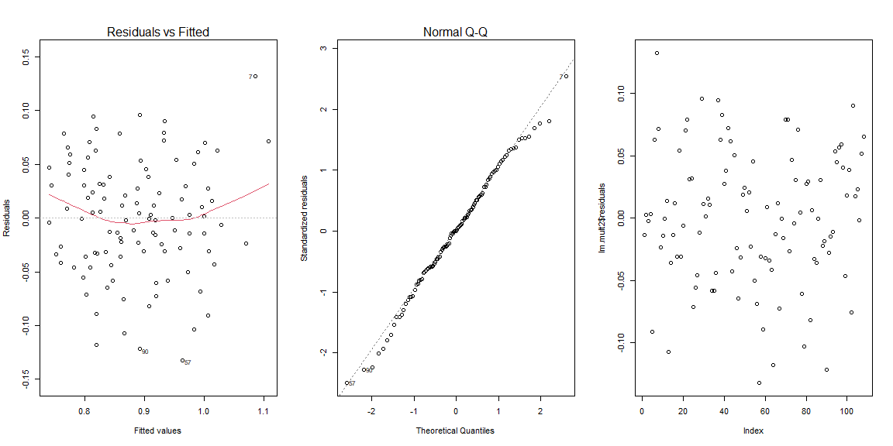

```r
# Use this R-Chunk to import all your datasets!
traffic2 <- read_excel("traffic2.xls")
traffic2 <- select(traffic2, c(prcfat, wkends, unem, spdlaw, beltlaw, feb,mar,apr,may,jun,jul,aug,sep,oct,nov,dec, year))
```

## {.tabset .tabset-pills .tabset-fade}

### Problem #1

##### When the errors in a regression model have AR(1) serial correlation, why do the OLS standard errors tend to underestimate the sampling variation in the estimated beta’s?  Is it always true that the OLS standard errors are too small?

If a given periods value give information about the following period this has accounted for part of the total variation, thus allowing the model to predict some of the total variation outside of our variables. If for example total variation is 100, an our auto correlation is 10 then by the time our model comes into play it is only being used to account for the remaining 90 variation. If autocorrelation and other OLS issues are not present our estimators should be correcy, though if any errors or issues exist it will result in smaller than correct OLS standard errors.

### Problem #2

Use the TRAFFIC2 data set to complete the following exercise

#### OLS Regression
Run an OLS regression on prcfat using a linear time trend, monthly dummy variables and the variables wkends, unem, spdlaw, and beltlaw. Report the results of your regression equation.


```r
lm.mult2 <-lm(prcfat ~ year + feb + mar +apr +may +jun +jul +aug +sep +oct +nov +dec + wkends + unem + spdlaw +beltlaw, data=traffic2)
summary(lm.mult2) %>%
pander(caption= "HW 5 Multiple regression results")
```


-----------------------------------------------------------------
     &nbsp;        Estimate    Std. Error   t value    Pr(>|t|)  
----------------- ----------- ------------ ---------- -----------
 **(Intercept)**     54.16       10.03        5.4      5.276e-07 

    **year**       -0.02682     0.00505      -5.312    7.656e-07 

     **feb**       -0.001374    0.02899     -0.04741    0.9623   

     **mar**       -0.004378    0.02741     -0.1597     0.8735   

     **apr**        0.05151     0.02785       1.85      0.06756  

     **may**        0.0627      0.02774       2.26      0.02622  

     **jun**        0.09009     0.02817      3.198     0.001906  

     **jul**        0.1632      0.02725      5.988     4.162e-08 

     **aug**         0.177      0.02751      6.432     5.73e-09  

     **sep**        0.1421      0.02831      5.021     2.547e-06 

     **oct**        0.08092     0.02776      2.915     0.004472  

     **nov**       -0.008403    0.02819     -0.2981     0.7663   

     **dec**       -0.01539      0.0279     -0.5515     0.5827   

   **wkends**      0.0006259    0.006162     0.1016     0.9193   

    **unem**       -0.01543     0.005544     -2.782    0.006563  

   **spdlaw**       0.06709     0.02057      3.262      0.00156  

   **beltlaw**     -0.02951     0.02323      -1.27      0.2073   
-----------------------------------------------------------------


--------------------------------------------------------------
 Observations   Residual Std. Error   $R^2$    Adjusted $R^2$ 
-------------- --------------------- -------- ----------------
     108              0.05751         0.7174       0.6677     
--------------------------------------------------------------

Table: HW 5 Multiple regression results


```r
par(mfrow=c(1,3))
plot(lm.mult2,which=1:2)
plot(lm.mult2$residuals)
```

<!-- -->


#### Durbin Watson Test

Use the Durbin Watson test to test for autocorrelation in the data. What are the results of the test and what can you conclude?


```r
durbinWatsonTest(lm.mult2)
```

```
##  lag Autocorrelation D-W Statistic p-value
##    1       0.2775695      1.430032   0.002
##  Alternative hypothesis: rho != 0
```

The results of this test are significant, we must reject the null and conclude that there is autocorrelation within this dataset. The auto correlation value is estimated to be 0.277 so 27.7% of all variation is being accounted

####  Breusch-Godfrey Test {.tabset .tabset-pills .tabset-fade}
Use the Breusch-Godfrey test at the orders of 1, 2 and 3 to test for autocorrelation. 

##### Order 1


```r
bgtest(lm.mult2, order =1)
```

```
## 
## 	Breusch-Godfrey test for serial correlation of order up to 1
## 
## data:  lm.mult2
## LM test = 8.5059, df = 1, p-value = 0.00354
```

The null Hypothesis here is that auto correlation within one time period to the next, feb to march, in this case our P-val is significant and we must reject the null and conclude that one time period is correlated with the next time period.


##### Order 2


```r
bgtest(lm.mult2, order =2)
```

```
## 
## 	Breusch-Godfrey test for serial correlation of order up to 2
## 
## data:  lm.mult2
## LM test = 8.5072, df = 2, p-value = 0.01421
```

The null Hypothesis here is that auto correlation within one time period to the 2nd following period, feb to april, in this case our P-val is significant and we must reject the null and conclude that one time period is correlated with the period after the next period.

##### Order 3


```r
bgtest(lm.mult2, order =3)
```

```
## 
## 	Breusch-Godfrey test for serial correlation of order up to 3
## 
## data:  lm.mult2
## LM test = 8.5142, df = 3, p-value = 0.0365
```

The null Hypothesis here is that auto correlation within one time period to the 2nd following period, feb to may, in this case our P-val is significant and we must reject the null and conclude that one time period is correlated with the period after the period after next period.

####

##### Differences 
Is there a difference between the three orders?  What can you conclude for these three different orders about autocorrelation?

Each test for autocorrelation up to the order of the test, 1 period, 2 periods etc. All P-vals where significant so we must conclude that auto correlation is present up to at least the 3rd degree.


### Problem #3

State whether the following statements are true or false.  Briefly justify your answer.

#### When autocorrelation is present, OLS estimators are biased as well as inefficient.
  
  False: The estimators are still unbiased, but they are now inefficient.

#### The Durbin Watson test assumes that the variance of the error term is homoscedastic

True: We assume and test against the null the $E(E_iE_j \neq 0)$

#### A significant Durbin Watson value does not necessarily mean there is autocorrelation of the first order.

False: The Durbin watson test is for AR1 and thus tests for auto correlation up to the first order, as there is no order below, if the result is significant then we do have correlation in the first order.

#### In the presence of autocorrelation, the conventionally computed variances and standard errors of forecast values are inefficient.

True: the OLS estimators and thus SE and variances would be inefficient in the presence of auto correlation.

